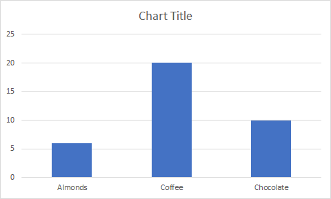

# <a name="scripting-fundamentals-for-office-scripts-in-excel-on-the-web-preview"></a><span data-ttu-id="a8f61-103">Notions de base sur les scripts pour les scripts Office dans Excel sur le Web (aperçu)</span><span class="sxs-lookup"><span data-stu-id="a8f61-103">Scripting fundamentals for Office Scripts in Excel on the web (preview)</span></span>

<span data-ttu-id="a8f61-104">Cet article vous présente les aspects techniques des scripts Office.</span><span class="sxs-lookup"><span data-stu-id="a8f61-104">This article will introduce you to the technical aspects of Office Scripts.</span></span> <span data-ttu-id="a8f61-105">Vous découvrirez comment les objets Excel fonctionnent ensemble et comment l’éditeur de code se synchronise avec un classeur.</span><span class="sxs-lookup"><span data-stu-id="a8f61-105">You'll learn how the Excel objects work together and how the Code Editor synchronizes with a workbook.</span></span>

[!INCLUDE [Preview note](../includes/preview-note.md)]

## <a name="object-model"></a><span data-ttu-id="a8f61-106">Modèle d’objet</span><span class="sxs-lookup"><span data-stu-id="a8f61-106">Object model</span></span>

<span data-ttu-id="a8f61-107">Pour comprendre les API Excel, vous devez comprendre comment les composants d’un classeur sont liés les uns aux autres.</span><span class="sxs-lookup"><span data-stu-id="a8f61-107">To understand the Excel APIs, you must understand how the components of a workbook are related to one another.</span></span>

- <span data-ttu-id="a8f61-108">Un **classeur** contient une ou plusieurs **feuilles de calcul**.</span><span class="sxs-lookup"><span data-stu-id="a8f61-108">A **Workbook** contains one or more **Worksheets**.</span></span>
- <span data-ttu-id="a8f61-109">Une **feuille de calcul** donne accès aux cellules par le biais d’objets **Range** .</span><span class="sxs-lookup"><span data-stu-id="a8f61-109">A **Worksheet** gives access to cells through **Range** objects.</span></span>
- <span data-ttu-id="a8f61-110">Une **plage** représente un groupe de cellules contiguës.</span><span class="sxs-lookup"><span data-stu-id="a8f61-110">A **Range** represents a group of contiguous cells.</span></span>
- <span data-ttu-id="a8f61-111">Les **plages** permettent de créer et de placer des **tableaux**, des **graphiques**, des **formes**et d’autres objets d’organisation ou de visualisation de données.</span><span class="sxs-lookup"><span data-stu-id="a8f61-111">**Ranges** are used to create and place **Tables**, **Charts**, **Shapes**, and other data visualization or organization objects.</span></span>
- <span data-ttu-id="a8f61-112">Une **feuille de calcul** contient des collections de ces objets de données qui sont présents dans la feuille individuelle.</span><span class="sxs-lookup"><span data-stu-id="a8f61-112">A **Worksheet** contains collections of those data objects that are present in the individual sheet.</span></span>
- <span data-ttu-id="a8f61-113">Les **classeurs** contiennent des collections de certains de ces objets de données (tels que les **tableaux**) pour l’intégralité du **classeur**.</span><span class="sxs-lookup"><span data-stu-id="a8f61-113">**Workbooks** contain collections of some of those data objects (such as **Tables**) for the entire **Workbook**.</span></span>

### <a name="ranges"></a><span data-ttu-id="a8f61-114">Ranges</span><span class="sxs-lookup"><span data-stu-id="a8f61-114">Ranges</span></span>

<span data-ttu-id="a8f61-115">Une plage est un groupe de cellules contiguës dans le classeur.</span><span class="sxs-lookup"><span data-stu-id="a8f61-115">A range is a group of contiguous cells in the workbook.</span></span> <span data-ttu-id="a8f61-116">Les scripts utilisent généralement la notation de style a1 (par exemple, **B3** pour la cellule unique de la ligne **B** et de la colonne **3** ou **C2 : F4** pour les cellules des lignes **C** à **F** et les colonnes **2** à **4**) pour définir des plages.</span><span class="sxs-lookup"><span data-stu-id="a8f61-116">Scripts typically use A1-style notation (e.g. **B3** for the single cell in row **B** and column **3** or **C2:F4** for the cells from rows **C** through **F** and columns **2** through **4**) to define ranges.</span></span>

<span data-ttu-id="a8f61-117">Les plages ont trois propriétés principales `values`: `formulas`, et `format`.</span><span class="sxs-lookup"><span data-stu-id="a8f61-117">Ranges have three core properties: `values`, `formulas`, and `format`.</span></span> <span data-ttu-id="a8f61-118">Ces propriétés obtiennent ou définissent les valeurs de cellule, les formules à évaluer et la mise en forme visuelle des cellules.</span><span class="sxs-lookup"><span data-stu-id="a8f61-118">These properties get or set the cell values, formulas to be evaluated, and the visual formatting of the cells.</span></span>

#### <a name="range-sample"></a><span data-ttu-id="a8f61-119">Exemple de plage</span><span class="sxs-lookup"><span data-stu-id="a8f61-119">Range sample</span></span>

<span data-ttu-id="a8f61-120">L’exemple suivant montre comment créer des enregistrements de ventes.</span><span class="sxs-lookup"><span data-stu-id="a8f61-120">The following sample shows how to create sales records.</span></span> <span data-ttu-id="a8f61-121">Ce script utilise `Range` des objets pour définir les valeurs, les formules et les formats.</span><span class="sxs-lookup"><span data-stu-id="a8f61-121">This script uses `Range` objects to set the values, formulas, and formats.</span></span>

```TypeScript
async function main(context: Excel.RequestContext) {
  // Get the active worksheet.
  let sheet = context.workbook.worksheets.getActiveWorksheet();

  // Create the headers and format them to stand out.
  let headers = [
    ["Product", "Quantity", "Unit Price", "Totals"]
  ];
  let headerRange = sheet.getRange("B2:E2");
  headerRange.values = headers;
  headerRange.format.fill.color = "#4472C4";
  headerRange.format.font.color = "white";

  // Create the product data rows.
  let productData = [
    ["Almonds", 6, 7.5],
    ["Coffee", 20, 34.5],
    ["Chocolate", 10, 9.56],
  ];
  let dataRange = sheet.getRange("B3:D5");
  dataRange.values = productData;

  // Create the formulas to total the amounts sold.
  let totalFormulas = [
    ["=C3 * D3"],
    ["=C4 * D4"],
    ["=C5 * D5"],
    ["=SUM(E3:E5)"]
  ];
  let totalRange = sheet.getRange("E3:E6");
  totalRange.formulas = totalFormulas;
  totalRange.format.font.bold = true;

  // Display the totals as US dollar amounts.
  totalRange.numberFormat = [["$0.00"]];
}
```

<span data-ttu-id="a8f61-122">L’exécution de ce script crée les données suivantes dans la feuille de calcul active :</span><span class="sxs-lookup"><span data-stu-id="a8f61-122">Running this script creates the following data in the current worksheet:</span></span>


### <a name="charts-tables-and-other-data-objects"></a><span data-ttu-id="a8f61-124">Graphiques, tableaux et autres objets de données</span><span class="sxs-lookup"><span data-stu-id="a8f61-124">Charts, tables, and other data objects</span></span>

<span data-ttu-id="a8f61-125">Les scripts peuvent créer et manipuler les structures de données et les visualisations dans Excel.</span><span class="sxs-lookup"><span data-stu-id="a8f61-125">Scripts can create and manipulate the data structures and visualizations within Excel.</span></span> <span data-ttu-id="a8f61-126">Les tableaux et les graphiques sont deux des objets les plus couramment utilisés, mais les API prennent en charge les tableaux croisés dynamiques, les formes, les images et plus encore.</span><span class="sxs-lookup"><span data-stu-id="a8f61-126">Tables and charts are two of the more commonly used objects, but the APIs support PivotTables, shapes, images, and more.</span></span>

#### <a name="creating-a-table"></a><span data-ttu-id="a8f61-127">Création d’un tableau</span><span class="sxs-lookup"><span data-stu-id="a8f61-127">Creating a table</span></span>

<span data-ttu-id="a8f61-128">Créer des tables à l’aide de plages de données.</span><span class="sxs-lookup"><span data-stu-id="a8f61-128">Create tables by using data-filled ranges.</span></span> <span data-ttu-id="a8f61-129">La mise en forme et les contrôles de tableau (tels que les filtres) sont automatiquement appliqués à la plage.</span><span class="sxs-lookup"><span data-stu-id="a8f61-129">Formatting and table controls (such as filters) are automatically applied to the range.</span></span>

<span data-ttu-id="a8f61-130">Le script suivant crée un tableau à l’aide des plages de l’exemple précédent.</span><span class="sxs-lookup"><span data-stu-id="a8f61-130">The following script creates a table using the ranges from the previous sample.</span></span>

```TypeScript
async function main(context: Excel.RequestContext) {
   let sheet = context.workbook.worksheets.getActiveWorksheet();
   sheet.tables.add("B2:E5", true);
}
```

<span data-ttu-id="a8f61-131">L’exécution de ce script sur la feuille de calcul avec les données précédentes crée le tableau suivant :</span><span class="sxs-lookup"><span data-stu-id="a8f61-131">Running this script on the worksheet with the previous data creates the following table:</span></span>


#### <a name="creating-a-chart"></a><span data-ttu-id="a8f61-133">Création d’un graphique</span><span class="sxs-lookup"><span data-stu-id="a8f61-133">Creating a chart</span></span>

<span data-ttu-id="a8f61-134">Créez des graphiques pour visualiser les données dans une plage.</span><span class="sxs-lookup"><span data-stu-id="a8f61-134">Create charts to visualize the data in a range.</span></span> <span data-ttu-id="a8f61-135">Les scripts autorisent des dizaines de variétés de graphiques, chacune pouvant être personnalisée en fonction de vos besoins.</span><span class="sxs-lookup"><span data-stu-id="a8f61-135">Scripts allow for dozens of chart varieties, each of which can be customized to suit your needs.</span></span>

<span data-ttu-id="a8f61-136">Le script suivant crée un graphique en histogramme simple pour trois éléments et place celle-ci 100 pixels en dessous de la partie supérieure de la feuille de calcul.</span><span class="sxs-lookup"><span data-stu-id="a8f61-136">The following script creates a simple column chart for three items and places it 100 pixels below the top of the worksheet.</span></span>

```TypeScript
async function main(context: Excel.RequestContext) {
  let sheet = context.workbook.worksheets.getActiveWorksheet();
  let chart = sheet.charts.add(Excel.ChartType.columnStacked, sheet.getRange("B3:C5"));
  chart.top = 100;
}
```

<span data-ttu-id="a8f61-137">L’exécution de ce script sur la feuille de calcul avec le tableau précédent crée le graphique suivant :</span><span class="sxs-lookup"><span data-stu-id="a8f61-137">Running this script on the worksheet with the previous table creates the following chart:</span></span>



### <a name="further-reading-on-the-object-model"></a><span data-ttu-id="a8f61-139">Documentation supplémentaire sur le modèle objet</span><span class="sxs-lookup"><span data-stu-id="a8f61-139">Further reading on the object model</span></span>

<span data-ttu-id="a8f61-140">La [documentation de référence de l’API des scripts Office](/javascript/api/office-scripts/overview) est une liste complète des objets utilisés dans les scripts Office.</span><span class="sxs-lookup"><span data-stu-id="a8f61-140">The [Office Scripts API reference documentation](/javascript/api/office-scripts/overview) is a comprehensive listing of the objects used in Office Scripts.</span></span> <span data-ttu-id="a8f61-141">Vous pouvez utiliser la table des matières pour accéder à une classe sur laquelle vous aimeriez obtenir des informations supplémentaires.</span><span class="sxs-lookup"><span data-stu-id="a8f61-141">There, you can use the table of contents to navigate to any class you'd like to learn more about.</span></span> <span data-ttu-id="a8f61-142">Voici quelques-unes des pages fréquemment consultées.</span><span class="sxs-lookup"><span data-stu-id="a8f61-142">The following are several commonly viewed pages.</span></span>

- [<span data-ttu-id="a8f61-143">Chart</span><span class="sxs-lookup"><span data-stu-id="a8f61-143">Chart</span></span>](/javascript/api/office-scripts/excel/excel.chart)
- [<span data-ttu-id="a8f61-144">Comment</span><span class="sxs-lookup"><span data-stu-id="a8f61-144">Comment</span></span>](/javascript/api/office-scripts/excel/excel.comment)
- [<span data-ttu-id="a8f61-145">PivotTable</span><span class="sxs-lookup"><span data-stu-id="a8f61-145">PivotTable</span></span>](/javascript/api/office-scripts/excel/excel.pivottable)
- [<span data-ttu-id="a8f61-146">Range</span><span class="sxs-lookup"><span data-stu-id="a8f61-146">Range</span></span>](/javascript/api/office-scripts/excel/excel.range)
- [<span data-ttu-id="a8f61-147">RangeFormat</span><span class="sxs-lookup"><span data-stu-id="a8f61-147">RangeFormat</span></span>](/javascript/api/office-scripts/excel/excel.rangeformat)
- [<span data-ttu-id="a8f61-148">Shape</span><span class="sxs-lookup"><span data-stu-id="a8f61-148">Shape</span></span>](/javascript/api/office-scripts/excel/excel.shape)
- [<span data-ttu-id="a8f61-149">Table</span><span class="sxs-lookup"><span data-stu-id="a8f61-149">Table</span></span>](/javascript/api/office-scripts/excel/excel.table)
- [<span data-ttu-id="a8f61-150">Workbook</span><span class="sxs-lookup"><span data-stu-id="a8f61-150">Workbook</span></span>](/javascript/api/office-scripts/excel/excel.workbook)
- [<span data-ttu-id="a8f61-151">Worksheet</span><span class="sxs-lookup"><span data-stu-id="a8f61-151">Worksheet</span></span>](/javascript/api/office-scripts/excel/excel.worksheet)

## <a name="main-function"></a><span data-ttu-id="a8f61-152">`main`elle</span><span class="sxs-lookup"><span data-stu-id="a8f61-152">`main` function</span></span>

<span data-ttu-id="a8f61-153">Chaque script Office doit contenir une `main` fonction avec la signature suivante, y compris `Excel.RequestContext` la définition de type :</span><span class="sxs-lookup"><span data-stu-id="a8f61-153">Every Office Script must contain a `main` function with the following signature, including the `Excel.RequestContext` type definition:</span></span>

```TypeScript
async function main(context: Excel.RequestContext) {
    // Your Excel Script
}
```

<span data-ttu-id="a8f61-154">Le code à l' `main` intérieur de la fonction s’exécute lors de l’exécution du script.</span><span class="sxs-lookup"><span data-stu-id="a8f61-154">The code inside the `main` function runs when the script is run.</span></span> <span data-ttu-id="a8f61-155">`main`peut appeler d’autres fonctions dans votre script, mais le code qui n’est pas contenu dans une fonction ne s’exécutera pas.</span><span class="sxs-lookup"><span data-stu-id="a8f61-155">`main` can call other functions in your script, but code that's not contained in a function will not run.</span></span>

## <a name="context"></a><span data-ttu-id="a8f61-156">Contexte</span><span class="sxs-lookup"><span data-stu-id="a8f61-156">Context</span></span>

<span data-ttu-id="a8f61-157">La `main` fonction accepte un `Excel.RequestContext` paramètre, nommé `context`.</span><span class="sxs-lookup"><span data-stu-id="a8f61-157">The `main` function accepts an `Excel.RequestContext` parameter, named `context`.</span></span> <span data-ttu-id="a8f61-158">Imaginez `context` comme un pont entre votre script et le classeur.</span><span class="sxs-lookup"><span data-stu-id="a8f61-158">Think of `context` as the bridge between your script and the workbook.</span></span> <span data-ttu-id="a8f61-159">Votre script accède au classeur avec l' `context` objet et l’utilise `context` pour envoyer et recevoir des données.</span><span class="sxs-lookup"><span data-stu-id="a8f61-159">Your script accesses the workbook with the `context` object and uses that `context` to send data back and forth.</span></span>

<span data-ttu-id="a8f61-160">L' `context` objet est nécessaire, car le script et Excel s’exécutent dans différents processus et emplacements.</span><span class="sxs-lookup"><span data-stu-id="a8f61-160">The `context` object is necessary because the script and Excel are running in different processes and locations.</span></span> <span data-ttu-id="a8f61-161">Le script devra modifier ou interroger les données du classeur dans le Cloud.</span><span class="sxs-lookup"><span data-stu-id="a8f61-161">The script will need to make changes to or query data from the workbook in the cloud.</span></span> <span data-ttu-id="a8f61-162">L' `context` objet gère ces transactions.</span><span class="sxs-lookup"><span data-stu-id="a8f61-162">The `context` object manages those transactions.</span></span>

## <a name="sync-and-load"></a><span data-ttu-id="a8f61-163">Synchronisation et chargement</span><span class="sxs-lookup"><span data-stu-id="a8f61-163">Sync and Load</span></span>

<span data-ttu-id="a8f61-164">Étant donné que votre script et votre classeur s’exécutent à différents emplacements, le transfert de données entre les deux prend du temps.</span><span class="sxs-lookup"><span data-stu-id="a8f61-164">Because your script and workbook run in different locations, any data transfer between the two takes time.</span></span> <span data-ttu-id="a8f61-165">Pour améliorer les performances des scripts, les commandes sont mises en file d’attente jusqu' `sync` à ce que le script appelle explicitement l’opération pour synchroniser le script et le classeur.</span><span class="sxs-lookup"><span data-stu-id="a8f61-165">To improve script performance, commands are queued up until the script explicitly calls the `sync` operation to synchronize the script and workbook.</span></span> <span data-ttu-id="a8f61-166">Votre script peut fonctionner indépendamment jusqu’à ce qu’il doive effectuer l’une des opérations suivantes :</span><span class="sxs-lookup"><span data-stu-id="a8f61-166">Your script can work independently until it needs to do either of the following:</span></span>

- <span data-ttu-id="a8f61-167">Lire les données du classeur (après `load` une opération).</span><span class="sxs-lookup"><span data-stu-id="a8f61-167">Read data from the workbook (following a `load` operation).</span></span>
- <span data-ttu-id="a8f61-168">Écrire des données dans le classeur (généralement parce que le script est terminé).</span><span class="sxs-lookup"><span data-stu-id="a8f61-168">Write data to the workbook (usually because the script has finished).</span></span>

<span data-ttu-id="a8f61-169">L’image suivante montre un exemple de flux de contrôle entre le script et le classeur :</span><span class="sxs-lookup"><span data-stu-id="a8f61-169">The following image shows an example control flow between the script and workbook:</span></span>


### <a name="sync"></a><span data-ttu-id="a8f61-171">Synchronisation</span><span class="sxs-lookup"><span data-stu-id="a8f61-171">Sync</span></span>

<span data-ttu-id="a8f61-172">Chaque fois que votre script a besoin de lire ou d’écrire des données dans le classeur, appelez la `RequestContext.sync` méthode comme illustré ci-dessous :</span><span class="sxs-lookup"><span data-stu-id="a8f61-172">Whenever your script needs to read data from or write data to the workbook, call the `RequestContext.sync` method as shown here:</span></span>

```TypeScript
await context.sync();
```

> [!NOTE]
> <span data-ttu-id="a8f61-173">`context.sync()`est implicitement appelé à la fin d’un script.</span><span class="sxs-lookup"><span data-stu-id="a8f61-173">`context.sync()` is implicitly called when a script ends.</span></span>

<span data-ttu-id="a8f61-174">Une fois `sync` l’opération terminée, le classeur est mis à jour pour refléter toutes les opérations d’écriture que le script a spécifiées.</span><span class="sxs-lookup"><span data-stu-id="a8f61-174">After the `sync` operation completes, the workbook updates to reflect any write operations that script has specified.</span></span> <span data-ttu-id="a8f61-175">Une opération d’écriture définit une propriété sur un objet Excel (par exemple `range.format.fill.color = "red"`,) ou un appel à une méthode qui modifie une propriété ( `range.format.autoFitColumns()`par exemple,).</span><span class="sxs-lookup"><span data-stu-id="a8f61-175">A write operation is setting any property on a Excel object (e.g. `range.format.fill.color = "red"`) or calling a method that changes a property (e.g., `range.format.autoFitColumns()`).</span></span> <span data-ttu-id="a8f61-176">L' `sync` opération lit également toutes les valeurs du classeur que le script a demandées `load` à l’aide d’une opération (comme indiqué dans la section suivante).</span><span class="sxs-lookup"><span data-stu-id="a8f61-176">The `sync` operation also reads any values from the workbook that the script requested by using a `load` operation (as discussed in the next section).</span></span>

<span data-ttu-id="a8f61-177">La synchronisation de votre script avec le classeur peut prendre du temps, en fonction de votre réseau.</span><span class="sxs-lookup"><span data-stu-id="a8f61-177">Synchronizing your script with the workbook can take time, depending on your network.</span></span> <span data-ttu-id="a8f61-178">Vous devez réduire le nombre d' `sync` appels pour aider votre script à s’exécuter rapidement.</span><span class="sxs-lookup"><span data-stu-id="a8f61-178">You should minimize the number of `sync` calls to help your script run fast.</span></span>  

### <a name="load"></a><span data-ttu-id="a8f61-179">Load</span><span class="sxs-lookup"><span data-stu-id="a8f61-179">Load</span></span>

<span data-ttu-id="a8f61-180">Un script doit charger les données du classeur avant de le lire.</span><span class="sxs-lookup"><span data-stu-id="a8f61-180">A script must load data from the workbook before reading it.</span></span> <span data-ttu-id="a8f61-181">Toutefois, le chargement fréquent de données à partir de l’intégralité du classeur réduirait considérablement la vitesse du script.</span><span class="sxs-lookup"><span data-stu-id="a8f61-181">However, frequently loading data from the entire workbook would greatly reduce the script's speed.</span></span> <span data-ttu-id="a8f61-182">Au lieu de `load` cela, la méthode permet à votre script d’indiquer spécifiquement quelles données doivent être récupérées à partir du classeur.</span><span class="sxs-lookup"><span data-stu-id="a8f61-182">Instead, the `load` method lets your script state specifically which data should be retrieved from the workbook.</span></span>

<span data-ttu-id="a8f61-183">La `load` méthode est disponible sur tous les objets Excel.</span><span class="sxs-lookup"><span data-stu-id="a8f61-183">The `load` method is available on every Excel object.</span></span> <span data-ttu-id="a8f61-184">Votre script doit charger les propriétés d’un objet avant de pouvoir les lire.</span><span class="sxs-lookup"><span data-stu-id="a8f61-184">Your script must load an object's properties before it can read them.</span></span> <span data-ttu-id="a8f61-185">Si vous ne le faites pas, une erreur se produit.</span><span class="sxs-lookup"><span data-stu-id="a8f61-185">Not doing so will result in an error.</span></span>

<span data-ttu-id="a8f61-186">Les exemples suivants utilisent un `Range` objet pour afficher les trois façons dont `load` la méthode peut être utilisée pour charger des données.</span><span class="sxs-lookup"><span data-stu-id="a8f61-186">The following examples use a `Range` object to show the three ways the `load` method can be used to load data.</span></span>

|<span data-ttu-id="a8f61-187">Intent</span><span class="sxs-lookup"><span data-stu-id="a8f61-187">Intent</span></span> |<span data-ttu-id="a8f61-188">Exemple de commande</span><span class="sxs-lookup"><span data-stu-id="a8f61-188">Example Command</span></span> | <span data-ttu-id="a8f61-189">Effet</span><span class="sxs-lookup"><span data-stu-id="a8f61-189">Effect</span></span> |
|:--|:--|:--|
|<span data-ttu-id="a8f61-190">Charger une propriété</span><span class="sxs-lookup"><span data-stu-id="a8f61-190">Load one property</span></span> |`myRange.load("values");` | <span data-ttu-id="a8f61-191">Charge une seule propriété, dans ce cas, le tableau à deux dimensions des valeurs de cette plage.</span><span class="sxs-lookup"><span data-stu-id="a8f61-191">Loads a single property, in this case the two-dimensional array of values in this range.</span></span> |
|<span data-ttu-id="a8f61-192">Charger plusieurs propriétés</span><span class="sxs-lookup"><span data-stu-id="a8f61-192">Load multiple properties</span></span> |`myRange.load("values, rowCount, columnCount");`| <span data-ttu-id="a8f61-193">Charge toutes les propriétés à partir d’une liste délimitée par des virgules, dans cet exemple, les valeurs, le nombre de lignes et le nombre de colonnes.</span><span class="sxs-lookup"><span data-stu-id="a8f61-193">Loads all the properties from a comma-delimited list, in this example the values, row count, and column count.</span></span> |
|<span data-ttu-id="a8f61-194">Tout charger</span><span class="sxs-lookup"><span data-stu-id="a8f61-194">Load everything</span></span> | `myRange.load();`|<span data-ttu-id="a8f61-195">Charge toutes les propriétés de la plage.</span><span class="sxs-lookup"><span data-stu-id="a8f61-195">Loads all the properties on the range.</span></span> <span data-ttu-id="a8f61-196">Il ne s’agit pas d’une solution recommandée, car elle ralentit votre script en obtenant des données inutiles.</span><span class="sxs-lookup"><span data-stu-id="a8f61-196">This is not a recommended solution, since it will slow down your script by getting unnecessary data.</span></span> <span data-ttu-id="a8f61-197">Vous ne devez l’utiliser que si vous testez votre script ou si vous avez besoin de chaque propriété de l’objet.</span><span class="sxs-lookup"><span data-stu-id="a8f61-197">You should only use this while testing your script or if you need every property from the object.</span></span> |

<span data-ttu-id="a8f61-198">Votre script doit appeler `context.sync()` avant de lire les valeurs chargées.</span><span class="sxs-lookup"><span data-stu-id="a8f61-198">Your script must call `context.sync()` before reading any loaded values.</span></span>

```TypeScript
let range = selectedSheet.getRange("A1:B3");
range.load ("rowCount"); // Load the property.
await context.sync(); // Synchronize with the workbook to get the property.
console.log(range.rowCount); // Read and log the property value (3).
```

<span data-ttu-id="a8f61-199">Vous pouvez également charger les propriétés sur toute une collection.</span><span class="sxs-lookup"><span data-stu-id="a8f61-199">You can also load properties across an entire collection.</span></span> <span data-ttu-id="a8f61-200">Chaque objet collection possède une `items` propriété qui est un tableau contenant les objets de cette collection.</span><span class="sxs-lookup"><span data-stu-id="a8f61-200">Every collection object has an `items` property that is an array containing the objects in that collection.</span></span> <span data-ttu-id="a8f61-201">À `items` l’aide du début d’un appel hiérarchique (`items\myProperty`) pour `load` charger les propriétés spécifiées sur chacun de ces éléments.</span><span class="sxs-lookup"><span data-stu-id="a8f61-201">Using `items` as the start of a hierarchical call (`items\myProperty`) to `load` loads the specified properties on each of those items.</span></span> <span data-ttu-id="a8f61-202">L’exemple suivant charge la `resolved` propriété sur chaque `Comment` objet dans l' `CommentCollection` objet d’une feuille de calcul.</span><span class="sxs-lookup"><span data-stu-id="a8f61-202">The following example loads the `resolved` property on every `Comment` object in the `CommentCollection` object of a worksheet.</span></span>

```TypeScript
let comments = selectedSheet.comments;
comments.load("items/resolved"); // Load the `resolved` property from every comment in this collection.
await context.sync(); // Synchronize with the workbook to get the properties.
```

> [!TIP]
> <span data-ttu-id="a8f61-203">Pour en savoir plus sur l’utilisation des collections dans les scripts Office, reportez-vous à la [section tableau de l’article Using Built-in JavaScript Objects in Office scripts](javascript-objects.md#array) .</span><span class="sxs-lookup"><span data-stu-id="a8f61-203">To learn more about working with collections in Office Scripts, see the [Array section of the Using built-in JavaScript objects in Office Scripts](javascript-objects.md#array) article.</span></span>

## <a name="see-also"></a><span data-ttu-id="a8f61-204">Voir aussi</span><span class="sxs-lookup"><span data-stu-id="a8f61-204">See also</span></span>

- [<span data-ttu-id="a8f61-205">Enregistrer, modifier et créer des scripts Office dans Excel sur le Web</span><span class="sxs-lookup"><span data-stu-id="a8f61-205">Record, edit, and create Office Scripts in Excel on the web</span></span>](../tutorials/excel-tutorial.md)
- [<span data-ttu-id="a8f61-206">Lire des données de classeur avec des scripts Office dans Excel sur le Web</span><span class="sxs-lookup"><span data-stu-id="a8f61-206">Read workbook data with Office Scripts in Excel on the web</span></span>](../tutorials/excel-read-tutorial.md)
- [<span data-ttu-id="a8f61-207">Référence de l’API des scripts Office</span><span class="sxs-lookup"><span data-stu-id="a8f61-207">Office Scripts API reference</span></span>](/javascript/api/office-scripts/overview)
- [<span data-ttu-id="a8f61-208">Utilisation d’objets JavaScript intégrés dans les scripts Office</span><span class="sxs-lookup"><span data-stu-id="a8f61-208">Using built-in JavaScript objects in Office Scripts</span></span>](javascript-objects.md)
