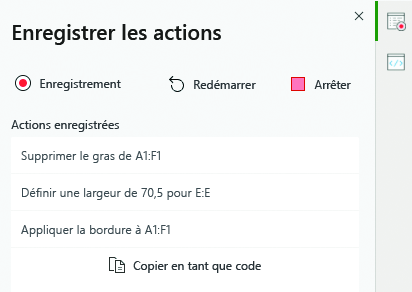
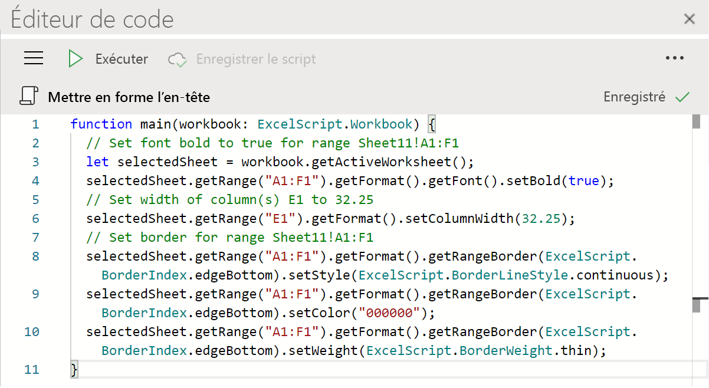
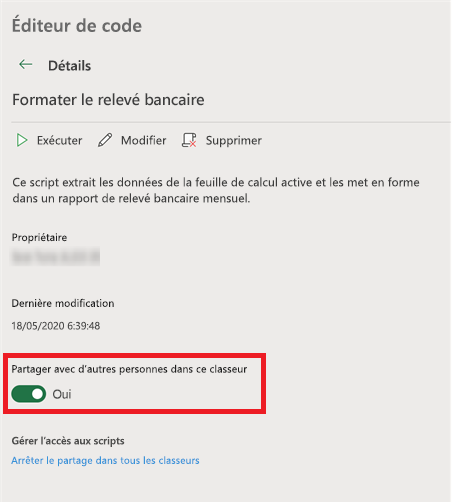

# Office Scripts dans Excel sur le web (Aperçu)

Office Scripts dans Excel sur le web vous permet d’automatiser vos tâches quotidiennes. Vous pouvez enregistrer les actions Excel avec l’enregistreur d’actions, ce qui crée un script. Vous pouvez également créer et modifier des scripts avec l’éditeur de code. Vos scripts peuvent ensuite être partagés au sein de votre organisation afin que vos collègues puissent également automatiser leurs flux de travail.

Cette série de documents vous explique comment utiliser ces outils. Vous allez découvrir comment enregistrer vos actions Excel fréquentes avec l’enregistreur d’actions. Vous découvrirez également comment créer ou mettre à jour vos propres scripts à l’aide de l’éditeur de code.

 

> [!VIDEO https://www.microsoft.com/videoplayer/embed/RE4qdFF]

## Configuration requise

[!INCLUDE [Preview note](../includes/preview-note.md)]

Pour utiliser les scripts Office, vous devez disposer des éléments suivants.

1. [Excel sur le web](https://www.office.com/launch/excel) (les autres plateformes, telles que le bureau, ne sont pas prises en charge).
1. OneDrive Entreprise.
1. Scripts Office [activés par votre administrateur](/microsoft-365/admin/manage/manage-office-scripts-settings).
1. Toute licence Microsoft 365 commerciale ou éducative donnant accès aux applications de bureau Microsoft 365, telles que :

    - Applications Microsoft 365 pour les PME
    - Office 365 Business Premium
    - Office 365 ProPlus
    - Office 365 ProPlus pour les appareils
    - Office 365 Entreprise E3
    - Office 365 Entreprise E5
    - Office 365 A3
    - Office 365 A5

## Quand utiliser Office Scripts

Les scripts permettent d’enregistrer et de reproduire les actions Excel sur des classeurs et des feuilles de calcul différents. Si votre travail comporte des tâches répétitives, vous pouvez les automatiser facilement à l’aide d’un script Office. Exécutez votre script en appuyant sur un bouton dans Excel ou combinez-le avec Power Automate pour rationaliser l'ensemble de votre flux de travail.

Par exemple, vous débutez votre journée de travail en ouvrant un fichier .csv à partir d’un site de comptabilité dans Excel. Vous consacrez ensuite plusieurs minutes à supprimer les colonnes superflues, à mettre en forme un tableau, à ajouter des formules et à créer un tableau croisé dynamique dans une nouvelle feuille de calcul. Ces actions que vous répétez quotidiennement peuvent être enregistrées une seule fois à l’aide de l’enregistreur d’actions. Dès lors, l’exécution du script se chargera de l’intégralité de la conversion .csv. Non seulement, vous supprimez le risque d’oublier les étapes, mais vous pouvez aussi partager le procédé avec d’autres personnes sans avoir à leur apprendre ce dernier. Les scripts Office automatisent vos tâches courantes afin que vous et votre équipe puissiez être plus efficaces et productifs.

## Enregistreur d’actions

La fonctionnalité Enregistreur d’actions vous permet d’enregistrer les actions que vous effectuez dans Excel sous forme de script. Quand l’enregistreur d’actions est en cours d’exécution, vous pouvez capturer les actions Excel effectuées lorsque vous modifiez des cellules, la mise en forme et créez des tableaux. Le script obtenu peut être exécuté sur d’autres feuilles de calcul et classeurs pour recréer vos actions d’origine.

## Éditeur de code

Tous les scripts enregistrés avec l’enregistreur d’actions peuvent être modifiés via l’éditeur de code. Cela vous permet d’affiner et de personnaliser le script pour l’adapter à vos besoins. Vous pouvez également ajouter une logique et des fonctionnalités qui ne sont pas directement accessibles via l’interface utilisateur d’Excel, comme les instructions conditionnelles (si/sinon) et les boucles.

Un moyen simple de commencer à apprendre les fonctionnalités de Office Scripts consiste à enregistrer les scripts dans Excel sur le web et à afficher le code obtenu. Vous pouvez également suivre nos [tutoriels](../tutorials/excel-tutorial.md) pour découvrir des instructions qui vous guideront de manière plus structurée. 

## Partage de scénarios

Les scénarios Office peuvent être partagés avec d'autres utilisateurs d'un classeur Excel. Lorsque vous partagez un scénario avec d'autres personnes dans un cahier de travail, le scénario est joint au cahier. Vos scénarios sont stockés dans votre OneDrive, et lorsque vous en partagez un, vous créez un lien vers celui-ci dans le cahier de travail que vous avez ouvert.

Plus de détails sur le partage et le non-partage de scripts peuvent être trouvés dans l'article [Partager des scripts de bureau en Excel pour le Web](https://support.microsoft.com/office/sharing-office-scripts-in-excel-for-the-web-226eddbc-3a44-4540-acfe-fccda3d1122b).

> [!NOTE]
> Étant donné que les scripts Office sont stockés dans le OneDrive d’un utilisateur, ils respectent les mêmes stratégies de rétention et de suppression. Pour savoir comment gérer les scripts qui ont été créés et partagés par un utilisateur supprimé de votre organisation, consultez [Rétention et suppression de OneDrive](/onedrive/retention-and-deletion).

## Connecter les scripts de bureau à l'automatisation de la puissance

[Automatisation de la puissance](https://flow.microsoft.com/) est un service qui vous aide à créer des flux de travail automatisés entre plusieurs applications et services. Les Office Scripts peuvent être utilisés dans ces flux de travail, ce qui vous permet de contrôler vos scénarios en dehors du cahier de travail. Vous pouvez exécuter vos scénarios selon un calendrier, les déclencher en réponse à des courriels, et bien plus encore. Visitez le [Exécutez des scénarios Office en Excel sur le web avec Power Automate](../tutorials/excel-power-automate-manual.md) pour apprendre les bases de la connexion de ces services d'automatisation.

## Étapes suivantes

Suivez le [tutoriel sur Office Scripts dans Excel sur le web](../tutorials/excel-tutorial.md) pour découvrir comment créer vos premiers scripts Office.

## Voir aussi

- [Principes de base pour la rédaction de scripts Office en Excel sur le web](../develop/scripting-fundamentals.md)
- [Référence de l'API Office Scripts](/javascript/api/office-scripts/overview)
- [Dépannage de Office Scripts](../testing/troubleshooting.md)
- [Paramètres de Office Scripts dans M365](https://support.office.com/article/office-scripts-settings-in-m365-19d3c51a-6ca2-40ab-978d-60fa49554dcf)
- [Introduction à Office Scripts dans Excel (sur support.office.com)](https://support.office.com/article/introduction-to-office-scripts-in-excel-9fbe283d-adb8-4f13-a75b-a81c6baf163a)
- [Partager des scénarios de bureau en Excel pour le Web](https://support.microsoft.com/office/sharing-office-scripts-in-excel-for-the-web-226eddbc-3a44-4540-acfe-fccda3d1122b?storagetype=live&ui=en-US&rs=en-US&ad=US)
