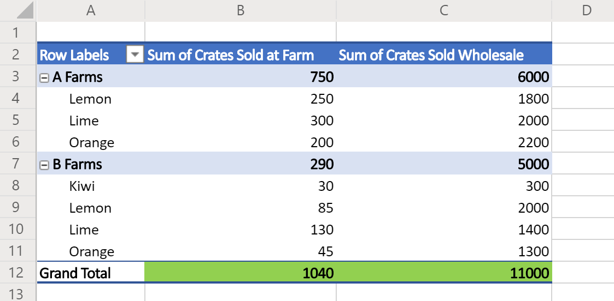

# <a name="sample-scripts-for-office-scripts-in-excel-on-the-web-preview"></a>Exemples de scripts pour les scripts Office dans Excel sur le Web (aperçu)

Les exemples suivants sont des scripts simples que vous pouvez essayer dans vos propres classeurs. Pour les utiliser dans Excel sur le Web :

1. Ouvrez l’onglet **Automatiser**.
2. Appuyez sur **éditeur de code**.
3. Appuyez sur **nouveau script** dans le volet Office de l’éditeur de code.
4. Remplacez l’intégralité du script par l’exemple de votre choix.
5. Appuyez sur **exécuter** dans le volet Office de l’éditeur de code.

[!INCLUDE [Preview note](../includes/preview-note.md)]

## <a name="scripting-basics"></a>Concepts de base des scripts

Ces exemples illustrent des blocs de construction fondamentaux pour les scripts Office. Ajoutez-les à vos scripts pour étendre votre solution et résoudre les problèmes courants.

### <a name="read-and-log-one-cell"></a>Lecture et journalisation d’une cellule

Cet exemple lit la valeur de **a1** et l’imprime sur la console.

```typescript
function main(workbook: ExcelScript.Workbook) {
  // Get the current worksheet.
  let selectedSheet = workbook.getActiveWorksheet();

  // Get the value of cell A1.
  let range = selectedSheet.getRange("A1");
  
  // Print the value of A1.
  console.log(range.getValue());
}
```

### <a name="read-the-active-cell"></a>Lire la cellule active

Ce script journalise la valeur de la cellule active active. Si plusieurs cellules sont sélectionnées, la cellule située à l’extrême gauche est consignée.

```typescript
function main(workbook: ExcelScript.Workbook) {
  // Get the current active cell in the workbook.
  let cell = workbook.getActiveCell();

  // Log that cell's value.
  console.log(`The current cell's value is ${cell.getValue()}`);
}
```

### <a name="change-an-adjacent-cell"></a>Modifier une cellule adjacente

Ce script obtient des cellules adjacentes à l’aide de références relatives. Notez que si la cellule active se trouve sur la ligne supérieure, une partie du script échoue, car elle fait référence à la cellule située au-dessus de la cellule actuellement sélectionnée.

```typescript
function main(workbook: ExcelScript.Workbook) {
  // Get the currently active cell in the workbook.
  let activeCell = workbook.getActiveCell();
  console.log(`The active cell's address is: ${activeCell.getAddress()}`);

  // Get the cell to the right of the active cell and set its value and color.
  let rightCell = activeCell.getOffsetRange(0,1);
  rightCell.setValue("Right cell");
  console.log(`The right cell's address is: ${rightCell.getAddress()}`);
  rightCell.getFormat().getFont().setColor("Magenta");
  rightCell.getFormat().getFill().setColor("Cyan");

  // Get the cell to the above of the active cell and set its value and color.
  // Note that this operation will fail if the active cell is in the top row.
  let aboveCell = activeCell.getOffsetRange(-1, 0);
  aboveCell.setValue("Above cell");
  console.log(`The above cell's address is: ${aboveCell.getAddress()}`);
  aboveCell.getFormat().getFont().setColor("White");
  aboveCell.getFormat().getFill().setColor("Black");
}
```

### <a name="change-all-adjacent-cells"></a>Modifier toutes les cellules adjacentes

Ce script copie la mise en forme de la cellule active vers les cellules voisines. Notez que ce script ne fonctionne que lorsque la cellule active ne se trouve pas sur un bord de la feuille de calcul.

```typescript
function main(workbook: ExcelScript.Workbook) {
  // Get the active cell.
  let activeCell = workbook.getActiveCell();

  // Get the cell that's one row above and one column to the left of the active cell.
  let cornerCell = activeCell.getOffsetRange(-1,-1);

  // Get a range that includes all the cells surrounding the active cell.
  let surroundingRange = cornerCell.getResizedRange(2, 2)

  // Copy the formatting from the active cell to the new range.
  surroundingRange.copyFrom(
    activeCell, /* The source range. */
    ExcelScript.RangeCopyType.formats /* What to copy. */
    );
}
```

### <a name="work-with-dates"></a>Utiliser des dates

Les exemples de cette section indiquent comment utiliser l’objet [Date](https://developer.mozilla.org/docs/web/javascript/reference/global_objects/date) JavaScript.

L’exemple suivant obtient la date et l’heure actuelles, puis écrit ces valeurs dans deux cellules de la feuille de calcul active.

```TypeScript
function main(workbook: ExcelScript.Workbook) {
  // Get the cells at A1 and B1.
  let dateRange = workbook.getActiveWorksheet().getRange("A1");
  let timeRange = workbook.getActiveWorksheet().getRange("B1");

  // Get the current date and time with the JavaScript Date object.
  let date = new Date(Date.now());

  // Add the date string to A1.
  dateRange.setValue(date.toLocaleDateString());

  // Add the time string to B1.
  timeRange.setValue(date.toLocaleTimeString());
}
```

L’exemple suivant lit une date stockée dans Excel et la convertit en un objet JavaScript date. Il utilise le [numéro de série numérique de la date](https://support.office.com/article/now-function-3337fd29-145a-4347-b2e6-20c904739c46) comme entrée pour la date JavaScript.

```TypeScript
function main(workbook: ExcelScript.Workbook) {
  // Read a date at cell A1 from Excel.
  let dateRange = workbook.getActiveWorksheet().getRange("A1");

  // Convert the Excel date to a JavaScript Date object.
  let excelDateValue = dateRange.getValue();
  let javaScriptDate = new Date(Math.round((excelDateValue - 25569) * 86400 * 1000));
  console.log(javaScriptDate);
}
```

## <a name="display-data"></a>Afficher les données

Ces exemples montrent comment utiliser les données de feuille de calcul et fournir aux utilisateurs une meilleure vue ou organisation.

### <a name="apply-conditional-formatting"></a>Application d’une mise en forme conditionnelle

Cet exemple applique la mise en forme conditionnelle à la plage utilisée dans la feuille de calcul. La mise en forme conditionnelle est un remplissage vert pour les 10% de valeurs les plus fréquentes.

```TypeScript
function main(workbook: ExcelScript.Workbook) {
  // Get the current worksheet.
  let selectedSheet = workbook.getActiveWorksheet();

  // Get the used range in the worksheet.
  let range = selectedSheet.getUsedRange();

  // Set the fill color to green for the top 10% of values in the range.
  let conditionalFormat = range.addConditionalFormat(ExcelScript.ConditionalFormatType.topBottom)
  conditionalFormat.getTopBottom().getFormat().getFill().setColor("green");
  conditionalFormat.getTopBottom().setRule({
    rank: 10, // The percentage threshold.
    type: ExcelScript.ConditionalTopBottomCriterionType.topPercent // The type of the top/bottom condition.
  });
}
```

### <a name="create-a-sorted-table"></a>Créer un tableau trié

Cet exemple montre comment créer un tableau à partir de la plage utilisée dans la feuille de calcul active, puis comment le trier en fonction de la première colonne.

```TypeScript
function main(workbook: ExcelScript.Workbook) {
  // Get the current worksheet.
  let selectedSheet = workbook.getActiveWorksheet();

  // Create a table with the used cells.
  let usedRange = selectedSheet.getUsedRange();
  let newTable = selectedSheet.addTable(usedRange, true);

  // Sort the table using the first column.
  newTable.getSort().apply([{ key: 0, ascending: true }]);
}
```

### <a name="log-the-grand-total-values-from-a-pivottable"></a>Enregistrer les valeurs « total général » à partir d’un tableau croisé dynamique

Cet exemple recherche le premier tableau croisé dynamique dans le classeur et enregistre les valeurs dans les cellules « total général » (comme mise en surbrillance en vert dans l’image ci-dessous).



```TypeScript
function main(workbook: ExcelScript.Workbook) {
  // Get the first PivotTable in the workbook.
  let pivotTable = workbook.getPivotTables()[0];

  // Get the names of each data column in the PivotTable.
  let pivotColumnLabelRange = pivotTable.getLayout().getColumnLabelRange();

  // Get the range displaying the pivoted data.
  let pivotDataRange = pivotTable.getLayout().getRangeBetweenHeaderAndTotal();

  // Get the range with the "grand totals" for the PivotTable columns.
  let grandTotalRange = pivotDataRange.getLastRow();

  // Print each of the "Grand Totals" to the console.
  grandTotalRange.getValues()[0].forEach((column, columnIndex) => {
    console.log(`Grand total of ${pivotColumnLabelRange.getValues()[0][columnIndex]}: ${grandTotalRange.getValues()[0][columnIndex]}`);
    // Example log: "Grand total of Sum of Crates Sold Wholesale: 11000"
  });
}
```

## <a name="scenario-samples"></a>Exemples de scénario

Pour obtenir des exemples illustrant des solutions plus étendues dans le monde réel, consultez [exemples de scénarios pour les scripts Office](scenarios/sample-scenario-overview.md).

## <a name="suggest-new-samples"></a>Suggérer de nouveaux exemples

Nous vous invitons à suggérer de nouveaux exemples. S’il existe un scénario courant qui aide les autres développeurs de script, veuillez nous en indiquer dans la section commentaires ci-dessous.
