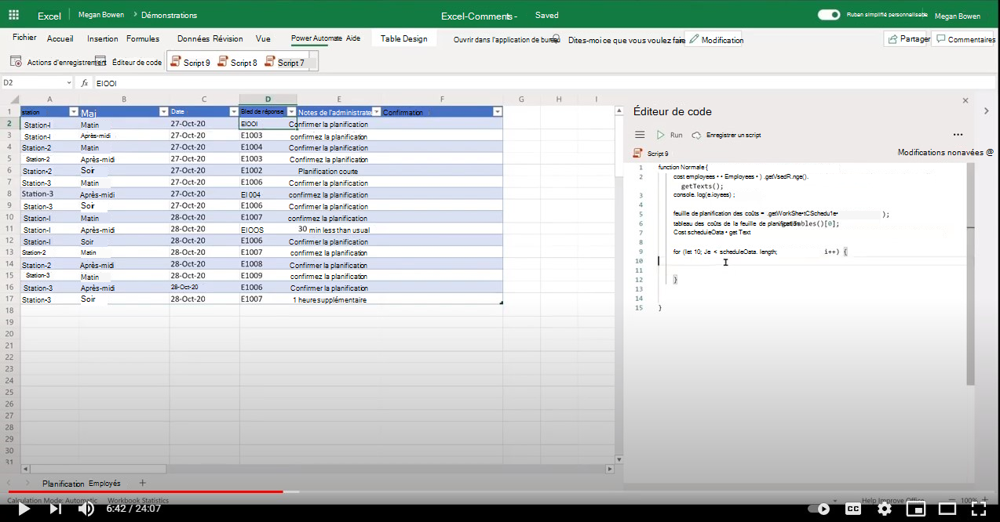

# <a name="add-comments-in-excel"></a><span data-ttu-id="ce6de-103">Ajouter des commentaires dans Excel</span><span class="sxs-lookup"><span data-stu-id="ce6de-103">Add comments in Excel</span></span>

<span data-ttu-id="ce6de-104">Cet exemple montre comment ajouter des commentaires à une cellule, y compris [@mentioning](https://support.microsoft.com/office/90701709-5dc1-41c7-aa48-b01d4a46e8c7) collègue.</span><span class="sxs-lookup"><span data-stu-id="ce6de-104">This sample shows how to add comments to a cell including [@mentioning](https://support.microsoft.com/office/90701709-5dc1-41c7-aa48-b01d4a46e8c7) a colleague.</span></span>

## <a name="example-scenario"></a><span data-ttu-id="ce6de-105">Exemple de scénario</span><span class="sxs-lookup"><span data-stu-id="ce6de-105">Example scenario</span></span>

* <span data-ttu-id="ce6de-106">Le chef d’équipe maintient la planification du travail d’équipe.</span><span class="sxs-lookup"><span data-stu-id="ce6de-106">The team lead maintains the shift schedule.</span></span> <span data-ttu-id="ce6de-107">Le chef d’équipe affecte un ID d’employé à l’enregistrement d’équipe.</span><span class="sxs-lookup"><span data-stu-id="ce6de-107">The team lead assigns an employee ID to the shift record.</span></span>
* <span data-ttu-id="ce6de-108">Le chef d’équipe souhaite en informer l’employé.</span><span class="sxs-lookup"><span data-stu-id="ce6de-108">The team lead wishes to notify the employee.</span></span> <span data-ttu-id="ce6de-109">En ajoutant un commentaire qui @mentions l’employé, un message personnalisé provenant de la feuille de calcul lui est envoyé par courrier électronique.</span><span class="sxs-lookup"><span data-stu-id="ce6de-109">By adding a comment that @mentions the employee, the employee is emailed with a custom message from the worksheet.</span></span>
* <span data-ttu-id="ce6de-110">Par la suite, l’employé peut afficher le livre de travail et répondre au commentaire à sa convenance.</span><span class="sxs-lookup"><span data-stu-id="ce6de-110">Subsequently, the employee can view the workbook and respond to the comment at their convenience.</span></span>

## <a name="solution"></a><span data-ttu-id="ce6de-111">Solution</span><span class="sxs-lookup"><span data-stu-id="ce6de-111">Solution</span></span>

1. <span data-ttu-id="ce6de-112">Le script extrait les informations de l’employé de la feuille de calcul de l’employé.</span><span class="sxs-lookup"><span data-stu-id="ce6de-112">The script extracts employee information from the employee worksheet.</span></span>
1. <span data-ttu-id="ce6de-113">Le script ajoute ensuite un commentaire (y compris l’e-mail de l’employé approprié) à la cellule appropriée dans l’enregistrement d’équipe.</span><span class="sxs-lookup"><span data-stu-id="ce6de-113">The script then adds a comment (including the relevant employee email) to the appropriate cell in the shift record.</span></span>
1. <span data-ttu-id="ce6de-114">Les commentaires existants dans la cellule sont supprimés avant d’ajouter le nouveau commentaire.</span><span class="sxs-lookup"><span data-stu-id="ce6de-114">Existing comments in the cell are removed before adding the new comment.</span></span>

## <a name="sample-code-add-comments"></a><span data-ttu-id="ce6de-115">Exemple de code : ajouter des commentaires</span><span class="sxs-lookup"><span data-stu-id="ce6de-115">Sample code: Add comments</span></span>

<span data-ttu-id="ce6de-116">Téléchargez le fichier <a href="excel-comments.xlsx">excel-comments.xlsx</a> utilisé dans cet exemple et testez-le vous-même !</span><span class="sxs-lookup"><span data-stu-id="ce6de-116">Download the file <a href="excel-comments.xlsx">excel-comments.xlsx</a> used in this sample and try it out yourself!</span></span>

```TypeScript
function main(workbook: ExcelScript.Workbook) {
    const employees = workbook.getWorksheet('Employees').getUsedRange().getTexts();
    console.log(employees); 

    const scheduleSheet = workbook.getWorksheet('Schedule');
    const table = scheduleSheet.getTables()[0];
    const range = table.getRangeBetweenHeaderAndTotal();
    const scheduleData = range.getTexts();

    for (let i=0; i < scheduleData.length; i++) {
      let eId = scheduleData[i][3];

      let employeeInfo = employees.find(e => e[0] === eId);
      if (employeeInfo) {
        console.log("Found a match " + employeeInfo);
        let adminNotes = scheduleData[i][4];
        try { 
          let comment = workbook.getCommentByCell(range.getCell(i, 5));
          comment.delete();
        } catch {
            console.log("Ignore if there is no existing comment in the cell");
        }
        workbook.addComment(range.getCell(i,5), {
          mentions: [{
            email: employeeInfo[1],
            id: 0,
            name: employeeInfo[2]
          }],
          richContent: `<at id=\"0\">${employeeInfo[2]}</at> ${adminNotes}`
        }, ExcelScript.ContentType.mention);        
        
      } else {
        console.log("No match for: " + eId);
      }
    }
    return;
}
```

## <a name="training-video-add-comments"></a><span data-ttu-id="ce6de-117">Vidéo de formation : ajouter des commentaires</span><span class="sxs-lookup"><span data-stu-id="ce6de-117">Training video: Add comments</span></span>

<span data-ttu-id="ce6de-118">[](https://youtu.be/CpR78nkaOFw "Vidéo pas à pas sur l’ajout de commentaires dans un fichier Excel")</span><span class="sxs-lookup"><span data-stu-id="ce6de-118">[](https://youtu.be/CpR78nkaOFw "Step-by-step video on how to add comments in an Excel file")</span></span>
