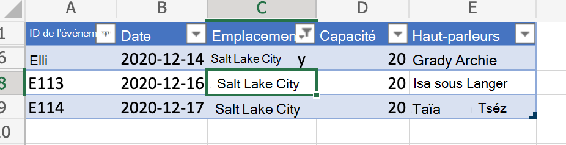
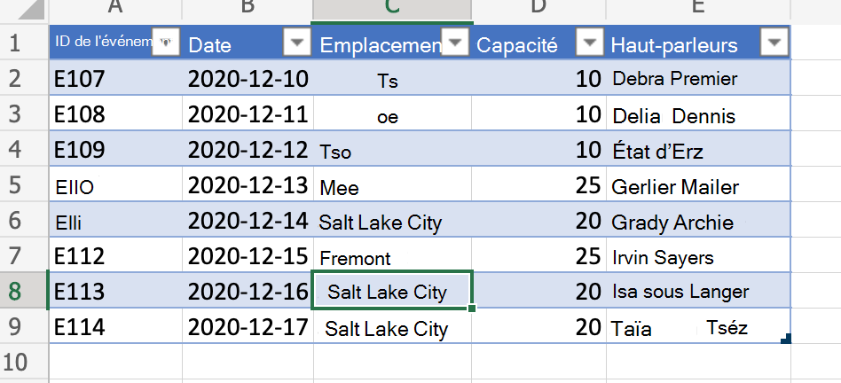

# <a name="clear-table-column-filter-based-on-active-cell-location"></a>Effacer le filtre de colonne de tableau en fonction de l’emplacement des cellules actives

Cet exemple permet d’effacer le filtre de colonne de tableau en fonction de l’emplacement de la cellule active. Le script détecte si la cellule fait partie d’un tableau, détermine la colonne de tableau et clears any filter that are applied on it.

Si vous souhaitez en savoir plus sur la façon d’enregistrer le filtre avant de l’effacer (et de le réapplager ultérieurement), voir Déplacer des lignes dans les tableaux en enregistreant des [filtres](move-rows-across-tables.md), un exemple plus avancé.

_Avant d’effacer le filtre de colonne (notez la cellule active)_



_Après l’effacement du filtre de colonne_



## <a name="sample-code-clear-table-column-filter-based-on-active-cell"></a>Exemple de code : effacer le filtre de colonne de tableau en fonction de la cellule active

Le script suivant permet d’effacer le filtre de colonne de tableau en fonction de l’emplacement des cellules actives et peut être appliqué à n’importe quel fichier Excel avec un tableau. Pour plus de commodité, vous pouvez télécharger et utiliser <a href="table-with-filter.xlsx">table-with-filter.xlsx</a>.

```TypeScript
function main(workbook: ExcelScript.Workbook) {
    // Get active cell.
    const cell = workbook.getActiveCell();

    // Get all tables associated with that cell.
    const tables = cell.getTables();
    
    // If there is no table on the selection, return/exit.
    if (tables.length !== 1) {
      console.log("The selection is not in a table.");
      return;
    }

    // Get table (since it is already determined that there is only
    // a single table part of the selection).
    const currentTable = tables[0];

    console.log(currentTable.getName());
    console.log(currentTable.getRange().getAddress());

    const entireCol = cell.getEntireColumn();
    const intersect = entireCol.getIntersection(currentTable.getRange());
    console.log(intersect.getAddress());

    const headerCellValue = intersect.getCell(0,0).getValue() as string;
    console.log(headerCellValue);

    // Get column.
    const col = currentTable.getColumnByName(headerCellValue);

    // Clear filter.
    col.getFilter().clear();
}
```

## <a name="training-video-clear-table-column-filter-based-on-active-cell-location"></a>Vidéo de formation : Effacer le filtre des colonnes de tableau en fonction de l’emplacement des cellules actives

Pour obtenir un exemple d’utilisation des plages, voir les vidéos de formation de [base de la plage.](range-basics.md#training-videos-range-basics)
