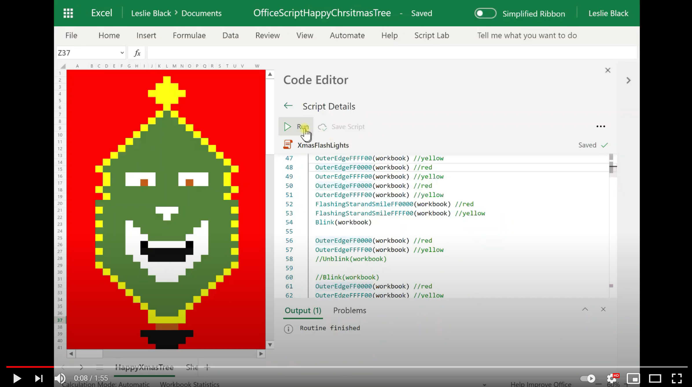

# <a name="seasons-greetings"></a><span data-ttu-id="6818b-103">Message d’accueil de saison</span><span class="sxs-lookup"><span data-stu-id="6818b-103">Seasons greetings</span></span>

<span data-ttu-id="6818b-104">Ce script a été fourni par [Megan Black](https://www.linkedin.com/in/lesblackconsultant/) lors de la période des congés !</span><span class="sxs-lookup"><span data-stu-id="6818b-104">This script was contributed by [Leslie Black](https://www.linkedin.com/in/lesblackconsultant/) in the spirit of the holiday season!</span></span> <span data-ttu-id="6818b-105">Il s'agit d'un script amusant qui affiche une arborescence d'arbre d'arborescence Excel sur le Web l'Office scripts.</span><span class="sxs-lookup"><span data-stu-id="6818b-105">It's a fun script that shows a singing tree in Excel on the web using Office Scripts.</span></span>

<span data-ttu-id="6818b-106">Profitez!.</span><span class="sxs-lookup"><span data-stu-id="6818b-106">Enjoy!</span></span>

<span data-ttu-id="6818b-107">[](https://youtu.be/HBiGEkzmkgo "Script de message d'accueil de message d'accueil en action !")</span><span class="sxs-lookup"><span data-stu-id="6818b-107">[](https://youtu.be/HBiGEkzmkgo "Seasons greetings script in action!")</span></span>

## <a name="script"></a><span data-ttu-id="6818b-108">Script</span><span class="sxs-lookup"><span data-stu-id="6818b-108">Script</span></span>

<span data-ttu-id="6818b-109">Téléchargez le fichier <a href="happy-tree.xlsx">happy-tree.xlsx</a> utilisé dans cette solution pour l'essayer vous-même !</span><span class="sxs-lookup"><span data-stu-id="6818b-109">Download the file <a href="happy-tree.xlsx">happy-tree.xlsx</a> used in this solution to try it out yourself!</span></span>

```TypeScript
/* Original version by Leslie Black.  */

function main(workbook: ExcelScript.Workbook) {
  let happyTree = workbook.getWorksheet('HappyTree');
  happyTree.activate();

  setOuterEdgeYellow(workbook) //yellow
  setOuterEdgeRed(workbook) //red
  setOuterEdgeYellow(workbook) //yellow
  setOuterEdgeRed(workbook) //red
  setOuterEdgeYellow(workbook) //yellow
  setOuterEdgeRed(workbook) //red
  setOuterEdgeYellow(workbook) //yellow
  setOuterEdgeRed(workbook) //red
  setOuterEdgeYellow(workbook) //yellow
  setOuterEdgeRed(workbook) //red
  setOuterEdgeYellow(workbook) //yellow
  setOuterEdgeRed(workbook) //red
  setOuterEdgeYellow(workbook) //yellow
  setOuterEdgeRed(workbook) //red
  setOuterEdgeYellow(workbook) //yellow
  setOuterEdgeRed(workbook) //red
  setOuterEdgeYellow(workbook) //yellow
  setFlashingStarAndSmileRed(workbook) //red
  setFlashingStarAndSmileYellow(workbook) //yellow

  setOuterEdgeYellow(workbook) //yellow
  setOuterEdgeRed(workbook) //red
  setOuterEdgeYellow(workbook) //yellow
  setOuterEdgeRed(workbook) //red
  setOuterEdgeYellow(workbook) //yellow
  setOuterEdgeRed(workbook) //red
  setOuterEdgeYellow(workbook) //yellow
  setOuterEdgeRed(workbook) //red
  setOuterEdgeYellow(workbook) //yellow
  setOuterEdgeRed(workbook) //red
  setOuterEdgeYellow(workbook) //yellow
  setOuterEdgeRed(workbook) //red
  setOuterEdgeYellow(workbook) //yellow
  setOuterEdgeRed(workbook) //red
  setOuterEdgeYellow(workbook) //yellow
  setOuterEdgeRed(workbook) //red
  setOuterEdgeYellow(workbook) //yellow
  setFlashingStarAndSmileRed(workbook) //red
  setFlashingStarAndSmileYellow(workbook) //yellow
  blink(workbook)

  setOuterEdgeRed(workbook) //red
  setOuterEdgeYellow(workbook) //yellow

  setOuterEdgeRed(workbook) //red
  setOuterEdgeYellow(workbook) //yellow

  setOuterEdgeRed(workbook) //red
  setOuterEdgeYellow(workbook) //yellow
  unblink(workbook)

  console.log('Routine finished');

  function blink(workbook: ExcelScript.Workbook) {
    let selectedSheet = workbook.getWorksheet('HappyTree');
    // Set the eyes to brown.
    selectedSheet.getRanges("N16:Q17, G16: J17")
      .getFormat()
      .getFill()
      .setColor("C65911");
  }

  function unblink(workbook: ExcelScript.Workbook) {
    let selectedSheet = workbook.getWorksheet('HappyTree');
    // Set the eyes back to white (except the pupils).
    selectedSheet.getRanges("N16:N17, O16:Q16, G16:H17, I16:J16, P17:Q17, J17")
      .getFormat()
      .getFill()
      .setColor("FFFFFF");
  }

  function setFlashingStarAndSmileRed(workbook: ExcelScript.Workbook) {
    // Set the star to red.
    let selectedSheet = workbook.getWorksheet('HappyTree');
    selectedSheet.getRanges("L2:L6, K3:K5, M3:M5, N4, J4")
      .getFormat()
      .getFill()
      .setColor("FF0000");
    // Set the smile points to black.
    selectedSheet.getRanges("I26, O26")
      .getFormat()
      .getFill()
      .setColor("000000");
  }

  function setFlashingStarAndSmileYellow(workbook: ExcelScript.Workbook) {
    // Set the start to yellow.
    let selectedSheet = workbook.getWorksheet('HappyTree');
    selectedSheet.getRanges("L2:L6, K3:K5, M3:M5, N4, J4")
      .getFormat()
      .getFill()
      .setColor("FFFF00");
    // Clear the smile points.
    selectedSheet.getRanges("O26, I26")
      .getFormat()
      .getFill().clear();
  }
}

function setOuterEdgeYellow(workbook: ExcelScript.Workbook) {
  let sheet = workbook.getWorksheet('HappyTree');
  // Set the outer edge to yellow.
  sheet.getRanges("Q11, G11, R12, F12, S13, E13, T14, D14, C15, U15, T16:T17, D16:D17, C18, U18, T19, D19, L2:L6, C21, U21, C23, U23, C25, U25, C27, U27, C29, U29, T30, D30, K3:K5, M3: M5, S31, E31, R32, F32, Q33, G33, P34, H34, O35, I35, N36:N37, J36:J37, K37:M37, N4, J4, K7, M7, N8, J8, O9, I9, P10, H10")
    .getFormat()
    .getFill()
    .setColor("FFFF00");
}

function setOuterEdgeRed(workbook: ExcelScript.Workbook) {
  let sheet = workbook.getWorksheet('HappyTree');
  // Set the outer edge to red.
  sheet.getRanges("Q11, G11, R12, F12, S13, E13, T14, D14, C15, U15, T16:T17, D16:D17, C18, U18, T19, D19, L2:L6, C21, U21, C23, U23, C25, U25, C27, U27, C29, U29, T30, D30, K3:K5, M3: M5, S31, E31, R32, F32, Q33, G33, P34, H34, O35, I35, N36:N37, J36:J37, K37:M37, N4, J4, K7, M7, N8, J8, O9, I9, P10, H10")
    .getFormat()
    .getFill()
    .setColor("FF0000");
}
```
