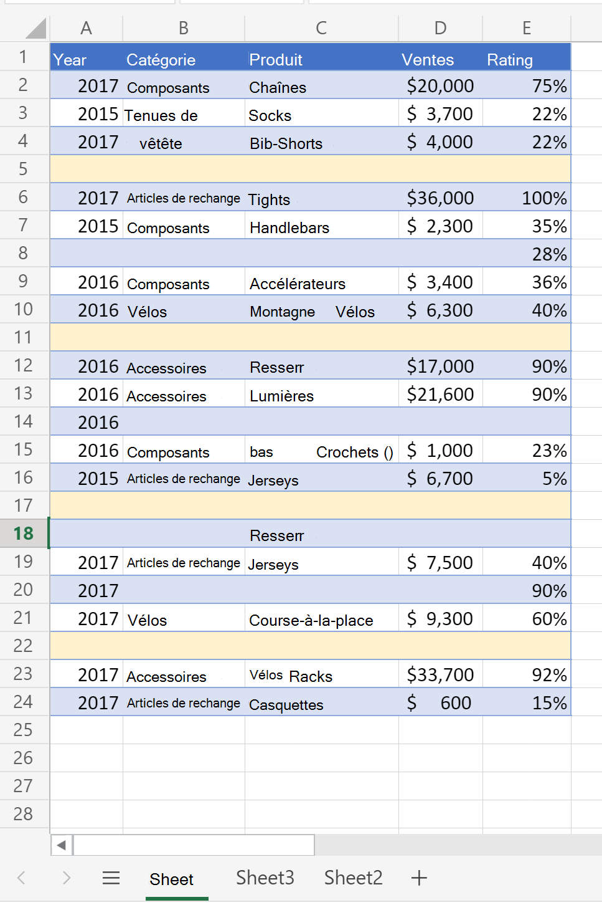
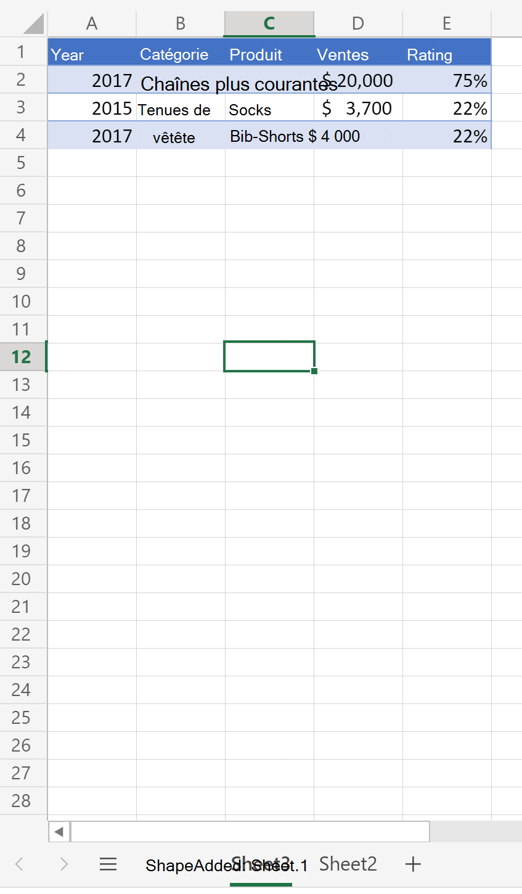
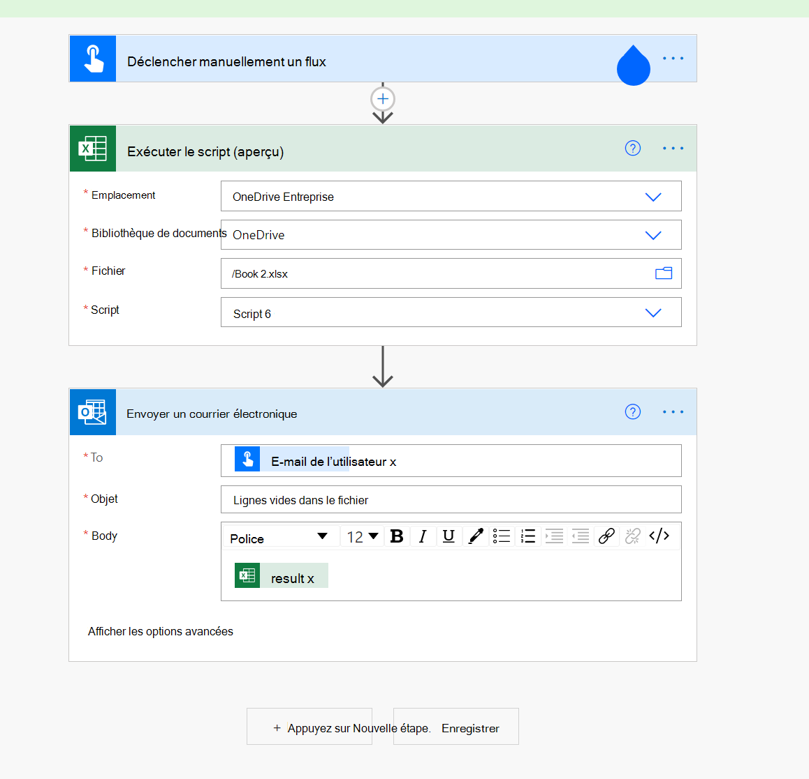

# <a name="count-blank-rows-on-sheets"></a>Compter les lignes vides sur les feuilles

Ce projet comprend deux scripts :

* [Compter les lignes vides sur une feuille](#sample-code-count-blank-rows-on-a-given-sheet)donnée : parcourt la plage utilisée dans une feuille de calcul donnée et renvoie un nombre de lignes vide.
* [Compter les lignes vides sur toutes les feuilles](#sample-code-count-blank-rows-on-all-sheets): parcourt la plage utilisée sur toutes les _feuilles_ de calcul et renvoie un nombre de lignes vide.

> [!NOTE]
> Pour notre script, une ligne vide est toute ligne sans données. La ligne peut avoir une mise en forme.

_Cette feuille renvoie le nombre de 4 lignes vides_



_Cette feuille renvoie le nombre de 0 lignes vides (toutes les lignes ont des données)_



## <a name="sample-code-count-blank-rows-on-a-given-sheet"></a>Exemple de code : compter les lignes vides sur une feuille donnée

```TypeScript
function main(workbook: ExcelScript.Workbook): number
{
  const sheet = workbook.getWorksheet('Sheet1'); 
  // Getting the active worksheet is not suitable for a script used by Power Automate.
  // const sheet = workbook.getActiveWorksheet();
  
  const range = sheet.getUsedRange(true); // Get value only.
  if (!range) {
    console.log(`No data on this sheet. `);
    return;
  }
  console.log(`Used range for the worksheet: ${range.getAddress()}`);
  const values = range.getValues();
  let emptyRows = 0;
  for (let row of values) {
    let len = 0; 
    for (let cell of row) {
      len = len + cell.toString().length;
    }
    if (len === 0) { 
      emptyRows++;
    }
  }
  console.log(`Total empty row: ` + emptyRows);
  return emptyRows;
}
```

## <a name="sample-code-count-blank-rows-on-all-sheets"></a>Exemple de code : compter les lignes vides sur toutes les feuilles

```TypeScript
function main(workbook: ExcelScript.Workbook): number
{
  const sheets = workbook.getWorksheets();
  let emptyRows = 0;
  for (let sheet of sheets) { 
    const range = sheet.getUsedRange(true); // Get value only.
    if (!range) {
      console.log(`No data on this sheet. `);
      continue;
    }
    console.log(`Used range for the worksheet ${sheet.getName()}: ${range.getAddress()}`);
    const values = range.getValues();

    for (let row of values) {
      let len = 0;
      for (let cell of row) {
        len = len + cell.toString().length;
      }
      if (len === 0) {
        emptyRows++;
      }
    }
  }
  console.log(`Total empty row: ` + emptyRows);
  return emptyRows;
}
```

## <a name="use-with-power-automate"></a>Utilisation avec Power Automate


