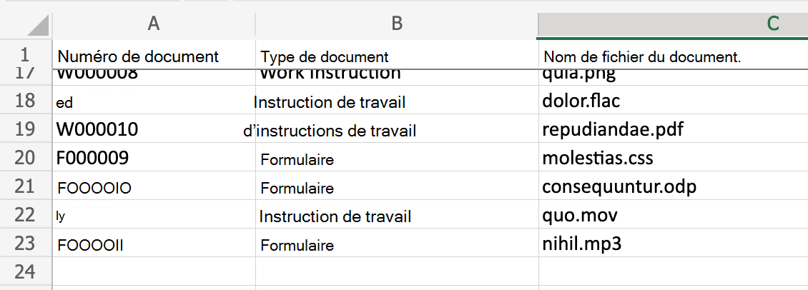
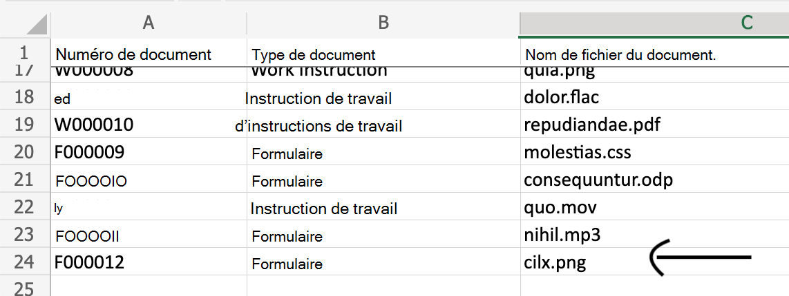
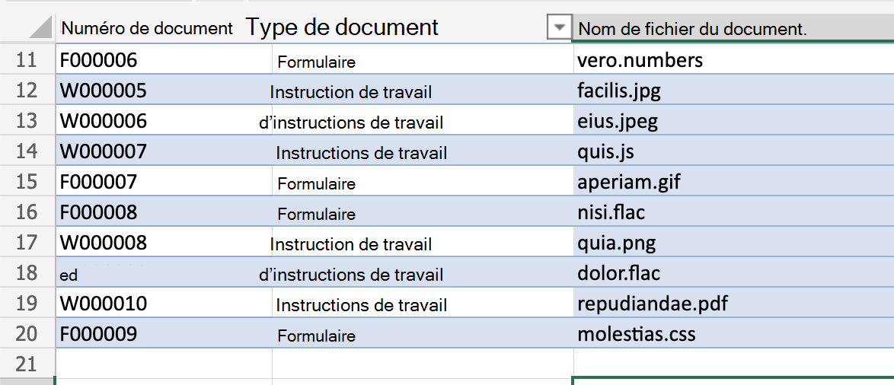
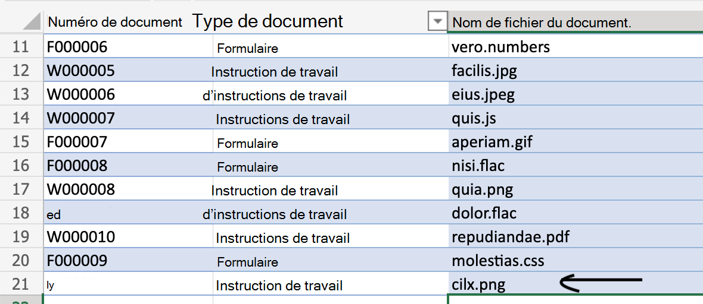

# <a name="generate-a-unique-identifier-in-a-workbook"></a><span data-ttu-id="ddaac-103">Générer un identificateur unique dans un workbook</span><span class="sxs-lookup"><span data-stu-id="ddaac-103">Generate a unique identifier in a workbook</span></span>

<span data-ttu-id="ddaac-104">Ce scénario permet à un utilisateur de générer un numéro de document unique avec un format spécifique et de l’ajouter en tant qu’entrée à une plage ou un tableau.</span><span class="sxs-lookup"><span data-stu-id="ddaac-104">This scenario helps a user generate a unique document number with a specific format and add it as an entry to a range or table.</span></span> <span data-ttu-id="ddaac-105">La nouvelle entrée ou ligne ajoutée contiendra le numéro de document unique nouvellement généré et quelques autres attributs transmis au script.</span><span class="sxs-lookup"><span data-stu-id="ddaac-105">The new entry or row added will contain the newly generated unique document number and a few other attributes passed to the script.</span></span>

<span data-ttu-id="ddaac-106">Il existe deux versions de l’exemple pour ce scénario.</span><span class="sxs-lookup"><span data-stu-id="ddaac-106">There are two versions of the sample for this scenario.</span></span>

* [<span data-ttu-id="ddaac-107">Version 1 : Lire et ajouter une ligne à une feuille de calcul contenant une plage simple</span><span class="sxs-lookup"><span data-stu-id="ddaac-107">Version 1: Read and add a row to a worksheet containing plain range</span></span>](#sample-code-generate-key-and-add-row-to-range)

    <span data-ttu-id="ddaac-108">_Avant l’ajout de la nouvelle ligne_</span><span class="sxs-lookup"><span data-stu-id="ddaac-108">_Before the new row is added_</span></span>

    

    <span data-ttu-id="ddaac-110">_Une fois la nouvelle ligne ajoutée_</span><span class="sxs-lookup"><span data-stu-id="ddaac-110">_After the new row is added_</span></span>

    

* [<span data-ttu-id="ddaac-112">Version 2 : Lire et ajouter une ligne à un tableau</span><span class="sxs-lookup"><span data-stu-id="ddaac-112">Version 2: Read and add a row to a table</span></span>](#sample-code-generate-key-and-add-row-to-table)

    <span data-ttu-id="ddaac-113">_Avant l’ajout de la nouvelle ligne_</span><span class="sxs-lookup"><span data-stu-id="ddaac-113">_Before the new row is added_</span></span>

    

    <span data-ttu-id="ddaac-115">_Une fois la nouvelle ligne ajoutée_</span><span class="sxs-lookup"><span data-stu-id="ddaac-115">_After the new row is added_</span></span>

    

## <a name="sample-excel-file"></a><span data-ttu-id="ddaac-117">Exemple de fichier Excel</span><span class="sxs-lookup"><span data-stu-id="ddaac-117">Sample Excel file</span></span>

<span data-ttu-id="ddaac-118">Téléchargez le fichier <a href="document-number-generator.xlsx">document-number-generator.xlsx</a> utilisé dans cette solution pour l’essayer vous-même !</span><span class="sxs-lookup"><span data-stu-id="ddaac-118">Download the file <a href="document-number-generator.xlsx">document-number-generator.xlsx</a> used in this solution to try it out yourself!</span></span>

## <a name="sample-code-generate-key-and-add-row-to-range"></a><span data-ttu-id="ddaac-119">Exemple de code : générer une clé et ajouter une ligne à la plage</span><span class="sxs-lookup"><span data-stu-id="ddaac-119">Sample code: Generate key and add row to range</span></span>

```TypeScript
function main(workbook: ExcelScript.Workbook, inputString: string): string {
    // Object to hold key prefixes for each document type.
    const PREFIX  = {
        form: 'F',
        'work instruction': 'W'
    }

    // Length of the numeric part of the key.
    const KEYLENGTH = 6;

    // Parse the incoming string as object.
    const input:RequestData = JSON.parse(inputString);

    // Reject invalid request.
    if (input.docType.toLowerCase() !== 'form' && 
        input.docType.toLowerCase() !== 'work instruction') {
        throw `Invalid type sent to the script:  ${input.docType}. Should be one of the following: ${Object.keys(PREFIX)}`
    }

    // Get existing data in the sheet.
    const sheet = workbook.getWorksheet('PlainSheet'); /* plain range sheet */
    const range = sheet.getUsedRange();

    const data = range.getValues() as string[][];

    // Filter rows to match the incoming type and then extract the document number column (index 0) and then sort it. 
    const selectIds = data.filter((value) => {
        return value[1].toLowerCase() === input.docType.toLowerCase();
    }).map((row) => row[0]).sort();

    // Get the max document ID for the type.
    const maxId = selectIds[selectIds.length-1];

    // Extract numeric part.
    const numPart = maxId.substring(1);
    const nextNum = Number(numPart) + 1;

    // If we ever reach the max key value, throw an error.
    if (nextNum >= (10 ** KEYLENGTH)) {
        throw `Key sequence of ${nextNum} out of range for type: ${input.docType}.`
    }
    // Get the correct prefix value.
    const prefixVal: string = PREFIX[input.docType.toLowerCase()] as string;
    
    // Compute next key value.
    const nextKey = prefixVal + '0'.repeat(KEYLENGTH).substring(0, KEYLENGTH - String(nextNum).length) + String(nextNum);
    
    // Get last row and compute next row address.
    const last = range.getLastRow();
    const target = last.getOffsetRange(1, 0);

    // Add a row with incoming data plus the computed key value.
    target.setValues([
      [
        nextKey, 
        /* Capitalize the document type. */
        input.docType[0].toUpperCase() + input.docType.toLowerCase().slice(1),
        input.documentName
      ]
    ])
    console.log(`Added row: ${[nextKey, input.docType, input.documentName]}`)
    // Return the key value recorded in Excel.
    return nextKey;
}

// Incoming data structure.
interface RequestData {
    docType: string
    documentName: string
}
```

## <a name="sample-code-generate-key-and-add-row-to-table"></a><span data-ttu-id="ddaac-120">Exemple de code : générer une clé et ajouter une ligne au tableau</span><span class="sxs-lookup"><span data-stu-id="ddaac-120">Sample code: Generate key and add row to table</span></span>

```TypeScript
function main(workbook: ExcelScript.Workbook, inputString: string): string {
    // Object to hold key prefixes for each document type.
    const PREFIX = {
        form: 'F',
        'work instruction': 'W'
    }

    // Length of the numeric part of the key.
    const KEYLENGTH = 6;

    // Parse the incoming string as object.
    const input: RequestData = JSON.parse(inputString);

    // Reject invalid request.
    if (input.docType.toLowerCase() !== 'form' &&
        input.docType.toLowerCase() !== 'work instruction') {
        throw `Invalid type sent to the script:  ${input.docType}. Should be one of the following: ${Object.keys(PREFIX)}`
    }

    // Get existing data in the sheet.
    const sheet = workbook.getWorksheet('TableSheet'); /* table sheet */
    const table = sheet.getTables()[0];
    const range = table.getRangeBetweenHeaderAndTotal();
    const data = range.getValues() as string[][];

    // Filter rows to match the incoming type and then extract the document number column (index 0) and then sort it.
    const selectIds = data.filter((value) => {
        return value[1].toLowerCase() === input.docType.toLowerCase();
    }).map((row) => row[0]).sort();

    // Get the max document ID for the type.
    const maxId = selectIds[selectIds.length - 1];


    // Extract numeric part.
    const numPart = maxId.substring(1);
    const nextNum = Number(numPart) + 1;

    // If we ever reach the max key value, throw an error.
    if (nextNum >= (10 ** KEYLENGTH)) {
        throw `Key sequence of ${nextNum} out of range for type: ${input.docType}.`
    }
    // Get the correct prefix value.
    const prefixVal: string = PREFIX[input.docType.toLowerCase()] as string;

    // Compute next key value.
    const nextKey = prefixVal + '0'.repeat(KEYLENGTH).substring(0, KEYLENGTH - String(nextNum).length) + String(nextNum);

    // Add a row with incoming data plus the computed key value.
    table.addRow(-1, [
            nextKey,
            /* Capitalize the document type. */
            input.docType[0].toUpperCase() + input.docType.toLowerCase().slice(1),
            input.documentName
        ]);
    console.log(`Added row: ${[nextKey, input.docType, input.documentName]}`)
    // Return the key value recorded in Excel.
    return nextKey;
}

// Incoming data structure.
interface RequestData {
    docType: string
    documentName: string
}
```
