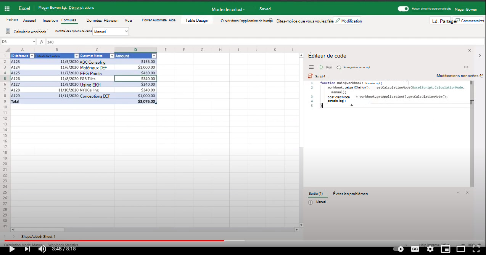

# <a name="manage-calculation-mode-in-excel"></a>Gérer le mode de calcul dans Excel

Cet exemple montre comment utiliser le [mode de calcul](/javascript/api/office-scripts/excelscript/excelscript.calculationmode) et calculer des méthodes dans Excel sur le web à l’aide de Scripts Office. Vous pouvez essayer le script sur n’importe quel fichier Excel.

## <a name="scenario"></a>Scénario

Dans Excel sur le web, le mode de calcul d’un fichier peut être contrôlé par programme à l’aide d’API. Les actions suivantes sont possibles à l’aide des scripts Office.

1. Obtenir le mode de calcul.
1. Définissez le mode de calcul.
1. Calculer des formules Excel pour les fichiers qui sont définies en mode manuel (également appelé recalcul).

## <a name="sample-code-control-calculation-mode"></a>Exemple de code : mode de calcul de contrôle

```TypeScript
function main(workbook: ExcelScript.Workbook) {
    // Set calculation mode.
    workbook.getApplication().setCalculationMode(ExcelScript.CalculationMode.manual);
    // Get calculation mode.
    const calcMode = workbook.getApplication().getCalculationMode();    
    console.log(calcMode);
    // Calculate (for manual mode files).
    workbook.getApplication().calculate(ExcelScript.CalculationType.full);
}
```

## <a name="training-video-manage-calculation-mode"></a>Vidéo de formation : gérer le mode de calcul

[](https://youtu.be/iw6O8QH01CI "Vidéo pas à pas sur la gestion du mode de calcul dans Excel sur le web")
