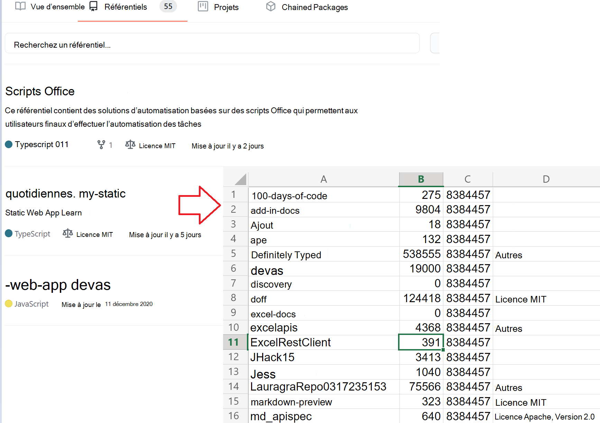

# <a name="use-external-fetch-calls-in-office-scripts"></a>Utiliser les appels externes de récupération dans les scripts Office

Ce script obtient des informations de base sur les référentiels GitHub d’un utilisateur. Il montre comment l’utiliser `fetch` dans un scénario simple. Pour plus d’informations sur l’utilisation `fetch` ou d’autres appels externes, lisez la [prise en charge des appels d’API externes dans Office Scripts](../../develop/external-calls.md). Pour plus d’informations sur l’utilisation de [JSON]](https://www.w3schools.com/whatis/whatis_json.asp) objets, comme ce qui est retourné par les API GitHub, consultez [Utiliser JSON pour passer des données vers et depuis Office Scripts](../../develop/use-json.md).

En savoir plus sur les API GItHub utilisées dans la [référence de l’API GitHub](https://docs.github.com/rest/reference/repos#list-repositories-for-a-user). Vous pouvez également voir la sortie d’appel d’API brute en accédant `https://api.github.com/users/{USERNAME}/repos` à un navigateur web (veillez à remplacer l’espace réservé {USERNAME} par votre ID GitHub).



## <a name="sample-code-get-basic-information-about-users-github-repositories"></a>Exemple de code : obtenir des informations de base sur les référentiels GitHub de l’utilisateur

```TypeScript
async function main(workbook: ExcelScript.Workbook) {
  // Call the GitHub REST API.
  // Replace the {USERNAME} placeholder with your GitHub username.
  const response = await fetch('https://api.github.com/users/{USERNAME}/repos');
  const repos: Repository[] = await response.json();

  // Create an array to hold the returned values.
  const rows: (string | boolean | number)[][] = [];

  // Convert each repository block into a row.
  for (let repo of repos) {
    rows.push([repo.id, repo.name, repo.license?.name, repo.license?.url]);
  }
  // Create a header row.
  const sheet = workbook.getActiveWorksheet();
  sheet.getRange('A1:D1').setValues([["ID", "Name", "License Name", "License URL"]]);

  // Add the data to the current worksheet, starting at "A2".
  const range = sheet.getRange('A2').getResizedRange(rows.length - 1, rows[0].length - 1);
  range.setValues(rows);
}

// An interface matching the returned JSON for a GitHub repository.
interface Repository {
  name: string,
  id: string,
  license?: License
}

// An interface matching the returned JSON for a GitHub repo license.
interface License {
  name: string,
  url: string
}
```

## <a name="training-video-how-to-make-external-api-calls"></a>Vidéo de formation : Comment effectuer des appels d’API externes

[Regardez Sudhi Ramamurthy parcourir cet exemple sur YouTube](https://youtu.be/fulP29J418E).
