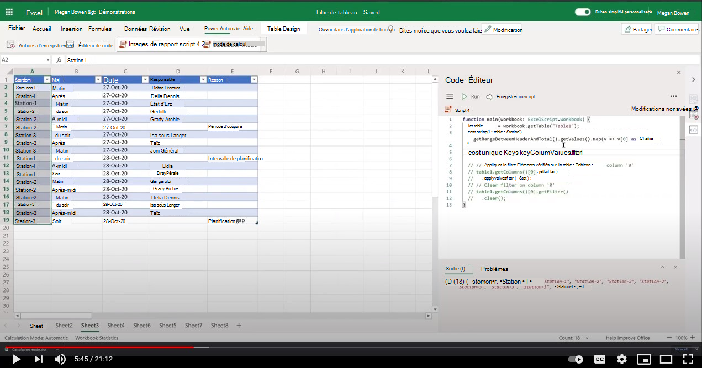

# <a name="filter-excel-table-and-get-visible-range-as-a-json-object"></a><span data-ttu-id="a7003-103">Filtrer le tableau Excel et obtenir une plage visible en tant qu’objet JSON</span><span class="sxs-lookup"><span data-stu-id="a7003-103">Filter Excel table and get visible range as a JSON object</span></span>

<span data-ttu-id="a7003-104">Cet exemple filtre un tableau Excel et renvoie la plage visible en tant qu’objet JSON.</span><span class="sxs-lookup"><span data-stu-id="a7003-104">This sample filters an Excel table and returns the visible range as a JSON object.</span></span> <span data-ttu-id="a7003-105">Ce JSON peut être fourni à un flux Power Automate dans le cadre d’une solution plus grande.</span><span class="sxs-lookup"><span data-stu-id="a7003-105">This JSON could be provided to a Power Automate flow as part of a larger solution.</span></span>

## <a name="example-scenario"></a><span data-ttu-id="a7003-106">Exemple de scénario</span><span class="sxs-lookup"><span data-stu-id="a7003-106">Example scenario</span></span>

* <span data-ttu-id="a7003-107">Appliquer un filtre à une colonne de tableau.</span><span class="sxs-lookup"><span data-stu-id="a7003-107">Apply a filter to a table column.</span></span>
* <span data-ttu-id="a7003-108">Extraire la plage visible après le filtrage.</span><span class="sxs-lookup"><span data-stu-id="a7003-108">Extract the visible range after filtering.</span></span>
* <span data-ttu-id="a7003-109">Assemblez et renvoyer un objet avec une [structure JSON spécifique.](#sample-json)</span><span class="sxs-lookup"><span data-stu-id="a7003-109">Assemble and return an object with a [specific JSON structure](#sample-json).</span></span>

## <a name="sample-code-filter-a-table-and-get-visible-range"></a><span data-ttu-id="a7003-110">Exemple de code : filtrer un tableau et obtenir une plage visible</span><span class="sxs-lookup"><span data-stu-id="a7003-110">Sample code: Filter a table and get visible range</span></span>

<span data-ttu-id="a7003-111">Le script suivant filtre un tableau et obtient la plage visible.</span><span class="sxs-lookup"><span data-stu-id="a7003-111">The following script filters a table and gets the visible range.</span></span>

<span data-ttu-id="a7003-112">Téléchargez l’exemple <a href="table-filter.xlsx">table-filter.xlsx</a> fichier et utilisez-le avec ce script pour l’essayer vous-même !</span><span class="sxs-lookup"><span data-stu-id="a7003-112">Download the sample file <a href="table-filter.xlsx">table-filter.xlsx</a> and use it with this script to try it out yourself!</span></span>

```TypeScript
function main(workbook: ExcelScript.Workbook): ReturnTemplate {
  const table1 = workbook.getTable("Table1");
  const keyColumnValues: string [] = table1.getColumnByName('Station').getRangeBetweenHeaderAndTotal().getValues().map(v => v[0] as string);
  const uniqueKeys = keyColumnValues.filter((v, i, a) => a.indexOf(v) === i);

  console.log(uniqueKeys);
  const returnObj: ReturnTemplate = {}

  uniqueKeys.forEach((key: string) => {
    table1.getColumnByName('Station').getFilter()
      .applyValuesFilter([key]);
    const rangeView = table1.getRange().getVisibleView();
    returnObj[key] = returnObjectFromValues(rangeView.getValues() as string[][]);
  })
  table1.getColumnByName('Station').getFilter().clear();
  console.log(JSON.stringify(returnObj));
  return returnObj
}

function returnObjectFromValues(values: string[][]): BasicObj[] {
  let objArray = [];
  let objKeys: string[] = [];
  for (let i=0; i < values.length; i++) {
    if (i===0) {
      objKeys = values[i]
      continue;
    }
    let obj = {}
    for (let j=0; j < values[i].length; j++) {
      obj[objKeys[j]] = values[i][j]
    }
    objArray.push(obj);
  }
  return objArray;
}

interface BasicObj {
  [key: string] : string
}

interface ReturnTemplate {
  [key: string]: BasicObj[]
}
```

### <a name="sample-json"></a><span data-ttu-id="a7003-113">Exemple de JSON</span><span class="sxs-lookup"><span data-stu-id="a7003-113">Sample JSON</span></span>

<span data-ttu-id="a7003-114">Chaque clé représente une valeur unique d’un tableau.</span><span class="sxs-lookup"><span data-stu-id="a7003-114">Each key represents a unique value of a table.</span></span> <span data-ttu-id="a7003-115">Chaque instance de tableau représente la ligne visible lorsque le filtre correspondant est appliqué.</span><span class="sxs-lookup"><span data-stu-id="a7003-115">Each array instance represents the row that is visible when the corresponding filter is applied.</span></span>

```json
{
  "Station-1": [{
    "Station": "Station-1",
    "Shift": "Morning",
    "Date": "27-Oct-20",
    "Responsible": "Debra Berger",
    "Reason": ""
  }, {
    "Station": "Station-1",
    "Shift": "Afternoon",
    "Date": "27-Oct-20",
    "Responsible": "Delia Dennis",
    "Reason": ""
  }, {
    "Station": "Station-1",
    "Shift": "Afternoon",
    "Date": "28-Oct-20",
    "Responsible": "Lidia Holloway",
    "Reason": ""
  }],
  "Station-2": [{
    "Station": "Station-2",
    "Shift": "Morning",
    "Date": "27-Oct-20",
    "Responsible": "Gerhart Moller",
    "Reason": ""
  }, {
    "Station": "Station-2",
    "Shift": "Afternoon",
    "Date": "28-Oct-20",
    "Responsible": "Grady Archie",
    "Reason": ""
  }],
  "Station-3": [{
    "Station": "Station-3",
    "Shift": "Morning",
    "Date": "27-Oct-20",
    "Responsible": "Isaiah Langer",
    "Reason": ""
  }]
}
```

## <a name="training-video-filter-an-excel-table-and-get-the-visible-range"></a><span data-ttu-id="a7003-116">Vidéo de formation : filtrer un tableau Excel et obtenir la plage visible</span><span class="sxs-lookup"><span data-stu-id="a7003-116">Training video: Filter an Excel table and get the visible range</span></span>

<span data-ttu-id="a7003-117">[](https://youtu.be/Mv7BrvPq84A "Vidéo pas à pas sur la façon de filtrer un tableau Excel et d’obtenir la plage visible")</span><span class="sxs-lookup"><span data-stu-id="a7003-117">[](https://youtu.be/Mv7BrvPq84A "Step-by-step video on how to filter an Excel table and get the visible range")</span></span>
