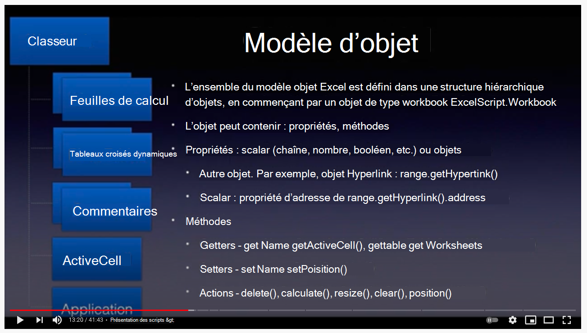
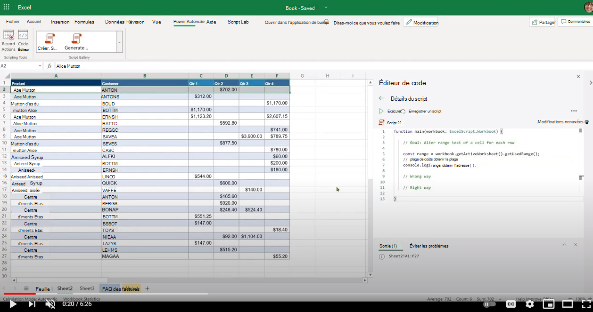

# <a name="getting-started"></a>Prise en main

Cette section fournit des détails sur les principes de base des scripts Office, notamment l'accès, l'environnement, les principes de base des scripts et quelques modèles de script de base.

## <a name="environment-setup"></a>Configuration de l'environnement

Découvrez les principes de base de l'accès, de l'environnement et de l'éditeur de script.

[](https://youtu.be/vvCtxsjPxo8 "Principes de base de l’application Office Scripts")

### <a name="access"></a>Access

Office Scripts nécessite des paramètres d'administration disponibles pour l'administrateur Microsoft 365 sous  >  **Paramètres Org paramètres**  >  **Office Scripts**. Par défaut, il est allumé pour tous les utilisateurs. Il existe deux sous-paramètres, que l'administrateur peut activer et désactiver.

* Possibilité de partager des scripts au sein de l'organisation
* Possibilité d'utiliser des scripts dans Power Automate

Vous pouvez savoir si vous avez accès aux scripts Office en ouvrant un fichier dans Excel sur le web (navigateur) et en voyant si l'onglet **Automatiser** apparaît ou non dans le ruban Excel.
Si vous ne pouvez toujours pas voir **l'onglet Automatiser,** consultez [cette section de dépannage.](../../testing/troubleshooting.md#automate-tab-not-appearing-or-office-scripts-unavailable)

### <a name="availability"></a>Disponibilité

Les scripts Office sont disponibles uniquement dans Excel sur le web pour les licences Entreprise E3+ (les comptes Grand public et E1 ne sont pas pris en charge). Les scripts Office ne sont pas encore pris en charge dans Excel sur Windows et Mac.

### <a name="scripts-and-editor"></a>Scripts et éditeur

L'éditeur de code est intégré directement dans Excel sur le web (version en ligne). Si vous avez utilisé des éditeurs comme Visual Studio Code ou Sublime, cette expérience d'édition sera assez similaire.
La plupart des touches de raccourci que Visual Studio éditeur de code utilise fonctionnent également dans l'expérience d'édition des scripts Office. Consultez les touches de raccourci suivantes.

* [MacOS](https://code.visualstudio.com/shortcuts/keyboard-shortcuts-macos.pdf)
* [Windows](https://code.visualstudio.com/shortcuts/keyboard-shortcuts-windows.pdf)

#### <a name="key-things-to-note"></a>Points clés à noter

* Les scripts Office sont disponibles uniquement pour les fichiers stockés dans OneDrive Entreprise, les sites SharePoint et les sites d'équipe.
* L'éditeur n'affiche pas l'extension du script. En réalité, il s'agit de fichiers TypeScript, mais ils sont stockés avec une extension personnalisée appelée `.osts` .
* Les scripts sont stockés dans votre propre dossier OneDrive `My Files/Documents/OfficeScripts` Entreprise. Vous n'avez pas besoin de gérer ce dossier. Pour votre part, vous pouvez ignorer cet aspect, car l'éditeur gère l'expérience d'affichage/modification.
* Les scripts ne sont pas stockés dans des fichiers Excel. Ils sont stockés séparément.
* Vous pouvez partager le script avec un fichier Excel, ce qui signifie en fait que vous liez le script au fichier, et non que vous l'attachez. Toute personne qui a accès au fichier Excel peut également **afficher,** exécuter ou effectuer une **copie** du script. Il s'agit d'une différence clé par rapport aux macros VBA.
* Sauf si vous partagez vos scripts, personne d'autre ne peut y accéder car il réside dans votre propre bibliothèque.
* Les scripts ne peuvent pas être liés à partir d'un disque local ou d'emplacements cloud personnalisés. Office Scripts reconnaît et exécute uniquement un script qui se trouve sur un emplacement prédéféré (votre dossier OneDrive mentionné ci-dessus) ou des scripts partagés.
* Pendant la modification, les fichiers sont temporairement enregistrés dans le navigateur, mais vous devez enregistrer le script avant de fermer la fenêtre Excel pour l'enregistrer dans l'emplacement OneDrive. N'oubliez pas d'enregistrer le fichier après les modifications.

## <a name="gentle-introduction-to-scripting"></a>Présentation légère de l'écriture de scripts

Les scripts Office sont des scripts autonomes écrits dans le langage TypeScript qui contiennent des instructions pour effectuer certaines automatisations sur le classeur Excel sélectionné. Toutes les instructions d'automatisation sont autonomes dans un script et les scripts ne peuvent pas appeler ou appeler d'autres scripts. Tous les scripts sont stockés dans des fichiers autonomes et stockés dans le dossier OneDrive de l'utilisateur. Vous pouvez enregistrer un nouveau script, modifier un script enregistré ou écrire un tout nouveau script à partir de zéro, le tout dans une interface d'éditeur intégrée. La meilleure partie des scripts Office est qu'ils n'ont pas besoin d'une configuration supplémentaire de la part des utilisateurs. Pas de bibliothèques externes, de pages web ou d'éléments d'interface utilisateur, de configuration, etc. Toute la configuration de l'environnement est gérée par Office Scripts et permet un accès simple et rapide à l'automatisation via une interface API simple.

Voici quelques-uns des concepts de base utiles pour comprendre comment modifier et naviguer dans les scripts :

* Syntaxe du langage TypeScript de base
* Compréhension de `main` la fonction et des arguments
* Objets et hiérarchie, méthodes, propriétés
* Collection (tableau) : navigation et opérations
* Définitions de type
* Environnement : enregistrer/modifier, exécuter, examiner les résultats, partager

Cette vidéo et cette section expliquent certains de ces concepts en détail.

[](https://youtu.be/8Zsrc1uaiiU "Principes de base des scripts")

### <a name="language-typescript"></a>Langue : TypeScript

[Les scripts Office](../../index.md) sont écrits à l'aide du langage [TypeScript,](https://www.typescriptlang.org/)qui est un langage open source qui s'appuie sur JavaScript (l'un des plus utilisés au monde) en ajoutant des définitions de types statiques. Comme l'indique le site web, fournissez un moyen de décrire la forme d'un objet, en fournissant une meilleure documentation et en permettant à TypeScript de vérifier que votre `Types` code fonctionne correctement.

La syntaxe du langage elle-même est écrite à l'aide [de JavaScript](https://developer.mozilla.org/docs/Web/JavaScript) avec des typages supplémentaires définis dans le script à l'aide de conventions TypeScript. Dans la plupart des cas, vous pouvez penser aux scripts Office tels qu'ils sont écrits en JavaScript. Il est essentiel que vous compreniez les principes de base du langage JavaScript pour commencer votre parcours de scripts Office ; même si vous n'avez pas besoin d'être compétent pour commencer votre processus d'automatisation. Avec l'enregistreur d'actions d'Office Scripts, vous pouvez comprendre les instructions de script, car des commentaires de code sont inclus et vous pouvez suivre et apporter de petites modifications.

Les API Office Scripts, qui permettent au script d'interagir avec Excel, sont conçues pour les utilisateurs finaux qui n'ont peut-être pas beaucoup d'arrière-plan de codage. Les API peuvent être invoquées de manière synchrone et vous n'avez pas besoin de connaître les sujets avancés tels que les promesses ou les rappels. La conception de l'API Office Scripts fournit :

* Modèle objet simple avec méthodes, getters/setters.
* Collections d'objets faciles d'accès en tant que tableaux réguliers.
* Options de gestion des erreurs simples.
* Performances optimisées pour certains scénarios aidant les utilisateurs à se concentrer sur le scénario en cours.

### <a name="main-function-the-scripts-starting-point"></a>`main` fonction : point de départ du script

L'exécution d'Office Scripts commence à la `main` fonction. Un script est un fichier unique contenant une ou plusieurs fonctions, ainsi que des déclarations de types, d'interfaces, de variables, etc. Pour suivre le script, commencez par la fonction car Excel appelle d'abord la fonction lorsque `main` `main` vous exécutez un script. La fonction aura toujours au moins un argument (ou paramètre) nommé, qui est simplement un nom de variable identifiant le workbook actuel sur lequel le `main` script est en cours `workbook` d'exécution. Vous pouvez définir des arguments supplémentaires pour l'utilisation avec l'exécution de Power Automate (hors connexion).

* `function main(workbook: ExcelScript.Workbook)`

Un script peut être organisé en fonctions plus petites pour faciliter la réutilisabilité du code, la clarté, etc. D'autres fonctions peuvent se trouver à l'intérieur ou à l'extérieur de la fonction principale, mais toujours dans le même fichier. Un script est autonome et ne peut utiliser que les fonctions définies dans le même fichier. Les scripts ne peuvent pas appeler ou appeler un autre script Office.

Ainsi, en résumé :

* La `main` fonction est le point d'entrée de n'importe quel script. Lorsque la fonction est exécutée, l'application Excel appelle cette fonction principale en fournissant le premier paramètre du workbook.
* Il est important de conserver le premier argument et sa déclaration de `workbook` type tel qu'il apparaît. Vous pouvez ajouter de nouveaux arguments à la fonction (voir la section suivante), mais `main` conservez le premier argument tel qu'il est.

:::image type="content" source="../../images/getting-started-main-introduction.png" alt-text="La fonction principale est le point d'entrée du script":::

#### <a name="send-or-receive-data-from-other-apps"></a>Envoyer ou recevoir des données à partir d'autres applications

Vous pouvez connecter Excel à d'autres parties de votre organisation en exécutant des scripts [dans Power Automate.](https://flow.microsoft.com) En savoir plus sur [l'exécution de scripts Office dans les flux Power Automate.](../../develop/power-automate-integration.md)

La manière de recevoir ou d'envoyer des données à partir et vers Excel consiste à passer par la `main` fonction. Pensez-la comme la passerelle d'informations qui permet de décrire et d'utiliser les données entrantes et sortantes dans le script. Vous pouvez recevoir des données en dehors du script à l'aide du type de données et renvoyer toutes les données reconnues par TypeScript telles que , ou tout objet sous la forme d'interfaces que vous définissez dans le `string` `string` `number` `boolean` script.

:::image type="content" source="../../images/getting-started-data-in-out.png" alt-text="Entrées et sorties d'un script":::

#### <a name="use-functions-to-organize-and-reuse-code"></a>Utiliser des fonctions pour organiser et réutiliser le code

Vous pouvez utiliser des fonctions pour organiser et réutiliser le code dans votre script.

:::image type="content" source="../../images/getting-started-use-functions.png" alt-text="Utilisation de fonctions dans un script":::

### <a name="objects-hierarchy-methods-properties-collections"></a>Objets, hiérarchie, méthodes, propriétés, collections

L'ensemble du modèle objet d'Excel est défini dans une structure hiérarchique d'objets, en commençant par l'objet de type « workbook `ExcelScript.Workbook` ». Un objet peut contenir des méthodes, des propriétés et d'autres objets qu'il contient. Les objets sont liés les uns aux autres à l'aide des méthodes. La méthode d'un objet peut renvoyer un autre objet ou une autre collection d'objets. L'utilisation de la fonctionnalité IntelliSense de l'éditeur de code (fin du code) est un excellent moyen d'explorer la hiérarchie d'objets. Vous pouvez également utiliser le [site de documentation de référence officiel](/javascript/api/office-scripts/overview) pour suivre les relations entre les objets.

Un [objet](https://developer.mozilla.org/docs/Web/JavaScript/Reference/Global_Objects/Object) est une collection de propriétés et une propriété est une association entre un nom (ou une clé) et une valeur. La valeur d'une propriété peut être une fonction, auquel cas la propriété est appelée méthode. Dans le cas du modèle objet Office Scripts, un objet représente une chose dans le fichier Excel avec qui les utilisateurs interagissent, comme un graphique, un lien hypertexte, un tableau croisé dynamique, etc. Il peut également représenter le comportement d'un objet tel que les attributs de protection d'une feuille de calcul.

La rubrique des objets et propriétés TypeScript et des méthodes est assez profonde. Pour commencer à utiliser le script et être productif, vous pouvez vous souvenir de quelques éléments de base :

* Les objets et propriétés sont accessibles à l'aide de la notation (point), avec l'objet sur le côté gauche de la propriété ou la méthode `.` `.` sur le côté droit. Exemples `hyperlink.address` : , `range.getAddress()` .
* Les propriétés sont de nature scalante (chaînes, booléens, nombres). Par exemple, le nom d'un workbook, la position d'une feuille de calcul, la valeur de la table a un pied de table ou non.
* Les méthodes sont « invoquées » ou « exécutées » à l'aide des parenthèses ouvertes. Exemple : `table.delete()`. Parfois, un argument est transmis à une fonction en les incluant entre parenthèses ouvertes : `range.setValue('Hello')` . Vous pouvez transmettre de nombreux arguments à une fonction (telle que définie par son contrat/signature) et les séparer à l'aide `,` de .  Par exemple : `worksheet.addTable('A1:D6', true)`. Vous pouvez transmettre des arguments de n'importe quel type selon les besoins de la méthode, tels que des chaînes, des nombres, des booléens ou même d'autres objets, par exemple, où se trouve un objet créé ailleurs dans le `worksheet.addTable(targetRange, true)` `targetRange` script.
* Les méthodes peuvent renvoyer une chose telle qu'une propriété scalar (nom, adresse, etc.) ou un autre objet (plage, graphique) ou ne rien renvoyer (par exemple, avec des `delete` méthodes). Vous recevez ce que la méthode renvoie en déclarant une variable ou en l'attribuant à une variable existante. Vous pouvez le voir sur le côté gauche de l'instruction telle que `const table = worksheet.addTable('A1:D6', true)` .
* En grande partie, le modèle objet Office Scripts se compose d'objets avec des méthodes qui relient différentes parties du modèle objet Excel. Très rarement, vous trouverez des propriétés de valeurs scalatiques ou d'objets.
* Dans les scripts Office, une méthode de modèle objet Excel doit contenir des parenthèses ouvertes. L'utilisation de méthodes sans elles n'est pas autorisée (par exemple, l'affectation d'une méthode à une variable).

Examinons quelques méthodes sur `workbook` l'objet.

```TypeScript
function main(workbook: ExcelScript.Workbook) {
    // Return a boolean (true or false) setting of whether the workbook is set to auto-save or not. 
    const autoSave = workbook.getAutoSave(); 
    // Get workbook name.
    const name = workbook.getName();
    // Get active cell range object.
    const cell = workbook.getActiveCell();
    // Get table named SALES.
    const cell = workbook.getTable('SALES');
    // Get all slicer objects.
    const slicers = workbook.getSlicers();
}
```

Dans cet exemple :

* Méthodes de l'objet telles que et renvoyer `workbook` `getAutoSave()` une propriété `getName()` scalar (chaîne, nombre, booléen).
* Méthodes telles que `getActiveCell()` le retour d'un autre objet.
* La méthode accepte un argument (nom de la table dans ce cas) et renvoie `getTable()` une table spécifique dans le workbook.
* La méthode renvoie un tableau (appelé à de nombreux endroits en tant que collection) de tous les objets slicer dans `getSlicers()` le workbook.

Vous remarquerez que toutes ces méthodes ont un préfixe, qui n'est qu'une convention utilisée dans le modèle objet Office Scripts pour transmettre que la méthode retourne `get` quelque chose. Ils sont également communément appelés « getters ».

Il existe deux autres types de méthodes que nous allons voir dans l'exemple suivant :

```TypeScript
function main(workbook: ExcelScript.Workbook) {
    // Get a worksheet named 'Sheet1.
    const sheet = workbook.getWorksheet('Sheet1'); 
    // Set name to SALES.
    sheet.setName('SALES');
    // Position the worksheet at the beginning.
    sheet.setPosition(0);
}
```

Dans cet exemple :

* La `setName()` méthode définit un nouveau nom pour la feuille de calcul. `setPosition()` définit la position sur la première cellule.
* Ces méthodes modifient le fichier Excel en fixant une propriété ou un comportement du classeur. Ces méthodes sont appelées « méthodes setter ».
* En règle générale, les « méthodes setter » ont un « getter » complémentaire, par exemple, et les deux méthodes `worksheet.getPosition` `worksheet.setPosition` sont des méthodes.

#### <a name="undefined-and-null-primitive-types"></a>`undefined` et `null` types primitifs

Les deux types de données primitifs suivants doivent être pris en compte :

1. La valeur [`null`](https://developer.mozilla.org/docs/Web/JavaScript/Reference/Global_Objects/null) représente l'absence intentionnelle de toute valeur d'objet. Il s'agit de l'une des valeurs primitives de JavaScript et est utilisée pour indiquer qu'une variable n'a pas de valeur.
1. Une variable qui n'a pas été affectée à une valeur est de type [`undefined`](https://developer.mozilla.org/docs/Web/JavaScript/Reference/Global_Objects/undefined) . Une méthode ou une instruction peut également renvoyer si la variable en cours `undefined` d'évaluation n'a pas de valeur affectée.

Ces deux types se rogner dans le cadre de la gestion des erreurs et peuvent provoquer un peu de difficultés si elles ne sont pas gérées correctement. Heureusement, TypeScript/JavaScript permet de vérifier si une variable est de type `undefined` ou `null` . Nous parlerons de certains de ces contrôles dans les sections ultérieures, y compris la gestion des erreurs.

#### <a name="method-chaining"></a>Chaînage de méthode

Vous pouvez utiliser la notation par points pour connecter des objets renvoyés à partir d'une méthode afin de raccourcir votre code. Parfois, cette technique facilite la lecture et la gestion du code. Toutefois, il y a quelques points à prendre en compte. Examinons les exemples suivants.

Le code suivant obtient la cellule active et la cellule suivante, puis définit la valeur. Il s'agit d'un bon candidat pour utiliser le chaînage, car ce code réussira en tout temps.

```TypeScript
function main(workbook: ExcelScript.Workbook) {
    workbook.getActiveCell().getOffsetRange(0,1).setValue('Next cell');
}
```

Toutefois, le code suivant (qui obtient un tableau nommé **SALES** et qui allume son style de colonne à bandes) présente un problème.

```TypeScript
function main(workbook: ExcelScript.Workbook) {
  workbook.getTable('SALES').setShowBandedColumns(true);
}
```

Que se **passe-t-il** si la table SALES n'existe pas ? Le script échoue avec une erreur (indiquée ci-dessous), car elle renvoie (qui est un type JavaScript indiquant qu'il n'existe pas de `getTable('SALES')` table telle que `undefined` **SALES**). Appeler la `setShowBandedColumns` méthode n'a aucun sens, c'est-à-dire que le `undefined` script se termine par une `undefined.setShowBandedColumns(true)` erreur.

```text
Line 2: Cannot read property 'setShowBandedColumns' of undefined
```

Vous pouvez [](https://developer.mozilla.org/docs/Web/JavaScript/Reference/Operators/Optional_chaining) utiliser l'opérateur de chaînage facultatif qui permet de simplifier l'accès aux valeurs par le biais d'objets connectés lorsqu'il est possible qu'une référence ou une méthode soit ou `undefined` (c'est-à-dire la manière dont JavaScript indique un objet ou un résultat non lié ou inexistant) pour gérer cette `null` condition.

```TypeScript
function main(workbook: ExcelScript.Workbook) {
    // This line will not fail as the setShowBandedColumns method is executed only if the SALES table is present.
    workbook.getTable('SALES')?.setShowBandedColumns(true); 
}
```

Si vous souhaitez gérer les conditions ou le type d'objet inexistants renvoyés par une méthode, il est préférable d'affecter la valeur renvoyée à partir de la méthode et de gérer `undefined` celle-ci séparément.

```TypeScript
function main(workbook: ExcelScript.Workbook) {
    const salesTable = workbook.getTable('SALES');
    if (salesTable) {
        salesTable.setShowBandedColumns(true);
    } else { 
        // Handle this condition.
    }
}
```

#### <a name="get-object-reference"></a>Obtenir une référence d'objet

`workbook`L'objet vous est attribué dans la `main` fonction. Vous pouvez commencer à utiliser `workbook` l'objet et accéder directement à ses méthodes.

```TypeScript
function main(workbook: ExcelScript.Workbook) {
    // Get workbook name.
    const name = workbook.getName();
    // Display name to console.
    console.log(name);
}
```

Pour utiliser tous les autres objets dans le manuel, commencez par l'objet et descendez la hiérarchie jusqu'à ce que vous obtenez `workbook` l'objet que vous recherchez. Vous pouvez obtenir la référence d'objet en récupérant l'objet à l'aide de sa méthode ou en récupérant la collection d'objets, `get` comme illustré ci-dessous :

```TypeScript
function main(workbook: ExcelScript.Workbook) {
    // Get the active worksheet.
    const sheet = workbook.getActiveWorksheet();
    // Fetch using an ID or key.
    const sheet = workbook.getWorksheet('SomeSheetName');
    // Invoke methods on the object.
    sheet.setPosition(0); 
    
    // Get collection of methods.
    const tables = sheet.getTables();
    console.log('Total tables in this sheet: ' + tables.length);
}
```

#### <a name="check-if-an-object-exists-then-delete-and-add"></a>Vérifier si un objet existe, puis supprimer et ajouter

Pour créer un objet, par exemple avec un nom prédéféré, il est toujours préférable de supprimer un objet similaire qui peut exister, puis de l'ajouter. Vous pouvez le faire à l'aide du modèle suivant.

```TypeScript
function main(workbook: ExcelScript.Workbook) {
  // Name of the worksheet to be added. 
  let name = "Index";
  // Check if the worksheet already exists. If not, add the worksheet.
  let sheet = workbook.getWorksheet('Index');
  if (sheet) {
    console.log(`Worksheet by the name ${name} already exists. Deleting it.`);
    // Call the delete method on the object to remove it. 
    sheet.delete();
  } 
    // Add a blank worksheet. 
  console.log(`Adding the worksheet named  ${name}.`)
  const indexSheet = workbook.addWorksheet("Index");
}

```

Vous pouvez également supprimer un objet qui existe ou non, utilisez le modèle suivant.

```TypeScript
    // The ? preceding delete() will ensure that the API is only invoked if the object exists. 
    workbook.getWorksheet('Index')?.delete(); 
```

#### <a name="note-about-adding-an-object"></a>Remarque sur l'ajout d'un objet

Pour créer, insérer ou ajouter un objet tel qu'un slicer, un tableau croisé dynamique, une feuille de calcul, etc., utilisez la méthode add_Object_ **correspondante.** Une telle méthode est disponible sur son objet parent. Par exemple, la `addChart()` méthode est disponible sur `worksheet` l'objet. La **méthode add_Object_** renvoie l'objet qu'elle crée. Recevez la valeur renvoyée et utilisez-la ultérieurement dans votre script.

```TypeScript
function main(workbook: ExcelScript.Workbook) {
  // Add object and get a reference to it. 
  const indexSheet = workbook.addWorksheet("Index");
  // Use it elsewhere in the script 
  console.log(indexSheet.getPosition());
}

```

Vous pouvez également supprimer un objet qui existe ou non, utilisez ce modèle :

```TypeScript
    workbook.getWorksheet('Index')?.delete(); // The ? preceding delete() will ensure that the API is only invoked if the object exists. 
```

#### <a name="collections"></a>Collections

Les collections sont des objets tels que des tableaux, des graphiques, des colonnes, etc. qui peuvent être récupérés en tant que tableaux et retentés pour traitement. Vous pouvez récupérer une collection à l'aide de la méthode correspondante et traiter les données dans une boucle à l'aide de l'une des nombreuses techniques de traversée de tableau `get` TypeScript telles que :

* [`for` ou `while`](https://developer.mozilla.org/docs/Web/JavaScript/Guide/Loops_and_iteration)
* [`for..of`](https://developer.mozilla.org/docs/Web/JavaScript/Reference/Statements/for...of)
* [`forEach`](https://developer.mozilla.org/docs/Web/JavaScript/Reference/Global_Objects/Array/forEach)

* [Informations de base sur la langue des tableaux](https://developer.mozilla.org//docs/Learn/JavaScript/First_steps/Arrays)

Ce script montre comment utiliser les collections pris en charge dans les API De scripts Office. Il colore chaque onglet de feuille de calcul du fichier avec une couleur aléatoire.

```TypeScript
function main(workbook: ExcelScript.Workbook) {

  // Get all sheets as a collection.
  const sheets = workbook.getWorksheets();
  const names = sheets.map ((sheet) => sheet.getName());
  console.log(names);
  console.log(`Total worksheets inside of this workbook: ${sheets.length}`);
  // Get information from specific sheets within the collection.
  console.log(`First sheet name is: ${names[0]}`);
  if (sheets.length > 1) {
    console.log(`Last sheet's Id is: ${sheets[sheets.length -1].getId()}`);
  }
  // Color each worksheet with random color.
  for (const sheet of sheets) {
    sheet.setTabColor(`#${Math.random().toString(16).substr(-6)}`);
  }
}
```

## <a name="type-declarations"></a>Déclarations de type

Les déclarations de type aident les utilisateurs à comprendre le type de variable avec qui ils traitent. Il facilite l'achèvement automatique des méthodes et facilite les vérifications de la qualité du temps de développement.

Vous pouvez trouver des déclarations de type dans le script à différents endroits, y compris la déclaration de fonction, la déclaration de variable, IntelliSense définitions, etc.

Exemples :

* `function main(workbook: ExcelScript.Workbook)`
* `let myRange: ExcelScript.Range;`
* `function getMaxAmount(range: ExcelScript.Range): number`

Vous pouvez identifier facilement les types dans l'éditeur de code, car ils apparaissent généralement différemment dans une couleur différente. Un `:` deux-points précède généralement la déclaration de type.  

L'écriture de types peut être facultative dans TypeScript, car l'inférence de type vous permet d'obtenir beaucoup de puissance sans écrire de code supplémentaire. En grande partie, le langage TypeScript est bon pour déduire les types de variables. Toutefois, dans certains cas, les scripts Office exigent que les déclarations de type soient explicitement définies si la langue ne parvient pas à identifier clairement le type. En outre, les scripts explicites ou `any` implicites ne sont pas autorisés dans Office Script. Plus d'informations à ce jour.

### <a name="excelscript-types"></a>`ExcelScript` types

Dans Office Scripts, vous utiliserez les types de types suivants.

* Types de langue native tels `number` que , , , , , `string` `object` `boolean` `null` etc.
* Types d'API Excel. Elles commencent par `ExcelScript` . Par exemple, `ExcelScript.Range` , `ExcelScript.Table` etc.
* Toutes les interfaces personnalisées que vous avez peut-être définies dans le script à l'aide `interface` d'instructions.

Consultez ensuite des exemples de chacun de ces groupes.

**_Types de langue native_**

Dans l'exemple suivant, notez les endroits `string` où , et ont été `number` `boolean` utilisés. Il s'existe des types **de langage TypeScript** natifs.

```TypeScript
function main(workbook: ExcelScript.Workbook)
{
  const table = workbook.getActiveWorksheet().getTables()[0];
  const sales = table.getColumnByName('Sales').getRange().getValues();
  console.log(sales);
  // Add 100 to each value.
  const revisedSales = salesAs1DArray.map(data => data as number + 100);
  // Add a column.
  table.addColumn(-1, revisedSales);  
}
/**
 * Extract a column from 2D array and return result.
 */
function extractColumn(data: (string | number | boolean)[][], index: number): (string | number | boolean)[] {

  const column = data.map((row) => {
    return row[index];
  })
  return column;
}
/**
 * Convert a flat array into a 2D array that can be used as range column.
 */
function convertColumnTo2D(data: (string | number | boolean)[]): (string | number | boolean)[][] {

  const columnAs2D = data.map((row) => {
    return [row];
  })
  return columnAs2D;
}
```

**_Types ExcelScript_**

Dans l'exemple suivant, une fonction d'aide prend deux arguments. La première est la `sheet` variable de `ExcelScript.Worksheet` type.

```TypeScript
function main(workbook: ExcelScript.Workbook) {
    const sheet = workbook.getWorksheet('Sheet5');
    const data = ['2016', 'Bikes', 'Seats', '1500', .05];
    addRow(sheet, data);
    return;
}

function addRow(sheet: ExcelScript.Worksheet, data: (string | number | boolean)[]): void {

    const usedRange = sheet.getUsedRange();
    let startCell: ExcelScript.Range;
    // If the sheet is empty, then use A1 as starting cell for update.
    if (usedRange) { 
      startCell = usedRange.getLastRow().getCell(0, 0).getOffsetRange(1, 0);
    } else {
      startCell = sheet.getRange('A1');
    }
    console.log(startCell.getAddress());
    const targetRange = startCell.getResizedRange(0, data.length - 1);      
    targetRange.setValues([data]);
    return;
}
```

**_Types personnalisés_**

L'interface personnalisée `ReportImages` est utilisée pour renvoyer des images vers une autre action de flux. La `main` déclaration de fonction `: ReportImages` inclut des instructions pour indiquer à TypeScript qu'un objet de ce type est renvoyé.

```TypeScript
function main(workbook: ExcelScript.Workbook): ReportImages {
  let chart = workbook.getWorksheet("Sheet1").getCharts()[0];
  const table = workbook.getWorksheet('InvoiceAmounts').getTables()[0];
  
  const chartImage = chart.getImage();
  const tableImage = table.getRange().getImage();
  return {
    chartImage,
    tableImage
  }
}

interface ReportImages {
  chartImage: string
  tableImage: string
}
```

### <a name="type-assertion-overriding-the-type"></a>Assertion de type (remplacement du type)

Comme l'indique la [documentation](https://www.typescriptlang.org/docs/handbook/basic-types.html#type-assertions) TypeScript, « Parfois, vous finirez par vous retrouver dans une situation où vous en sconnaissez plus sur une valeur que TypeScript. En règle générale, cela se produit lorsque vous savez que le type d'une entité peut être plus spécifique que son type actuel. Les assertions de type sont un moyen d'indiquer au compilateur « Faites-moi confiance, je sais ce que je suis en train de faire ». Une assertion de type est comme un type cast dans d'autres langages, mais elle n'effectue aucune vérification ou réorganisation spéciale des données. Elle n'a aucun impact sur l'runtime et est utilisée purement par le compilateur. »

Vous pouvez faire la déclaration du type à l'aide du mot `as` clé ou à l'aide de crochets angulaires, comme illustré dans le code suivant.

```TypeScript
function main(workbook: ExcelScript.Workbook) {
  let data = workbook.getActiveCell().getValue();
  // Since the add10 function only accepts number, assert data's type as number, otherwise the script cannot be run.
  const answer1 = add10(data as number);
  const answer2 = add10(<number> data);
}

function add10(data: number) { 
  return data + 10;
}
```

#### <a name="any-type-in-the-script"></a>« any » (n'importe quel) type dans le script

Le [site web TypeScript indique](https://www.typescriptlang.org/docs/handbook/basic-types.html#any):

  Dans certains cas, toutes les informations de type ne sont pas disponibles ou sa déclaration prend un effort inapproprié. Ceux-ci peuvent se produire pour les valeurs du code qui a été écrite sans TypeScript ou une bibliothèque tierce. Dans ce cas, nous pourrions refuser la vérification du type. Pour ce faire, nous étiqueterons ces valeurs avec le `any` type :

  ```TypeScript
  declare function getValue(key: string): any;
  // OK, return value of 'getValue' is not checked
  const str: string = getValue("myString");
  ```

**Explicit `any` n'est PAS autorisé**

```TypeScript
// This is not allowed
let someVariable: any; 
```

Le `any` type présente des difficultés pour la façon dont Office Scripts traite les API Excel. Cela provoque des problèmes lorsque les variables sont envoyées aux API Excel pour traitement. Il est essentiel de connaître le type de variables utilisées dans le script pour le traitement du script et, par conséquent, il est interdit de définir explicitement une variable avec `any` un type. Vous recevrez une erreur de compilation (erreur avant l'exécution du script) s'il existe une variable dont le type est déclaré `any` dans le script. Une erreur s'est également produite dans l'éditeur.

:::image type="content" source="../../images/getting-started-eanyi.png" alt-text="Erreur explicite « any »":::

:::image type="content" source="../../images/getting-started-expany.png" alt-text="Erreur explicite « any » affichée dans la sortie":::

Dans le code affiché dans l'image précédente, indique que la ligne `[5, 16] Explicit Any is not allowed` 5 colonne 16 déclare le `any` type. Cela vous permet de localiser la ligne de code qui contient l'erreur.

Pour contourner ce problème, déclarez toujours le type de la variable.

Si vous avez des doutes sur le type d'une variable, une astuce dans TypeScript vous permet de définir des [types d'union.](https://www.typescriptlang.org/docs/handbook/unions-and-intersections.html) Cela peut être utilisé pour que les variables tiennent des valeurs de plage, qui peuvent être de nombreux types.

```TypeScript
// Define value as a union type rather than 'any' type.
let value: (string | number | boolean);
value = someValue_from_another_source;
//...
someRange.setValue(value);
```

### <a name="type-inference"></a>Inférence de type

Dans TypeScript, il existe plusieurs endroits où [l'inférence de type](https://www.typescriptlang.org/docs/handbook/type-inference.html) est utilisée pour fournir des informations de type lorsqu'il n'existe aucune annotation de type explicite. Par exemple, le type de la variable x est déduit comme un nombre dans le code suivant.

```TypeScript
let x = 3;
//  ^ = let x: number
```

Ce type d'inférence a lieu lors de l'initialisation des variables et des membres, de la définition des valeurs par défaut des paramètres et de la détermination des types de retour de fonction.

### <a name="no-implicit-any-rule"></a>règle no-implicit-any

Un script requiert les types de variables qui ont été explicitement ou implicitement déclarées. Si le compilateur TypeScript ne parvient pas à déterminer le type d'une variable (soit parce que le type n'est pas déclaré explicitement, soit parce que l'inférence de type n'est pas possible), vous recevrez une erreur de temps de compilation (erreur avant l'exécution du script). Une erreur s'est également produite dans l'éditeur.

:::image type="content" source="../../images/getting-started-iany.png" alt-text="Erreur implicite « any » affichée dans l'éditeur.":::

Les scripts suivants ont des erreurs de temps de compilation, car les variables sont déclarées sans types et TypeScript ne peut pas déterminer le type au moment de la déclaration.

```TypeScript
function main(workbook: ExcelScript.Workbook) {
    // The variable 'value' gets 'any' type
    // because no type is declared.
    let value; 
    // Even when a number type is assigned,
    // the type of 'value' remains any.
    value = 10; 
    // The following statement fails because
    // Office Scripts can't send an argument
    // of type 'any' to Excel for processing.
    workbook.getActiveCell().setValue(value);
    return;
}
```

```TypeScript
function main(workbook: ExcelScript.Workbook) {
    // The variable 'cell' gets 'any' type
    // because no type is defined.
    let cell; 
    cell = workbook.getActiveCell().getValue();
    // Office Scripts can't assign Range type object
    // to a variable of 'any' type.
    console.log(cell.getValue());
    return;
}
```

Pour éviter cette erreur, utilisez plutôt les modèles suivants. Dans chaque cas, la variable et son type sont déclarés en même temps.

```TypeScript
function main(workbook: ExcelScript.Workbook) {
    const value: number = 10; 
    workbook.getActiveCell().setValue(value);
    return;
}
```

```TypeScript
function main(workbook: ExcelScript.Workbook) {
    const cell: ExcelScript.Range = workbook.getActiveCell().getValue();
    console.log(cell.getValue()); 
    return;
}
```

## <a name="error-handling"></a>Gestion des erreurs

L'erreur Office Scripts peut être classée dans l'une des catégories suivantes.

1. Avertissement au moment de la compilation affiché dans l'éditeur
1. Erreur au moment de la compilation qui s'affiche lorsque vous exécutez, mais qui se produit avant le début de l'exécution
1. Erreur d'runtime

Les avertissements de l'éditeur peuvent être identifiés à l'aide des soulignements ondulés rouge dans l'éditeur :

:::image type="content" source="../../images/getting-started-eanyi.png" alt-text="Avertissement au moment de la compilation affiché dans l'éditeur":::

Parfois, vous pouvez également voir des soulignements d'avertissement orange et des messages d'information gris. Ils doivent être examinés attentivement, même s'ils ne vont pas provoquer d'erreurs.

Il n'est pas possible de faire la distinction entre les erreurs de compilation et d'runtime, car les deux messages d'erreur semblent identiques. Elles se produisent toutes les deux lorsque vous exécutez réellement le script. Les images suivantes montrent des exemples d'erreur de compilation et d'erreur d'runtime.

:::image type="content" source="../../images/getting-started-expany.png" alt-text="Exemple d'erreur au moment de la compilation":::

:::image type="content" source="../../images/getting-started-error-basic.png" alt-text="Exemple d'erreur d'utilisation":::

Dans les deux cas, vous verrez le numéro de ligne où l'erreur s'est produite. Vous pouvez ensuite examiner le code, résoudre le problème et ré-exécuter.

Voici quelques meilleures pratiques pour éviter les erreurs d'runtime.

### <a name="check-for-object-existence-before-deletion"></a>Vérifier l'existence d'un objet avant la suppression

Vous pouvez également supprimer un objet qui existe ou non, utilisez ce modèle :

```TypeScript
// The ? ensures that the delete() API is only invoked if the object exists.
workbook.getWorksheet('Index')?.delete();

// Alternative:
const indexSheet = workbook.getWorksheet('Index');
if (indexSheet) {
    indexSheet.delete();
}
```

### <a name="do-pre-checks-at-the-beginning-of-the-script"></a>Faire des vérifications préalables au début du script

En tant que meilleure pratique, assurez-vous toujours que toutes vos entrées sont présentes dans le fichier Excel avant d'exécutez votre script. Vous avez peut-être effectué certaines hypothèses sur la présence d'objets dans le manuel. Si ces objets n'existent pas, votre script peut rencontrer une erreur lorsque vous lisez l'objet ou ses données. Au lieu de commencer le traitement et les erreurs au milieu une fois qu'une partie des mises à jour ou du traitement est déjà terminée, il est préférable de faire toutes les vérifications préalables au début du script.

Par exemple, le script suivant requiert la présence de deux tables nommées Table1 et Table2. Par conséquent, le script vérifie leur présence et se termine par l'instruction et un message approprié `return` s'ils ne sont pas présents.

```TypeScript
function main(workbook: ExcelScript.Workbook) {

  // Tables that should be in the workbook for the script to work:
  const TargetTableName = 'Table1';
  const SourceTableName = 'Table2';

  // Get the table objects.
  let targetTable = workbook.getTable(TargetTableName);
  let sourceTable = workbook.getTable(SourceTableName);

  if (!targetTable || !sourceTable) {
    console.log(`Required tables missing - Check that both source (${TargetTableName}) and target (${SourceTableName}) tables are present before running the script.`);
    return;
  }

  // Continue....
}
```

Si la vérification pour s'assurer de la présence de données d'entrée se produit dans une fonction distincte, il est important de terminer le script en émettant l'instruction à partir `return` de la `main` fonction.

Dans l'exemple suivant, la `main` fonction appelle la fonction pour faire les `inputPresent` vérifications préalables. `inputPresent` renvoie un booléen `true` (ou `false` ) indiquant si toutes les entrées requises sont présentes ou non. Il incombe ensuite à la fonction d'émettre l'instruction (c'est-à-dire, à partir de la fonction) de terminer immédiatement `main` `return` le `main` script.

```TypeScript
function main(workbook: ExcelScript.Workbook) {

  // Get the table objects.
  if (!inputPresent(workbook)) {
    return;
  }

  // Continue....
}

function inputPresent( workbook: ExcelScript.Workbook): boolean {

  // Tables that should be in the workbook for the script to work:
  const TargetTableName = 'Table1';
  const SourceTableName = 'Table2';

  // Get the table objects.
  let targetTable = workbook.getTable(TargetTableName);
  let sourceTable = workbook.getTable(SourceTableName);

  if (!targetTable || !sourceTable) {
    console.log(`Required tables missing - Check that both source (${TargetTableName}) and target (${SourceTableName}) tables are present before running the script.`);
    return false;
  }
  return true;
}
```

### <a name="when-to-abort-throw-the-script"></a>Quand abandonner ( `throw` ) le script  

En grande partie, vous n'avez pas besoin d'abandonner ( `throw` ) votre script. Cela est dû au fait que le script informe généralement l'utilisateur que le script n'a pas réussi à s'exécuter en raison d'un problème. Dans la plupart des cas, il suffit de terminer le script avec un message d'erreur et `return` une instruction de la `main` fonction.

Toutefois, si votre script s'exécute dans le cadre de Power Automate, vous pouvez abandonner le flux si certaines conditions ne sont pas remplies. Il est donc important de ne pas sur une erreur, mais plutôt d'émettre une instruction pour abandonner le script afin que les `return` `throw` instructions de code suivantes ne s'exécutent pas.

```TypeScript
function main(workbook: ExcelScript.Workbook) {

  // Tables that should be in the workbook for the script to work:
  const TargetTableName = 'Table1';
  const SourceTableName = 'Table2';

  // Get the table objects.
  let targetTable = workbook.getTable(TargetTableName);
  let sourceTable = workbook.getTable(SourceTableName);

  if (!targetTable || !sourceTable) {
    // Abort script.
    throw `Required tables missing - Check that both source (${TargetTableName}) and target (${SourceTableName}) tables are present before running the script.`;
  }
  
```

Comme mentionné dans la section suivante, un autre scénario se présente lorsque plusieurs fonctions sont impliquées (appels qui appellent, etc.), ce qui rend difficile la propagation de `main` `functionX` `functionY` l'erreur. Il peut être plus facile d'abandonner ou de lever à partir de la fonction imbriisée avec un message que de renvoyer une erreur jusqu'à un message d'erreur et de le `main` `main` renvoyer.

### <a name="when-to-use-trycatch-throw-exception"></a>Quand utiliser try.. catch (exception de throw)

La technique permet de détecter si un appel d'API a échoué et de [`try..catch`](https://developer.mozilla.org/docs/Web/JavaScript/Reference/Statements/try...catch) gérer cette erreur dans votre script. Il peut être important de vérifier la valeur de retour d'une API pour vérifier qu'elle a été correctement effectuée.

Prenons l'exemple d'extrait de code suivant.

```TypeScript
function main(workbook: ExcelScript.Workbook) {

  // Somewhere in the script, perform a large data update.
  range.setValues(someLargeValues);

}
```

`setValues()`L'appel peut échouer et entraîner l'échec du script. Vous pouvez gérer cette condition dans votre code et éventuellement personnaliser le message d'erreur ou décomposer la mise à jour en unités plus petites, etc. Dans ce cas, il est important de savoir que l'API a renvoyé une erreur et interprète ou gère cette erreur.

```TypeScript
try {
    range.setValues(someLargeValues);
} catch (error) {
    console.log(`The script failed to update the values at location ____. Please inspect and run again.`);
    console.log(error);
    return; // End script (assuming this is in main function).
}

// OR...

try {
    range.setValues(someLargeValues);
} catch (error) {
    console.log(`The script failed to update the values at location ____. Trying a different approach`);
    handleUpdatesInSmallerChunks(someLargeValues);
}

// Continue...
}
```

Un autre scénario se produit lorsque la fonction principale appelle une autre fonction, qui appelle à son tour une autre fonction (et ainsi de suite) et que l'appel d'API qui vous intéresse se produit dans la fonction inférieure. La propagation de l'erreur jusqu'à n'est peut-être pas `main` réalisable ou pratique. Dans ce cas, il est plus pratique de lancer une erreur dans la fonction inférieure.

```TypeScript

function main(workbook: ExcelScript.Workbook) {
    ...
    updateRangeInChunks(sheet.getRange("B1"), data);
    ...
}

function updateRangeInChunks(
    ...
    updateNextChunk(startCell, values, rowsPerChunk, totalRowsUpdated);
    ...
}

function updateTargetRange(
      targetCell: ExcelScript.Range,
      values: (string | boolean | number)[][]
    ) {
    const targetRange = targetCell.getResizedRange(values.length - 1, values[0].length - 1);
    console.log(`Updating the range: ${targetRange.getAddress()}`);
    try {
      targetRange.setValues(values);
    } catch (e) {
      throw `Error while updating the whole range: ${JSON.stringify(e)}`;
    }
    return;
}
```

*Avertissement :* `try..catch` l'utilisation à l'intérieur d'une boucle ralentit votre script. Évitez d'utiliser cela à l'intérieur ou autour des boucles.

## <a name="range-basics"></a>Principes de base des plages

Consultez [Range Basics](range-basics.md) avant d'aller plus loin dans votre parcours.

## <a name="basic-performance-considerations"></a>Considérations de base sur les performances

### <a name="avoid-slow-operations-in-the-loop"></a>Éviter les opérations lentes dans la boucle

Certaines opérations réalisées à l'intérieur/autour des instructions de boucle telles que , , , , etc. peuvent entraîner `for` `for..of` des performances `map` `forEach` lentes. Évitez les catégories d'API suivantes.

* `get*` API

Lisez toutes les données dont vous avez besoin en dehors de la boucle plutôt que de les lire à l'intérieur de la boucle. Parfois, il est difficile d'éviter la lecture à l'intérieur de boucles ; dans ce cas, assurez-vous que le nombre de boucles n'est pas trop important ou gérez-les par lots pour éviter d'avoir à effectuer une boucle dans une structure de données de grande taille.

**Remarque**: si la plage/données que vous traitez est assez grande (par ex., >100 000 cellules), vous devrez peut-être utiliser des techniques avancées telles que la répartition de vos opérations de lecture/écriture en plusieurs blocs. La vidéo suivante est vraiment pour une configuration de données de petite taille moyenne. Pour un jeu de données de grande taille, reportez-vous [à un scénario d'écriture de données avancé.](write-large-dataset.md)

[](https://youtu.be/lsR_GvVW3Pg "Vidéo montrant un conseil d’optimisation de la lecture et de l’écriture")

* `console.log` instruction (voir l'exemple suivant)

```TypeScript
// Color each cell with random color.
for (let row = 0; row < rows; row++) {
    for (let col = 0; col < cols; col++) {
        range
            .getCell(row, col)
            .getFormat()
            .getFill()
            .setColor(`#${Math.random().toString(16).substr(-6)}`);
        /* Avoid such console.log inside loop */
        // console.log("Updating" + range.getCell(row, col).getAddress());
    }
}
```

* `try {} catch ()` statement

Évitez les boucles de gestion `for` des exceptions. Boucles à l'intérieur et à l'extérieur.

## <a name="note-to-vba-developers"></a>Remarque pour les développeurs VBA

Le langage TypeScript diffère de VBA du point de vue du langage syntactique et des conventions d'attribution de noms.

Consultez les extraits de code équivalents suivants.

```vba
Worksheets("Sheet1").Range("A1:G37").Clear
```

```TypeScript
workbook.getWorksheet('Sheet1').getRange('A1:G37').clear(ExcelScript.ClearApplyTo.all);
```

Quelques éléments à mettre en avant à propos de TypeScript :

* Vous remarquerez peut-être que toutes les méthodes doivent avoir des parenthèses ouvertes pour s'exécuter. Les arguments sont passés de manière identique, mais certains arguments peuvent être requis pour l'exécution (c'est-à-dire, obligatoires ou facultatifs).
* La convention d'attribution de noms suit la convention camelCase au lieu de la convention RelativeCase.
* Les méthodes ont généralement `get` ou des préfixes indiquant s'il s'agit de lire ou `set` d'écrire des membres de l'objet.
* Les blocs de code sont définis et identifiés par des accolades ouvertes : `{` `}` . Les blocs sont requis pour `if` les conditions, `while` instructions, `for` boucles, définitions de fonctions, etc.
* Les fonctions peuvent appeler d'autres fonctions et vous pouvez même définir des fonctions au sein d'une fonction.

Dans l’ensemble, TypeScript est un langage différent et il existe peu de similitudes entre eux. Toutefois, l’API Office Scripts utilise elle-même une terminologie et une hiérarchie de modèles de données (modèle objet) similaires aux API VBA, ce qui devrait vous aider à naviguer.
