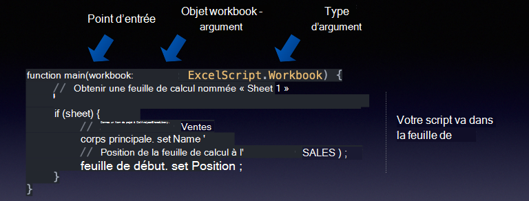
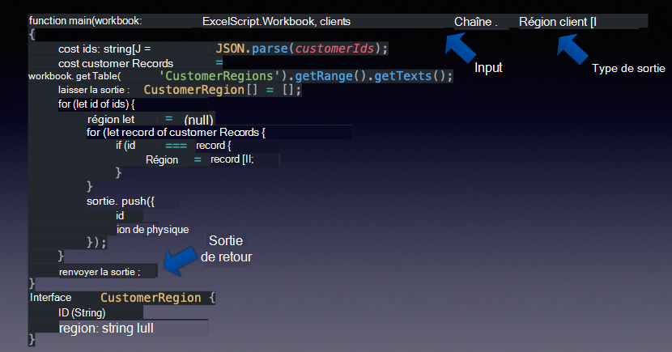
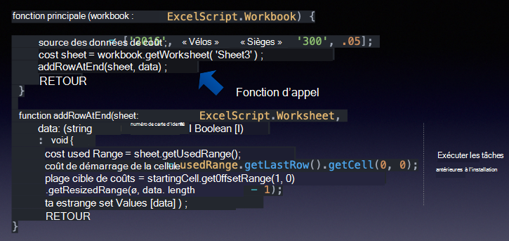
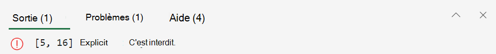
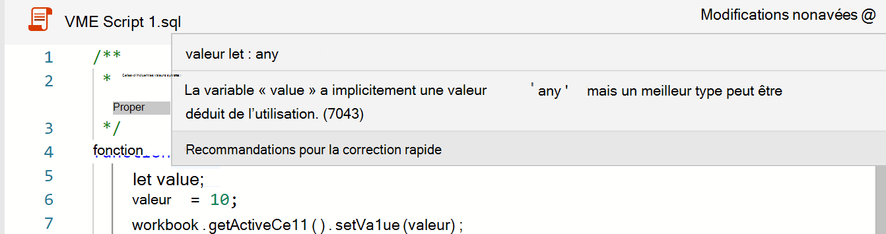

# <a name="getting-started"></a><span data-ttu-id="6cff1-103">Prise en main</span><span class="sxs-lookup"><span data-stu-id="6cff1-103">Getting started</span></span>

<span data-ttu-id="6cff1-104">Cette section fournit des détails sur les principes de base des scripts Office, notamment l’accès, l’environnement, les principes de base des scripts et quelques modèles de script de base.</span><span class="sxs-lookup"><span data-stu-id="6cff1-104">This section provides details about the basics of Office Scripts including access, environment, script fundamentals, and few basic script patterns.</span></span>

## <a name="environment-setup"></a><span data-ttu-id="6cff1-105">Configuration de l’environnement</span><span class="sxs-lookup"><span data-stu-id="6cff1-105">Environment setup</span></span>

<span data-ttu-id="6cff1-106">Découvrez les principes de base de l’accès, de l’environnement et de l’éditeur de script.</span><span class="sxs-lookup"><span data-stu-id="6cff1-106">Learn about the basics of access, environment, and script editor.</span></span>

<span data-ttu-id="6cff1-107">[](https://youtu.be/vvCtxsjPxo8 "Principes de base de l’application Office Scripts")</span><span class="sxs-lookup"><span data-stu-id="6cff1-107">[](https://youtu.be/vvCtxsjPxo8 "Basics of Office Scripts application")</span></span>

### <a name="access"></a><span data-ttu-id="6cff1-108">Accès</span><span class="sxs-lookup"><span data-stu-id="6cff1-108">Access</span></span>

<span data-ttu-id="6cff1-109">Office Scripts nécessite des paramètres d’administration disponibles pour l’administrateur Microsoft 365 sous  >  **Paramètres Org paramètres**  >  **Office Scripts**.</span><span class="sxs-lookup"><span data-stu-id="6cff1-109">Office Scripts requires admin settings available for Microsoft 365 administrator under **Settings** > **Org settings** > **Office Scripts**.</span></span> <span data-ttu-id="6cff1-110">Par défaut, il est allumé pour tous les utilisateurs.</span><span class="sxs-lookup"><span data-stu-id="6cff1-110">By default, it's turned on for all users.</span></span> <span data-ttu-id="6cff1-111">Il existe deux sous-paramètres, que l’administrateur peut activer et désactiver.</span><span class="sxs-lookup"><span data-stu-id="6cff1-111">There are two sub-settings, which the admin can turn on and off.</span></span>

* <span data-ttu-id="6cff1-112">Possibilité de partager des scripts au sein de l’organisation</span><span class="sxs-lookup"><span data-stu-id="6cff1-112">Ability to share scripts within the organization</span></span>
* <span data-ttu-id="6cff1-113">Possibilité d’utiliser des scripts dans Power Automate</span><span class="sxs-lookup"><span data-stu-id="6cff1-113">Ability to use scripts in Power Automate</span></span>

<span data-ttu-id="6cff1-114">Vous pouvez savoir si vous avez accès aux scripts Office en ouvrant un fichier dans Excel sur le web (navigateur) et en voyant si l’onglet **Automatiser** apparaît ou non dans le ruban Excel.</span><span class="sxs-lookup"><span data-stu-id="6cff1-114">You can tell if you have access to Office Scripts by opening a file in Excel on the web (browser) and seeing if the **Automate** tab appears in the Excel ribbon or not.</span></span>
<span data-ttu-id="6cff1-115">Si vous ne pouvez toujours pas voir **l’onglet Automatiser,** consultez [cette section de dépannage.](../../testing/troubleshooting.md#automate-tab-not-appearing-or-office-scripts-unavailable)</span><span class="sxs-lookup"><span data-stu-id="6cff1-115">If you still can't see the **Automate** tab, check [this troubleshooting section](../../testing/troubleshooting.md#automate-tab-not-appearing-or-office-scripts-unavailable).</span></span>

### <a name="availability"></a><span data-ttu-id="6cff1-116">Disponibilité</span><span class="sxs-lookup"><span data-stu-id="6cff1-116">Availability</span></span>

<span data-ttu-id="6cff1-117">Les scripts Office sont disponibles uniquement dans Excel sur le web pour les licences Entreprise E3+ (les comptes Grand public et E1 ne sont pas pris en charge).</span><span class="sxs-lookup"><span data-stu-id="6cff1-117">Office Scripts is available only in the Excel on the web for Enterprise E3+ licenses (Consumer and E1 accounts are not supported).</span></span> <span data-ttu-id="6cff1-118">Les scripts Office ne sont pas encore pris en charge dans Excel sur Windows et Mac.</span><span class="sxs-lookup"><span data-stu-id="6cff1-118">Office Scripts is not yet supported in Excel on Windows and Mac.</span></span>

### <a name="scripts-and-editor"></a><span data-ttu-id="6cff1-119">Scripts et éditeur</span><span class="sxs-lookup"><span data-stu-id="6cff1-119">Scripts and editor</span></span>

<span data-ttu-id="6cff1-120">L’éditeur de code est intégré directement dans Excel sur le web (version en ligne).</span><span class="sxs-lookup"><span data-stu-id="6cff1-120">The code editor is built right into Excel on the web (online version).</span></span> <span data-ttu-id="6cff1-121">Si vous avez utilisé des éditeurs comme Visual Studio Code ou Sublime, cette expérience d’édition sera assez similaire.</span><span class="sxs-lookup"><span data-stu-id="6cff1-121">If you have used editors like Visual Studio Code or Sublime, this editing experience will be quite similar.</span></span>
<span data-ttu-id="6cff1-122">La plupart des touches de raccourci que Visual Studio éditeur de code utilise fonctionnent également dans l’expérience d’édition des scripts Office.</span><span class="sxs-lookup"><span data-stu-id="6cff1-122">Most of the shortcut keys that Visual Studio Code editor uses work in the Office Scripts editing experience as well.</span></span> <span data-ttu-id="6cff1-123">Consultez les clés de raccourci suivantes.</span><span class="sxs-lookup"><span data-stu-id="6cff1-123">Check out the following shortcut keys handouts.</span></span>

* [<span data-ttu-id="6cff1-124">MacOS</span><span class="sxs-lookup"><span data-stu-id="6cff1-124">macOS</span></span>](https://code.visualstudio.com/shortcuts/keyboard-shortcuts-macos.pdf)
* [<span data-ttu-id="6cff1-125">Windows</span><span class="sxs-lookup"><span data-stu-id="6cff1-125">Windows</span></span>](https://code.visualstudio.com/shortcuts/keyboard-shortcuts-windows.pdf)

#### <a name="key-things-to-note"></a><span data-ttu-id="6cff1-126">Points clés à noter</span><span class="sxs-lookup"><span data-stu-id="6cff1-126">Key things to note</span></span>

* <span data-ttu-id="6cff1-127">Les scripts Office sont disponibles uniquement pour les fichiers stockés dans OneDrive Entreprise, les sites SharePoint et les sites d’équipe.</span><span class="sxs-lookup"><span data-stu-id="6cff1-127">Office Scripts is only available for files stored in OneDrive for Business, SharePoint sites, and Team sites.</span></span>
* <span data-ttu-id="6cff1-128">L’éditeur n’affiche pas l’extension du script.</span><span class="sxs-lookup"><span data-stu-id="6cff1-128">The editor doesn't show the script's extension.</span></span> <span data-ttu-id="6cff1-129">En réalité, il s’agit de fichiers TypeScript, mais ils sont stockés avec une extension personnalisée appelée `.osts` .</span><span class="sxs-lookup"><span data-stu-id="6cff1-129">In reality, these are TypeScript files but they are stored with a custom extension called `.osts`.</span></span>
* <span data-ttu-id="6cff1-130">Les scripts sont stockés dans votre propre dossier OneDrive `My Files/Documents/OfficeScripts` Entreprise.</span><span class="sxs-lookup"><span data-stu-id="6cff1-130">The scripts are stored in your own OneDrive for Business folder `My Files/Documents/OfficeScripts`.</span></span> <span data-ttu-id="6cff1-131">Vous n’avez pas besoin de gérer ce dossier.</span><span class="sxs-lookup"><span data-stu-id="6cff1-131">You won't need to manage this folder.</span></span> <span data-ttu-id="6cff1-132">Pour votre part, vous pouvez ignorer cet aspect, car l’éditeur gère l’expérience d’affichage/modification.</span><span class="sxs-lookup"><span data-stu-id="6cff1-132">For your part, you can ignore this aspect as the editor manages the viewing/editing experience.</span></span>
* <span data-ttu-id="6cff1-133">Les scripts ne sont pas stockés dans des fichiers Excel.</span><span class="sxs-lookup"><span data-stu-id="6cff1-133">Scripts are not stored as part of Excel files.</span></span> <span data-ttu-id="6cff1-134">Ils sont stockés séparément.</span><span class="sxs-lookup"><span data-stu-id="6cff1-134">They are stored separately.</span></span>
* <span data-ttu-id="6cff1-135">Vous pouvez partager le script avec un fichier Excel, ce qui signifie en fait que vous liez le script au fichier, et non que vous l’attachez.</span><span class="sxs-lookup"><span data-stu-id="6cff1-135">You can share the script with an Excel file which in effect means you are linking the script with the file, not attaching it.</span></span> <span data-ttu-id="6cff1-136">Toute personne qui a accès au fichier Excel peut également **afficher,** exécuter ou effectuer une **copie** du script.</span><span class="sxs-lookup"><span data-stu-id="6cff1-136">Whoever has access to the Excel file will also be able to **view**, **run**, or **make a copy** of the script.</span></span> <span data-ttu-id="6cff1-137">Il s’agit d’une différence clé par rapport aux macros VBA.</span><span class="sxs-lookup"><span data-stu-id="6cff1-137">This is a key difference compared to VBA macros.</span></span>
* <span data-ttu-id="6cff1-138">Sauf si vous partagez vos scripts, personne d’autre ne peut y accéder car il réside dans votre propre bibliothèque.</span><span class="sxs-lookup"><span data-stu-id="6cff1-138">Unless you share your scripts, no one else can access it as it resides in your own library.</span></span>
* <span data-ttu-id="6cff1-139">Les scripts ne peuvent pas être liés à partir d’un disque local ou d’emplacements cloud personnalisés.</span><span class="sxs-lookup"><span data-stu-id="6cff1-139">Scripts can't be linked from a local disk or custom cloud locations.</span></span> <span data-ttu-id="6cff1-140">Office Scripts reconnaît et exécute uniquement un script qui se trouve sur un emplacement prédéféré (votre dossier OneDrive mentionné ci-dessus) ou des scripts partagés.</span><span class="sxs-lookup"><span data-stu-id="6cff1-140">Office Scripts only recognizes and runs a script that is on predefined location (your OneDrive folder mentioned above) or shared scripts.</span></span>
* <span data-ttu-id="6cff1-141">Pendant la modification, les fichiers sont temporairement enregistrés dans le navigateur, mais vous devez enregistrer le script avant de fermer la fenêtre Excel pour l’enregistrer dans l’emplacement OneDrive.</span><span class="sxs-lookup"><span data-stu-id="6cff1-141">During editing, files are temporarily saved in the browser but you'll have to save the script before closing the Excel window to save it to the OneDrive location.</span></span> <span data-ttu-id="6cff1-142">N’oubliez pas d’enregistrer le fichier après les modifications.</span><span class="sxs-lookup"><span data-stu-id="6cff1-142">Don't forget to save the file after edits.</span></span>

## <a name="gentle-introduction-to-scripting"></a><span data-ttu-id="6cff1-143">Présentation légère de l’écriture de scripts</span><span class="sxs-lookup"><span data-stu-id="6cff1-143">Gentle introduction to scripting</span></span>

<span data-ttu-id="6cff1-144">Les scripts Office sont des scripts autonomes écrits dans le langage TypeScript qui contiennent des instructions pour effectuer une automatisation sur le classeur Excel sélectionné.</span><span class="sxs-lookup"><span data-stu-id="6cff1-144">Office Scripts are standalone scripts written in the TypeScript language that contain instructions to perform some automation against the selected Excel workbook.</span></span> <span data-ttu-id="6cff1-145">Toutes les instructions d’automatisation sont autonomes dans un script et les scripts ne peuvent pas appeler ou appeler d’autres scripts.</span><span class="sxs-lookup"><span data-stu-id="6cff1-145">All automation instructions are self-contained within a script and scripts can't invoke or call other scripts.</span></span> <span data-ttu-id="6cff1-146">Tous les scripts sont stockés dans des fichiers autonomes et stockés dans le dossier OneDrive de l’utilisateur.</span><span class="sxs-lookup"><span data-stu-id="6cff1-146">All scripts are stored in standalone files and stored on the user's OneDrive folder.</span></span> <span data-ttu-id="6cff1-147">Vous pouvez enregistrer un nouveau script, modifier un script enregistré ou écrire un tout nouveau script à partir de zéro, le tout dans une interface d’éditeur intégrée.</span><span class="sxs-lookup"><span data-stu-id="6cff1-147">You can record a new script, edit a recorded script, or write a whole new script from scratch, all within a built-in editor interface.</span></span> <span data-ttu-id="6cff1-148">La meilleure partie des scripts Office est qu’ils n’ont pas besoin d’une configuration supplémentaire de la part des utilisateurs.</span><span class="sxs-lookup"><span data-stu-id="6cff1-148">The best part of Office Scripts is that they don't need any further setup from users.</span></span> <span data-ttu-id="6cff1-149">Pas de bibliothèques externes, de pages web ou d’éléments d’interface utilisateur, de configuration, etc. Toute la configuration de l’environnement est gérée par Office Scripts et permet un accès simple et rapide à l’automatisation via une interface API simple.</span><span class="sxs-lookup"><span data-stu-id="6cff1-149">No external libraries, web pages, or UI elements, setup, etc. All the environment setup is handled by Office Scripts and it allows easy and fast access to automation through a simple API interface.</span></span>

<span data-ttu-id="6cff1-150">Voici quelques-uns des concepts de base utiles pour comprendre comment modifier et naviguer dans les scripts :</span><span class="sxs-lookup"><span data-stu-id="6cff1-150">Some of the basic concepts helpful to understand how to edit and navigate around scripts include:</span></span>

* <span data-ttu-id="6cff1-151">Syntaxe du langage TypeScript de base</span><span class="sxs-lookup"><span data-stu-id="6cff1-151">Basic TypeScript language syntax</span></span>
* <span data-ttu-id="6cff1-152">Compréhension de `main` la fonction et des arguments</span><span class="sxs-lookup"><span data-stu-id="6cff1-152">Understanding of `main` function and arguments</span></span>
* <span data-ttu-id="6cff1-153">Objets et hiérarchie, méthodes, propriétés</span><span class="sxs-lookup"><span data-stu-id="6cff1-153">Objects and hierarchy, methods, properties</span></span>
* <span data-ttu-id="6cff1-154">Collection (tableau) : navigation et opérations</span><span class="sxs-lookup"><span data-stu-id="6cff1-154">Collection (array): navigation and operations</span></span>
* <span data-ttu-id="6cff1-155">Définitions de type</span><span class="sxs-lookup"><span data-stu-id="6cff1-155">Type definitions</span></span>
* <span data-ttu-id="6cff1-156">Environnement : enregistrer/modifier, exécuter, examiner les résultats, partager</span><span class="sxs-lookup"><span data-stu-id="6cff1-156">Environment: record/edit, run, examine results, share</span></span>

<span data-ttu-id="6cff1-157">Cette vidéo et cette section expliquent certains de ces concepts en détail.</span><span class="sxs-lookup"><span data-stu-id="6cff1-157">This video and section explain some of these concepts in detail.</span></span>

<span data-ttu-id="6cff1-158">[](https://youtu.be/8Zsrc1uaiiU "Principes de base des scripts")</span><span class="sxs-lookup"><span data-stu-id="6cff1-158">[](https://youtu.be/8Zsrc1uaiiU "Basics of Scripts")</span></span>

### <a name="language-typescript"></a><span data-ttu-id="6cff1-159">Langue : TypeScript</span><span class="sxs-lookup"><span data-stu-id="6cff1-159">Language: TypeScript</span></span>

<span data-ttu-id="6cff1-160">[Les scripts Office](../../index.md) sont écrits à l’aide du langage [TypeScript,](https://www.typescriptlang.org/)qui est un langage open source qui s’appuie sur JavaScript (l’un des plus utilisés au monde) en ajoutant des définitions de types statiques.</span><span class="sxs-lookup"><span data-stu-id="6cff1-160">[Office Scripts](../../index.md) is written using the [TypeScript language](https://www.typescriptlang.org/), which is an open-source language that builds on JavaScript (one of the world's most used) by adding static type definitions.</span></span> <span data-ttu-id="6cff1-161">Comme l’indique le site web, fournissez un moyen de décrire la forme d’un objet, en fournissant une meilleure documentation et en permettant à TypeScript de vérifier que votre code fonctionne `Types` correctement.</span><span class="sxs-lookup"><span data-stu-id="6cff1-161">As the website says, `Types` provide a way to describe the shape of an object, providing better documentation, and allowing TypeScript to validate that your code is working correctly.</span></span>

<span data-ttu-id="6cff1-162">La syntaxe du langage elle-même est écrite à l’aide [de JavaScript](https://developer.mozilla.org/docs/Web/JavaScript) avec des typages supplémentaires définis dans le script à l’aide de conventions TypeScript.</span><span class="sxs-lookup"><span data-stu-id="6cff1-162">The language syntax itself is written using [JavaScript](https://developer.mozilla.org/docs/Web/JavaScript) with additional typings defined in the script using TypeScript conventions.</span></span> <span data-ttu-id="6cff1-163">Dans la plupart des cas, vous pouvez penser aux scripts Office tels qu’ils sont écrits en JavaScript.</span><span class="sxs-lookup"><span data-stu-id="6cff1-163">For the most part, you can think of Office Scripts as written in JavaScript.</span></span> <span data-ttu-id="6cff1-164">Il est essentiel que vous compreniez les principes de base du langage JavaScript pour commencer votre parcours de scripts Office ; même si vous n’avez pas besoin d’être compétent pour commencer votre processus d’automatisation.</span><span class="sxs-lookup"><span data-stu-id="6cff1-164">It is essential that you understand the basics of JavaScript language to begin your Office Scripts journey; though you don't need to be proficient at it to begin your automation journey.</span></span> <span data-ttu-id="6cff1-165">Avec l’enregistreur d’actions d’Office Scripts, vous pouvez comprendre les instructions de script, car des commentaires de code sont inclus et vous pouvez suivre et apporter de petites modifications.</span><span class="sxs-lookup"><span data-stu-id="6cff1-165">With the Office Scripts' action recorder, you can understand the script statements because code comments are included and you can follow along and make small edits.</span></span>

<span data-ttu-id="6cff1-166">Les API Office Scripts, qui permettent au script d’interagir avec Excel, sont conçues pour les utilisateurs finaux qui n’ont peut-être pas beaucoup d’arrière-plan de codage.</span><span class="sxs-lookup"><span data-stu-id="6cff1-166">Office Scripts APIs, which allow the script to interact with Excel, are designed for end-users who may not have much coding background.</span></span> <span data-ttu-id="6cff1-167">Les API peuvent être invoquées de manière synchrone et vous n’avez pas besoin de connaître les sujets avancés tels que les promesses ou les rappels.</span><span class="sxs-lookup"><span data-stu-id="6cff1-167">APIs can be invoked synchronously and you don't need to know advanced topics such as promises or callbacks.</span></span> <span data-ttu-id="6cff1-168">La conception de l’API Office Scripts fournit :</span><span class="sxs-lookup"><span data-stu-id="6cff1-168">Office Scripts API design provides:</span></span>

* <span data-ttu-id="6cff1-169">Modèle objet simple avec méthodes, getters/setters.</span><span class="sxs-lookup"><span data-stu-id="6cff1-169">Simple object model with methods, getters/setters.</span></span>
* <span data-ttu-id="6cff1-170">Collections d’objets faciles d’accès en tant que tableaux réguliers.</span><span class="sxs-lookup"><span data-stu-id="6cff1-170">Easy-to-access object collections as regular arrays.</span></span>
* <span data-ttu-id="6cff1-171">Options de gestion des erreurs simples.</span><span class="sxs-lookup"><span data-stu-id="6cff1-171">Simple error handling options.</span></span>
* <span data-ttu-id="6cff1-172">Performances optimisées pour certains scénarios aidant les utilisateurs à se concentrer sur le scénario en cours.</span><span class="sxs-lookup"><span data-stu-id="6cff1-172">Optimized performance for select scenarios helping users to focus on the scenario at hand.</span></span>

### <a name="main-function-the-scripts-starting-point"></a><span data-ttu-id="6cff1-173">`main` fonction : point de départ du script</span><span class="sxs-lookup"><span data-stu-id="6cff1-173">`main` function: The script's starting point</span></span>

<span data-ttu-id="6cff1-174">L’exécution d’Office Scripts commence à la `main` fonction.</span><span class="sxs-lookup"><span data-stu-id="6cff1-174">Office Scripts' execution begins at the `main` function.</span></span> <span data-ttu-id="6cff1-175">Un script est un fichier unique contenant une ou plusieurs fonctions, ainsi que des déclarations de types, d’interfaces, de variables, etc. Pour suivre le script, commencez par la fonction car Excel appelle d’abord la fonction lorsque `main` `main` vous exécutez un script.</span><span class="sxs-lookup"><span data-stu-id="6cff1-175">A script is a single file containing one or many functions along with declarations of types, interfaces, variables, etc. To follow along with the script, begin with the `main` function as Excel always first invokes the `main` function when you execute any script.</span></span> <span data-ttu-id="6cff1-176">La fonction aura toujours au moins un argument (ou paramètre) nommé, qui est simplement un nom de variable identifiant le workbook actuel sur lequel le `main` script est en cours `workbook` d’exécution.</span><span class="sxs-lookup"><span data-stu-id="6cff1-176">The `main` function will always have at least one argument (or parameter) named `workbook`, which is just a variable name identifying the current workbook against which the script is running.</span></span> <span data-ttu-id="6cff1-177">Vous pouvez définir des arguments supplémentaires pour l’utilisation avec l’exécution de Power Automate (hors connexion).</span><span class="sxs-lookup"><span data-stu-id="6cff1-177">You can define additional arguments for usage with Power Automate (offline) execution.</span></span>

* `function main(workbook: ExcelScript.Workbook)`

<span data-ttu-id="6cff1-178">Un script peut être organisé en fonctions plus petites pour faciliter la reutilisabilité du code, la clarté, etc. D’autres fonctions peuvent être à l’intérieur ou à l’extérieur de la fonction principale, mais toujours dans le même fichier.</span><span class="sxs-lookup"><span data-stu-id="6cff1-178">A script can be organized into smaller functions to aid with code reusability, clarity, etc. Other functions can be inside or outside of the main function but always in the same file.</span></span> <span data-ttu-id="6cff1-179">Un script est autonome et ne peut utiliser que les fonctions définies dans le même fichier.</span><span class="sxs-lookup"><span data-stu-id="6cff1-179">A script is self-contained and can only use functions defined in the same file.</span></span> <span data-ttu-id="6cff1-180">Les scripts ne peuvent pas appeler ou appeler un autre script Office.</span><span class="sxs-lookup"><span data-stu-id="6cff1-180">Scripts cannot invoke or call another Office Script.</span></span>

<span data-ttu-id="6cff1-181">Ainsi, en résumé :</span><span class="sxs-lookup"><span data-stu-id="6cff1-181">So, in summary:</span></span>

* <span data-ttu-id="6cff1-182">La `main` fonction est le point d’entrée de n’importe quel script.</span><span class="sxs-lookup"><span data-stu-id="6cff1-182">The `main` function is the entry point for any script.</span></span> <span data-ttu-id="6cff1-183">Lorsque la fonction est exécutée, l’application Excel appelle cette fonction principale en fournissant le premier paramètre du workbook.</span><span class="sxs-lookup"><span data-stu-id="6cff1-183">When the function is executed, the Excel application invokes this main function by providing the workbook as its first parameter.</span></span>
* <span data-ttu-id="6cff1-184">Il est important de conserver le premier argument et sa déclaration de `workbook` type tel qu’il apparaît.</span><span class="sxs-lookup"><span data-stu-id="6cff1-184">It's important to keep the first argument `workbook` and its type declaration as it appears.</span></span> <span data-ttu-id="6cff1-185">Vous pouvez ajouter de nouveaux arguments à la fonction (voir la section suivante), mais `main` conservez le premier argument tel qu’il est.</span><span class="sxs-lookup"><span data-stu-id="6cff1-185">You can add new arguments to the `main` function (see the next section) but do keep the first argument as is.</span></span>



#### <a name="send-or-receive-data-from-other-apps"></a><span data-ttu-id="6cff1-187">Envoyer ou recevoir des données à partir d’autres applications</span><span class="sxs-lookup"><span data-stu-id="6cff1-187">Send or receive data from other apps</span></span>

<span data-ttu-id="6cff1-188">Vous pouvez connecter Excel à d’autres parties de votre organisation en exécutant des scripts [dans Power Automate.](https://flow.microsoft.com)</span><span class="sxs-lookup"><span data-stu-id="6cff1-188">You can connect Excel to other parts of your organization by running scripts in [Power Automate](https://flow.microsoft.com).</span></span> <span data-ttu-id="6cff1-189">En savoir plus sur [l’exécution de scripts Office dans les flux Power Automate.](../../develop/power-automate-integration.md)</span><span class="sxs-lookup"><span data-stu-id="6cff1-189">Learn more about [running Office Scripts in Power Automate flows](../../develop/power-automate-integration.md).</span></span>

<span data-ttu-id="6cff1-190">La manière de recevoir ou d’envoyer des données à partir et vers Excel consiste à passer par la `main` fonction.</span><span class="sxs-lookup"><span data-stu-id="6cff1-190">The way to receive or send data from and to Excel is through the `main` function.</span></span> <span data-ttu-id="6cff1-191">Pensez-la comme la passerelle d’informations qui permet de décrire et d’utiliser les données entrantes et sortantes dans le script.</span><span class="sxs-lookup"><span data-stu-id="6cff1-191">Think of it as the information gateway that allows incoming and outgoing data to be described and used in the script.</span></span> <span data-ttu-id="6cff1-192">Vous pouvez recevoir des données en dehors du script à l’aide du type de données et renvoyer toutes les données reconnues par TypeScript telles que , ou tout objet sous la forme d’interfaces que vous définissez dans le `string` `string` `number` `boolean` script.</span><span class="sxs-lookup"><span data-stu-id="6cff1-192">You can receive data from outside the script using the `string` data type and return any TypeScript-recognized data such as `string`, `number`, `boolean`, or any objects in the form of interfaces you define in the script.</span></span>



#### <a name="use-functions-to-organize-and-reuse-code"></a><span data-ttu-id="6cff1-194">Utiliser des fonctions pour organiser et réutiliser le code</span><span class="sxs-lookup"><span data-stu-id="6cff1-194">Use functions to organize and reuse code</span></span>

<span data-ttu-id="6cff1-195">Vous pouvez utiliser des fonctions pour organiser et réutiliser le code dans votre script.</span><span class="sxs-lookup"><span data-stu-id="6cff1-195">You can use functions to organize and reuse code within your script.</span></span>



### <a name="objects-hierarchy-methods-properties-collections"></a><span data-ttu-id="6cff1-197">Objets, hiérarchie, méthodes, propriétés, collections</span><span class="sxs-lookup"><span data-stu-id="6cff1-197">Objects, hierarchy, methods, properties, collections</span></span>

<span data-ttu-id="6cff1-198">L’ensemble du modèle objet d’Excel est défini dans une structure hiérarchique d’objets, en commençant par l’objet de type « workbook `ExcelScript.Workbook` ».</span><span class="sxs-lookup"><span data-stu-id="6cff1-198">All of Excel's object model is defined in a hierarchical structure of objects, beginning with the workbook object of type `ExcelScript.Workbook`.</span></span> <span data-ttu-id="6cff1-199">Un objet peut contenir des méthodes, des propriétés et d’autres objets qu’il contient.</span><span class="sxs-lookup"><span data-stu-id="6cff1-199">An object can contain methods, properties, and other objects within it.</span></span> <span data-ttu-id="6cff1-200">Les objets sont liés les uns aux autres à l’aide des méthodes.</span><span class="sxs-lookup"><span data-stu-id="6cff1-200">Objects are linked to each other using the methods.</span></span> <span data-ttu-id="6cff1-201">La méthode d’un objet peut renvoyer un autre objet ou une autre collection d’objets.</span><span class="sxs-lookup"><span data-stu-id="6cff1-201">An object's method can return another object or collection of objects.</span></span> <span data-ttu-id="6cff1-202">L’utilisation de la fonctionnalité d’IntelliSense de code (fin du code) est un excellent moyen d’explorer la hiérarchie d’objets.</span><span class="sxs-lookup"><span data-stu-id="6cff1-202">Using the code editor's IntelliSense (code completion) feature is a great way to explore the object hierarchy.</span></span> <span data-ttu-id="6cff1-203">Vous pouvez également utiliser le [site de documentation de référence officiel](/javascript/api/office-scripts/overview) pour suivre les relations entre les objets.</span><span class="sxs-lookup"><span data-stu-id="6cff1-203">You can also use the [official reference documentation site](/javascript/api/office-scripts/overview) to follow along with the relationships among objects.</span></span>

<span data-ttu-id="6cff1-204">Un [objet](https://developer.mozilla.org/docs/Web/JavaScript/Reference/Global_Objects/Object) est une collection de propriétés et une propriété est une association entre un nom (ou une clé) et une valeur.</span><span class="sxs-lookup"><span data-stu-id="6cff1-204">An [object](https://developer.mozilla.org/docs/Web/JavaScript/Reference/Global_Objects/Object) is a collection of properties, and a property is an association between a name (or key) and a value.</span></span> <span data-ttu-id="6cff1-205">La valeur d’une propriété peut être une fonction, auquel cas la propriété est appelée méthode.</span><span class="sxs-lookup"><span data-stu-id="6cff1-205">A property's value can be a function, in which case the property is known as a method.</span></span> <span data-ttu-id="6cff1-206">Dans le cas du modèle objet Office Scripts, un objet représente une chose dans le fichier Excel avec qui les utilisateurs interagissent, comme un graphique, un lien hypertexte, un tableau croisé dynamique, etc. Il peut également représenter le comportement d’un objet tel que les attributs de protection d’une feuille de calcul.</span><span class="sxs-lookup"><span data-stu-id="6cff1-206">In the case of the Office Scripts object model, an object represents a thing in the Excel file that users interact with such as a chart, hyperlink, pivot-table, etc. It can also represent the behavior of an object such as the protection attributes of a worksheet.</span></span>

<span data-ttu-id="6cff1-207">La rubrique des objets et propriétés TypeScript et des méthodes est assez profonde.</span><span class="sxs-lookup"><span data-stu-id="6cff1-207">The topic of TypeScript objects and properties vs methods is quite deep.</span></span> <span data-ttu-id="6cff1-208">Pour commencer à utiliser le script et être productif, vous pouvez vous souvenir de quelques éléments de base :</span><span class="sxs-lookup"><span data-stu-id="6cff1-208">In order to get started with the script and be productive, you can remember a few basic things:</span></span>

* <span data-ttu-id="6cff1-209">Les objets et propriétés sont accessibles à l’aide de la notation (point), avec l’objet sur le côté gauche de la propriété ou la méthode `.` `.` sur le côté droit.</span><span class="sxs-lookup"><span data-stu-id="6cff1-209">Both objects and properties are accessed using `.` (dot) notation, with the object on the left side of the `.` and the property or method on the right side.</span></span> <span data-ttu-id="6cff1-210">Exemples `hyperlink.address` : , `range.getAddress()` .</span><span class="sxs-lookup"><span data-stu-id="6cff1-210">Examples: `hyperlink.address`, `range.getAddress()`.</span></span>
* <span data-ttu-id="6cff1-211">Les propriétés sont de nature scalante (chaînes, booléens, nombres).</span><span class="sxs-lookup"><span data-stu-id="6cff1-211">Properties are scalar in nature (strings, booleans, numbers).</span></span> <span data-ttu-id="6cff1-212">Par exemple, le nom d’un workbook, la position d’une feuille de calcul, la valeur de la table a un pied de table ou non.</span><span class="sxs-lookup"><span data-stu-id="6cff1-212">For example, name of a workbook, position of a worksheet, the value of whether the table has a footer or not.</span></span>
* <span data-ttu-id="6cff1-213">Les méthodes sont « invoquées » ou « exécutées » à l’aide des parenthèses ouvertes.</span><span class="sxs-lookup"><span data-stu-id="6cff1-213">Methods are 'invoked' or 'executed' using the open-close parentheses.</span></span> <span data-ttu-id="6cff1-214">Exemple : `table.delete()`.</span><span class="sxs-lookup"><span data-stu-id="6cff1-214">Example: `table.delete()`.</span></span> <span data-ttu-id="6cff1-215">Parfois, un argument est transmis à une fonction en les incluant entre parenthèses ouvertes : `range.setValue('Hello')` .</span><span class="sxs-lookup"><span data-stu-id="6cff1-215">Sometimes an argument is passed to a function by including them between open-close parentheses: `range.setValue('Hello')`.</span></span> <span data-ttu-id="6cff1-216">Vous pouvez transmettre de nombreux arguments à une fonction (telle que définie par son contrat/signature) et les séparer à l’aide `,` de .</span><span class="sxs-lookup"><span data-stu-id="6cff1-216">You can pass many arguments to a function (as defined by its contract/signature) and separate them using `,`.</span></span>  <span data-ttu-id="6cff1-217">Par exemple : `worksheet.addTable('A1:D6', true)`.</span><span class="sxs-lookup"><span data-stu-id="6cff1-217">For example: `worksheet.addTable('A1:D6', true)`.</span></span> <span data-ttu-id="6cff1-218">Vous pouvez transmettre des arguments de n’importe quel type comme requis par la méthode, tels que des chaînes, des nombres, des booléens ou même d’autres objets, par exemple, où est un objet créé ailleurs dans le `worksheet.addTable(targetRange, true)` `targetRange` script.</span><span class="sxs-lookup"><span data-stu-id="6cff1-218">You can pass arguments of any type as required by the method such as strings, number, boolean, or even other objects, for example, `worksheet.addTable(targetRange, true)`, where `targetRange` is an object created elsewhere in the script.</span></span>
* <span data-ttu-id="6cff1-219">Les méthodes peuvent renvoyer une chose telle qu’une propriété scalar (nom, adresse, etc.) ou un autre objet (plage, graphique) ou ne rien renvoyer (par exemple, avec des `delete` méthodes).</span><span class="sxs-lookup"><span data-stu-id="6cff1-219">Methods can return a thing such as a scalar property (name, address, etc.) or another object (range, chart), or not return anything at all (such as the case with `delete` methods).</span></span> <span data-ttu-id="6cff1-220">Vous recevez ce que la méthode renvoie en déclarant une variable ou en l’attribuant à une variable existante.</span><span class="sxs-lookup"><span data-stu-id="6cff1-220">You receive what the method returns by declaring a variable or assigning to an existing variable.</span></span> <span data-ttu-id="6cff1-221">Vous pouvez le voir sur le côté gauche de l’instruction telle que `const table = worksheet.addTable('A1:D6', true)` .</span><span class="sxs-lookup"><span data-stu-id="6cff1-221">You can see that on the left hand side of statement such as `const table = worksheet.addTable('A1:D6', true)`.</span></span>
* <span data-ttu-id="6cff1-222">En grande partie, le modèle objet Office Scripts se compose d’objets avec des méthodes qui relient différentes parties du modèle objet Excel.</span><span class="sxs-lookup"><span data-stu-id="6cff1-222">For the most part, the Office Scripts object model consists of objects with methods that link various parts of the Excel object model.</span></span> <span data-ttu-id="6cff1-223">Très rarement, vous trouverez des propriétés de valeurs scalatiques ou d’objets.</span><span class="sxs-lookup"><span data-stu-id="6cff1-223">Very rarely you'll come across properties that are of scalar or object values.</span></span>
* <span data-ttu-id="6cff1-224">Dans les scripts Office, une méthode de modèle objet Excel doit contenir des parenthèses ouvertes.</span><span class="sxs-lookup"><span data-stu-id="6cff1-224">In Office Scripts, an Excel object model method has to contain open-close parentheses.</span></span> <span data-ttu-id="6cff1-225">L’utilisation de méthodes sans elles n’est pas autorisée (par exemple, l’affectation d’une méthode à une variable).</span><span class="sxs-lookup"><span data-stu-id="6cff1-225">Using methods without them is not allowed (such as assigning a method to a variable).</span></span>

<span data-ttu-id="6cff1-226">Examinons quelques méthodes sur `workbook` l’objet.</span><span class="sxs-lookup"><span data-stu-id="6cff1-226">Let's look at a few methods on the `workbook` object.</span></span>

```TypeScript
function main(workbook: ExcelScript.Workbook) {
    // Return a boolean (true or false) setting of whether the workbook is set to auto-save or not. 
    const autoSave = workbook.getAutoSave(); 
    // Get workbook name.
    const name = workbook.getName();
    // Get active cell range object.
    const cell = workbook.getActiveCell();
    // Get table named SALES.
    const cell = workbook.getTable('SALES');
    // Get all slicer objects.
    const slicers = workbook.getSlicers();
}
```

<span data-ttu-id="6cff1-227">Dans cet exemple :</span><span class="sxs-lookup"><span data-stu-id="6cff1-227">In this example:</span></span>

* <span data-ttu-id="6cff1-228">Méthodes de l’objet telles que et renvoyer `workbook` `getAutoSave()` une propriété `getName()` scalar (chaîne, nombre, booléen).</span><span class="sxs-lookup"><span data-stu-id="6cff1-228">The methods of the `workbook` object such as `getAutoSave()` and `getName()` return a scalar property (string, number, boolean).</span></span>
* <span data-ttu-id="6cff1-229">Méthodes telles que `getActiveCell()` le retour d’un autre objet.</span><span class="sxs-lookup"><span data-stu-id="6cff1-229">Methods such as `getActiveCell()` return another object.</span></span>
* <span data-ttu-id="6cff1-230">La méthode accepte un argument (nom de la table dans ce cas) et renvoie `getTable()` une table spécifique dans le workbook.</span><span class="sxs-lookup"><span data-stu-id="6cff1-230">The `getTable()` method accepts an argument (table name in this case) and returns a specific table in the workbook.</span></span>
* <span data-ttu-id="6cff1-231">La méthode renvoie un tableau (appelé à de nombreux endroits en tant que collection) de tous les objets slicer dans `getSlicers()` le workbook.</span><span class="sxs-lookup"><span data-stu-id="6cff1-231">The `getSlicers()` method returns an array (referred to in many places as a collection) of all slicer objects within the workbook.</span></span>

<span data-ttu-id="6cff1-232">Vous remarquerez que toutes ces méthodes ont un préfixe, qui n’est qu’une convention utilisée dans le modèle objet Office Scripts pour transmettre que la méthode retourne `get` quelque chose.</span><span class="sxs-lookup"><span data-stu-id="6cff1-232">You'll notice that all of these methods have a `get` prefix, which is just a convention used in the Office Scripts object model to convey that the method is returning something.</span></span> <span data-ttu-id="6cff1-233">Ils sont également communément appelés « getters ».</span><span class="sxs-lookup"><span data-stu-id="6cff1-233">They are also commonly referred to as 'getters'.</span></span>

<span data-ttu-id="6cff1-234">Il existe deux autres types de méthodes que nous allons voir dans l’exemple suivant :</span><span class="sxs-lookup"><span data-stu-id="6cff1-234">There are two other types of methods that we'll now see in the next example:</span></span>

```TypeScript
function main(workbook: ExcelScript.Workbook) {
    // Get a worksheet named 'Sheet1.
    const sheet = workbook.getWorksheet('Sheet1'); 
    // Set name to SALES.
    sheet.setName('SALES');
    // Position the worksheet at the beginning.
    sheet.setPosition(0);
}
```

<span data-ttu-id="6cff1-235">Dans cet exemple :</span><span class="sxs-lookup"><span data-stu-id="6cff1-235">In this example:</span></span>

* <span data-ttu-id="6cff1-236">La `setName()` méthode définit un nouveau nom pour la feuille de calcul.</span><span class="sxs-lookup"><span data-stu-id="6cff1-236">The `setName()` method sets a new name to the worksheet.</span></span> <span data-ttu-id="6cff1-237">`setPosition()` définit la position sur la première cellule.</span><span class="sxs-lookup"><span data-stu-id="6cff1-237">`setPosition()` sets the position to the first cell.</span></span>
* <span data-ttu-id="6cff1-238">Ces méthodes modifient le fichier Excel en fixant une propriété ou un comportement du classeur.</span><span class="sxs-lookup"><span data-stu-id="6cff1-238">Such methods modify the Excel file by setting a property or behavior of the workbook.</span></span> <span data-ttu-id="6cff1-239">Ces méthodes sont appelées « méthodes setter ».</span><span class="sxs-lookup"><span data-stu-id="6cff1-239">These methods are called 'setters'.</span></span>
* <span data-ttu-id="6cff1-240">En règle générale, les « méthodes setter » ont un « getter » complémentaire, par exemple, et les deux méthodes `worksheet.getPosition` `worksheet.setPosition` sont des méthodes.</span><span class="sxs-lookup"><span data-stu-id="6cff1-240">Typically 'setters' have a companion 'getter', for example, `worksheet.getPosition` and `worksheet.setPosition`, both of which are methods.</span></span>

#### <a name="undefined-and-null-primitive-types"></a><span data-ttu-id="6cff1-241">`undefined` et `null` types primitifs</span><span class="sxs-lookup"><span data-stu-id="6cff1-241">`undefined` and `null` primitive types</span></span>

<span data-ttu-id="6cff1-242">Voici deux types de données primitives que vous devez connaître :</span><span class="sxs-lookup"><span data-stu-id="6cff1-242">The following are two primitive data types that you must be aware of:</span></span>

1. <span data-ttu-id="6cff1-243">La valeur [`null`](https://developer.mozilla.org/docs/Web/JavaScript/Reference/Global_Objects/null) représente l’absence intentionnelle de toute valeur d’objet.</span><span class="sxs-lookup"><span data-stu-id="6cff1-243">The value [`null`](https://developer.mozilla.org/docs/Web/JavaScript/Reference/Global_Objects/null) represents the intentional absence of any object value.</span></span> <span data-ttu-id="6cff1-244">Il s’agit de l’une des valeurs primitives de JavaScript et est utilisée pour indiquer qu’une variable n’a pas de valeur.</span><span class="sxs-lookup"><span data-stu-id="6cff1-244">It is one of JavaScript's primitive values and is used to indicate that a variable has no value.</span></span>
1. <span data-ttu-id="6cff1-245">Une variable qui n’a pas été affectée à une valeur est de type [`undefined`](https://developer.mozilla.org/docs/Web/JavaScript/Reference/Global_Objects/undefined) .</span><span class="sxs-lookup"><span data-stu-id="6cff1-245">A variable that has not been assigned a value is of type [`undefined`](https://developer.mozilla.org/docs/Web/JavaScript/Reference/Global_Objects/undefined).</span></span> <span data-ttu-id="6cff1-246">Une méthode ou une instruction peut également renvoyer si la variable en cours `undefined` d’évaluation n’a pas de valeur affectée.</span><span class="sxs-lookup"><span data-stu-id="6cff1-246">A method or statement can also return `undefined` if the variable that's being evaluated doesn't have an assigned value.</span></span>

<span data-ttu-id="6cff1-247">Ces deux types se rogner dans le cadre de la gestion des erreurs et peuvent provoquer un certain nombre de difficultés si elles ne sont pas gérées correctement.</span><span class="sxs-lookup"><span data-stu-id="6cff1-247">These two types crop up as part of error handling and can cause quite a bit of headache if not handled properly.</span></span> <span data-ttu-id="6cff1-248">Heureusement, TypeScript/JavaScript permet de vérifier si une variable est de type `undefined` ou `null` .</span><span class="sxs-lookup"><span data-stu-id="6cff1-248">Fortunately, TypeScript/JavaScript offers a way to check if a variable is of type `undefined` or `null`.</span></span> <span data-ttu-id="6cff1-249">Nous parlerons de certains de ces contrôles dans les sections ultérieures, y compris la gestion des erreurs.</span><span class="sxs-lookup"><span data-stu-id="6cff1-249">We will talk about some of those checks in later sections, including error handling.</span></span>

#### <a name="method-chaining"></a><span data-ttu-id="6cff1-250">Chaînage de méthode</span><span class="sxs-lookup"><span data-stu-id="6cff1-250">Method chaining</span></span>

<span data-ttu-id="6cff1-251">Vous pouvez utiliser la notation par points pour connecter des objets renvoyés à partir d’une méthode afin de raccourcir votre code.</span><span class="sxs-lookup"><span data-stu-id="6cff1-251">You can use dot notation to connect objects being returned from a method to shorten your code.</span></span> <span data-ttu-id="6cff1-252">Parfois, cette technique facilite la lecture et la gestion du code.</span><span class="sxs-lookup"><span data-stu-id="6cff1-252">Sometimes this technique makes the code easy to read and manage.</span></span> <span data-ttu-id="6cff1-253">Toutefois, il y a quelques points à prendre en compte.</span><span class="sxs-lookup"><span data-stu-id="6cff1-253">However, there are few things to be aware of.</span></span> <span data-ttu-id="6cff1-254">Examinons les exemples suivants.</span><span class="sxs-lookup"><span data-stu-id="6cff1-254">Let's look at the following examples.</span></span>

<span data-ttu-id="6cff1-255">Le code suivant obtient la cellule active et la cellule suivante, puis définit la valeur.</span><span class="sxs-lookup"><span data-stu-id="6cff1-255">The following code gets the active cell and the next cell, then sets the value.</span></span> <span data-ttu-id="6cff1-256">Il s’agit d’un bon candidat pour utiliser le chaînage, car ce code réussira en tout temps.</span><span class="sxs-lookup"><span data-stu-id="6cff1-256">This is a good candidate to use chaining as this code will succeed all the time.</span></span>

```TypeScript
function main(workbook: ExcelScript.Workbook) {
    workbook.getActiveCell().getOffsetRange(0,1).setValue('Next cell');
}
```

<span data-ttu-id="6cff1-257">Toutefois, le code suivant (qui obtient un tableau nommé **SALES** et qui allume son style de colonne à bandes) présente un problème.</span><span class="sxs-lookup"><span data-stu-id="6cff1-257">However, the following code (which gets a table named **SALES** and turns on its banded column style) has an issue.</span></span>

```TypeScript
function main(workbook: ExcelScript.Workbook) {
  workbook.getTable('SALES').setShowBandedColumns(true);
}
```

<span data-ttu-id="6cff1-258">Que se **passe-t-il** si la table SALES n’existe pas ?</span><span class="sxs-lookup"><span data-stu-id="6cff1-258">What if the **SALES** table doesn't exist?</span></span> <span data-ttu-id="6cff1-259">Le script échoue avec une erreur (indiquée ci-dessous), car elle renvoie (qui est un type JavaScript indiquant qu’il n’existe pas de `getTable('SALES')` table telle que `undefined` **SALES**).</span><span class="sxs-lookup"><span data-stu-id="6cff1-259">The script will fail with an error (shown next) because `getTable('SALES')` returns `undefined` (which is a JavaScript type indicating that there is no table such as **SALES**).</span></span> <span data-ttu-id="6cff1-260">Appeler la `setShowBandedColumns` méthode n’a aucun sens, c’est-à-dire que le `undefined` script se termine par une `undefined.setShowBandedColumns(true)` erreur.</span><span class="sxs-lookup"><span data-stu-id="6cff1-260">Calling the `setShowBandedColumns` method on `undefined` makes no sense, that is, `undefined.setShowBandedColumns(true)`, and hence the script ends in an error.</span></span>

```text
Line 2: Cannot read property 'setShowBandedColumns' of undefined
```

<span data-ttu-id="6cff1-261">Vous pouvez [](https://developer.mozilla.org/docs/Web/JavaScript/Reference/Operators/Optional_chaining) utiliser l’opérateur de chaînage facultatif qui permet de simplifier l’accès aux valeurs par le biais d’objets connectés lorsqu’il est possible qu’une référence ou une méthode soit ou (c’est le moyen de `undefined` `null` JavaScript d’indiquer un objet ou résultat non lié ou inexistant) pour gérer cette condition.</span><span class="sxs-lookup"><span data-stu-id="6cff1-261">You could use the [optional chaining operator](https://developer.mozilla.org/docs/Web/JavaScript/Reference/Operators/Optional_chaining) that provides a way to simplify accessing values through connected objects when it's possible that a reference or method may be `undefined` or `null` (which is JavaScript's way of indicating an unassigned or nonexistent object or result) to handle this condition.</span></span>

```TypeScript
function main(workbook: ExcelScript.Workbook) {
    // This line will not fail as the setShowBandedColumns method is executed only if the SALES table is present.
    workbook.getTable('SALES')?.setShowBandedColumns(true); 
}
```

<span data-ttu-id="6cff1-262">Si vous souhaitez gérer les conditions ou le type d’objet inexistants renvoyés par une méthode, il est préférable d’affecter la valeur renvoyée à partir de la méthode et de gérer `undefined` celle-ci séparément.</span><span class="sxs-lookup"><span data-stu-id="6cff1-262">If you wish to handle nonexistent object conditions or `undefined` type being returned by a method, then it is better to assign the return value from the method and handle that separately.</span></span>

```TypeScript
function main(workbook: ExcelScript.Workbook) {
    const salesTable = workbook.getTable('SALES');
    if (salesTable) {
        salesTable.setShowBandedColumns(true);
    } else { 
        // Handle this condition.
    }
}
```

#### <a name="get-object-reference"></a><span data-ttu-id="6cff1-263">Obtenir une référence d’objet</span><span class="sxs-lookup"><span data-stu-id="6cff1-263">Get object reference</span></span>

<span data-ttu-id="6cff1-264">`workbook`L’objet vous est attribué dans la `main` fonction.</span><span class="sxs-lookup"><span data-stu-id="6cff1-264">The `workbook` object is given to you in the `main` function.</span></span> <span data-ttu-id="6cff1-265">Vous pouvez commencer à utiliser `workbook` l’objet et accéder directement à ses méthodes.</span><span class="sxs-lookup"><span data-stu-id="6cff1-265">You can begin to use the `workbook` object and access its methods directly.</span></span>

```TypeScript
function main(workbook: ExcelScript.Workbook) {
    // Get workbook name.
    const name = workbook.getName();
    // Display name to console.
    console.log(name);
}
```

<span data-ttu-id="6cff1-266">Pour utiliser tous les autres objets dans le workbook, commencez par l’objet et descendez la hiérarchie jusqu’à ce que vous obtenez `workbook` l’objet que vous recherchez.</span><span class="sxs-lookup"><span data-stu-id="6cff1-266">For using all other objects within the workbook, begin with `workbook` object and go down the hierarchy until you get to the object you are looking for.</span></span> <span data-ttu-id="6cff1-267">Vous pouvez obtenir la référence d’objet en récupérant l’objet à l’aide de sa méthode ou en récupérant la collection d’objets, `get` comme illustré ci-dessous :</span><span class="sxs-lookup"><span data-stu-id="6cff1-267">You can get the object reference by fetching the object using its `get` method or by retrieving the collection of objects as shown below:</span></span>

```TypeScript
function main(workbook: ExcelScript.Workbook) {
    // Get the active worksheet.
    const sheet = workbook.getActiveWorksheet();
    // Fetch using an ID or key.
    const sheet = workbook.getWorksheet('SomeSheetName');
    // Invoke methods on the object.
    sheet.setPosition(0); 
    
    // Get collection of methods.
    const tables = sheet.getTables();
    console.log('Total tables in this sheet: ' + tables.length);
}
```

#### <a name="check-if-an-object-exists-then-delete-and-add"></a><span data-ttu-id="6cff1-268">Vérifier si un objet existe, puis supprimer et ajouter</span><span class="sxs-lookup"><span data-stu-id="6cff1-268">Check if an object exists, then delete, and add</span></span>

<span data-ttu-id="6cff1-269">Pour créer un objet, par exemple avec un nom prédéféré, il est toujours préférable de supprimer un objet similaire qui peut exister, puis de l’ajouter.</span><span class="sxs-lookup"><span data-stu-id="6cff1-269">For creating an object, say with a predefined name, it is always better to remove a similar object that may exist and then add it.</span></span> <span data-ttu-id="6cff1-270">Vous pouvez le faire à l’aide du modèle suivant.</span><span class="sxs-lookup"><span data-stu-id="6cff1-270">You can do that using the following pattern.</span></span>

```TypeScript
function main(workbook: ExcelScript.Workbook) {
  // Name of the worksheet to be added. 
  let name = "Index";
  // Check if the worksheet already exists. If not, add the worksheet.
  let sheet = workbook.getWorksheet('Index');
  if (sheet) {
    console.log(`Worksheet by the name ${name} already exists. Deleting it.`);
    // Call the delete method on the object to remove it. 
    sheet.delete();
  } 
    // Add a blank worksheet. 
  console.log(`Adding the worksheet named  ${name}.`)
  const indexSheet = workbook.addWorksheet("Index");
}

```

<span data-ttu-id="6cff1-271">Vous pouvez également supprimer un objet qui existe ou non, utilisez le modèle suivant.</span><span class="sxs-lookup"><span data-stu-id="6cff1-271">Alternatively, for deleting an object that may or may not exist, use the following pattern.</span></span>

```TypeScript
    // The ? preceding delete() will ensure that the API is only invoked if the object exists. 
    workbook.getWorksheet('Index')?.delete(); 
```

#### <a name="note-about-adding-an-object"></a><span data-ttu-id="6cff1-272">Remarque sur l’ajout d’un objet</span><span class="sxs-lookup"><span data-stu-id="6cff1-272">Note about adding an object</span></span>

<span data-ttu-id="6cff1-273">Pour créer, insérer ou ajouter un objet tel qu’un slicer, un tableau croisé dynamique, une feuille de calcul, etc., utilisez la méthode add_Object_ **correspondante.**</span><span class="sxs-lookup"><span data-stu-id="6cff1-273">To create, insert, or add an object such as a slicer, pivot table, worksheet, etc., use the corresponding **add_Object_** method.</span></span> <span data-ttu-id="6cff1-274">Une telle méthode est disponible sur son objet parent.</span><span class="sxs-lookup"><span data-stu-id="6cff1-274">Such a method is available on its parent object.</span></span> <span data-ttu-id="6cff1-275">Par exemple, la `addChart()` méthode est disponible sur `worksheet` l’objet.</span><span class="sxs-lookup"><span data-stu-id="6cff1-275">For example, the `addChart()` method is available on `worksheet` object.</span></span> <span data-ttu-id="6cff1-276">La **méthode add_Object_** renvoie l’objet qu’elle crée.</span><span class="sxs-lookup"><span data-stu-id="6cff1-276">The **add_Object_** method returns the object it creates.</span></span> <span data-ttu-id="6cff1-277">Recevez la valeur renvoyée et utilisez-la ultérieurement dans votre script.</span><span class="sxs-lookup"><span data-stu-id="6cff1-277">Receive the returned value and use it later in your script.</span></span>

```TypeScript
function main(workbook: ExcelScript.Workbook) {
  // Add object and get a reference to it. 
  const indexSheet = workbook.addWorksheet("Index");
  // Use it elsewhere in the script 
  console.log(indexSheet.getPosition());
}

```

<span data-ttu-id="6cff1-278">Vous pouvez également supprimer un objet qui existe ou non, utilisez ce modèle :</span><span class="sxs-lookup"><span data-stu-id="6cff1-278">Alternatively, for deleting an object that may or may not exist, use this pattern:</span></span>

```TypeScript
    workbook.getWorksheet('Index')?.delete(); // The ? preceding delete() will ensure that the API is only invoked if the object exists. 
```

#### <a name="collections"></a><span data-ttu-id="6cff1-279">Collections</span><span class="sxs-lookup"><span data-stu-id="6cff1-279">Collections</span></span>

<span data-ttu-id="6cff1-280">Les collections sont des objets tels que des tableaux, des graphiques, des colonnes, etc. qui peuvent être récupérés en tant que tableaux et retentés pour traitement.</span><span class="sxs-lookup"><span data-stu-id="6cff1-280">Collections are objects such as tables, charts, columns, etc. that can be retrieved as an array and iterated over for processing.</span></span> <span data-ttu-id="6cff1-281">Vous pouvez récupérer une collection à l’aide de la méthode correspondante et traiter les données dans une boucle à l’aide de l’une des nombreuses techniques de traversée de tableau `get` TypeScript telles que :</span><span class="sxs-lookup"><span data-stu-id="6cff1-281">You can retrieve a collection using the corresponding `get` method and process the data in a loop using one of many TypeScript array traversal techniques such as:</span></span>

* [<span data-ttu-id="6cff1-282">`for` ou `while`</span><span class="sxs-lookup"><span data-stu-id="6cff1-282">`for` or `while`</span></span>](https://developer.mozilla.org/docs/Web/JavaScript/Guide/Loops_and_iteration)
* [`for..of`](https://developer.mozilla.org/docs/Web/JavaScript/Reference/Statements/for...of)
* [`forEach`](https://developer.mozilla.org/docs/Web/JavaScript/Reference/Global_Objects/Array/forEach)

* [<span data-ttu-id="6cff1-283">Informations de base sur la langue des tableaux</span><span class="sxs-lookup"><span data-stu-id="6cff1-283">Language basics of arrays</span></span>](https://developer.mozilla.org//docs/Learn/JavaScript/First_steps/Arrays)

<span data-ttu-id="6cff1-284">Ce script montre comment utiliser les collections pris en charge dans les API Office Scripts.</span><span class="sxs-lookup"><span data-stu-id="6cff1-284">This script demonstrates how to use collections supported in Office Scripts APIs.</span></span> <span data-ttu-id="6cff1-285">Il colore chaque onglet de feuille de calcul du fichier avec une couleur aléatoire.</span><span class="sxs-lookup"><span data-stu-id="6cff1-285">It colors each worksheet tab in the file with a random color.</span></span>

```TypeScript
function main(workbook: ExcelScript.Workbook) {

  // Get all sheets as a collection.
  const sheets = workbook.getWorksheets();
  const names = sheets.map ((sheet) => sheet.getName());
  console.log(names);
  console.log(`Total worksheets inside of this workbook: ${sheets.length}`);
  // Get information from specific sheets within the collection.
  console.log(`First sheet name is: ${names[0]}`);
  if (sheets.length > 1) {
    console.log(`Last sheet's Id is: ${sheets[sheets.length -1].getId()}`);
  }
  // Color each worksheet with random color.
  for (const sheet of sheets) {
    sheet.setTabColor(`#${Math.random().toString(16).substr(-6)}`);
  }
}
```

## <a name="type-declarations"></a><span data-ttu-id="6cff1-286">Déclarations de type</span><span class="sxs-lookup"><span data-stu-id="6cff1-286">Type declarations</span></span>

<span data-ttu-id="6cff1-287">Les déclarations de type aident les utilisateurs à comprendre le type de variable avec qui ils traitent.</span><span class="sxs-lookup"><span data-stu-id="6cff1-287">Type declarations help users understand the type of variable they are dealing with.</span></span> <span data-ttu-id="6cff1-288">Il facilite l’achèvement automatique des méthodes et facilite les vérifications de la qualité du temps de développement.</span><span class="sxs-lookup"><span data-stu-id="6cff1-288">It helps with auto-completion of methods and assists in development time quality checks.</span></span>

<span data-ttu-id="6cff1-289">Vous pouvez trouver des déclarations de type dans le script à différents endroits, y compris la déclaration de fonction, la déclaration de variable, IntelliSense définitions, etc.</span><span class="sxs-lookup"><span data-stu-id="6cff1-289">You can find type declarations in the script in various places including function declaration, variable declaration, IntelliSense definitions, etc.</span></span>

<span data-ttu-id="6cff1-290">Exemples :</span><span class="sxs-lookup"><span data-stu-id="6cff1-290">Examples:</span></span>

* `function main(workbook: ExcelScript.Workbook)`
* `let myRange: ExcelScript.Range;`
* `function getMaxAmount(range: ExcelScript.Range): number`

<span data-ttu-id="6cff1-291">Vous pouvez identifier facilement les types dans l’éditeur de code, car ils apparaissent généralement différemment dans une couleur différente.</span><span class="sxs-lookup"><span data-stu-id="6cff1-291">You can identify the types easily in the code editor as it usually appears distinctly in a different color.</span></span> <span data-ttu-id="6cff1-292">Un `:` deux-points précède généralement la déclaration de type.</span><span class="sxs-lookup"><span data-stu-id="6cff1-292">A colon `:` usually precedes the type declaration.</span></span>  

<span data-ttu-id="6cff1-293">L’écriture de types peut être facultative dans TypeScript, car l’inférence de type vous permet d’obtenir beaucoup de puissance sans écrire de code supplémentaire.</span><span class="sxs-lookup"><span data-stu-id="6cff1-293">Writing types can be optional in TypeScript because type inference allows you to get a lot of power without writing additional code.</span></span> <span data-ttu-id="6cff1-294">La plupart du temps, le langage TypeScript est bon pour déduire les types de variables.</span><span class="sxs-lookup"><span data-stu-id="6cff1-294">For the most part, the TypeScript language is good at inferring the types of variables.</span></span> <span data-ttu-id="6cff1-295">Toutefois, dans certains cas, les scripts Office exigent que les déclarations de type soient explicitement définies si la langue ne parvient pas à identifier clairement le type.</span><span class="sxs-lookup"><span data-stu-id="6cff1-295">However, in certain cases, Office Scripts require the type declarations to be explicitly defined if the language is unable to clearly identify the type.</span></span> <span data-ttu-id="6cff1-296">En outre, les scripts explicites `any` ou implicites ne sont pas autorisés dans Office Script.</span><span class="sxs-lookup"><span data-stu-id="6cff1-296">Also, explicit or implicit `any` is not allowed in Office Script.</span></span> <span data-ttu-id="6cff1-297">Plus d’informations à ce jour.</span><span class="sxs-lookup"><span data-stu-id="6cff1-297">More on that later.</span></span>

### <a name="excelscript-types"></a><span data-ttu-id="6cff1-298">`ExcelScript` types</span><span class="sxs-lookup"><span data-stu-id="6cff1-298">`ExcelScript` types</span></span>

<span data-ttu-id="6cff1-299">Dans Office Scripts, vous utiliserez les types de types suivants.</span><span class="sxs-lookup"><span data-stu-id="6cff1-299">In Office Scripts, you will use the following kinds of types.</span></span>

* <span data-ttu-id="6cff1-300">Types de langue native tels `number` que , , , , , `string` `object` `boolean` `null` etc.</span><span class="sxs-lookup"><span data-stu-id="6cff1-300">Native language types such as `number`, `string`, `object`, `boolean`, `null`, etc.</span></span>
* <span data-ttu-id="6cff1-301">Types d’API Excel.</span><span class="sxs-lookup"><span data-stu-id="6cff1-301">Excel API types.</span></span> <span data-ttu-id="6cff1-302">Elles commencent par `ExcelScript` .</span><span class="sxs-lookup"><span data-stu-id="6cff1-302">They begin with `ExcelScript`.</span></span> <span data-ttu-id="6cff1-303">Par exemple, `ExcelScript.Range` , `ExcelScript.Table` etc.</span><span class="sxs-lookup"><span data-stu-id="6cff1-303">For example, `ExcelScript.Range`, `ExcelScript.Table`, etc.</span></span>
* <span data-ttu-id="6cff1-304">Toutes les interfaces personnalisées que vous avez peut-être définies dans le script à l’aide `interface` d’instructions.</span><span class="sxs-lookup"><span data-stu-id="6cff1-304">Any custom interfaces you may have defined in the script using `interface` statements.</span></span>

<span data-ttu-id="6cff1-305">Consultez ensuite des exemples de chacun de ces groupes.</span><span class="sxs-lookup"><span data-stu-id="6cff1-305">See examples of each of these groups next.</span></span>

<span data-ttu-id="6cff1-306">**_Types de langue native_**</span><span class="sxs-lookup"><span data-stu-id="6cff1-306">**_Native language types_**</span></span>

<span data-ttu-id="6cff1-307">Dans l’exemple suivant, notez les endroits `string` où , et ont été `number` `boolean` utilisés.</span><span class="sxs-lookup"><span data-stu-id="6cff1-307">In the following example, notice places where `string`, `number`, and `boolean` have been used.</span></span> <span data-ttu-id="6cff1-308">Il s’existe des types **de langage TypeScript** natifs.</span><span class="sxs-lookup"><span data-stu-id="6cff1-308">These are native **TypeScript** language types.</span></span>

```TypeScript
function main(workbook: ExcelScript.Workbook)
{
  const table = workbook.getActiveWorksheet().getTables()[0];
  const sales = table.getColumnByName('Sales').getRange().getValues();
  console.log(sales);
  // Add 100 to each value.
  const revisedSales = salesAs1DArray.map(data => data as number + 100);
  // Add a column.
  table.addColumn(-1, revisedSales);  
}
/**
 * Extract a column from 2D array and return result.
 */
function extractColumn(data: (string | number | boolean)[][], index: number): (string | number | boolean)[] {

  const column = data.map((row) => {
    return row[index];
  })
  return column;
}
/**
 * Convert a flat array into a 2D array that can be used as range column.
 */
function convertColumnTo2D(data: (string | number | boolean)[]): (string | number | boolean)[][] {

  const columnAs2D = data.map((row) => {
    return [row];
  })
  return columnAs2D;
}
```

<span data-ttu-id="6cff1-309">**_Types ExcelScript_**</span><span class="sxs-lookup"><span data-stu-id="6cff1-309">**_ExcelScript types_**</span></span>

<span data-ttu-id="6cff1-310">Dans l’exemple suivant, une fonction d’aide prend deux arguments.</span><span class="sxs-lookup"><span data-stu-id="6cff1-310">In the following example, a helper function takes two arguments.</span></span> <span data-ttu-id="6cff1-311">La première est la `sheet` variable de `ExcelScript.Worksheet` type.</span><span class="sxs-lookup"><span data-stu-id="6cff1-311">The first one is the `sheet` variable which is of type `ExcelScript.Worksheet` type.</span></span>

```TypeScript
function main(workbook: ExcelScript.Workbook) {
    const sheet = workbook.getWorksheet('Sheet5');
    const data = ['2016', 'Bikes', 'Seats', '1500', .05];
    addRow(sheet, data);
    return;
}

function addRow(sheet: ExcelScript.Worksheet, data: (string | number | boolean)[]): void {

    const usedRange = sheet.getUsedRange();
    let startCell: ExcelScript.Range;
    // If the sheet is empty, then use A1 as starting cell for update.
    if (usedRange) { 
      startCell = usedRange.getLastRow().getCell(0, 0).getOffsetRange(1, 0);
    } else {
      startCell = sheet.getRange('A1');
    }
    console.log(startCell.getAddress());
    const targetRange = startCell.getResizedRange(0, data.length - 1);      
    targetRange.setValues([data]);
    return;
}
```

<span data-ttu-id="6cff1-312">**_Types personnalisés_**</span><span class="sxs-lookup"><span data-stu-id="6cff1-312">**_Custom types_**</span></span>

<span data-ttu-id="6cff1-313">L’interface personnalisée `ReportImages` est utilisée pour renvoyer des images vers une autre action de flux.</span><span class="sxs-lookup"><span data-stu-id="6cff1-313">The custom interface `ReportImages` is used to return images to another flow action.</span></span> <span data-ttu-id="6cff1-314">La `main` déclaration de fonction `: ReportImages` inclut des instructions pour indiquer à TypeScript qu’un objet de ce type est renvoyé.</span><span class="sxs-lookup"><span data-stu-id="6cff1-314">The `main` function declaration includes `: ReportImages` instruction to tell TypeScript that an object of that type is being returned.</span></span>

```TypeScript
function main(workbook: ExcelScript.Workbook): ReportImages {
  let chart = workbook.getWorksheet("Sheet1").getCharts()[0];
  const table = workbook.getWorksheet('InvoiceAmounts').getTables()[0];
  
  const chartImage = chart.getImage();
  const tableImage = table.getRange().getImage();
  return {
    chartImage,
    tableImage
  }
}

interface ReportImages {
  chartImage: string
  tableImage: string
}
```

### <a name="type-assertion-overriding-the-type"></a><span data-ttu-id="6cff1-315">Assertion de type (remplacement du type)</span><span class="sxs-lookup"><span data-stu-id="6cff1-315">Type assertion (overriding the type)</span></span>

<span data-ttu-id="6cff1-316">Comme l’indique la [documentation](https://www.typescriptlang.org/docs/handbook/basic-types.html#type-assertions) TypeScript, « Parfois, vous finirez par vous retrouver dans une situation où vous en sconnaissez plus sur une valeur que TypeScript.</span><span class="sxs-lookup"><span data-stu-id="6cff1-316">As the TypeScript [documentation](https://www.typescriptlang.org/docs/handbook/basic-types.html#type-assertions) states, "Sometimes you'll end up in a situation where you'll know more about a value than TypeScript does.</span></span> <span data-ttu-id="6cff1-317">En règle générale, cela se produit lorsque vous savez que le type d’une entité peut être plus spécifique que son type actuel.</span><span class="sxs-lookup"><span data-stu-id="6cff1-317">Usually, this will happen when you know the type of some entity could be more specific than its current type.</span></span> <span data-ttu-id="6cff1-318">Les assertions de type sont un moyen d’indiquer au compilateur « Faites-moi confiance, je sais ce que je suis en train de faire ».</span><span class="sxs-lookup"><span data-stu-id="6cff1-318">Type assertions are a way to tell the compiler “trust me, I know what I'm doing.”</span></span> <span data-ttu-id="6cff1-319">Une assertion de type est comme un type cast dans d’autres langages, mais elle n’effectue aucune vérification ou réorganisation spéciale des données.</span><span class="sxs-lookup"><span data-stu-id="6cff1-319">A type assertion is like a type cast in other languages, but it performs no special checking or restructuring of data.</span></span> <span data-ttu-id="6cff1-320">Elle n’a aucun impact sur l’runtime et est utilisée purement par le compilateur. »</span><span class="sxs-lookup"><span data-stu-id="6cff1-320">It has no runtime impact and is used purely by the compiler."</span></span>

<span data-ttu-id="6cff1-321">Vous pouvez faire la déclaration du type à l’aide du mot `as` clé ou à l’aide de crochets angulaires, comme illustré dans le code suivant.</span><span class="sxs-lookup"><span data-stu-id="6cff1-321">You can assert the type using the `as` keyword or using angle brackets as shown in following code.</span></span>

```TypeScript
function main(workbook: ExcelScript.Workbook) {
  let data = workbook.getActiveCell().getValue();
  // Since the add10 function only accepts number, assert data's type as number, otherwise the script cannot be run.
  const answer1 = add10(data as number);
  const answer2 = add10(<number> data);
}

function add10(data: number) { 
  return data + 10;
}
```

#### <a name="any-type-in-the-script"></a><span data-ttu-id="6cff1-322">« any » (n’importe quel) type dans le script</span><span class="sxs-lookup"><span data-stu-id="6cff1-322">'any' type in the script</span></span>

<span data-ttu-id="6cff1-323">Le [site web TypeScript indique](https://www.typescriptlang.org/docs/handbook/basic-types.html#any):</span><span class="sxs-lookup"><span data-stu-id="6cff1-323">The [TypeScript website states](https://www.typescriptlang.org/docs/handbook/basic-types.html#any):</span></span>

  <span data-ttu-id="6cff1-324">Dans certains cas, toutes les informations de type ne sont pas disponibles ou sa déclaration prend un effort inapproprié.</span><span class="sxs-lookup"><span data-stu-id="6cff1-324">In some situations, not all type information is available or its declaration would take an inappropriate amount of effort.</span></span> <span data-ttu-id="6cff1-325">Ceux-ci peuvent se produire pour les valeurs du code qui a été écrite sans TypeScript ou une bibliothèque tierce.</span><span class="sxs-lookup"><span data-stu-id="6cff1-325">These may occur for values from code that has been written without TypeScript or a 3rd party library.</span></span> <span data-ttu-id="6cff1-326">Dans ce cas, nous pourrions refuser la vérification du type.</span><span class="sxs-lookup"><span data-stu-id="6cff1-326">In these cases, we might want to opt-out of type checking.</span></span> <span data-ttu-id="6cff1-327">Pour ce faire, nous étiqueterons ces valeurs avec le `any` type :</span><span class="sxs-lookup"><span data-stu-id="6cff1-327">To do so, we label these values with the `any` type:</span></span>

  ```TypeScript
  declare function getValue(key: string): any;
  // OK, return value of 'getValue' is not checked
  const str: string = getValue("myString");
  ```

<span data-ttu-id="6cff1-328">**Explicit `any` n’est PAS autorisé**</span><span class="sxs-lookup"><span data-stu-id="6cff1-328">**Explicit `any` is NOT allowed**</span></span>

```TypeScript
// This is not allowed
let someVariable: any; 
```

<span data-ttu-id="6cff1-329">Le `any` type présente des difficultés pour la façon dont Office Scripts traite les API Excel.</span><span class="sxs-lookup"><span data-stu-id="6cff1-329">The `any` type presents challenges to the way Office Scripts processes the Excel APIs.</span></span> <span data-ttu-id="6cff1-330">Cela provoque des problèmes lorsque les variables sont envoyées aux API Excel pour traitement.</span><span class="sxs-lookup"><span data-stu-id="6cff1-330">It causes issues when the variables are sent to Excel APIs for processing.</span></span> <span data-ttu-id="6cff1-331">Il est essentiel de connaître le type de variables utilisées dans le script pour le traitement du script et, par conséquent, il est interdit de définir explicitement une variable avec `any` un type.</span><span class="sxs-lookup"><span data-stu-id="6cff1-331">Knowing the type of variables used in the script is essential to the processing of script and hence explicit definition of any variable with `any` type is prohibited.</span></span> <span data-ttu-id="6cff1-332">Vous recevrez une erreur de compilation (erreur avant l’exécution du script) s’il existe une variable dont le type est déclaré `any` dans le script.</span><span class="sxs-lookup"><span data-stu-id="6cff1-332">You will receive a compile-time error (error prior to running the script) if there is any variable with `any` type declared in the script.</span></span> <span data-ttu-id="6cff1-333">Une erreur s’est également produite dans l’éditeur.</span><span class="sxs-lookup"><span data-stu-id="6cff1-333">You will see an error in the editor as well.</span></span>




<span data-ttu-id="6cff1-336">Dans le code affiché dans l’image précédente, indique que la ligne `[5, 16] Explicit Any is not allowed` 5 colonne 16 déclare le `any` type.</span><span class="sxs-lookup"><span data-stu-id="6cff1-336">In the code displayed in the previous image, `[5, 16] Explicit Any is not allowed` indicates that line 5 column 16 declares the `any` type.</span></span> <span data-ttu-id="6cff1-337">Cela vous permet de localiser la ligne de code qui contient l’erreur.</span><span class="sxs-lookup"><span data-stu-id="6cff1-337">This helps you locate the line of code that contains the error.</span></span>

<span data-ttu-id="6cff1-338">Pour contourner ce problème, déclarez toujours le type de la variable.</span><span class="sxs-lookup"><span data-stu-id="6cff1-338">To get around this issue, always declare the type of the variable.</span></span>

<span data-ttu-id="6cff1-339">Si vous avez des doutes sur le type d’une variable, une astuce dans TypeScript vous permet de définir des [types d’union.](https://www.typescriptlang.org/docs/handbook/unions-and-intersections.html)</span><span class="sxs-lookup"><span data-stu-id="6cff1-339">If you are uncertain about the type of a variable, one cool trick in TypeScript allows you to define [union types](https://www.typescriptlang.org/docs/handbook/unions-and-intersections.html).</span></span> <span data-ttu-id="6cff1-340">Cela peut être utilisé pour que les variables tiennent des valeurs de plage, qui peuvent être de nombreux types.</span><span class="sxs-lookup"><span data-stu-id="6cff1-340">This can be used for variables to hold a range values, which can be of many types.</span></span>

```TypeScript
// Define value as a union type rather than 'any' type.
let value: (string | number | boolean);
value = someValue_from_another_source;
//...
someRange.setValue(value);
```

### <a name="type-inference"></a><span data-ttu-id="6cff1-341">Inférence de type</span><span class="sxs-lookup"><span data-stu-id="6cff1-341">Type inference</span></span>

<span data-ttu-id="6cff1-342">Dans TypeScript, il existe plusieurs endroits où [l’inférence de type](https://www.typescriptlang.org/docs/handbook/type-inference.html) est utilisée pour fournir des informations de type lorsqu’il n’existe aucune annotation de type explicite.</span><span class="sxs-lookup"><span data-stu-id="6cff1-342">In TypeScript, there are several places where [type inference](https://www.typescriptlang.org/docs/handbook/type-inference.html) is used to provide type information when there is no explicit type annotation.</span></span> <span data-ttu-id="6cff1-343">Par exemple, le type de la variable x est déduit comme un nombre dans le code suivant.</span><span class="sxs-lookup"><span data-stu-id="6cff1-343">For example, the type of the x variable is inferred to be a number in the following code.</span></span>

```TypeScript
let x = 3;
//  ^ = let x: number
```

<span data-ttu-id="6cff1-344">Ce type d’inférence a lieu lors de l’initialisation des variables et des membres, de la définition des valeurs par défaut des paramètres et de la détermination des types de retour de fonction.</span><span class="sxs-lookup"><span data-stu-id="6cff1-344">This kind of inference takes place when initializing variables and members, setting parameter default values, and determining function return types.</span></span>

### <a name="no-implicit-any-rule"></a><span data-ttu-id="6cff1-345">règle no-implicit-any</span><span class="sxs-lookup"><span data-stu-id="6cff1-345">no-implicit-any rule</span></span>

<span data-ttu-id="6cff1-346">Un script requiert les types de variables qui ont été explicitement ou implicitement déclarées.</span><span class="sxs-lookup"><span data-stu-id="6cff1-346">A script requires the types of the variables used to be explicitly or implicitly declared.</span></span> <span data-ttu-id="6cff1-347">Si le compilateur TypeScript ne parvient pas à déterminer le type d’une variable (soit parce que le type n’est pas déclaré explicitement, soit parce que l’inférence de type n’est pas possible), vous recevrez une erreur de temps de compilation (erreur avant l’exécution du script).</span><span class="sxs-lookup"><span data-stu-id="6cff1-347">If the TypeScript compiler is unable to determine the type of a variable (either because type is not declared explicitly or type inference is not possible), then you will receive a compilation time error (error prior to running the script).</span></span> <span data-ttu-id="6cff1-348">Une erreur s’est également produite dans l’éditeur.</span><span class="sxs-lookup"><span data-stu-id="6cff1-348">You will see an error in the editor as well.</span></span>



<span data-ttu-id="6cff1-350">Les scripts suivants ont des erreurs de temps de compilation, car les variables sont déclarées sans types et TypeScript ne peut pas déterminer le type au moment de la déclaration.</span><span class="sxs-lookup"><span data-stu-id="6cff1-350">The following scripts have compilation time errors because variables are declared without types and TypeScript cannot determine the type at the time of declaration.</span></span>

```TypeScript
function main(workbook: ExcelScript.Workbook) {
    // The variable 'value' gets 'any' type
    // because no type is declared.
    let value; 
    // Even when a number type is assigned,
    // the type of 'value' remains any.
    value = 10; 
    // The following statement fails because
    // Office Scripts can't send an argument
    // of type 'any' to Excel for processing.
    workbook.getActiveCell().setValue(value);
    return;
}
```

```TypeScript
function main(workbook: ExcelScript.Workbook) {
    // The variable 'cell' gets 'any' type
    // because no type is defined.
    let cell; 
    cell = workbook.getActiveCell().getValue();
    // Office Scripts can't assign Range type object
    // to a variable of 'any' type.
    console.log(cell.getValue());
    return;
}
```

<span data-ttu-id="6cff1-351">Pour éviter cette erreur, utilisez plutôt les modèles suivants.</span><span class="sxs-lookup"><span data-stu-id="6cff1-351">To avoid this error, use the following patterns instead.</span></span> <span data-ttu-id="6cff1-352">Dans chaque cas, la variable et son type sont déclarés en même temps.</span><span class="sxs-lookup"><span data-stu-id="6cff1-352">In each case, the variable and its type are declared at the same time.</span></span>

```TypeScript
function main(workbook: ExcelScript.Workbook) {
    const value: number = 10; 
    workbook.getActiveCell().setValue(value);
    return;
}
```

```TypeScript
function main(workbook: ExcelScript.Workbook) {
    const cell: ExcelScript.Range = workbook.getActiveCell().getValue();
    console.log(cell.getValue()); 
    return;
}
```

## <a name="error-handling"></a><span data-ttu-id="6cff1-353">Gestion des erreurs</span><span class="sxs-lookup"><span data-stu-id="6cff1-353">Error handling</span></span>

<span data-ttu-id="6cff1-354">L’erreur des scripts Office peut être classée dans l’une des catégories suivantes.</span><span class="sxs-lookup"><span data-stu-id="6cff1-354">Office Scripts error can be classified into one of the following categories.</span></span>

1. <span data-ttu-id="6cff1-355">Avertissement au moment de la compilation affiché dans l’éditeur</span><span class="sxs-lookup"><span data-stu-id="6cff1-355">Compile-time warning shown in the editor</span></span>
1. <span data-ttu-id="6cff1-356">Erreur au moment de la compilation qui s’affiche lorsque vous exécutez, mais qui se produit avant le début de l’exécution</span><span class="sxs-lookup"><span data-stu-id="6cff1-356">Compile-time error that appears when you run but occurs before execution begins</span></span>
1. <span data-ttu-id="6cff1-357">Erreur d’runtime</span><span class="sxs-lookup"><span data-stu-id="6cff1-357">Runtime error</span></span>

<span data-ttu-id="6cff1-358">Les avertissements de l’éditeur peuvent être identifiés à l’aide des soulignements ondulés rouge dans l’éditeur :</span><span class="sxs-lookup"><span data-stu-id="6cff1-358">Editor warnings can be identified using the wavy red underlines in the editor:</span></span>


<span data-ttu-id="6cff1-360">Parfois, vous pouvez également voir des soulignements d’avertissement orange et des messages d’information gris.</span><span class="sxs-lookup"><span data-stu-id="6cff1-360">At times, you may also see orange warning underlines and grey informational messages.</span></span> <span data-ttu-id="6cff1-361">Ils doivent être examinés attentivement, même s’ils ne vont pas provoquer d’erreurs.</span><span class="sxs-lookup"><span data-stu-id="6cff1-361">They should be examined closely though they are not going to cause errors.</span></span>

<span data-ttu-id="6cff1-362">Il n’est pas possible de faire la distinction entre les erreurs de compilation et d’runtime, car les deux messages d’erreur semblent identiques.</span><span class="sxs-lookup"><span data-stu-id="6cff1-362">It isn't possible to distinguish between compile-time and runtime errors as both error messages look identical.</span></span> <span data-ttu-id="6cff1-363">Elles se produisent toutes les deux lorsque vous exécutez réellement le script.</span><span class="sxs-lookup"><span data-stu-id="6cff1-363">They both occur when you actually execute the script.</span></span> <span data-ttu-id="6cff1-364">Les images suivantes montrent des exemples d’erreur de compilation et d’erreur d’runtime.</span><span class="sxs-lookup"><span data-stu-id="6cff1-364">The following images show examples of a compile-time error and a runtime error.</span></span>


<span data-ttu-id="6cff1-367">Dans les deux cas, vous verrez le numéro de ligne où l’erreur s’est produite.</span><span class="sxs-lookup"><span data-stu-id="6cff1-367">In both cases, you will see the line number where the error occurred.</span></span> <span data-ttu-id="6cff1-368">Vous pouvez ensuite examiner le code, résoudre le problème et ré-exécuter.</span><span class="sxs-lookup"><span data-stu-id="6cff1-368">You can then examine the code, fix the issue, and run again.</span></span>

<span data-ttu-id="6cff1-369">Voici quelques meilleures pratiques pour éviter les erreurs d’runtime.</span><span class="sxs-lookup"><span data-stu-id="6cff1-369">Following are a few best practices to avoid runtime errors.</span></span>

### <a name="check-for-object-existence-before-deletion"></a><span data-ttu-id="6cff1-370">Vérifier l’existence d’un objet avant la suppression</span><span class="sxs-lookup"><span data-stu-id="6cff1-370">Check for object existence before deletion</span></span>

<span data-ttu-id="6cff1-371">Vous pouvez également supprimer un objet qui existe ou non, utilisez ce modèle :</span><span class="sxs-lookup"><span data-stu-id="6cff1-371">Alternatively, for deleting an object that may or may not exist, use this pattern:</span></span>

```TypeScript
// The ? ensures that the delete() API is only invoked if the object exists.
workbook.getWorksheet('Index')?.delete();

// Alternative:
const indexSheet = workbook.getWorksheet('Index');
if (indexSheet) {
    indexSheet.delete();
}
```

### <a name="do-pre-checks-at-the-beginning-of-the-script"></a><span data-ttu-id="6cff1-372">Faire des vérifications préalables au début du script</span><span class="sxs-lookup"><span data-stu-id="6cff1-372">Do pre-checks at the beginning of the script</span></span>

<span data-ttu-id="6cff1-373">En tant que meilleure pratique, assurez-vous toujours que toutes vos entrées sont présentes dans le fichier Excel avant d’exécutez votre script.</span><span class="sxs-lookup"><span data-stu-id="6cff1-373">As a best practice, always ensure that all your inputs are present in the Excel file prior to running your script.</span></span> <span data-ttu-id="6cff1-374">Vous avez peut-être effectué certaines hypothèses sur la présence d’objets dans le manuel.</span><span class="sxs-lookup"><span data-stu-id="6cff1-374">You may have made certain assumptions about objects being present in the workbook.</span></span> <span data-ttu-id="6cff1-375">Si ces objets n’existent pas, votre script peut rencontrer une erreur lorsque vous lisez l’objet ou ses données.</span><span class="sxs-lookup"><span data-stu-id="6cff1-375">If those objects don't exist, your script may encounter an error when you read the object or its data.</span></span> <span data-ttu-id="6cff1-376">Plutôt que de commencer le traitement et les erreurs au milieu une fois qu’une partie des mises à jour ou du traitement est déjà terminée, il est préférable de faire toutes les vérifications préalables au début du script.</span><span class="sxs-lookup"><span data-stu-id="6cff1-376">Rather than beginning the processing and erroring in the middle after part of the updates or processing has already finished, it is better to do all pre-checks at the start of the script.</span></span>

<span data-ttu-id="6cff1-377">Par exemple, le script suivant requiert la présence de deux tables nommées Table1 et Table2.</span><span class="sxs-lookup"><span data-stu-id="6cff1-377">For example, the following script requires two tables named Table1 and Table2 to be present.</span></span> <span data-ttu-id="6cff1-378">Par conséquent, le script vérifie leur présence et se termine par l’instruction et un message approprié `return` s’ils ne sont pas présents.</span><span class="sxs-lookup"><span data-stu-id="6cff1-378">Hence the script checks for their presence and ends with the `return` statement and an appropriate message if they are not present.</span></span>

```TypeScript
function main(workbook: ExcelScript.Workbook) {

  // Tables that should be in the workbook for the script to work:
  const TargetTableName = 'Table1';
  const SourceTableName = 'Table2';

  // Get the table objects.
  let targetTable = workbook.getTable(TargetTableName);
  let sourceTable = workbook.getTable(SourceTableName);

  if (!targetTable || !sourceTable) {
    console.log(`Required tables missing - Check that both source (${TargetTableName}) and target (${SourceTableName}) tables are present before running the script.`);
    return;
  }

  // Continue....
}
```

<span data-ttu-id="6cff1-379">Si la vérification pour s’assurer de la présence de données d’entrée se produit dans une fonction distincte, il est important de terminer le script en émettant l’instruction à partir `return` de la `main` fonction.</span><span class="sxs-lookup"><span data-stu-id="6cff1-379">If the verification to ensure the presence of input data is happening in a separate function, it's important to end the script by issuing the `return` statement from the `main` function.</span></span>

<span data-ttu-id="6cff1-380">Dans l’exemple suivant, la `main` fonction appelle la fonction pour faire les `inputPresent` vérifications préalables.</span><span class="sxs-lookup"><span data-stu-id="6cff1-380">In the following example, the `main` function calls the `inputPresent` function to do the pre-checks.</span></span> <span data-ttu-id="6cff1-381">`inputPresent` renvoie un booléen `true` (ou `false` ) indiquant si toutes les entrées requises sont présentes ou non.</span><span class="sxs-lookup"><span data-stu-id="6cff1-381">`inputPresent` returns a boolean (`true` or `false`) indicating whether all required inputs are present or not.</span></span> <span data-ttu-id="6cff1-382">Il incombe ensuite à la fonction d’émettre l’instruction (c’est-à-dire, à partir de la fonction) de terminer immédiatement `main` `return` le `main` script.</span><span class="sxs-lookup"><span data-stu-id="6cff1-382">It's then the responsibility of the `main` function to issue the `return` statement (that is, from within the `main` function) to end the script immediately.</span></span>

```TypeScript
function main(workbook: ExcelScript.Workbook) {

  // Get the table objects.
  if (!inputPresent(workbook)) {
    return;
  }

  // Continue....
}

function inputPresent( workbook: ExcelScript.Workbook): boolean {

  // Tables that should be in the workbook for the script to work:
  const TargetTableName = 'Table1';
  const SourceTableName = 'Table2';

  // Get the table objects.
  let targetTable = workbook.getTable(TargetTableName);
  let sourceTable = workbook.getTable(SourceTableName);

  if (!targetTable || !sourceTable) {
    console.log(`Required tables missing - Check that both source (${TargetTableName}) and target (${SourceTableName}) tables are present before running the script.`);
    return false;
  }
  return true;
}
```

### <a name="when-to-abort-throw-the-script"></a><span data-ttu-id="6cff1-383">Quand abandonner ( `throw` ) le script</span><span class="sxs-lookup"><span data-stu-id="6cff1-383">When to abort (`throw`) the script</span></span>  

<span data-ttu-id="6cff1-384">En grande partie, vous n’avez pas besoin d’abandonner ( `throw` ) votre script.</span><span class="sxs-lookup"><span data-stu-id="6cff1-384">For the most part, you don't need to abort (`throw`) from your script.</span></span> <span data-ttu-id="6cff1-385">Cela est dû au fait que le script informe généralement l’utilisateur que le script n’a pas réussi à s’exécuter en raison d’un problème.</span><span class="sxs-lookup"><span data-stu-id="6cff1-385">This is because the script's usually informs the user that the script failed to run due to an issue.</span></span> <span data-ttu-id="6cff1-386">Dans la plupart des cas, il suffit de terminer le script avec un message d’erreur et `return` une instruction de la `main` fonction.</span><span class="sxs-lookup"><span data-stu-id="6cff1-386">In most case, it's sufficient to end the script with an error message and a `return` statement from the `main` function.</span></span>

<span data-ttu-id="6cff1-387">Toutefois, si votre script s’exécute dans le cadre de Power Automate, vous pouvez abandonner le flux si certaines conditions ne sont pas remplies.</span><span class="sxs-lookup"><span data-stu-id="6cff1-387">However, if your script is running as part of Power Automate, you may want to abort the flow if certain conditions are not met.</span></span> <span data-ttu-id="6cff1-388">Il est donc important de ne pas sur une erreur, mais plutôt d’émettre une instruction pour abandonner le script afin que les `return` `throw` instructions de code suivantes ne s’exécutent pas.</span><span class="sxs-lookup"><span data-stu-id="6cff1-388">It's therefore important to not `return` upon an error but rather issue a `throw` statement to abort the script so that any subsequent code statements don't run.</span></span>

```TypeScript
function main(workbook: ExcelScript.Workbook) {

  // Tables that should be in the workbook for the script to work:
  const TargetTableName = 'Table1';
  const SourceTableName = 'Table2';

  // Get the table objects.
  let targetTable = workbook.getTable(TargetTableName);
  let sourceTable = workbook.getTable(SourceTableName);

  if (!targetTable || !sourceTable) {
    // Abort script.
    throw `Required tables missing - Check that both source (${TargetTableName}) and target (${SourceTableName}) tables are present before running the script.`;
  }
  
```

<span data-ttu-id="6cff1-389">Comme mentionné dans la section suivante, un autre scénario se présente lorsque plusieurs fonctions sont impliquées (appels qui appellent, etc.), ce qui rend difficile la propagation de `main` `functionX` `functionY` l’erreur.</span><span class="sxs-lookup"><span data-stu-id="6cff1-389">As mentioned in the following section, another scenario is when you have several functions involved (`main` calls `functionX` which calls `functionY`, etc.) which makes it hard to propagate the error.</span></span> <span data-ttu-id="6cff1-390">Il peut être plus facile d’abandonner ou de lever à partir de la fonction imbrisée avec un message que de renvoyer une erreur jusqu’à un message d’erreur et de le `main` `main` renvoyer.</span><span class="sxs-lookup"><span data-stu-id="6cff1-390">Aborting/throwing from the nested function with a message may be easier than returning an error all the way up to `main` and returning from `main` with an error message.</span></span>

### <a name="when-to-use-trycatch-throw-exception"></a><span data-ttu-id="6cff1-391">Quand utiliser try.. catch (exception de throw)</span><span class="sxs-lookup"><span data-stu-id="6cff1-391">When to use try..catch (throw exception)</span></span>

<span data-ttu-id="6cff1-392">La technique permet de détecter si un appel d’API a échoué et de [`try..catch`](https://developer.mozilla.org/docs/Web/JavaScript/Reference/Statements/try...catch) gérer cette erreur dans votre script.</span><span class="sxs-lookup"><span data-stu-id="6cff1-392">The [`try..catch`](https://developer.mozilla.org/docs/Web/JavaScript/Reference/Statements/try...catch) technique is a way to detect if an API call failed and handle that error in your script.</span></span> <span data-ttu-id="6cff1-393">Il peut être important de vérifier la valeur de retour d’une API pour vérifier qu’elle a été correctement effectuée.</span><span class="sxs-lookup"><span data-stu-id="6cff1-393">It may be important to check the return value of an API to verify that it was completed successfully.</span></span>

<span data-ttu-id="6cff1-394">Prenons l’exemple d’extrait de code suivant.</span><span class="sxs-lookup"><span data-stu-id="6cff1-394">Consider the following example snippet.</span></span>

```TypeScript
function main(workbook: ExcelScript.Workbook) {

  // Somewhere in the script, perform a large data update.
  range.setValues(someLargeValues);

}
```

<span data-ttu-id="6cff1-395">`setValues()`L’appel peut échouer et entraîner l’échec du script.</span><span class="sxs-lookup"><span data-stu-id="6cff1-395">The `setValues()` call may fail and result in the script failure.</span></span> <span data-ttu-id="6cff1-396">Vous pouvez gérer cette condition dans votre code et éventuellement personnaliser le message d’erreur ou décomposer la mise à jour en unités plus petites, etc. Dans ce cas, il est important de savoir que l’API a renvoyé une erreur et interprète ou gère cette erreur.</span><span class="sxs-lookup"><span data-stu-id="6cff1-396">You may wish to handle this condition in your code and perhaps customize the error message or break up the update into smaller units, etc. In that case, it's important to know that the API returned an error and interpret or handle that error.</span></span>

```TypeScript
try {
    range.setValues(someLargeValues);
} catch (error) {
    console.log(`The script failed to update the values at location ____. Please inspect and run again.`);
    console.log(error);
    return; // End script (assuming this is in main function).
}

// OR...

try {
    range.setValues(someLargeValues);
} catch (error) {
    console.log(`The script failed to update the values at location ____. Trying a different approach`);
    handleUpdatesInSmallerChunks(someLargeValues);
}

// Continue...
}
```

<span data-ttu-id="6cff1-397">Un autre scénario se produit lorsque la fonction principale appelle une autre fonction, qui appelle à son tour une autre fonction (et ainsi de suite) et que l’appel d’API qui vous intéresse se produit dans la fonction inférieure.</span><span class="sxs-lookup"><span data-stu-id="6cff1-397">Another scenario is when main function calls another function, which in turn calls another function (and so on..), and the API call that you care about happens down in the bottom function.</span></span> <span data-ttu-id="6cff1-398">La propagation de l’erreur jusqu’à n’est peut-être pas `main` réalisable ou pratique.</span><span class="sxs-lookup"><span data-stu-id="6cff1-398">Propagating the error all the way up to `main` may not be feasible or convenient.</span></span> <span data-ttu-id="6cff1-399">Dans ce cas, il est plus pratique de lancer une erreur dans la fonction inférieure.</span><span class="sxs-lookup"><span data-stu-id="6cff1-399">In that case, throwing an error in the bottom function will be most convenient.</span></span>

```TypeScript

function main(workbook: ExcelScript.Workbook) {
    ...
    updateRangeInChunks(sheet.getRange("B1"), data);
    ...
}

function updateRangeInChunks(
    ...
    updateNextChunk(startCell, values, rowsPerChunk, totalRowsUpdated);
    ...
}

function updateTargetRange(
      targetCell: ExcelScript.Range,
      values: (string | boolean | number)[][]
    ) {
    const targetRange = targetCell.getResizedRange(values.length - 1, values[0].length - 1);
    console.log(`Updating the range: ${targetRange.getAddress()}`);
    try {
      targetRange.setValues(values);
    } catch (e) {
      throw `Error while updating the whole range: ${JSON.stringify(e)}`;
    }
    return;
}
```

<span data-ttu-id="6cff1-400">*Avertissement*: `try..catch` l’utilisation à l’intérieur d’une boucle ralentit votre script.</span><span class="sxs-lookup"><span data-stu-id="6cff1-400">*Warning*: Using `try..catch` inside of a loop will slow down your script.</span></span> <span data-ttu-id="6cff1-401">Évitez d’utiliser cela à l’intérieur ou autour des boucles.</span><span class="sxs-lookup"><span data-stu-id="6cff1-401">Avoid using this inside of or around loops.</span></span>

## <a name="range-basics"></a><span data-ttu-id="6cff1-402">Informations de base sur les plages</span><span class="sxs-lookup"><span data-stu-id="6cff1-402">Range basics</span></span>

<span data-ttu-id="6cff1-403">Consultez [Range Basics](range-basics.md) avant d’aller plus loin dans votre parcours.</span><span class="sxs-lookup"><span data-stu-id="6cff1-403">Check out [Range Basics](range-basics.md) before you go further on your journey.</span></span>

## <a name="basic-performance-considerations"></a><span data-ttu-id="6cff1-404">Considérations de base sur les performances</span><span class="sxs-lookup"><span data-stu-id="6cff1-404">Basic performance considerations</span></span>

### <a name="avoid-slow-operations-in-the-loop"></a><span data-ttu-id="6cff1-405">Éviter les opérations lentes dans la boucle</span><span class="sxs-lookup"><span data-stu-id="6cff1-405">Avoid slow operations in the loop</span></span>

<span data-ttu-id="6cff1-406">Certaines opérations lorsqu’elles sont réalisées à l’intérieur/autour des instructions de boucle telles que , , , , etc. peuvent entraîner `for` `for..of` des performances `map` `forEach` lentes.</span><span class="sxs-lookup"><span data-stu-id="6cff1-406">Certain operations when done inside/around the loop statements such as `for`, `for..of`, `map`, `forEach`, etc. can lead to slow performance.</span></span> <span data-ttu-id="6cff1-407">Évitez les catégories d’API suivantes.</span><span class="sxs-lookup"><span data-stu-id="6cff1-407">Avoid the following API categories.</span></span>

* <span data-ttu-id="6cff1-408">`get*` API</span><span class="sxs-lookup"><span data-stu-id="6cff1-408">`get*` APIs</span></span>

<span data-ttu-id="6cff1-409">Lisez toutes les données dont vous avez besoin en dehors de la boucle plutôt que de les lire à l’intérieur de la boucle.</span><span class="sxs-lookup"><span data-stu-id="6cff1-409">Read all the data you need outside of the loop rather than reading it inside of the loop.</span></span> <span data-ttu-id="6cff1-410">Parfois, il est difficile d’éviter la lecture à l’intérieur de boucles ; dans ce cas, assurez-vous que le nombre de boucles n’est pas trop important ou gérez-les par lots pour éviter d’avoir à effectuer une boucle dans une structure de données de grande taille.</span><span class="sxs-lookup"><span data-stu-id="6cff1-410">At times, it is hard to avoid reading inside of loops; in such a case, make sure your loop counts are not too large or manage them in batches to avoid having to loop through a large data structure.</span></span>

<span data-ttu-id="6cff1-411">**Remarque**: si la plage/données que vous traitez est assez grande (par ex., >100 000 cellules), vous devrez peut-être utiliser des techniques avancées telles que la répartition de vos opérations de lecture/écriture en plusieurs blocs.</span><span class="sxs-lookup"><span data-stu-id="6cff1-411">**Note**: If the range/data you are dealing with is quite large (say >100K cells), you may need to use advanced techniques like breaking up your read/writes into multiple chunks.</span></span> <span data-ttu-id="6cff1-412">La vidéo suivante est vraiment pour une configuration de données de petite taille moyenne.</span><span class="sxs-lookup"><span data-stu-id="6cff1-412">The following video is really for a small-mid sized data setup.</span></span> <span data-ttu-id="6cff1-413">Pour un jeu de données de grande taille, reportez-vous [à un scénario d’écriture de données avancé.](write-large-dataset.md)</span><span class="sxs-lookup"><span data-stu-id="6cff1-413">For a large dataset, refer to [advanced data write scenario](write-large-dataset.md).</span></span>

<span data-ttu-id="6cff1-414">[](https://youtu.be/lsR_GvVW3Pg "Vidéo montrant un conseil d’optimisation de la lecture et de l’écriture")</span><span class="sxs-lookup"><span data-stu-id="6cff1-414">[](https://youtu.be/lsR_GvVW3Pg "Video showing read-and-write optimization tip")</span></span>

* <span data-ttu-id="6cff1-415">`console.log` instruction (voir l’exemple suivant)</span><span class="sxs-lookup"><span data-stu-id="6cff1-415">`console.log` statement (see the following example)</span></span>

```TypeScript
// Color each cell with random color.
for (let row = 0; row < rows; row++) {
    for (let col = 0; col < cols; col++) {
        range
            .getCell(row, col)
            .getFormat()
            .getFill()
            .setColor(`#${Math.random().toString(16).substr(-6)}`);
        /* Avoid such console.log inside loop */
        // console.log("Updating" + range.getCell(row, col).getAddress());
    }
}
```

* <span data-ttu-id="6cff1-416">`try {} catch ()` statement</span><span class="sxs-lookup"><span data-stu-id="6cff1-416">`try {} catch ()` statement</span></span>

<span data-ttu-id="6cff1-417">Évitez les boucles de gestion `for` des exceptions.</span><span class="sxs-lookup"><span data-stu-id="6cff1-417">Avoid exception handling `for` loops.</span></span> <span data-ttu-id="6cff1-418">Boucles à l’intérieur et à l’extérieur.</span><span class="sxs-lookup"><span data-stu-id="6cff1-418">Both inside and outside loops.</span></span>

## <a name="note-to-vba-developers"></a><span data-ttu-id="6cff1-419">Remarque pour les développeurs VBA</span><span class="sxs-lookup"><span data-stu-id="6cff1-419">Note to VBA developers</span></span>

<span data-ttu-id="6cff1-420">Le langage TypeScript diffère de VBA du point de vue du langage syntactique et des conventions d’attribution de noms.</span><span class="sxs-lookup"><span data-stu-id="6cff1-420">The TypeScript language differs from VBA both syntactically as well as in naming conventions.</span></span>

<span data-ttu-id="6cff1-421">Consultez les extraits de code équivalents suivants.</span><span class="sxs-lookup"><span data-stu-id="6cff1-421">Check out the following equivalent snippets.</span></span>

```vba
Worksheets("Sheet1").Range("A1:G37").Clear
```

```TypeScript
workbook.getWorksheet('Sheet1').getRange('A1:G37').clear(ExcelScript.ClearApplyTo.all);
```

<span data-ttu-id="6cff1-422">Quelques éléments à mettre en avant à propos de TypeScript :</span><span class="sxs-lookup"><span data-stu-id="6cff1-422">A few things to call out about TypeScript:</span></span>

* <span data-ttu-id="6cff1-423">Vous remarquerez peut-être que toutes les méthodes doivent avoir des parenthèses ouvertes pour s’exécuter.</span><span class="sxs-lookup"><span data-stu-id="6cff1-423">You may notice that all methods need to have open-close parentheses to execute.</span></span> <span data-ttu-id="6cff1-424">Les arguments sont passés de manière identique, mais certains arguments peuvent être requis pour l’exécution (c’est-à-dire, obligatoires ou facultatifs).</span><span class="sxs-lookup"><span data-stu-id="6cff1-424">Arguments are passed identically but some arguments may be required for execution (that is, required vs optional).</span></span>
* <span data-ttu-id="6cff1-425">La convention d’attribution de noms suit la convention camelCase au lieu de la convention RelativeCase.</span><span class="sxs-lookup"><span data-stu-id="6cff1-425">The naming convention follows camelCase instead of PascalCase convention.</span></span>
* <span data-ttu-id="6cff1-426">Les méthodes ont généralement `get` ou des préfixes indiquant s’il s’agit de lire ou `set` d’écrire des membres de l’objet.</span><span class="sxs-lookup"><span data-stu-id="6cff1-426">Methods usually have `get` or `set` prefixes indicating whether it is reading or writing object members.</span></span>
* <span data-ttu-id="6cff1-427">Les blocs de code sont définis et identifiés par des accolades ouvertes : `{` `}` .</span><span class="sxs-lookup"><span data-stu-id="6cff1-427">The code blocks are defined and identified by open-close curly braces: `{` `}`.</span></span> <span data-ttu-id="6cff1-428">Les blocs sont requis pour `if` les conditions, `while` instructions, `for` boucles, définitions de fonctions, etc.</span><span class="sxs-lookup"><span data-stu-id="6cff1-428">Blocks are required for `if` conditions, `while` statements, `for` loops, function definitions, etc.</span></span>
* <span data-ttu-id="6cff1-429">Les fonctions peuvent appeler d’autres fonctions et vous pouvez même définir des fonctions au sein d’une fonction.</span><span class="sxs-lookup"><span data-stu-id="6cff1-429">Functions can call other functions and you can even define functions within a function.</span></span>

<span data-ttu-id="6cff1-430">Dans l’ensemble, TypeScript est un langage différent et il existe peu de similitudes entre eux.</span><span class="sxs-lookup"><span data-stu-id="6cff1-430">Overall, TypeScript is a different language and there are few similarities between them.</span></span> <span data-ttu-id="6cff1-431">Toutefois, l’API Office Scripts utilise elle-même une terminologie et une hiérarchie de modèles de données (modèle objet) similaires aux API VBA, ce qui devrait vous aider à naviguer.</span><span class="sxs-lookup"><span data-stu-id="6cff1-431">However, the Office Scripts API themselves use similar terminology and data-model (object model) hierarchy as VBA APIs and that should help you navigate around.</span></span>
