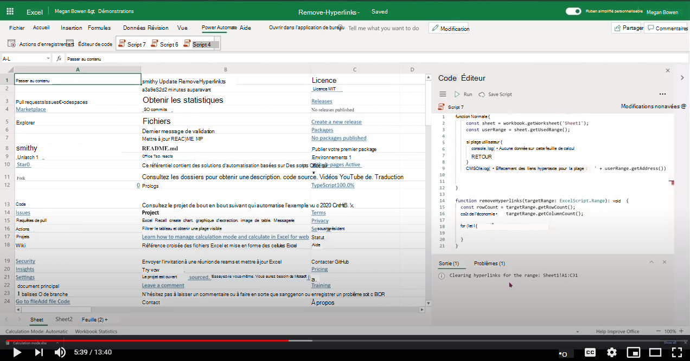

# <a name="remove-hyperlinks-from-each-cell-in-an-excel-worksheet"></a>Supprimer des liens hypertexte de chaque cellule d’une feuille de calcul Excel

 Cet exemple permet d’effacer tous les liens hypertexte de la feuille de calcul actuelle. Il parcourt la feuille de calcul et, s’il existe un lien hypertexte associé à la cellule, il effacera le lien hypertexte tout en conservant la valeur de la cellule telle quelle. Enregistre également le temps qu’il faut pour effectuer la traversée.

> [!NOTE]
> Cela fonctionne uniquement si le nombre de cellules est < 10 000.

## <a name="sample-code-remove-hyperlinks"></a>Exemple de code : supprimer des liens hypertexte

Téléchargez le fichier <a href="remove-hyperlinks.xlsx">remove-hyperlinks.xlsx</a> utilisé dans cet exemple et testez-le vous-même !

```TypeScript
function main(workbook: ExcelScript.Workbook, sheetName: string = 'Sheet1') {

  // Get the active worksheet. 
  let sheet = workbook.getWorksheet(sheetName);
  const targetRange = sheet.getUsedRange(true);
  if (!targetRange) {
    console.log(`There is no data in the worksheet. `)
    return;
  }
  console.log(`Target Range to clear hyperlinks from: ${targetRange.getAddress()}`);

  const rowCount = targetRange.getRowCount();
  const colCount = targetRange.getColumnCount();
  const totalCells = rowCount * colCount;
  if (totalCells > 10000) {
    console.log("Too many cells to operate with. Consider editing script to use selected range and then remove hyperlinks in batches. " + targetRange.getAddress());
    return;
  }
  // Call the helper function to remove the hyperlinks. 
  removeHyperLink(targetRange);
  return;
}

/**
 * Removes hyperlink for each cell in the target range. Logs the time it takes to complete traversal.
 * @param targetRange Target range to clear the hyperlinks from.
 */
function removeHyperLink(targetRange: ExcelScript.Range): void {
  const rowCount = targetRange.getRowCount();
  const colCount = targetRange.getColumnCount();
  console.log(`Searching for hyperlinks in ${targetRange.getAddress()} which contains ${(rowCount * colCount)} cells`);
  let clearedCount = 0;
  let cellsVisited = 0;

  let groupStart = new Date().getTime();
  for (let i = 0; i < rowCount; i++) {
    for (let j = 0; j < colCount; j++) {
      cellsVisited++;
      if (cellsVisited % 50 === 0) {
        let groupEnd = new Date().getTime();
        console.log(`Completed ${cellsVisited} cells out of ${rowCount * colCount}. This group took: ${(groupEnd - groupStart) / 1000} seconds to complete.`);
        groupStart = new Date().getTime();
      }
      const cell = targetRange.getCell(i, j);
      const hyperlink = cell.getHyperlink();
      if (hyperlink) {
        cell.clear(ExcelScript.ClearApplyTo.hyperlinks);
        cell.getFormat().getFont().setUnderline(ExcelScript.RangeUnderlineStyle.none);
        cell.getFormat().getFont().setColor('Black');
        clearedCount++;
      }
    }
  }
  console.log(`Done. Inspected ${cellsVisited} cells. Cleared hyperlinks in: ${clearedCount} cells`);
  return;
}
```

## <a name="training-video-remove-hyperlinks-from-each-cell-in-an-excel-worksheet"></a>Vidéo de formation : supprimer des liens hypertexte de chaque cellule d’une feuille de calcul Excel

[](https://youtu.be/v20fdinxpHU "Vidéo pas à pas sur la suppression de liens hypertexte de chaque cellule d’une feuille de calcul Excel")
