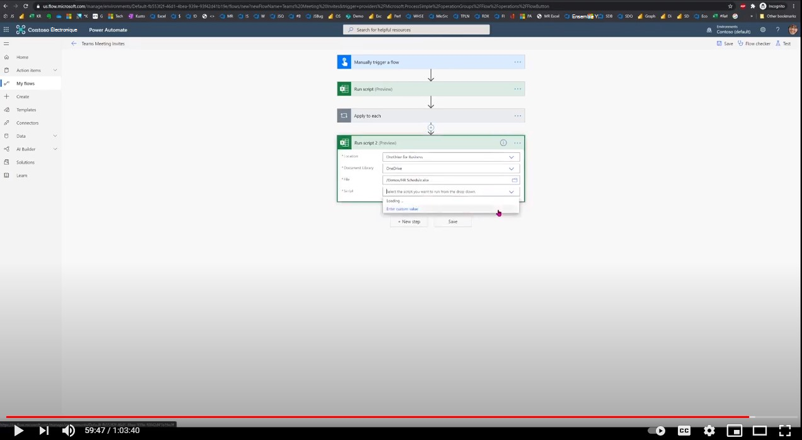

# <a name="send-teams-meeting-from-excel-data"></a>Envoyer une réunion Teams à partir de données Excel

Cette solution indique comment utiliser des actions Office Scripts et Power Automate pour sélectionner des lignes à partir d’un fichier Excel et l’utiliser pour envoyer une invitation à une réunion Teams, puis mettre à jour Excel.

## <a name="example-scenario"></a>Exemple de scénario

* Un recrutement RH gère la planification des entretiens des candidats dans un fichier Excel.
* Le recrutement doit envoyer l’invitation à la réunion Teams au candidat et aux enquêteurs. Les règles métiers sont à sélectionner :

    (a) Invite uniquement les personnes pour lesquelles l’invitation n’est pas déjà envoyée comme enregistrée dans la colonne de fichier.

    (b) Dates d’entretien futures (aucune date passée).

* Le recrutement doit mettre à jour le fichier Excel avec la confirmation que toutes les réunions Teams ont été envoyées pour les enregistrements éligibles.

La solution est en 3 parties :

1. Script Office pour extraire des données d’une table en fonction des conditions et renvoie un tableau d’objets en tant que données JSON.
1. Les données sont ensuite envoyées à l’action Créer une réunion **Teams teams** pour envoyer des invitations. Envoyez une réunion Teams par instance dans le tableau JSON.
1. Envoyez les mêmes données JSON à un autre script Office pour mettre à jour l’état de l’invitation.

## <a name="sample-excel-file"></a>Exemple de fichier Excel

Téléchargez le fichier <a href="hr-schedule.xlsx">hr-schedule.xlsx</a> utilisé dans cette solution et testez-le vous-même !

## <a name="sample-code-select-filtered-rows-from-table-as-json"></a>Exemple de code : sélectionner des lignes filtrées dans le tableau en tant que JSON

```TypeScript
function main(workbook: ExcelScript.Workbook): InterviewInvite[] {
  console.log("Current date time: " + new Date().toUTCString())
  const MEETING_DURATION = workbook.getNamedItem('MeetingDuration').getRange().getValue() as number;
  const sheet = workbook.getWorksheet('Interviews');
  const table = sheet.getTables()[0];
  const dataRows: string[][] = table.getRange().getTexts();
  // OR use the following statement if there's no table:
  // let dataRows = sheet.getUsedRange().getValues();
  const selectedRows = dataRows.filter((row, i) => {
    // Select header row and any data row with the status column equal to approach value.
    return (row[1] === 'FALSE' || i === 0)
  })
  const recordDetails: RecordDetail[] = returnObjectFromValues(selectedRows as string[][]);
  const inviteRecords = generateInterviewRecords(recordDetails, MEETING_DURATION);
  console.log(JSON.stringify(inviteRecords));
  return inviteRecords;
}

/**
 * This helper function converts table values into an object array.
 */
function returnObjectFromValues(values: string[][]): RecordDetail[] {
  let objArray: BasicObj[] = [];
  let objKeys: string[] = [];
  for (let i = 0; i < values.length; i++) {
    if (i === 0) {
      objKeys = values[i]
      continue;
    }
    let obj = {}
    for (let j = 0; j < values[i].length; j++) {
      obj[objKeys[j]] = values[i][j]
    }
    objArray.push(obj);
  }
  return objArray as RecordDetail[];
}

/**
 * Generate interview records by selecting required columns.
 * @param records Input records
 * @param mins Number of minutes to add to the start date-time
 */
function generateInterviewRecords(records: RecordDetail[], mins: number): InterviewInvite[] {
  const interviewInvites: InterviewInvite[] = []

  records.forEach((record) => {
    // Interviewer 1
    // If the start date-time is greater than current date-time, add to output records.
    if ((new Date(record['Start time1'])) > new Date()) {
      console.log("selected " + new Date(record['Start time1']).toUTCString());
      let startTime = new Date(record['Start time1']).toISOString();
      // Compute the finish time of the meeting.
      let finishTime = addMins(new Date(record['Start time1']), mins).toISOString();
      interviewInvites.push({
        ID: record.ID,
        Candidate: record.Candidate,
        CandidateEmail: record['Candidate email'] as string,
        CandidateContact: record['Candidate contact'] as string,
        Interviewer: record.Interviewer1,
        InterviewerEmail: record['Interviewer1 email'],
        StartTime: startTime,
        FinishTime: finishTime
      })
    } else {
      console.log("Rejected " + (new Date(record['Start time1']).toUTCString()))
    }
    // Interviewer 2 
    // If the start date-time is greater than current date-time, add to output records.
    if ((new Date(record['Start time2'])) > new Date()) {
      console.log("selected " + new Date(record['Start time2']).toUTCString());


      let startTime = new Date(record['Start time2']).toISOString();
      // Compute the finish time of the meeting.
      let finishTime = addMins(new Date(record['Start time2']), mins).toISOString();
      interviewInvites.push({
        ID: record.ID,
        Candidate: record.Candidate,
        CandidateEmail: record['Candidate email'] as string,
        CandidateContact: record['Candidate contact'] as string,
        Interviewer: record.Interviewer2,
        InterviewerEmail: record['Interviewer2 email'],
        StartTime: startTime,
        FinishTime: finishTime
      })
    } else {
      console.log("Rejected " + (new Date(record['Start time2']).toUTCString()))

    }
  })
  return interviewInvites;
}

/**
 * Add minutes to start date-time.
 * @param startDateTime Start date-time
 * @param mins Minutes to add to the start date-time
 */
function addMins(startDateTime: Date, mins: number) {
  return new Date(startDateTime.getTime() + mins * 60 * 1000);
}

// Basic key-value pair object.
interface BasicObj {
  [key: string]: string | number | boolean
}

// Input record that matches the table data.
interface RecordDetail extends BasicObj {
  ID: string
  'Invite to interview': string
  Candidate: string
  'Candidate email': string
  'Candidate contact': string
  Interviewer1: string
  'Interviewer1 email': string
  Interviewer2: string
  'Interviewer2 email': string
  'Start time1': string
  'Start time2': string
}

// Output record.
interface InterviewInvite extends BasicObj {
  ID: string
  Candidate: string
  CandidateEmail: string
  CandidateContact: string
  Interviewer: string
  InterviewerEmail: string
  StartTime: string
  FinishTime: string
}
```

## <a name="sample-code-mark-as-invited"></a>Exemple de code : marquer comme invité

```TypeScript
function main(workbook: ExcelScript.Workbook, completedInvitesString: string) {
    completedInvitesString = `[
  {
    "ID": "10",
    "Candidate": "Adele ",
    "CandidateEmail": "AdeleV@M365x904181.OnMicrosoft.com",
    "CandidateContact": "1234567899",
    "Interviewer": "Megan",
    "InterviewerEmail": "MeganB@M365x904181.OnMicrosoft.com",
    "StartTime": "2020-11-03T18:30:00Z",
    "FinishTime": "2020-11-03T22:45:00Z"
  },
  {
    "ID": "30",
    "Candidate": "Allan ",
    "CandidateEmail": "AllanD@M365x904181.OnMicrosoft.com",
    "CandidateContact": "1234567978",
    "Interviewer": "Raul",
    "InterviewerEmail": "RaulR@M365x904181.OnMicrosoft.com",
    "StartTime": "2020-11-03T23:00:00Z",
    "FinishTime": "2020-11-03T23:45:00Z"
  }
]`;
    let completedInvites = JSON.parse(completedInvitesString) as InterviewInvite[];
    const sheet = workbook.getWorksheet('Interviews');
    const range = sheet.getTables()[0].getRange();
    const dataRows = range.getValues();
    for (let i=0; i < dataRows.length; i++) {
        for (let invite of completedInvites) {
            if (String(dataRows[i][0]) === invite.ID) {
                range.getCell(i,1).setValue(true);
            }
        }
    }
    return;
}


// Invite record.
interface InterviewInvite  {
    ID: string
    Candidate: string
    CandidateEmail: string
    CandidateContact: string
    Interviewer: string
    InterviewerEmail: string
    StartTime: string
    FinishTime: string
}
```

## <a name="training-video-send-a-teams-meeting-from-excel-data"></a>Vidéo de formation : envoyer une réunion Teams à partir de données Excel

[](https://youtu.be/HyBdx52NOE8 "Vidéo pas à pas sur l’envoi d’une réunion Teams à partir de données Excel")
