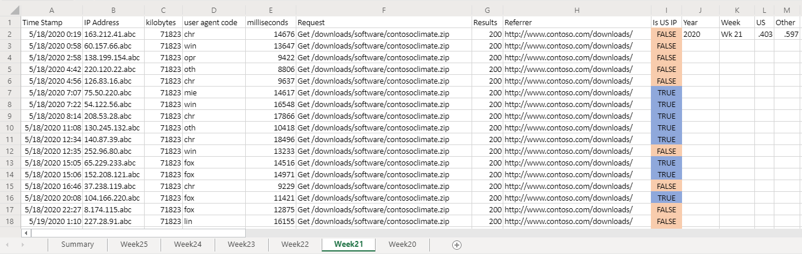

# <a name="office-scripts-sample-scenario-analyze-web-downloads"></a><span data-ttu-id="a2ece-103">Exemple de scénario de scripts Office : analyser les téléchargements Web</span><span class="sxs-lookup"><span data-stu-id="a2ece-103">Office Scripts sample scenario: Analyze web downloads</span></span>

<span data-ttu-id="a2ece-104">Dans ce scénario, vous êtes chargé d’analyser les rapports de téléchargement à partir du site Web de votre entreprise.</span><span class="sxs-lookup"><span data-stu-id="a2ece-104">In this scenario, you're tasked with analyzing download reports from your company's website.</span></span> <span data-ttu-id="a2ece-105">L’objectif de cette analyse est de déterminer si le trafic Web est en provenance des États-Unis ou ailleurs dans le monde entier.</span><span class="sxs-lookup"><span data-stu-id="a2ece-105">The goal of this analysis is to determine if the web traffic is coming from the United States or elsewhere in the world.</span></span>

<span data-ttu-id="a2ece-106">Vos collègues téléchargent les données brutes dans votre classeur.</span><span class="sxs-lookup"><span data-stu-id="a2ece-106">Your colleagues upload the raw data to your workbook.</span></span> <span data-ttu-id="a2ece-107">Chaque ensemble de données de la semaine dispose de sa propre feuille de calcul.</span><span class="sxs-lookup"><span data-stu-id="a2ece-107">Each week's set of data has its own worksheet.</span></span> <span data-ttu-id="a2ece-108">Il existe également une feuille de calcul de **synthèse** contenant un tableau et un graphique présentant les tendances de semaine sur semaine.</span><span class="sxs-lookup"><span data-stu-id="a2ece-108">There is also the **Summary** worksheet with a table and chart that shows week-over-week trends.</span></span>

<span data-ttu-id="a2ece-109">Vous développerez un script qui analyse les données de téléchargements hebdomadaires dans la feuille de calcul active.</span><span class="sxs-lookup"><span data-stu-id="a2ece-109">You'll develop a script that analyzes weekly downloads data in the active worksheet.</span></span> <span data-ttu-id="a2ece-110">Elle analyse l’adresse IP associée à chaque téléchargement et détermine si elle provient ou non des États-Unis.</span><span class="sxs-lookup"><span data-stu-id="a2ece-110">It will parse the IP address associated with each download and determine whether or not it came from the US.</span></span> <span data-ttu-id="a2ece-111">La réponse est insérée dans la feuille de calcul en tant que valeur booléenne ("TRUE" ou "FALSe") et la mise en forme conditionnelle est appliquée à ces cellules.</span><span class="sxs-lookup"><span data-stu-id="a2ece-111">The answer will be inserted in the worksheet as a boolean value ("TRUE" or "FALSE") and conditional formatting will be applied to those cells.</span></span> <span data-ttu-id="a2ece-112">Les résultats de l’adresse IP seront totalisés sur la feuille de calcul et copiés dans le tableau récapitulatif.</span><span class="sxs-lookup"><span data-stu-id="a2ece-112">The IP address location results will be totaled on the worksheet and copied to the summary table.</span></span>

## <a name="scripting-skills-covered"></a><span data-ttu-id="a2ece-113">Compétences en matière de script</span><span class="sxs-lookup"><span data-stu-id="a2ece-113">Scripting skills covered</span></span>

- <span data-ttu-id="a2ece-114">Analyse de texte</span><span class="sxs-lookup"><span data-stu-id="a2ece-114">Text parsing</span></span>
- <span data-ttu-id="a2ece-115">Sous-fonctions dans les scripts</span><span class="sxs-lookup"><span data-stu-id="a2ece-115">Subfunctions in scripts</span></span>
- <span data-ttu-id="a2ece-116">Mise en forme conditionnelle</span><span class="sxs-lookup"><span data-stu-id="a2ece-116">Conditional formatting</span></span>
- <span data-ttu-id="a2ece-117">Tableaux</span><span class="sxs-lookup"><span data-stu-id="a2ece-117">Tables</span></span>

## <a name="demo-video"></a><span data-ttu-id="a2ece-118">Vidéo de démonstration</span><span class="sxs-lookup"><span data-stu-id="a2ece-118">Demo video</span></span>

<span data-ttu-id="a2ece-119">Cet exemple a été démo dans le cadre de l’appel de la communauté de développeurs de compléments Office pour le 2020 février.</span><span class="sxs-lookup"><span data-stu-id="a2ece-119">This sample was demoed as part of the Office Add-ins developer community call for February 2020.</span></span>

> [!VIDEO https://www.youtube.com/embed/vPEqbb7t6-Y?start=154]

## <a name="setup-instructions"></a><span data-ttu-id="a2ece-120">Instructions de configuration</span><span class="sxs-lookup"><span data-stu-id="a2ece-120">Setup instructions</span></span>

1. <span data-ttu-id="a2ece-121">Téléchargez <a href="analyze-web-downloads.xlsx">analyze-Web-Downloads. xlsx</a> sur votre OneDrive.</span><span class="sxs-lookup"><span data-stu-id="a2ece-121">Download <a href="analyze-web-downloads.xlsx">analyze-web-downloads.xlsx</a> to your OneDrive.</span></span>

2. <span data-ttu-id="a2ece-122">Ouvrez le classeur avec Excel pour le Web.</span><span class="sxs-lookup"><span data-stu-id="a2ece-122">Open the workbook with Excel for the web.</span></span>

3. <span data-ttu-id="a2ece-123">Sous l’onglet **automatiser** , ouvrez l' **éditeur de code**.</span><span class="sxs-lookup"><span data-stu-id="a2ece-123">Under the **Automate** tab, open the **Code Editor**.</span></span>

4. <span data-ttu-id="a2ece-124">Dans le volet Office **éditeur de code** , appuyez sur **nouveau script** et collez le script suivant dans l’éditeur.</span><span class="sxs-lookup"><span data-stu-id="a2ece-124">In the **Code Editor** task pane, press **New Script** and paste the following script into the editor.</span></span>

    ```TypeScript
      async function main(context: Excel.RequestContext) {
        let currentWorksheet = context.workbook.worksheets
          .getActiveWorksheet();
        // Get the values of the active range of the active worksheet.
        let logRange = currentWorksheet.getUsedRange().load("values");

        // Get the Summary worksheet and table.
        let summaryWorksheet = context.workbook.worksheets.getItem("Summary");
        let summaryTable = context.workbook.tables.getItem("Table1");

        // Get the range that will contain TRUE/FALSE if the IP address is from the United States (US).
        let isUSColumn = logRange
          .getLastColumn()
          .getOffsetRange(0, 1)
          .load("address");

        // Get the values of all the US IP addresses.
        let ipRange = context.workbook.worksheets
          .getItem("USIPAddresses")
          .getUsedRange()
          .load("values");
        await context.sync();

        // Remove the first row.
        let topRow = logRange.values.shift();

        // Create a new array to contain the boolean representing if this is a US IP address.
        let newCol = [[]];

        // Go through each row in worksheet and add Boolean.
        for (let i = 0; i < logRange.values.length; i++) {
          let curRowIP = logRange.values[i][1];
          if (findIP(ipRange.values, ipAddressToInteger(curRowIP)) > 0) {
            newCol.push([true]);
          } else {
            newCol.push([false]);
          }
        }

        // Remove the empty column header and add proper heading.
        newCol.shift();
        newCol.unshift(["Is US IP"]);

        // Write the result to the spreadsheet.
        isUSColumn.values = newCol;
        addSummaryData();
        applyConditionalFormatting();
        currentWorksheet.getUsedRange().format.autofitColumns();

        // Get the calculated summary data.
        let summaryRange = currentWorksheet.getRange("J2:M2").load("values");
        await context.sync();

        // Add the corresponding row to the summary table.
        summaryTable.rows.add(null, summaryRange.values);

        // Function to apply conditional formatting to the new column.
        function applyConditionalFormatting() {
          // Add conditional formatting to the new column.
          let conditionalFormatTrue = isUSColumn.conditionalFormats.add(
            Excel.ConditionalFormatType.cellValue
          );
          let conditionalFormatFalse = isUSColumn.conditionalFormats.add(
            Excel.ConditionalFormatType.cellValue
          );
          // Set TRUE to light blue and FALSE to light orange.
          conditionalFormatTrue.cellValue.format.fill.color = "#8FA8DB";
          conditionalFormatTrue.cellValue.rule = {
            formula1: "=TRUE",
            operator: "EqualTo"
          };
          conditionalFormatFalse.cellValue.format.fill.color = "#F8CCAD";
          conditionalFormatFalse.cellValue.rule = {
            formula1: "=FALSE",
            operator: "EqualTo"
          };
        }

        // Adds the summary data to the current sheet and to the summary table.
        function addSummaryData() {
          // Add a summary row and table.
          let summaryHeader = [["Year", "Week", "US", "Other"]];
          let countTrueFormula =
            "=COUNTIF(" + isUSColumn.address + ', "=TRUE")/' + (newCol.length - 1);
          let countFalseFormula =
            "=COUNTIF(" + isUSColumn.address + ', "=FALSE")/' + (newCol.length - 1);

          let summaryContent = [
            [
              '=TEXT(A2,"YYYY")',
              '=TEXTJOIN(" ", FALSE, "Wk", WEEKNUM(A2))',
              countTrueFormula,
              countFalseFormula
            ]
          ];
          let summaryHeaderRow = context.workbook.worksheets
            .getActiveWorksheet()
            .getRange("J1:M1");
          let summaryContentRow = context.workbook.worksheets
            .getActiveWorksheet()
            .getRange("J2:M2");
          summaryHeaderRow.values = summaryHeader;
          summaryContentRow.values = summaryContent;
          let formats = [[".000", ".000"]];
          summaryContentRow
            .getOffsetRange(0, 2)
            .getResizedRange(0, -2).numberFormat = formats;
        }
      }

      // Translate an IP address into an integer.
      function ipAddressToInteger(ipAddress: string) {
        // Split the IP address into octets.
        let octets = ipAddress.split(".");

        // Create a number for each octet and do the math to create the integer value of the IP address.
        let fullNum =
          // Define an arbitrary number for the last octet.
          111 +
          parseInt(octets[2]) * 256 +
          parseInt(octets[1]) * 65536 +
          parseInt(octets[0]) * 16777216;
        return fullNum;
      }

      // Return the row number where the ip address is found.
      function findIP(ipLookupTable: number[][], n: number) {
        for (let i = 0; i < ipLookupTable.length; i++) {
          if (ipLookupTable[i][0] <= n && ipLookupTable[i][1] >= n) {
            return i;
          }
        }
        return -1;
      }
    ```

5. <span data-ttu-id="a2ece-125">Renommez le script pour analyser et enregistrer les **téléchargements Web** .</span><span class="sxs-lookup"><span data-stu-id="a2ece-125">Rename the script to **Analyze Web Downloads** and save it.</span></span>

## <a name="running-the-script"></a><span data-ttu-id="a2ece-126">Exécution du script</span><span class="sxs-lookup"><span data-stu-id="a2ece-126">Running the script</span></span>

<span data-ttu-id="a2ece-127">Accédez à l’une des feuilles de calcul de \*\*semaine\* \*\* et exécutez le script **analyze Web Downloads** .</span><span class="sxs-lookup"><span data-stu-id="a2ece-127">Navigate to any of the **Week\*\*** worksheets and run the **Analyze Web Downloads** script.</span></span> <span data-ttu-id="a2ece-128">Le script applique la mise en forme conditionnelle et l’étiquetage de l’emplacement sur la feuille actuelle.</span><span class="sxs-lookup"><span data-stu-id="a2ece-128">The script will apply the conditional formatting and location labelling on the current sheet.</span></span> <span data-ttu-id="a2ece-129">Elle met également à jour la feuille de calcul de **synthèse** .</span><span class="sxs-lookup"><span data-stu-id="a2ece-129">It will also update the **Summary** worksheet.</span></span>

### <a name="before-running-the-script"></a><span data-ttu-id="a2ece-130">Avant d’exécuter le script</span><span class="sxs-lookup"><span data-stu-id="a2ece-130">Before running the script</span></span>


### <a name="after-running-the-script"></a><span data-ttu-id="a2ece-132">Après avoir exécuté le script</span><span class="sxs-lookup"><span data-stu-id="a2ece-132">After running the script</span></span>




