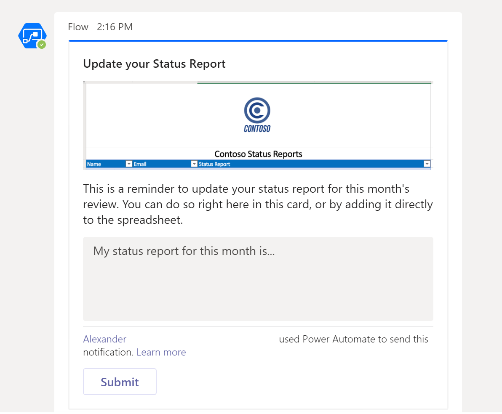

# <a name="office-scripts-sample-scenario-automated-task-reminders"></a><span data-ttu-id="905c7-103">Exemple de scénario de scripts Office : rappels de tâche automatisée</span><span class="sxs-lookup"><span data-stu-id="905c7-103">Office Scripts sample scenario: Automated task reminders</span></span>

<span data-ttu-id="905c7-104">Dans ce scénario, vous gérez un projet.</span><span class="sxs-lookup"><span data-stu-id="905c7-104">In this scenario you're managing a project.</span></span> <span data-ttu-id="905c7-105">Vous utilisez une feuille de calcul Excel pour suivre le statut de vos employés tous les mois.</span><span class="sxs-lookup"><span data-stu-id="905c7-105">You use an Excel worksheet to track your employees' status every month.</span></span> <span data-ttu-id="905c7-106">Vous avez souvent besoin de rappeler aux utilisateurs de remplir leur statut, de sorte que vous ayez décidé d’automatiser ce processus de rappel.</span><span class="sxs-lookup"><span data-stu-id="905c7-106">You often need to remind people to fill out their status, so you've decided to automate that reminder process.</span></span>

<span data-ttu-id="905c7-107">Vous allez créer un flux automatique d’alimentation pour les messages dont les champs d’État sont manquants et leur appliquer les réponses à la feuille de calcul.</span><span class="sxs-lookup"><span data-stu-id="905c7-107">You'll create a Power Automate flow to message people with missing status fields and apply their responses to the spreadsheet.</span></span> <span data-ttu-id="905c7-108">Pour ce faire, vous allez développer une paire de scripts pour gérer l’utilisation du classeur.</span><span class="sxs-lookup"><span data-stu-id="905c7-108">To do this, you'll develop a pair of scripts to handle the working with the workbook.</span></span> <span data-ttu-id="905c7-109">Le premier script obtient une liste de personnes dont l’État est vide et le deuxième script ajoute une chaîne d’État à la ligne de droite.</span><span class="sxs-lookup"><span data-stu-id="905c7-109">The first script gets a list of people with blank statuses and the second script adds a status string to the right row.</span></span> <span data-ttu-id="905c7-110">Vous utiliserez également des [cartes adaptatives](/microsoftteams/platform/task-modules-and-cards/what-are-cards) pour que les employés entrent leur état directement à partir de la notification.</span><span class="sxs-lookup"><span data-stu-id="905c7-110">You'll also make use of [Teams Adaptive Cards](/microsoftteams/platform/task-modules-and-cards/what-are-cards) to have employees enter their status directly from the notification.</span></span>

## <a name="scripting-skills-covered"></a><span data-ttu-id="905c7-111">Compétences en matière de script</span><span class="sxs-lookup"><span data-stu-id="905c7-111">Scripting skills covered</span></span>

- <span data-ttu-id="905c7-112">Créer des flux dans Power Automated</span><span class="sxs-lookup"><span data-stu-id="905c7-112">Create flows in Power Automate</span></span>
- <span data-ttu-id="905c7-113">Transmettre des données à des scripts</span><span class="sxs-lookup"><span data-stu-id="905c7-113">Pass data to scripts</span></span>
- <span data-ttu-id="905c7-114">Renvoyer des données à partir de scripts</span><span class="sxs-lookup"><span data-stu-id="905c7-114">Return data from scripts</span></span>
- <span data-ttu-id="905c7-115">Cartes adaptatives de teams</span><span class="sxs-lookup"><span data-stu-id="905c7-115">Teams Adaptive Cards</span></span>
- <span data-ttu-id="905c7-116">Tables</span><span class="sxs-lookup"><span data-stu-id="905c7-116">Tables</span></span>

## <a name="prerequisites"></a><span data-ttu-id="905c7-117">Conditions préalables</span><span class="sxs-lookup"><span data-stu-id="905c7-117">Prerequisites</span></span>

<span data-ttu-id="905c7-118">Ce scénario utilise [Power Automated](https://flow.microsoft.com) et [Microsoft teams](https://www.microsoft.com/microsoft-365/microsoft-teams/group-chat-software).</span><span class="sxs-lookup"><span data-stu-id="905c7-118">This scenario uses [Power Automate](https://flow.microsoft.com) and [Microsoft Teams](https://www.microsoft.com/microsoft-365/microsoft-teams/group-chat-software).</span></span> <span data-ttu-id="905c7-119">Vous aurez besoin des deux éléments associés au compte que vous utilisez pour le développement de scripts Office.</span><span class="sxs-lookup"><span data-stu-id="905c7-119">You will need both associated with the account that you use for developing Office Scripts.</span></span> <span data-ttu-id="905c7-120">Pour un accès gratuit à un abonnement de développeur Microsoft afin de découvrir et d’utiliser ces applications, envisagez de participer au [programme de développement microsoft 365](https://developer.microsoft.com/microsoft-365/dev-program).</span><span class="sxs-lookup"><span data-stu-id="905c7-120">For free access to a Microsoft Developer subscription to learn about and work with these applications, consider joining the [Microsoft 365 Developer Program](https://developer.microsoft.com/microsoft-365/dev-program).</span></span>

## <a name="setup-instructions"></a><span data-ttu-id="905c7-121">Instructions de configuration</span><span class="sxs-lookup"><span data-stu-id="905c7-121">Setup instructions</span></span>

1. <span data-ttu-id="905c7-122">Téléchargez <a href="task-reminders.xlsx">task-reminders.xlsx</a> vers votre espace OneDrive.</span><span class="sxs-lookup"><span data-stu-id="905c7-122">Download <a href="task-reminders.xlsx">task-reminders.xlsx</a> to your OneDrive.</span></span>

2. <span data-ttu-id="905c7-123">Ouvrez le classeur dans Excel sur le Web.</span><span class="sxs-lookup"><span data-stu-id="905c7-123">Open the workbook in Excel on the web.</span></span>

3. <span data-ttu-id="905c7-124">Sous l’onglet **automatiser** , ouvrez l' **éditeur de code**.</span><span class="sxs-lookup"><span data-stu-id="905c7-124">Under the **Automate** tab, open the **Code Editor**.</span></span>

4. <span data-ttu-id="905c7-125">Tout d’abord, nous avons besoin d’un script pour obtenir tous les employés ayant des rapports d’État manquants de la feuille de calcul.</span><span class="sxs-lookup"><span data-stu-id="905c7-125">First, we need a script to get all the employees with status reports that are missing from the spreadsheet.</span></span> <span data-ttu-id="905c7-126">Dans le volet Office **éditeur de code** , appuyez sur **nouveau script** et collez le script suivant dans l’éditeur.</span><span class="sxs-lookup"><span data-stu-id="905c7-126">In the **Code Editor** task pane, press **New Script** and paste the following script into the editor.</span></span>

    ```typescript
    /**
     * This script looks for missing status reports in a project management table.
     *
     * @returns An array of Employee objects (containing their names and emails).
     */
    function main(workbook: ExcelScript.Workbook): Employee[] {
      // Get the first worksheet and the first table on that worksheet.
      let sheet = workbook.getFirstWorksheet()
      let table = sheet.getTables()[0];

      // Give the column indices names matching their expected content.
      const NAME_INDEX = 0;
      const EMAIL_INDEX = 1;
      const STATUS_REPORT_INDEX = 2;

      // Get the data for the whole table.
      let bodyRangeValues = table.getRangeBetweenHeaderAndTotal().getValues();

      // Create the array of Employee objects to return.
      let people: Employee[] = [];

      // Loop through the table and check each row for completion.
      for (let i = 0; i < bodyRangeValues.length; i++) {
        let row = bodyRangeValues[i];
        if (row[STATUS_REPORT_INDEX] === "") {
          // Save the email to return.
          people.push({ name: row[NAME_INDEX], email: row[EMAIL_INDEX] });
        }
      }

      // Log the array to verify we're getting the right rows.
      console.log(people);

      // Return the array of Employees.
      return people;
    }

    /**
     * An interface representing an employee.
     * An array of Employees will be returned from the script
     * for the Power Automate flow.
     */
    interface Employee {
      name: string;
      email: string;
    }
    ```

5. <span data-ttu-id="905c7-127">Enregistrez le script sous le nom **Get People**.</span><span class="sxs-lookup"><span data-stu-id="905c7-127">Save the script with the name **Get People**.</span></span>

6. <span data-ttu-id="905c7-128">Ensuite, nous avons besoin d’un deuxième script pour traiter les cartes de rapports d’État et placer les nouvelles informations dans la feuille de calcul.</span><span class="sxs-lookup"><span data-stu-id="905c7-128">Next, we need a second script to process the status report cards and put the new information in the spreadsheet.</span></span> <span data-ttu-id="905c7-129">Dans le volet Office **éditeur de code** , appuyez sur **nouveau script** et collez le script suivant dans l’éditeur.</span><span class="sxs-lookup"><span data-stu-id="905c7-129">In the **Code Editor** task pane, press **New Script** and paste the following script into the editor.</span></span>

    ```typescript
    /**
     * This script applies the results of a Teams Adaptive Card about
     * a status update to a project management table.
     *
     * @param senderEmail - The email address of the employee updating their status.
     * @param statusReportResponse - The employee's status report.
     */
    function main(workbook: ExcelScript.Workbook,
      senderEmail: string,
      statusReportResponse: string) {

      // Get the first worksheet and the first table in that worksheet.
      let sheet = workbook.getFirstWorksheet();
      let table = sheet.getTables()[0];

      // Give the column indices names matching their expected content.
      const NAME_INDEX = 0;
      const EMAIL_INDEX = 1;
      const STATUS_REPORT_INDEX = 2;

      // Get the range and data for the whole table.
      let bodyRange = table.getRangeBetweenHeaderAndTotal();
      let tableRowCount = bodyRange.getRowCount();
      let bodyRangeValues = bodyRange.getValues();

      // Create a flag to denote success.
      let statusAdded = false;

      // Loop through the table and check each row for a matching email address.
      for (let i = 0; i < tableRowCount && !statusAdded; i++) {
        let row = bodyRangeValues[i];

        // Check if the row's email address matches.
        if (row[EMAIL_INDEX] === senderEmail) {
          // Add the Teams Adaptive Card response to the table.
          bodyRange.getCell(i, STATUS_REPORT_INDEX).setValues([
            [statusReportResponse]
          ]);
          statusAdded = true;
        }
      }

      // If successful, log the status update.
      if (statusAdded) {
        console.log(
          `Successfully added status report for ${senderEmail} containing: ${statusReportResponse}`
        );
      }
    }
    ```

7. <span data-ttu-id="905c7-130">Enregistrez le script sous le nom **Save Status**.</span><span class="sxs-lookup"><span data-stu-id="905c7-130">Save the script with the name **Save Status**.</span></span>

8. <span data-ttu-id="905c7-131">À présent, nous devons créer le flux.</span><span class="sxs-lookup"><span data-stu-id="905c7-131">Now, we need to create the flow.</span></span> <span data-ttu-id="905c7-132">Ouvrez [Power automate](https://flow.microsoft.com/).</span><span class="sxs-lookup"><span data-stu-id="905c7-132">Open [Power Automate](https://flow.microsoft.com/).</span></span>

    > [!TIP]
    > <span data-ttu-id="905c7-133">Si vous n’avez pas créé de flux avant, consultez notre didacticiel [commencer à utiliser des scripts avec Power automate](../../tutorials/excel-power-automate-manual.md) pour apprendre les bases.</span><span class="sxs-lookup"><span data-stu-id="905c7-133">If you haven't created a flow before, please check out our tutorial [Start using scripts with Power Automate](../../tutorials/excel-power-automate-manual.md) to learn the basics.</span></span>

9. <span data-ttu-id="905c7-134">Créez un **flux de messagerie instantanée**.</span><span class="sxs-lookup"><span data-stu-id="905c7-134">Create a new **Instant flow**.</span></span>

10. <span data-ttu-id="905c7-135">Choisissez **déclencher manuellement un flux** à partir des options, puis appuyez sur **créer**.</span><span class="sxs-lookup"><span data-stu-id="905c7-135">Choose **Manually trigger a flow** from the options and press **Create**.</span></span>

11. <span data-ttu-id="905c7-136">Le flux doit appeler le script **Get People** pour obtenir tous les employés avec des champs d’État vides.</span><span class="sxs-lookup"><span data-stu-id="905c7-136">The flow needs to call the **Get People** script to get all the employees with empty status fields.</span></span> <span data-ttu-id="905c7-137">Appuyez sur **nouvelle étape** et sélectionnez **Excel Online (professionnel)**.</span><span class="sxs-lookup"><span data-stu-id="905c7-137">Press **New step** and select **Excel Online (Business)**.</span></span> <span data-ttu-id="905c7-138">Sous **actions**, sélectionnez **exécuter un script (aperçu)**.</span><span class="sxs-lookup"><span data-stu-id="905c7-138">Under **Actions**, select **Run script (preview)**.</span></span> <span data-ttu-id="905c7-139">Fournissez les entrées suivantes pour l’étape de flux :</span><span class="sxs-lookup"><span data-stu-id="905c7-139">Provide the following entries for the flow step:</span></span>

    - <span data-ttu-id="905c7-140">**Emplacement**: OneDrive entreprise</span><span class="sxs-lookup"><span data-stu-id="905c7-140">**Location**: OneDrive for Business</span></span>
    - <span data-ttu-id="905c7-141">**Bibliothèque de documents**: OneDrive</span><span class="sxs-lookup"><span data-stu-id="905c7-141">**Document Library**: OneDrive</span></span>
    - <span data-ttu-id="905c7-142">**Fichier**: task-reminders.xlsx</span><span class="sxs-lookup"><span data-stu-id="905c7-142">**File**: task-reminders.xlsx</span></span>
    - <span data-ttu-id="905c7-143">**Script**: obtenir des personnes</span><span class="sxs-lookup"><span data-stu-id="905c7-143">**Script**: Get People</span></span>

    

12. <span data-ttu-id="905c7-145">Ensuite, le flux doit traiter chaque employé dans le tableau renvoyé par le script.</span><span class="sxs-lookup"><span data-stu-id="905c7-145">Next, the flow needs to process each Employee in the array returned by the script.</span></span> <span data-ttu-id="905c7-146">Appuyez sur **nouvelle étape** et sélectionnez **publier une carte adaptative pour un utilisateur de teams et attendez une réponse**.</span><span class="sxs-lookup"><span data-stu-id="905c7-146">Press **New step** and select **Post an Adaptive Card to a Teams user and wait for a response**.</span></span>

13. <span data-ttu-id="905c7-147">Pour le champ **destinataire** , ajoutez le **courrier électronique** à partir du contenu dynamique (la sélection comportera le logo Excel).</span><span class="sxs-lookup"><span data-stu-id="905c7-147">For the **Recipient** field, add **email** from the dynamic content (the selection will have the Excel logo by it).</span></span> <span data-ttu-id="905c7-148">L’ajout de **courrier** entraîne l’enchaînement de l’étape du flux par un bloc **apply to each** .</span><span class="sxs-lookup"><span data-stu-id="905c7-148">Adding **email** causes the flow step to be surrounded by an **Apply to each** block.</span></span> <span data-ttu-id="905c7-149">Cela signifie que le tableau sera parcouru par Power Automated.</span><span class="sxs-lookup"><span data-stu-id="905c7-149">That means the array will be iterated over by Power Automate.</span></span>

14. <span data-ttu-id="905c7-150">L’envoi d’une carte adaptative nécessite que le JSON de la carte soit fourni comme **message**.</span><span class="sxs-lookup"><span data-stu-id="905c7-150">Sending an Adaptive Card requires the card's JSON to be provided as the **Message**.</span></span> <span data-ttu-id="905c7-151">Vous pouvez utiliser le [Concepteur de cartes adaptatives](https://adaptivecards.io/designer/) pour créer des cartes personnalisées.</span><span class="sxs-lookup"><span data-stu-id="905c7-151">You can use the [Adaptive Card Designer](https://adaptivecards.io/designer/) to create custom cards.</span></span> <span data-ttu-id="905c7-152">Pour cet exemple, utilisez le code JSON suivant.</span><span class="sxs-lookup"><span data-stu-id="905c7-152">For this sample, use the following JSON.</span></span>  

    ```json
    {
      "$schema": "http://adaptivecards.io/schemas/adaptive-card.json",
      "type": "AdaptiveCard",
      "version": "1.0",
      "body": [
        {
          "type": "TextBlock",
          "size": "Medium",
          "weight": "Bolder",
          "text": "Update your Status Report"
        },
        {
          "type": "Image",
          "altText": "",
          "url": "https://i.imgur.com/f5RcuF3.png"
        },
        {
          "type": "TextBlock",
          "text": "This is a reminder to update your status report for this month's review. You can do so right here in this card, or by adding it directly to the spreadsheet.",
          "wrap": true
        },
        {
          "type": "Input.Text",
          "placeholder": "My status report for this month is...",
          "id": "response",
          "isMultiline": true
        }
      ],
      "actions": [
        {
          "type": "Action.Submit",
          "title": "Submit",
          "id": "submit"
        }
      ]
    }
    ```

15. <span data-ttu-id="905c7-153">Renseignez les champs restants comme suit :</span><span class="sxs-lookup"><span data-stu-id="905c7-153">Fill out the remaining fields as follows:</span></span>

    - <span data-ttu-id="905c7-154">**Mettre à jour le message**: Merci d’avoir soumis votre rapport d’État.</span><span class="sxs-lookup"><span data-stu-id="905c7-154">**Update message**: Thank you for submitting your status report.</span></span> <span data-ttu-id="905c7-155">Votre réponse a été ajoutée à la feuille de calcul.</span><span class="sxs-lookup"><span data-stu-id="905c7-155">Your response has been successfully added to the spreadsheet.</span></span>
    - <span data-ttu-id="905c7-156">**Mise à jour**de la carte : Oui</span><span class="sxs-lookup"><span data-stu-id="905c7-156">**Should update card**: Yes</span></span>

16. <span data-ttu-id="905c7-157">Dans le bloc **apply to each** , après l' **envoi d’une carte adaptative à un utilisateur de teams et l’attente d’une réponse**, appuyez sur **Ajouter une action**.</span><span class="sxs-lookup"><span data-stu-id="905c7-157">In the **Apply to each** block, following the **Post an Adaptive Card to a Teams user and wait for a response**, press **Add an action**.</span></span> <span data-ttu-id="905c7-158">Sélectionnez **Excel Online (professionnel)**.</span><span class="sxs-lookup"><span data-stu-id="905c7-158">Select **Excel Online (Business)**.</span></span> <span data-ttu-id="905c7-159">Sous **actions**, sélectionnez **exécuter un script (aperçu)**.</span><span class="sxs-lookup"><span data-stu-id="905c7-159">Under **Actions**, select **Run script (preview)**.</span></span> <span data-ttu-id="905c7-160">Fournissez les entrées suivantes pour l’étape de flux :</span><span class="sxs-lookup"><span data-stu-id="905c7-160">Provide the following entries for the flow step:</span></span>

    - <span data-ttu-id="905c7-161">**Emplacement**: OneDrive entreprise</span><span class="sxs-lookup"><span data-stu-id="905c7-161">**Location**: OneDrive for Business</span></span>
    - <span data-ttu-id="905c7-162">**Bibliothèque de documents**: OneDrive</span><span class="sxs-lookup"><span data-stu-id="905c7-162">**Document Library**: OneDrive</span></span>
    - <span data-ttu-id="905c7-163">**Fichier**: task-reminders.xlsx</span><span class="sxs-lookup"><span data-stu-id="905c7-163">**File**: task-reminders.xlsx</span></span>
    - <span data-ttu-id="905c7-164">**Script**: enregistrer l’État</span><span class="sxs-lookup"><span data-stu-id="905c7-164">**Script**: Save Status</span></span>
    - <span data-ttu-id="905c7-165">**senderEmail**: e-mail *(contenu dynamique d’Excel)*</span><span class="sxs-lookup"><span data-stu-id="905c7-165">**senderEmail**: email *(dynamic content from Excel)*</span></span>
    - <span data-ttu-id="905c7-166">**statusReportResponse**: Response *(contenu dynamique de Teams)*</span><span class="sxs-lookup"><span data-stu-id="905c7-166">**statusReportResponse**: response *(dynamic content from Teams)*</span></span>

    

17. <span data-ttu-id="905c7-168">Enregistrez le flux.</span><span class="sxs-lookup"><span data-stu-id="905c7-168">Save the flow.</span></span>

## <a name="running-the-flow"></a><span data-ttu-id="905c7-169">Exécution du flux</span><span class="sxs-lookup"><span data-stu-id="905c7-169">Running the flow</span></span>

<span data-ttu-id="905c7-170">Pour tester le flux, assurez-vous que toutes les lignes de tableau dont le statut est vide utilisent une adresse de messagerie liée à un compte Teams (vous devez probablement utiliser votre propre adresse de messagerie lors des tests).</span><span class="sxs-lookup"><span data-stu-id="905c7-170">To test the flow, make sure any table rows with blank status use an email address tied to a Teams account (you should probably use your own email address while testing).</span></span>

<span data-ttu-id="905c7-171">Vous pouvez sélectionner **test** dans le concepteur de flux ou exécuter le flux à partir de la page **mes flux** .</span><span class="sxs-lookup"><span data-stu-id="905c7-171">You can either select **Test** from the flow designer, or run the flow from the **My flows** page.</span></span> <span data-ttu-id="905c7-172">Après avoir démarré le flux et accepté l’utilisation des connexions requises, vous devez recevoir une carte adaptative de Power automate via Teams.</span><span class="sxs-lookup"><span data-stu-id="905c7-172">After starting the flow and accepting the use of the required connections, you should receive an Adaptive Card from Power Automate through Teams.</span></span> <span data-ttu-id="905c7-173">Une fois que vous avez rempli le champ d’État dans la carte, le flux se poursuit et met à jour la feuille de calcul avec l’état que vous avez fourni.</span><span class="sxs-lookup"><span data-stu-id="905c7-173">Once you fill out the status field in the card, the flow will continue and update the spreadsheet with the status you provide.</span></span>

### <a name="before-running-the-flow"></a><span data-ttu-id="905c7-174">Avant d’exécuter le flux</span><span class="sxs-lookup"><span data-stu-id="905c7-174">Before running the flow</span></span>


### <a name="receiving-the-adaptive-card"></a><span data-ttu-id="905c7-176">Réception de la carte adaptative</span><span class="sxs-lookup"><span data-stu-id="905c7-176">Receiving the Adaptive Card</span></span>



### <a name="after-running-the-flow"></a><span data-ttu-id="905c7-178">Après l’exécution du flux</span><span class="sxs-lookup"><span data-stu-id="905c7-178">After running the flow</span></span>


