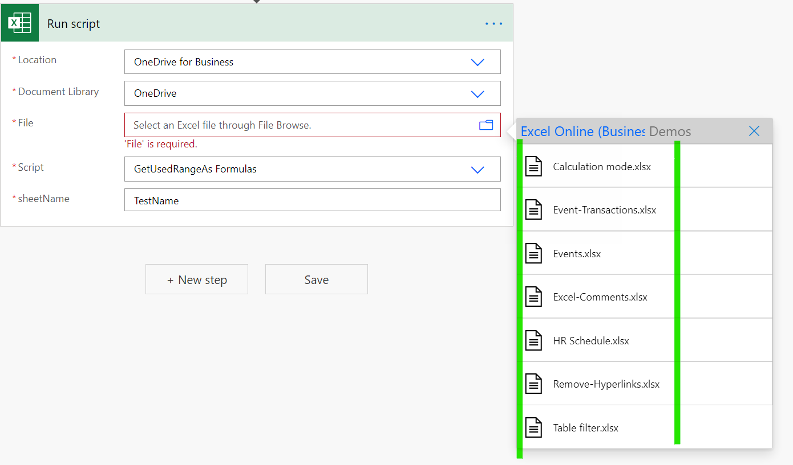
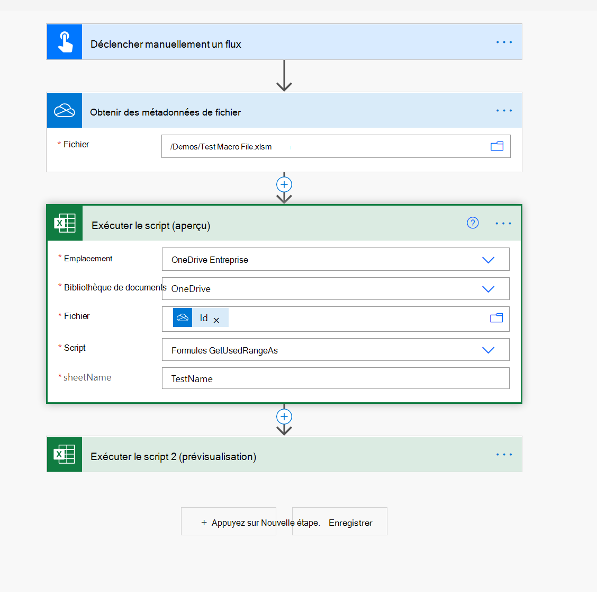

# Utilisation des fichiers macro dans les flux Power Automate

[Les flux Power Automate](https://flow.microsoft.com/) fournissent [des connecteurs Excel](https://flow.microsoft.com/connectors/shared_excelonlinebusiness/excel-online-business/) pour vous aider à connecter des fichiers Excel avec le reste de vos données organisationnelles et applications telles que Teams, Outlook et SharePoint.

Toutefois, les fichiers macro ne peuvent pas être sélectionnés dans la liste finale du fichier (voir un exemple dans la capture d’écran suivante).

Pour contourner ce problème, vous pouvez inclure l’action « Obtenir les métadonnées de fichier » (OneDrive ou SharePoint) et utiliser la propriété ID dans l’action « Exécuter le script », comme illustré dans la capture d’écran suivante.

> [!NOTE]
> Certains fichiers XLSM (notamment ceux avec des contrôles ActiveX/formulaire) peuvent ne pas fonctionner dans le connecteur en ligne Excel. Veillez à tester avant de déployer votre solution.

