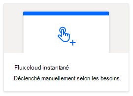
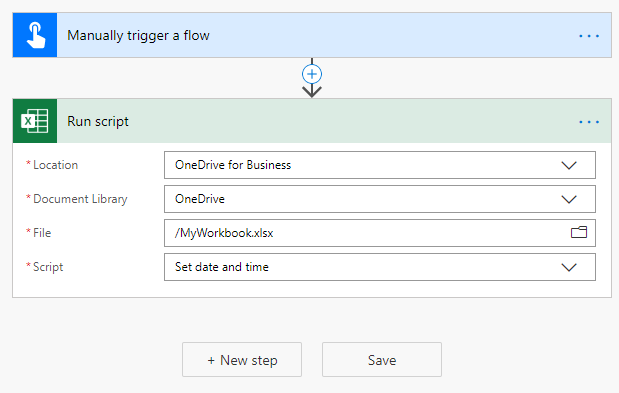
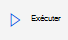

# <a name="start-using-scripts-with-power-automate-preview"></a><span data-ttu-id="8e007-103">Commencer à utiliser des scripts avec Power automate (aperçu)</span><span class="sxs-lookup"><span data-stu-id="8e007-103">Start using scripts with Power Automate (preview)</span></span>

<span data-ttu-id="8e007-104">Ce didacticiel vous apprend à exécuter un script Office pour Excel sur le Web à l’aide de [Power Automated](https://flow.microsoft.com).</span><span class="sxs-lookup"><span data-stu-id="8e007-104">This tutorial teaches you how to run an Office Script for Excel on the web through [Power Automate](https://flow.microsoft.com).</span></span>

## <a name="prerequisites"></a><span data-ttu-id="8e007-105">Conditions préalables</span><span class="sxs-lookup"><span data-stu-id="8e007-105">Prerequisites</span></span>

[!INCLUDE [Tutorial prerequisites](../includes/tutorial-prerequisites.md)]

> [!IMPORTANT]
> <span data-ttu-id="8e007-106">Ce didacticiel part du principe que vous avez terminé l' [enregistrement, la modification et la création de scripts Office dans le didacticiel Excel sur le Web](excel-tutorial.md) .</span><span class="sxs-lookup"><span data-stu-id="8e007-106">This tutorial assumes you have completed the [Record, edit, and create Office Scripts in Excel on the web](excel-tutorial.md) tutorial.</span></span>

## <a name="prepare-the-workbook"></a><span data-ttu-id="8e007-107">Préparation du classeur</span><span class="sxs-lookup"><span data-stu-id="8e007-107">Prepare the workbook</span></span>

<span data-ttu-id="8e007-108">Power automate ne peut pas utiliser de références relatives comme `Workbook.getActiveWorksheet` pour accéder aux composants du classeur.</span><span class="sxs-lookup"><span data-stu-id="8e007-108">Power Automate can't use relative references like `Workbook.getActiveWorksheet` to access workbook components.</span></span> <span data-ttu-id="8e007-109">Par conséquent, nous avons besoin d’un classeur et d’une feuille de calcul avec des noms cohérents que Power automate peut référencer.</span><span class="sxs-lookup"><span data-stu-id="8e007-109">So, we need a workbook and worksheet with consistent names that Power Automate can reference.</span></span>

1. <span data-ttu-id="8e007-110">Créez un classeur nommé **MyWorkbook**.</span><span class="sxs-lookup"><span data-stu-id="8e007-110">Create a new workbook named **MyWorkbook**.</span></span>

2. <span data-ttu-id="8e007-111">Dans le classeur **MyWorkbook** , créez une feuille de calcul appelée **TutorialWorksheet**.</span><span class="sxs-lookup"><span data-stu-id="8e007-111">In the **MyWorkbook** workbook, create a worksheet called **TutorialWorksheet**.</span></span>

## <a name="create-an-office-script"></a><span data-ttu-id="8e007-112">Créer un script Office</span><span class="sxs-lookup"><span data-stu-id="8e007-112">Create an Office Script</span></span>

1. <span data-ttu-id="8e007-113">Accédez à l’onglet **automatiser** et sélectionnez **éditeur de code**.</span><span class="sxs-lookup"><span data-stu-id="8e007-113">Go to the **Automate** tab and select **Code Editor**.</span></span>

2. <span data-ttu-id="8e007-114">Sélectionnez **nouveau script**.</span><span class="sxs-lookup"><span data-stu-id="8e007-114">Select **New Script**.</span></span>

3. <span data-ttu-id="8e007-115">Remplacez le script par défaut par le script suivant.</span><span class="sxs-lookup"><span data-stu-id="8e007-115">Replace the default script with the following script.</span></span> <span data-ttu-id="8e007-116">Ce script ajoute la date et l’heure actuelles aux deux premières cellules de la feuille de calcul **TutorialWorksheet** .</span><span class="sxs-lookup"><span data-stu-id="8e007-116">This script adds the current date and time to the first two cells of the **TutorialWorksheet** worksheet.</span></span>

    ```TypeScript
    function main(workbook: ExcelScript.Workbook) {
      // Get the "TutorialWorksheet" worksheet from the workbook.
      let worksheet = workbook.getWorksheet("TutorialWorksheet");

      // Get the cells at A1 and B1.
      let dateRange = worksheet.getRange("A1");
      let timeRange = worksheet.getRange("B1");

      // Get the current date and time using the JavaScript Date object.
      let date = new Date(Date.now());

      // Add the date string to A1.
      dateRange.setValue(date.toLocaleDateString());

      // Add the time string to B1.
      timeRange.setValue(date.toLocaleTimeString());
    }
    ```

4. <span data-ttu-id="8e007-117">Renommez le script pour **définir la date et l’heure**.</span><span class="sxs-lookup"><span data-stu-id="8e007-117">Rename the script to **Set date and time**.</span></span> <span data-ttu-id="8e007-118">Appuyez sur le nom du script pour le modifier.</span><span class="sxs-lookup"><span data-stu-id="8e007-118">Press the script name to change it.</span></span>

5. <span data-ttu-id="8e007-119">Enregistrez le script en appuyant sur **enregistrer le script**.</span><span class="sxs-lookup"><span data-stu-id="8e007-119">Save the script by pressing **Save Script**.</span></span>

## <a name="create-an-automated-workflow-with-power-automate"></a><span data-ttu-id="8e007-120">Créer un flux de travail automatisé avec Power automate</span><span class="sxs-lookup"><span data-stu-id="8e007-120">Create an automated workflow with Power Automate</span></span>

1. <span data-ttu-id="8e007-121">Connectez-vous au [site d’automate d’automate Power](https://flow.microsoft.com).</span><span class="sxs-lookup"><span data-stu-id="8e007-121">Sign in to the [Power Automate preview site](https://flow.microsoft.com).</span></span>

2. <span data-ttu-id="8e007-122">Dans le menu affiché sur le côté gauche de l’écran, appuyez sur **créer**.</span><span class="sxs-lookup"><span data-stu-id="8e007-122">In the menu that's displayed on the left side of the screen, press **Create**.</span></span> <span data-ttu-id="8e007-123">Cela vous permet de créer de nouveaux flux de travail.</span><span class="sxs-lookup"><span data-stu-id="8e007-123">This brings you to list of ways to create new workflows.</span></span>

    

3. <span data-ttu-id="8e007-125">Dans la section **commencer à partir d’un champ vide** , sélectionnez **flux instantané**.</span><span class="sxs-lookup"><span data-stu-id="8e007-125">In the **Start from blank** section, select **Instant flow**.</span></span> <span data-ttu-id="8e007-126">Cela crée un flux de travail activé manuellement.</span><span class="sxs-lookup"><span data-stu-id="8e007-126">This creates a manually activated workflow.</span></span>

    

4. <span data-ttu-id="8e007-128">Dans la fenêtre de boîte de dialogue qui s’affiche, entrez un nom pour votre flux dans la zone de texte **nom du flux** , sélectionnez **déclencher manuellement un flux** dans la liste des options sous **choisir comment déclencher le flux**, puis appuyez sur **créer**.</span><span class="sxs-lookup"><span data-stu-id="8e007-128">In the dialog window that appears, enter a name for your flow in the **Flow name** text box, select **Manually trigger a flow** from the list of options under **Choose how to trigger the flow**, and press **Create**.</span></span>

    

5. <span data-ttu-id="8e007-130">Appuyez sur **nouvelle étape**.</span><span class="sxs-lookup"><span data-stu-id="8e007-130">Press **New step**.</span></span>

6. <span data-ttu-id="8e007-131">Sélectionnez l’onglet **standard** , puis **Excel Online (professionnel)**.</span><span class="sxs-lookup"><span data-stu-id="8e007-131">Select the **Standard** tab, then select **Excel Online (Business)**.</span></span>

    

7. <span data-ttu-id="8e007-133">Sous **actions**, sélectionnez **exécuter un script (aperçu)**.</span><span class="sxs-lookup"><span data-stu-id="8e007-133">Under **Actions**, select **Run script (preview)**.</span></span>

    

8. <span data-ttu-id="8e007-135">Spécifiez les paramètres suivants pour le connecteur de **script d’exécution** :</span><span class="sxs-lookup"><span data-stu-id="8e007-135">Specify the following settings for the **Run script** connector:</span></span>

    - <span data-ttu-id="8e007-136">**Emplacement**: OneDrive entreprise</span><span class="sxs-lookup"><span data-stu-id="8e007-136">**Location**: OneDrive for Business</span></span>
    - <span data-ttu-id="8e007-137">**Bibliothèque de documents**: OneDrive</span><span class="sxs-lookup"><span data-stu-id="8e007-137">**Document Library**: OneDrive</span></span>
    - <span data-ttu-id="8e007-138">**Fichier**: MyWorkbook.xlsx</span><span class="sxs-lookup"><span data-stu-id="8e007-138">**File**: MyWorkbook.xlsx</span></span>
    - <span data-ttu-id="8e007-139">**Script**: définir la date et l’heure</span><span class="sxs-lookup"><span data-stu-id="8e007-139">**Script**: Set date and time</span></span>

    

9. <span data-ttu-id="8e007-141">Cliquez sur **Enregistrer**.</span><span class="sxs-lookup"><span data-stu-id="8e007-141">Press **Save**.</span></span>

<span data-ttu-id="8e007-142">Votre flux est maintenant prêt à être exécuté via automate Power.</span><span class="sxs-lookup"><span data-stu-id="8e007-142">Your flow is now ready to be run through Power Automate.</span></span> <span data-ttu-id="8e007-143">Vous pouvez le tester à l’aide du bouton **test** de l’éditeur de flux ou suivre les étapes du didacticiel restantes pour exécuter le flux à partir de votre collection de flux.</span><span class="sxs-lookup"><span data-stu-id="8e007-143">You can test it using the **Test** button in the flow editor or follow the remaining tutorial steps to run the flow from your flow collection.</span></span>

## <a name="run-the-script-through-power-automate"></a><span data-ttu-id="8e007-144">Exécuter le script par le biais de Power automate</span><span class="sxs-lookup"><span data-stu-id="8e007-144">Run the script through Power Automate</span></span>

1. <span data-ttu-id="8e007-145">Dans la page principale de l’alimentation automatique, sélectionnez **mes flux**.</span><span class="sxs-lookup"><span data-stu-id="8e007-145">From the main Power Automate page, select **My flows**.</span></span>

    

2. <span data-ttu-id="8e007-147">Sélectionnez **mon flux de didacticiel** dans la liste des flux affichée sous l’onglet **mes flux** . Indique les détails du flux que nous avons créé précédemment.</span><span class="sxs-lookup"><span data-stu-id="8e007-147">Select **My tutorial flow** from the list of flows displayed in the **My flows** tab. This shows the details of the flow we previously created.</span></span>

3. <span data-ttu-id="8e007-148">Appuyez sur **exécuter**.</span><span class="sxs-lookup"><span data-stu-id="8e007-148">Press **Run**.</span></span>

    

4. <span data-ttu-id="8e007-150">Un volet Office s’affiche pour exécuter le flux.</span><span class="sxs-lookup"><span data-stu-id="8e007-150">A task pane will appear for running the flow.</span></span> <span data-ttu-id="8e007-151">Si vous êtes invité à vous **connecter** à Excel Online, faites-le en appuyant sur **Continuer**.</span><span class="sxs-lookup"><span data-stu-id="8e007-151">If you are asked to **Sign in** to Excel Online, do so by pressing **Continue**.</span></span>

5. <span data-ttu-id="8e007-152">Appuyez sur **exécuter le flux**.</span><span class="sxs-lookup"><span data-stu-id="8e007-152">Press **Run flow**.</span></span> <span data-ttu-id="8e007-153">Cela exécute le flux, qui exécute le script Office associé.</span><span class="sxs-lookup"><span data-stu-id="8e007-153">This runs the flow, which runs the related Office Script.</span></span>

6. <span data-ttu-id="8e007-154">Appuyez sur **Terminer**.</span><span class="sxs-lookup"><span data-stu-id="8e007-154">Press **Done**.</span></span> <span data-ttu-id="8e007-155">La section **exécutions** doit être mise à jour en conséquence.</span><span class="sxs-lookup"><span data-stu-id="8e007-155">You should see the **Runs** section update accordingly.</span></span>

7. <span data-ttu-id="8e007-156">Actualisez la page pour afficher les résultats de l’automate Power.</span><span class="sxs-lookup"><span data-stu-id="8e007-156">Refresh the page to see the results of the Power Automate.</span></span> <span data-ttu-id="8e007-157">Si elle réussit, accédez au classeur pour voir les cellules mises à jour.</span><span class="sxs-lookup"><span data-stu-id="8e007-157">If it succeeded, go to the workbook to see the updated cells.</span></span> <span data-ttu-id="8e007-158">En cas d’échec, vérifiez les paramètres du flux et exécutez-le une seconde fois.</span><span class="sxs-lookup"><span data-stu-id="8e007-158">If it failed, verify the flow's settings and run it a second time.</span></span>

    

## <a name="next-steps"></a><span data-ttu-id="8e007-160">Étapes suivantes</span><span class="sxs-lookup"><span data-stu-id="8e007-160">Next steps</span></span>

<span data-ttu-id="8e007-161">Exécutez le didacticiel [exécuter automatiquement les scripts avec automate d’alimentation automatique](excel-power-automate-trigger.md) .</span><span class="sxs-lookup"><span data-stu-id="8e007-161">Complete the [Automatically run scripts with automated Power Automate flows](excel-power-automate-trigger.md) tutorial.</span></span> <span data-ttu-id="8e007-162">Elle vous apprend à transmettre des données à partir d’un service de flux de travail à votre script Office.</span><span class="sxs-lookup"><span data-stu-id="8e007-162">It teaches you how to pass data from a workflow service to your Office Script.</span></span>
