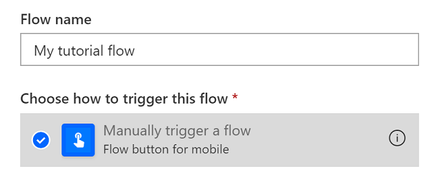

# <a name="start-using-scripts-with-power-automate-preview"></a>Commencer à utiliser des scripts avec Power automate (aperçu)

Ce didacticiel vous apprend à exécuter un script Office pour Excel sur le Web à l’aide de [Power Automated](https://flow.microsoft.com).

## <a name="prerequisites"></a>Conditions préalables

[!INCLUDE [Tutorial prerequisites](../includes/tutorial-prerequisites.md)]

> [!IMPORTANT]
> Ce didacticiel part du principe que vous avez terminé l' [enregistrement, la modification et la création de scripts Office dans le didacticiel Excel sur le Web](excel-tutorial.md) .

## <a name="prepare-the-workbook"></a>Préparation du classeur

Power automate ne peut pas utiliser de références relatives comme `Workbook.getActiveWorksheet` pour accéder aux composants du classeur. Par conséquent, nous avons besoin d’un classeur et d’une feuille de calcul avec des noms cohérents que Power automate peut référencer.

1. Créez un classeur nommé **MyWorkbook**.

2. Dans le classeur **MyWorkbook** , créez une feuille de calcul appelée **TutorialWorksheet**.

## <a name="create-an-office-script"></a>Créer un script Office

1. Accédez à l’onglet **automatiser** et sélectionnez **éditeur de code**.

2. Sélectionnez **nouveau script**.

3. Remplacez le script par défaut par le script suivant. Ce script ajoute la date et l’heure actuelles aux deux premières cellules de la feuille de calcul **TutorialWorksheet** .

    ```TypeScript
    function main(workbook: ExcelScript.Workbook) {
      // Get the "TutorialWorksheet" worksheet from the workbook.
      let worksheet = workbook.getWorksheet("TutorialWorksheet");

      // Get the cells at A1 and B1.
      let dateRange = worksheet.getRange("A1");
      let timeRange = worksheet.getRange("B1");

      // Get the current date and time using the JavaScript Date object.
      let date = new Date(Date.now());

      // Add the date string to A1.
      dateRange.setValue(date.toLocaleDateString());

      // Add the time string to B1.
      timeRange.setValue(date.toLocaleTimeString());
    }
    ```

4. Renommez le script pour **définir la date et l’heure**. Appuyez sur le nom du script pour le modifier.

5. Enregistrez le script en appuyant sur **enregistrer le script**.

## <a name="create-an-automated-workflow-with-power-automate"></a>Créer un flux de travail automatisé avec Power automate

1. Connectez-vous au [site d’automate d’automate Power](https://flow.microsoft.com).

2. Dans le menu affiché sur le côté gauche de l’écran, appuyez sur **créer**. Cela vous permet de créer de nouveaux flux de travail.

    

3. Dans la section **commencer à partir d’un champ vide** , sélectionnez **flux instantané**. Cela crée un flux de travail activé manuellement.

    

4. Dans la fenêtre de boîte de dialogue qui s’affiche, entrez un nom pour votre flux dans la zone de texte **nom du flux** , sélectionnez **déclencher manuellement un flux** dans la liste des options sous **choisir comment déclencher le flux**, puis appuyez sur **créer**.

    

5. Appuyez sur **nouvelle étape**.

6. Sélectionnez l’onglet **standard** , puis **Excel Online (professionnel)**.

    

7. Sous **actions**, sélectionnez **exécuter un script (aperçu)**.

    

8. Spécifiez les paramètres suivants pour le connecteur de **script d’exécution** :

    - **Emplacement**: OneDrive entreprise
    - **Bibliothèque de documents**: OneDrive
    - **Fichier**: MyWorkbook.xlsx
    - **Script**: définir la date et l’heure

    

9. Cliquez sur **Enregistrer**.

Votre flux est maintenant prêt à être exécuté via automate Power. Vous pouvez le tester à l’aide du bouton **test** de l’éditeur de flux ou suivre les étapes du didacticiel restantes pour exécuter le flux à partir de votre collection de flux.

## <a name="run-the-script-through-power-automate"></a>Exécuter le script par le biais de Power automate

1. Dans la page principale de l’alimentation automatique, sélectionnez **mes flux**.

    

2. Sélectionnez **mon flux de didacticiel** dans la liste des flux affichée sous l’onglet **mes flux** . Indique les détails du flux que nous avons créé précédemment.

3. Appuyez sur **exécuter**.

    

4. Un volet Office s’affiche pour exécuter le flux. Si vous êtes invité à vous **connecter** à Excel Online, faites-le en appuyant sur **Continuer**.

5. Appuyez sur **exécuter le flux**. Cela exécute le flux, qui exécute le script Office associé.

6. Appuyez sur **Terminer**. La section **exécutions** doit être mise à jour en conséquence.

7. Actualisez la page pour afficher les résultats de l’automate Power. Si elle réussit, accédez au classeur pour voir les cellules mises à jour. En cas d’échec, vérifiez les paramètres du flux et exécutez-le une seconde fois.

    

## <a name="next-steps"></a>Étapes suivantes

Exécutez le didacticiel [exécuter automatiquement les scripts avec automate d’alimentation automatique](excel-power-automate-trigger.md) . Elle vous apprend à transmettre des données à partir d’un service de flux de travail à votre script Office.
