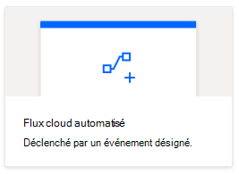
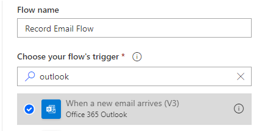
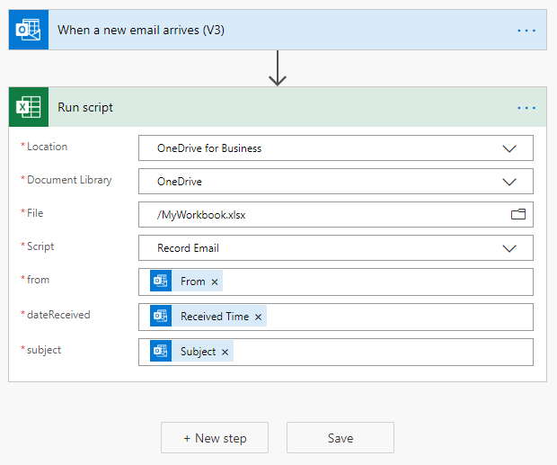
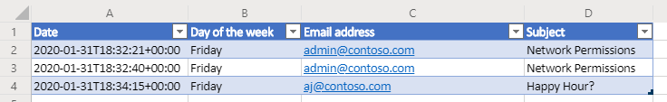
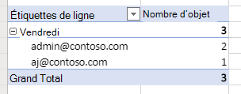

# <a name="pass-data-to-scripts-in-an-automatically-run-power-automate-flow-preview"></a><span data-ttu-id="6f608-103">Transmettre des données à des scripts dans un flux automatique Power Automate (Aperçu)</span><span class="sxs-lookup"><span data-stu-id="6f608-103">Pass data to scripts in an automatically-run Power Automate flow (preview)</span></span>

<span data-ttu-id="6f608-104">Ce tutoriel vous apprend à exécuter un script Office pour Excel sur le web via un flux de travail automatisé [Power Automate](https://flow.microsoft.com).</span><span class="sxs-lookup"><span data-stu-id="6f608-104">This tutorial teaches you how to use an Office Script for Excel on the web with an automated [Power Automate](https://flow.microsoft.com) workflow.</span></span> <span data-ttu-id="6f608-105">Votre script s’exécute automatiquement chaque fois que vous recevez un courrier électronique, enregistrant les informations du courrier électronique dans un classeur Excel.</span><span class="sxs-lookup"><span data-stu-id="6f608-105">Your script will automatically run each time you receive an email, recording information from the email in an Excel workbook.</span></span> <span data-ttu-id="6f608-106">La possibilité de transférer des données d’autres applications dans un script Office offre une flexibilité et une liberté considérables dans vos processus automatisés.</span><span class="sxs-lookup"><span data-stu-id="6f608-106">Being able to pass data from other applications into an Office Script gives you a great deal of flexibility and freedom in your automated processes.</span></span>

> [!TIP]
> <span data-ttu-id="6f608-107">Si vous débutez avec les scripts Office, nous vous recommandons de commencer par le didacticiel [Enregistrer, modifier, créer des scripts Office dans Excel pour le web](excel-tutorial.md).</span><span class="sxs-lookup"><span data-stu-id="6f608-107">If you are new to Office Scripts, we recommend starting with the [Record, edit, and create Office Scripts in Excel on the web](excel-tutorial.md) tutorial.</span></span> <span data-ttu-id="6f608-108">Si vous débutez avec Power Automate, nous vous recommandons de démarrer par le didacticiel [Appeler des scripts à partir d’un flux manuel Power Automate](excel-power-automate-manual.md).</span><span class="sxs-lookup"><span data-stu-id="6f608-108">If you are new to Power Automate, we recommend starting with the [Call scripts from a manual Power Automate flow](excel-power-automate-manual.md) tutorial.</span></span> <span data-ttu-id="6f608-109">[Les scripts Office utilisent TypeScript](../overview/code-editor-environment.md), et ce didacticiel est destiné aux utilisateurs ayant des connaissances de niveau débutant à intermédiaire en JavaScript ou TypeScript.</span><span class="sxs-lookup"><span data-stu-id="6f608-109">[Office Scripts use TypeScript](../overview/code-editor-environment.md) and this tutorial is intended for people with beginner to intermediate-level knowledge of JavaScript or TypeScript.</span></span> <span data-ttu-id="6f608-110">Si vous débutez avec JavaScript, nous vous conseillons de démarrer par le [didacticiel Mozilla JavaScript](https://developer.mozilla.org/docs/Web/JavaScript/Guide/Introduction).</span><span class="sxs-lookup"><span data-stu-id="6f608-110">If you're new to JavaScript, we recommend starting with the [Mozilla JavaScript tutorial](https://developer.mozilla.org/docs/Web/JavaScript/Guide/Introduction).</span></span>

## <a name="prerequisites"></a><span data-ttu-id="6f608-111">Configuration requise</span><span class="sxs-lookup"><span data-stu-id="6f608-111">Prerequisites</span></span>

[!INCLUDE [Tutorial prerequisites](../includes/power-automate-tutorial-prerequisites.md)]

## <a name="prepare-the-workbook"></a><span data-ttu-id="6f608-112">Préparer le classeur</span><span class="sxs-lookup"><span data-stu-id="6f608-112">Prepare the workbook</span></span>

<span data-ttu-id="6f608-113">Power Automate ne peut pas utiliser de [références relatives](../develop/power-automate-integration.md#avoid-using-relative-references) comme `Workbook.getActiveWorksheet`pour accéder aux composants du classeur.</span><span class="sxs-lookup"><span data-stu-id="6f608-113">Power Automate can't use [relative references](../develop/power-automate-integration.md#avoid-using-relative-references) like `Workbook.getActiveWorksheet` to access workbook components.</span></span> <span data-ttu-id="6f608-114">Nous avons donc besoin d’un classeur et d’une feuille de calcul avec des noms cohérents que Power Automate peut référencer.</span><span class="sxs-lookup"><span data-stu-id="6f608-114">So, we need a workbook and worksheet with consistent names for Power Automate to reference.</span></span>

1. <span data-ttu-id="6f608-115">Créer un nouveau classeur appelé **MyWorkbook**.</span><span class="sxs-lookup"><span data-stu-id="6f608-115">Create a new workbook named **MyWorkbook**.</span></span>

2. <span data-ttu-id="6f608-116">Accédez à l’onglet **Automatiser**, puis sélectionnez **Éditeur de code**.</span><span class="sxs-lookup"><span data-stu-id="6f608-116">Go to the **Automate** tab and select **Code Editor**.</span></span>

3. <span data-ttu-id="6f608-117">Sélectionnez **Nouveau script**.</span><span class="sxs-lookup"><span data-stu-id="6f608-117">Select **New Script**.</span></span>

4. <span data-ttu-id="6f608-118">Remplacez le code existant par le script suivant et appuyez sur **Exécuter** :</span><span class="sxs-lookup"><span data-stu-id="6f608-118">Replace the existing code with the following script and press **Run**.</span></span> <span data-ttu-id="6f608-119">Cette opération permet de configurer le classeur avec des noms de feuille de calcul, de tableau et de tableau croisé dynamique cohérents.</span><span class="sxs-lookup"><span data-stu-id="6f608-119">This will setup the workbook with consistent worksheet, table, and PivotTable names.</span></span>

    ```TypeScript
    function main(workbook: ExcelScript.Workbook) {
      // Add a new worksheet to store our email table
      let emailsSheet = workbook.addWorksheet("Emails");

      // Add data and create a table
      emailsSheet.getRange("A1:D1").setValues([
        ["Date", "Day of the week", "Email address", "Subject"]
      ]);
      let newTable = workbook.addTable(emailsSheet.getRange("A1:D2"), true);
      newTable.setName("EmailTable");

      // Add a new PivotTable to a new worksheet
      let pivotWorksheet = workbook.addWorksheet("Subjects");
      let newPivotTable = workbook.addPivotTable("Pivot", "EmailTable", pivotWorksheet.getRange("A3:C20"));

      // Setup the pivot hierarchies
      newPivotTable.addRowHierarchy(newPivotTable.getHierarchy("Day of the week"));
      newPivotTable.addRowHierarchy(newPivotTable.getHierarchy("Email address"));
      newPivotTable.addDataHierarchy(newPivotTable.getHierarchy("Subject"));
    }
    ```

## <a name="create-an-office-script"></a><span data-ttu-id="6f608-120">Créer un script Office</span><span class="sxs-lookup"><span data-stu-id="6f608-120">Create an Office Script</span></span>

<span data-ttu-id="6f608-121">Créons un script qui enregistre les informations à partir d’un message électronique.</span><span class="sxs-lookup"><span data-stu-id="6f608-121">Let's create a script that logs information from an email.</span></span> <span data-ttu-id="6f608-122">Nous cherchons à identifier quels jours de la semaine nous recevons le plus de messages électroniques et combien d’expéditeurs uniques envoient ces messages électroniques.</span><span class="sxs-lookup"><span data-stu-id="6f608-122">We want to know how which days of the week we receive the most mail and how many unique senders are sending that mail.</span></span> <span data-ttu-id="6f608-123">Notre classeur comporte une table avec les colonnes **date**, **jour de la semaine**, **adresse électronique**et **objet**.</span><span class="sxs-lookup"><span data-stu-id="6f608-123">Our workbook has a table with **Date**, **Day of the week**, **Email address**, and **Subject** columns.</span></span> <span data-ttu-id="6f608-124">Notre feuille de calcul comporte également un tableau croisé dynamique qui fait pivoter le **jour de la semaine** et **adresse électronique** (il s’agit des hiérarchies de ligne).</span><span class="sxs-lookup"><span data-stu-id="6f608-124">Our worksheet also has a PivotTable that is pivoting on the **Day of the week** and **Email address** (those are the row hierarchies).</span></span> <span data-ttu-id="6f608-125">Le nombre de sujets **uniques** correspond aux informations agrégées affichées (hiérarchie des données).</span><span class="sxs-lookup"><span data-stu-id="6f608-125">The count of unique **Subjects** is the aggregated information being displayed (the data hierarchy).</span></span> <span data-ttu-id="6f608-126">Notre script actualise ce tableau croisé dynamique après la mise à jour de la table de messagerie.</span><span class="sxs-lookup"><span data-stu-id="6f608-126">We'll have our script refresh that PivotTable after updating the email table.</span></span>

1. <span data-ttu-id="6f608-127">Dans l’ **Éditeur de code**, sélectionnez **Nouveau script**.</span><span class="sxs-lookup"><span data-stu-id="6f608-127">From within the **Code Editor**, select **New Script**.</span></span>

2. <span data-ttu-id="6f608-128">Le flux que nous allons créer plus tard dans le tutoriel enverra les informations de script de chaque message électronique reçu.</span><span class="sxs-lookup"><span data-stu-id="6f608-128">The flow that we'll create later in the tutorial will send our script information about each email that's received.</span></span> <span data-ttu-id="6f608-129">Le script doit accepter cette entrée à l’aide de paramètres de la fonction `main`.</span><span class="sxs-lookup"><span data-stu-id="6f608-129">The script needs to accept that input through parameters in the `main` function.</span></span> <span data-ttu-id="6f608-130">Remplacez le script par défaut par le script suivant :</span><span class="sxs-lookup"><span data-stu-id="6f608-130">Replace the default script with the following script:</span></span>

    ```TypeScript
    function main(
      workbook: ExcelScript.Workbook,
      from: string,
      dateReceived: string,
      subject: string) {

    }
    ```

3. <span data-ttu-id="6f608-131">Le script a besoin d’accéder à la table et au tableau croisé dynamique du classeur.</span><span class="sxs-lookup"><span data-stu-id="6f608-131">The script needs access to the workbook's table and PivotTable.</span></span> <span data-ttu-id="6f608-132">Ajoutez le code suivant dans le corps du script, après l'ouverture `{` :</span><span class="sxs-lookup"><span data-stu-id="6f608-132">Add the following code to the body of the script, after the opening `{`:</span></span>

    ```TypeScript
    // Get the email table.
    let emailWorksheet = workbook.getWorksheet("Emails");
    let table = emailWorksheet.getTable("EmailTable");
  
    // Get the PivotTable.
    let pivotTableWorksheet = workbook.getWorksheet("Subjects");
    let pivotTable = pivotTableWorksheet.getPivotTable("Pivot");
    ```

4. <span data-ttu-id="6f608-133">Le paramètre `dateReceived` est de type `string`.</span><span class="sxs-lookup"><span data-stu-id="6f608-133">The `dateReceived` parameter is of type `string`.</span></span> <span data-ttu-id="6f608-134">Transformons cela en un [`Date` objet](../develop/javascript-objects.md#date) pour pouvoir obtenir facilement le jour de la semaine.</span><span class="sxs-lookup"><span data-stu-id="6f608-134">Let's convert that to a [`Date` object](../develop/javascript-objects.md#date) so we can easily get the day of the week.</span></span> <span data-ttu-id="6f608-135">Une fois cette opération effectuée, vous devez mapper la valeur numérique du jour à une version plus lisible.</span><span class="sxs-lookup"><span data-stu-id="6f608-135">After doing that, we'll need to map the day's number value to a more readable version.</span></span> <span data-ttu-id="6f608-136">Ajoutez le code suivant à la fin de votre script (avant la clôture `}`) :</span><span class="sxs-lookup"><span data-stu-id="6f608-136">Add the following code to the end of your script, before the closing `}`:</span></span>

    ```TypeScript
      // Parse the received date string to determine the day of the week.
      let emailDate = new Date(dateReceived);
      let dayName = emailDate.toLocaleDateString("en-US", { weekday: 'long' });
    ```

5. <span data-ttu-id="6f608-137">La chaîne de `subject` peut inclure la balise de réponse « RE : ».</span><span class="sxs-lookup"><span data-stu-id="6f608-137">The `subject` string may include the "RE:" reply tag.</span></span> <span data-ttu-id="6f608-138">Supprimez-le de la chaîne afin que les messages électroniques d’un même fil de discussion aient le même objet pour le tableau.</span><span class="sxs-lookup"><span data-stu-id="6f608-138">Let's remove that from the string so that emails in the same thread have the same subject for the table.</span></span> <span data-ttu-id="6f608-139">Ajoutez le code suivant à la fin de votre script (avant la clôture `}`) :</span><span class="sxs-lookup"><span data-stu-id="6f608-139">Add the following code to the end of your script, before the closing `}`:</span></span>

    ```TypeScript
    // Remove the reply tag from the email subject to group emails on the same thread.
    let subjectText = subject.replace("Re: ", "");
    subjectText = subjectText.replace("RE: ", "");
    ```

6. <span data-ttu-id="6f608-140">À présent que les données de courrier électronique ont été formatées à notre gout, ajoutons une ligne au tableau de courrier électronique.</span><span class="sxs-lookup"><span data-stu-id="6f608-140">Now that the email data has been formatted to our liking, let's add a row to the email table.</span></span> <span data-ttu-id="6f608-141">Ajoutez le code suivant à la fin de votre script (avant la clôture `}`) :</span><span class="sxs-lookup"><span data-stu-id="6f608-141">Add the following code to the end of your script, before the closing `}`:</span></span>

    ```TypeScript
    // Add the parsed text to the table.
    table.addRow(-1, [dateReceived, dayName, from, subjectText]);
    ```

7. <span data-ttu-id="6f608-142">Enfin, assurez-vous que le tableau croisé dynamique est actualisé.</span><span class="sxs-lookup"><span data-stu-id="6f608-142">Finally, let's make sure the PivotTable is refreshed.</span></span> <span data-ttu-id="6f608-143">Ajoutez le code suivant à la fin de votre script (avant la clôture `}`) :</span><span class="sxs-lookup"><span data-stu-id="6f608-143">Add the following code to the end of your script, before the closing `}`:</span></span>

    ```TypeScript
    // Refresh the PivotTable to include the new row.
    pivotTable.refresh();
    ```

8. <span data-ttu-id="6f608-144">Renommez votre script **Enregistrer le courrier électronique**, puis appuyez sur **Enregistrer le script**.</span><span class="sxs-lookup"><span data-stu-id="6f608-144">Rename your script **Record Email** and press **Save script**.</span></span>

<span data-ttu-id="6f608-145">Votre script est maintenant prêt pour un flux de travail Power Automate.</span><span class="sxs-lookup"><span data-stu-id="6f608-145">Your script is now ready for a Power Automate workflow.</span></span> <span data-ttu-id="6f608-146">Il devrait ressembler au script suivant :</span><span class="sxs-lookup"><span data-stu-id="6f608-146">It should look like the following script:</span></span>

```TypeScript
function main(
  workbook: ExcelScript.Workbook,
  from: string,
  dateReceived: string,
  subject: string) {
  // Get the email table.
  let emailWorksheet = workbook.getWorksheet("Emails");
  let table = emailWorksheet.getTable("EmailTable");

  // Get the PivotTable.
  let pivotTableWorksheet = workbook.getWorksheet("Subjects");
  let pivotTable = pivotTableWorksheet.getPivotTable("Pivot");

  // Parse the received date string to determine the day of the week.
  let emailDate = new Date(dateReceived);
  let dayName = emailDate.toLocaleDateString("en-US", { weekday: 'long' });

  // Remove the reply tag from the email subject to group emails on the same thread.
  let subjectText = subject.replace("Re: ", "");
  subjectText = subjectText.replace("RE: ", "");

  // Add the parsed text to the table.
  table.addRow(-1, [dateReceived, dayName, from, subjectText]);

  // Refresh the PivotTable to include the new row.
  pivotTable.refresh();
}
```

## <a name="create-an-automated-workflow-with-power-automate"></a><span data-ttu-id="6f608-147">Créer un flux de travail automatisé avec Power Automate</span><span class="sxs-lookup"><span data-stu-id="6f608-147">Create an automated workflow with Power Automate</span></span>

1. <span data-ttu-id="6f608-148">Connectez-vous au site [Power Automate](https://flow.microsoft.com).</span><span class="sxs-lookup"><span data-stu-id="6f608-148">Sign in to the [Power Automate site](https://flow.microsoft.com).</span></span>

2. <span data-ttu-id="6f608-149">Dans le menu qui s’affiche sur le côté gauche de l’écran, appuyez sur **Créer**.</span><span class="sxs-lookup"><span data-stu-id="6f608-149">In the menu that's displayed on the left side of the screen, press **Create**.</span></span> <span data-ttu-id="6f608-150">Cela affiche une liste des moyens de créer de nouveaux flux de travail.</span><span class="sxs-lookup"><span data-stu-id="6f608-150">This brings you to list of ways to create new workflows.</span></span>

    

3. <span data-ttu-id="6f608-152">Dans la section **Démarrer à partir de zéro**, sélectionnez **Flux automatique**.</span><span class="sxs-lookup"><span data-stu-id="6f608-152">In the **Start from blank** section, select **Automated flow**.</span></span> <span data-ttu-id="6f608-153">Cela permet de créer un flux de travail déclenché par un événement, par exemple, la réception d’un courrier électronique.</span><span class="sxs-lookup"><span data-stu-id="6f608-153">This creates a workflow triggered by an event, such as receiving an email.</span></span>

    

4. <span data-ttu-id="6f608-155">Dans la fenêtre de boîte de dialogue qui s’affiche, entrez un nom pour votre flux dans la zone de texte **Nom du flux**.</span><span class="sxs-lookup"><span data-stu-id="6f608-155">In the dialog window that appears, enter a name for your flow in the **Flow name** text box.</span></span> <span data-ttu-id="6f608-156">Sélectionnez ensuite **À l'arrivée d'un nouveau courrier électronique** dans la liste d’options sous **Sélectionnez le déclencheur de votre flux**.</span><span class="sxs-lookup"><span data-stu-id="6f608-156">Then select **When a new email arrives** from the list of options under **Choose your flow's trigger**.</span></span> <span data-ttu-id="6f608-157">Vous devrez peut-être rechercher l’option dans la zone de recherche.</span><span class="sxs-lookup"><span data-stu-id="6f608-157">You may need to search for the option using the search box.</span></span> <span data-ttu-id="6f608-158">Enfin, appuyez sur **Créer**.</span><span class="sxs-lookup"><span data-stu-id="6f608-158">Finally, press **Create**.</span></span>

    

    > [!NOTE]
    > <span data-ttu-id="6f608-160">Ce tutoriel utilise Outlook.</span><span class="sxs-lookup"><span data-stu-id="6f608-160">This tutorial uses Outlook.</span></span> <span data-ttu-id="6f608-161">N’hésitez pas à utiliser votre service de messagerie préféré, même si certaines options peuvent être différentes.</span><span class="sxs-lookup"><span data-stu-id="6f608-161">Feel free to use your preferred email service instead, though some options may be different.</span></span>

5. <span data-ttu-id="6f608-162">Appuyez sur **Nouvelle étape**.</span><span class="sxs-lookup"><span data-stu-id="6f608-162">Press **New step**.</span></span>

6. <span data-ttu-id="6f608-163">Sélectionnez l’onglet **Standard**, puis sélectionnez **Excel Online (Business)**.</span><span class="sxs-lookup"><span data-stu-id="6f608-163">Select the **Standard** tab, then select **Excel Online (Business)**.</span></span>

    

7. <span data-ttu-id="6f608-165">Sous **Actions**, sélectionnez **Exécuter le script** (Aperçu).</span><span class="sxs-lookup"><span data-stu-id="6f608-165">Under **Actions**, select **Run script (preview)**.</span></span>

    

8. <span data-ttu-id="6f608-167">Vous devez ensuite sélectionner le classeur, le script, puis les arguments de saisie de script à utiliser dans l’étape de flux.</span><span class="sxs-lookup"><span data-stu-id="6f608-167">Next, you'll select the workbook, script, and script input arguments to use in the flow step.</span></span> <span data-ttu-id="6f608-168">À titre de didacticiel, vous allez utiliser le classeur précédemment créé dans OneDrive, mais vous pouvez utiliser n’importe quel classeur dans un site OneDrive ou SharePoint.</span><span class="sxs-lookup"><span data-stu-id="6f608-168">For the tutorial, you'll use the workbook you created in your OneDrive, but you could use any workbook in a OneDrive or SharePoint site.</span></span> <span data-ttu-id="6f608-169">Spécifiez les paramètres suivants pour le connecteur **Exécuter le script** :</span><span class="sxs-lookup"><span data-stu-id="6f608-169">Specify the following settings for the **Run script** connector:</span></span>

    - <span data-ttu-id="6f608-170">**Emplacement** : OneDrive Entreprise</span><span class="sxs-lookup"><span data-stu-id="6f608-170">**Location**: OneDrive for Business</span></span>
    - <span data-ttu-id="6f608-171">**Bibliothèque de documents** : OneDrive</span><span class="sxs-lookup"><span data-stu-id="6f608-171">**Document Library**: OneDrive</span></span>
    - <span data-ttu-id="6f608-172">**Fichier** : MyWorkbook.xlsx</span><span class="sxs-lookup"><span data-stu-id="6f608-172">**File**: MyWorkbook.xlsx</span></span>
    - <span data-ttu-id="6f608-173">**Script** : Enregistrer le courrier électronique</span><span class="sxs-lookup"><span data-stu-id="6f608-173">**Script**: Record Email</span></span>
    - <span data-ttu-id="6f608-174">**à partir de**: de *(contenu dynamique d’Outlook)*</span><span class="sxs-lookup"><span data-stu-id="6f608-174">**from**: From *(dynamic content from Outlook)*</span></span>
    - <span data-ttu-id="6f608-175">**date de réception**: heure de réception *(contenu dynamique d’Outlook)*</span><span class="sxs-lookup"><span data-stu-id="6f608-175">**dateReceived**: Received Time *(dynamic content from Outlook)*</span></span>
    - <span data-ttu-id="6f608-176">**objet**: Objet *(contenu dynamique d’Outlook)*</span><span class="sxs-lookup"><span data-stu-id="6f608-176">**subject**: Subject *(dynamic content from Outlook)*</span></span>

    <span data-ttu-id="6f608-177">*Notez que les paramètres du script s’affichent uniquement une fois le script sélectionné.*</span><span class="sxs-lookup"><span data-stu-id="6f608-177">*Note that the parameters for the script will only appear once the script is selected.*</span></span>

    

9. <span data-ttu-id="6f608-179">Appuyez sur **Enregistrer**.</span><span class="sxs-lookup"><span data-stu-id="6f608-179">Press **Save**.</span></span>

<span data-ttu-id="6f608-180">Votre flux est désormais activé.</span><span class="sxs-lookup"><span data-stu-id="6f608-180">Your flow is now enabled.</span></span> <span data-ttu-id="6f608-181">Il exécute automatiquement votre script chaque fois que vous recevez un courrier électronique via Outlook.</span><span class="sxs-lookup"><span data-stu-id="6f608-181">It will automatically run your script each time you receive an email through Outlook.</span></span>

## <a name="manage-the-script-in-power-automate"></a><span data-ttu-id="6f608-182">Gérer le script dans Power Automate</span><span class="sxs-lookup"><span data-stu-id="6f608-182">Manage the script in Power Automate</span></span>

1. <span data-ttu-id="6f608-183">Sur la page principale de Power Automate, sélectionnez **Mes flux**.</span><span class="sxs-lookup"><span data-stu-id="6f608-183">From the main Power Automate page, select **My flows**.</span></span>

    

2. <span data-ttu-id="6f608-185">Sélectionnez votre flux.</span><span class="sxs-lookup"><span data-stu-id="6f608-185">Select your flow.</span></span> <span data-ttu-id="6f608-186">Ici, vous pouvez voir l’historique d’exécution.</span><span class="sxs-lookup"><span data-stu-id="6f608-186">Here you can see the run history.</span></span> <span data-ttu-id="6f608-187">Vous pouvez actualiser la page ou appuyer sur le bouton **Actualiser toutes les exécutions** pour mettre à jour l’historique.</span><span class="sxs-lookup"><span data-stu-id="6f608-187">You can refresh the page or press the refresh **All runs** button to update the history.</span></span> <span data-ttu-id="6f608-188">Le flux se déclenche peu après la réception d’un message électronique.</span><span class="sxs-lookup"><span data-stu-id="6f608-188">The flow will trigger shortly after an email is received.</span></span> <span data-ttu-id="6f608-189">Testez le flux en envoyant un courrier électronique.</span><span class="sxs-lookup"><span data-stu-id="6f608-189">Test the flow by sending yourself mail.</span></span>

<span data-ttu-id="6f608-190">Lorsque le flux est déclenché et exécute votre script correctement, la table du classeur et la mise à jour du tableau croisé dynamique doivent s’afficher.</span><span class="sxs-lookup"><span data-stu-id="6f608-190">When the flow is triggered and successfully runs your script, you should see the workbook's table and PivotTable update.</span></span>





## <a name="next-steps"></a><span data-ttu-id="6f608-193">Étapes suivantes</span><span class="sxs-lookup"><span data-stu-id="6f608-193">Next steps</span></span>

<span data-ttu-id="6f608-194">Visitez [Exécuter des scripts Office avec Power Automate](../develop/power-automate-integration.md) pour en savoir plus sur la connexion de scripts Office avec Power Automate.</span><span class="sxs-lookup"><span data-stu-id="6f608-194">Visit [Run Office Scripts with Power Automate](../develop/power-automate-integration.md) to learn more about connecting Office Scripts with Power Automate.</span></span>

<span data-ttu-id="6f608-195">Vous pouvez également consulter le [scénario type des rappels de tâches automatisés](../resources/scenarios/task-reminders.md) pour découvrir comment combiner les scripts Office et Power Automate avec les cartes adaptatives Teams.</span><span class="sxs-lookup"><span data-stu-id="6f608-195">You can also check out the [Automated task reminders sample scenario](../resources/scenarios/task-reminders.md) to learn how to combine Office Scripts and Power Automate with Teams Adaptive Cards.</span></span>
