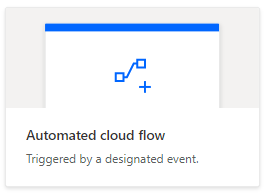

# <a name="pass-data-to-scripts-in-an-automatically-run-power-automate-flow-preview"></a><span data-ttu-id="b4279-103">Transmettre des données à des scripts dans un flux automatique Power Automate (Aperçu)</span><span class="sxs-lookup"><span data-stu-id="b4279-103">Pass data to scripts in an automatically-run Power Automate flow (preview)</span></span>

<span data-ttu-id="b4279-104">Ce tutoriel vous apprend à exécuter un script Office pour Excel sur le web via un flux de travail automatisé [Power Automate](https://flow.microsoft.com).</span><span class="sxs-lookup"><span data-stu-id="b4279-104">This tutorial teaches you how to use an Office Script for Excel on the web with an automated [Power Automate](https://flow.microsoft.com) workflow.</span></span> <span data-ttu-id="b4279-105">Votre script s’exécute automatiquement chaque fois que vous recevez un courrier électronique, enregistrant les informations du courrier électronique dans un classeur Excel.</span><span class="sxs-lookup"><span data-stu-id="b4279-105">Your script will automatically run each time you receive an email, recording information from the email in an Excel workbook.</span></span>

## <a name="prerequisites"></a><span data-ttu-id="b4279-106">Conditions préalables</span><span class="sxs-lookup"><span data-stu-id="b4279-106">Prerequisites</span></span>

[!INCLUDE [Tutorial prerequisites](../includes/power-automate-tutorial-prerequisites.md)]

> [!IMPORTANT]
> <span data-ttu-id="b4279-107">Ce tutoriel suppose que vous avez terminé le tutoriel [Exécuter les scripts Office dans Excel sur le web avec Power Automate](excel-power-automate-manual.md).</span><span class="sxs-lookup"><span data-stu-id="b4279-107">This tutorial assumes you have completed the [Run Office Scripts in Excel on the web with Power Automate](excel-power-automate-manual.md) tutorial.</span></span>

## <a name="prepare-the-workbook"></a><span data-ttu-id="b4279-108">Préparer le classeur</span><span class="sxs-lookup"><span data-stu-id="b4279-108">Prepare the workbook</span></span>

<span data-ttu-id="b4279-109">Power Automate ne peut pas utiliser de [références relatives](../develop/power-automate-integration.md#avoid-using-relative-references) comme `Workbook.getActiveWorksheet`pour accéder aux composants du classeur.</span><span class="sxs-lookup"><span data-stu-id="b4279-109">Power Automate can't use [relative references](../develop/power-automate-integration.md#avoid-using-relative-references) like `Workbook.getActiveWorksheet` to access workbook components.</span></span> <span data-ttu-id="b4279-110">Nous avons donc besoin d’un classeur et d’une feuille de calcul avec des noms cohérents que Power Automate peut référencer.</span><span class="sxs-lookup"><span data-stu-id="b4279-110">So, we need a workbook and worksheet with consistent names for Power Automate to reference.</span></span>

1. <span data-ttu-id="b4279-111">Créer un nouveau classeur appelé **MyWorkbook**.</span><span class="sxs-lookup"><span data-stu-id="b4279-111">Create a new workbook named **MyWorkbook**.</span></span>

2. <span data-ttu-id="b4279-112">Accédez à l’onglet **Automatiser**, puis sélectionnez **Éditeur de code**.</span><span class="sxs-lookup"><span data-stu-id="b4279-112">Go to the **Automate** tab and select **Code Editor**.</span></span>

3. <span data-ttu-id="b4279-113">Sélectionnez **Nouveau script**.</span><span class="sxs-lookup"><span data-stu-id="b4279-113">Select **New Script**.</span></span>

4. <span data-ttu-id="b4279-114">Remplacez le code existant par le script suivant et appuyez sur **Exécuter** :</span><span class="sxs-lookup"><span data-stu-id="b4279-114">Replace the existing code with the following script and press **Run**.</span></span> <span data-ttu-id="b4279-115">Cette opération permet de configurer le classeur avec des noms de feuille de calcul, de tableau et de tableau croisé dynamique cohérents.</span><span class="sxs-lookup"><span data-stu-id="b4279-115">This will setup the workbook with consistent worksheet, table, and PivotTable names.</span></span>

    ```TypeScript
    function main(workbook: ExcelScript.Workbook) {
      // Add a new worksheet to store our email table
      let emailsSheet = workbook.addWorksheet("Emails");

      // Add data and create a table
      emailsSheet.getRange("A1:D1").setValues([
        ["Date", "Day of the week", "Email address", "Subject"]
      ]);
      let newTable = workbook.addTable(emailsSheet.getRange("A1:D2"), true);
      newTable.setName("EmailTable");

      // Add a new PivotTable to a new worksheet
      let pivotWorksheet = workbook.addWorksheet("SubjectPivot");
      let newPivotTable = workbook.addPivotTable("Pivot", "EmailTable", pivotWorksheet.getRange("A3:C20"));

      // Setup the pivot hierarchies
      newPivotTable.addRowHierarchy(newPivotTable.getHierarchy("Day of the week"));
      newPivotTable.addRowHierarchy(newPivotTable.getHierarchy("Email address"));
      newPivotTable.addDataHierarchy(newPivotTable.getHierarchy("Subject"));
    }
    ```

## <a name="create-an-office-script-for-your-automated-workflow"></a><span data-ttu-id="b4279-116">Créer un script Office pour votre flux de travail automatisé</span><span class="sxs-lookup"><span data-stu-id="b4279-116">Create an Office Script for your automated workflow</span></span>

<span data-ttu-id="b4279-117">Créons un script qui enregistre les informations à partir d’un message électronique.</span><span class="sxs-lookup"><span data-stu-id="b4279-117">Let's create a script that logs information from an email.</span></span> <span data-ttu-id="b4279-118">Nous cherchons à identifier quels jours de la semaine nous recevons le plus de messages électroniques et combien d’expéditeurs uniques envoient ces messages électroniques.</span><span class="sxs-lookup"><span data-stu-id="b4279-118">We want to know how which days of the week we receive the most mail and how many unique senders are sending that mail.</span></span> <span data-ttu-id="b4279-119">Notre classeur comporte une table avec les colonnes **date**, **jour de la semaine**, **adresse électronique**et **objet**.</span><span class="sxs-lookup"><span data-stu-id="b4279-119">Our workbook has a table with **Date**, **Day of the week**, **Email address**, and **Subject** columns.</span></span> <span data-ttu-id="b4279-120">Notre feuille de calcul comporte également un tableau croisé dynamique qui fait pivoter le **jour de la semaine** et **adresse électronique** (il s’agit des hiérarchies de ligne).</span><span class="sxs-lookup"><span data-stu-id="b4279-120">Our worksheet also has a PivotTable that is pivoting on the **Day of the week** and **Email address** (those are the row hierarchies).</span></span> <span data-ttu-id="b4279-121">Le nombre de sujets **uniques** correspond aux informations agrégées affichées (hiérarchie des données).</span><span class="sxs-lookup"><span data-stu-id="b4279-121">The count of unique **Subjects** is the aggregated information being displayed (the data hierarchy).</span></span> <span data-ttu-id="b4279-122">Notre script actualise ce tableau croisé dynamique après la mise à jour de la table de messagerie.</span><span class="sxs-lookup"><span data-stu-id="b4279-122">We'll have our script refresh that PivotTable after updating the email table.</span></span>

1. <span data-ttu-id="b4279-123">Dans l’ **Éditeur de code**, sélectionnez **Nouveau script**.</span><span class="sxs-lookup"><span data-stu-id="b4279-123">From within the **Code Editor**, select **New Script**.</span></span>

2. <span data-ttu-id="b4279-124">Le flux que nous allons créer plus tard dans le tutoriel enverra les informations de script de chaque message électronique reçu.</span><span class="sxs-lookup"><span data-stu-id="b4279-124">The flow that we'll create later in the tutorial will send our script information about each email that's received.</span></span> <span data-ttu-id="b4279-125">Le script doit accepter cette entrée à l’aide de paramètres de la fonction `main`.</span><span class="sxs-lookup"><span data-stu-id="b4279-125">The script needs to accept that input through parameters in the `main` function.</span></span> <span data-ttu-id="b4279-126">Remplacez le script par défaut par le script suivant :</span><span class="sxs-lookup"><span data-stu-id="b4279-126">Replace the default script with the following script:</span></span>

    ```TypeScript
    function main(
      workbook: ExcelScript.Workbook,
      from: string,
      dateReceived: string,
      subject: string) {

    }
    ```

3. <span data-ttu-id="b4279-127">Le script a besoin d’accéder à la table et au tableau croisé dynamique du classeur.</span><span class="sxs-lookup"><span data-stu-id="b4279-127">The script needs access to the workbook's table and PivotTable.</span></span> <span data-ttu-id="b4279-128">Ajoutez le code suivant dans le corps du script, après l'ouverture `{` :</span><span class="sxs-lookup"><span data-stu-id="b4279-128">Add the following code to the body of the script, after the opening `{`:</span></span>

    ```TypeScript
    // Get the email table.
    let emailWorksheet = workbook.getWorksheet("Emails");
    let table = emailWorksheet.getTable("EmailTable");
  
    // Get the PivotTable.
    let pivotTableWorksheet = workbook.getWorksheet("SubjectPivot");
    let pivotTable = pivotTableWorksheet.getPivotTable("Pivot");
    ```

4. <span data-ttu-id="b4279-129">Le paramètre `dateReceived` est de type `string`.</span><span class="sxs-lookup"><span data-stu-id="b4279-129">The `dateReceived` parameter is of type `string`.</span></span> <span data-ttu-id="b4279-130">Transformons cela en un [`Date` objet](../develop/javascript-objects.md#date) pour pouvoir obtenir facilement le jour de la semaine.</span><span class="sxs-lookup"><span data-stu-id="b4279-130">Let's convert that to a [`Date` object](../develop/javascript-objects.md#date) so we can easily get the day of the week.</span></span> <span data-ttu-id="b4279-131">Une fois cette opération effectuée, vous devez mapper la valeur numérique du jour à une version plus lisible.</span><span class="sxs-lookup"><span data-stu-id="b4279-131">After doing that, we'll need to map the day's number value to a more readable version.</span></span> <span data-ttu-id="b4279-132">Ajoutez le code suivant à la fin de votre script (avant la clôture `}`) :</span><span class="sxs-lookup"><span data-stu-id="b4279-132">Add the following code to the end of your script, before the closing `}`:</span></span>

    ```TypeScript
    // Parse the received date string.
    let date = new Date(dateReceived);

    // Convert number representing the day of the week into the name of the day.
    let dayText : string;
    switch (date.getDay()) {
      case 0:
        dayText = "Sunday";
        break;
      case 1:
        dayText = "Monday";
        break;
      case 2:
        dayText = "Tuesday";
        break;
      case 3:
        dayText = "Wednesday";
        break;
      case 4:
        dayText = "Thursday";
        break;
      case 5:
        dayText = "Friday";
        break;
      default:
        dayText = "Saturday";
        break;
    }
    ```

5. <span data-ttu-id="b4279-133">La chaîne de `subject` peut inclure la balise de réponse « RE : ».</span><span class="sxs-lookup"><span data-stu-id="b4279-133">The `subject` string may include the "RE:" reply tag.</span></span> <span data-ttu-id="b4279-134">Supprimez-le de la chaîne afin que les messages électroniques d’un même fil de discussion aient le même objet pour le tableau.</span><span class="sxs-lookup"><span data-stu-id="b4279-134">Let's remove that from the string so that emails in the same thread have the same subject for the table.</span></span> <span data-ttu-id="b4279-135">Ajoutez le code suivant à la fin de votre script (avant la clôture `}`) :</span><span class="sxs-lookup"><span data-stu-id="b4279-135">Add the following code to the end of your script, before the closing `}`:</span></span>

    ```TypeScript
    // Remove the reply tag from the email subject to group emails on the same thread.
    let subjectText = subject.replace("Re: ", "");
    subjectText = subjectText.replace("RE: ", "");
    ```

6. <span data-ttu-id="b4279-136">À présent que les données de courrier électronique ont été formatées à notre gout, ajoutons une ligne au tableau de courrier électronique.</span><span class="sxs-lookup"><span data-stu-id="b4279-136">Now that the email data has been formatted to our liking, let's add a row to the email table.</span></span> <span data-ttu-id="b4279-137">Ajoutez le code suivant à la fin de votre script (avant la clôture `}`) :</span><span class="sxs-lookup"><span data-stu-id="b4279-137">Add the following code to the end of your script, before the closing `}`:</span></span>

    ```TypeScript
    // Add the parsed text to the table.
    table.addRow(-1, [dateReceived, dayText, from, subjectText]);
    ```

7. <span data-ttu-id="b4279-138">Enfin, assurez-vous que le tableau croisé dynamique est actualisé.</span><span class="sxs-lookup"><span data-stu-id="b4279-138">Finally, let's make sure the PivotTable is refreshed.</span></span> <span data-ttu-id="b4279-139">Ajoutez le code suivant à la fin de votre script (avant la clôture `}`) :</span><span class="sxs-lookup"><span data-stu-id="b4279-139">Add the following code to the end of your script, before the closing `}`:</span></span>

    ```TypeScript
    // Refresh the PivotTable to include the new row.
    pivotTable.refresh();
    ```

8. <span data-ttu-id="b4279-140">Renommez votre script **Enregistrer le courrier électronique**, puis appuyez sur **Enregistrer le script**.</span><span class="sxs-lookup"><span data-stu-id="b4279-140">Rename your script **Record Email** and press **Save script**.</span></span>

<span data-ttu-id="b4279-141">Votre script est maintenant prêt pour un flux de travail Power Automate.</span><span class="sxs-lookup"><span data-stu-id="b4279-141">Your script is now ready for a Power Automate workflow.</span></span> <span data-ttu-id="b4279-142">Il devrait ressembler au script suivant :</span><span class="sxs-lookup"><span data-stu-id="b4279-142">It should look like the following script:</span></span>

```TypeScript
function main(
  workbook: ExcelScript.Workbook,
  from: string,
  dateReceived: string,
  subject: string) {
  // Get the email table.
  let emailWorksheet = workbook.getWorksheet("Emails");
  let table = emailWorksheet.getTable("EmailTable");

  // Get the PivotTable.
  let pivotTableWorksheet = workbook.getWorksheet("Pivot");
  let pivotTable = pivotTableWorksheet.getPivotTable("SubjectPivot");

  // Parse the received date string.
  let date = new Date(dateReceived);

  // Convert number representing the day of the week into the name of the day.
  let dayText: string;
  switch (date.getDay()) {
    case 0:
      dayText = "Sunday";
      break;
    case 1:
      dayText = "Monday";
      break;
    case 2:
      dayText = "Tuesday";
      break;
    case 3:
      dayText = "Wednesday";
      break;
    case 4:
      dayText = "Thursday";
      break;
    case 5:
      dayText = "Friday";
      break;
    default:
      dayText = "Saturday";
      break;
  }

  // Remove the reply tag from the email subject to group emails on the same thread.
  let subjectText = subject.replace("Re: ", "");
  subjectText = subjectText.replace("RE: ", "");

  // Add the parsed text to the table.
  table.addRow(-1, [dateReceived, dayText, from, subjectText]);

  // Refresh the PivotTable to include the new row.
  pivotTable.refresh();
}
```

## <a name="create-an-automated-workflow-with-power-automate"></a><span data-ttu-id="b4279-143">Créer un flux de travail automatisé avec Power Automate</span><span class="sxs-lookup"><span data-stu-id="b4279-143">Create an automated workflow with Power Automate</span></span>

1. <span data-ttu-id="b4279-144">Connectez-vous au site [Power Automate](https://flow.microsoft.com).</span><span class="sxs-lookup"><span data-stu-id="b4279-144">Sign in to the [Power Automate site](https://flow.microsoft.com).</span></span>

2. <span data-ttu-id="b4279-145">Dans le menu qui s’affiche sur le côté gauche de l’écran, appuyez sur **Créer**.</span><span class="sxs-lookup"><span data-stu-id="b4279-145">In the menu that's displayed on the left side of the screen, press **Create**.</span></span> <span data-ttu-id="b4279-146">Cela affiche une liste des moyens de créer de nouveaux flux de travail.</span><span class="sxs-lookup"><span data-stu-id="b4279-146">This brings you to list of ways to create new workflows.</span></span>

    

3. <span data-ttu-id="b4279-148">Dans la section **Démarrer à partir de zéro**, sélectionnez **Flux automatique**.</span><span class="sxs-lookup"><span data-stu-id="b4279-148">In the **Start from blank** section, select **Automated flow**.</span></span> <span data-ttu-id="b4279-149">Cela permet de créer un flux de travail déclenché par un événement, par exemple, la réception d’un courrier électronique.</span><span class="sxs-lookup"><span data-stu-id="b4279-149">This creates a workflow triggered by an event, such as receiving an email.</span></span>

    

4. <span data-ttu-id="b4279-151">Dans la fenêtre de boîte de dialogue qui s’affiche, entrez un nom pour votre flux dans la zone de texte **Nom du flux**.</span><span class="sxs-lookup"><span data-stu-id="b4279-151">In the dialog window that appears, enter a name for your flow in the **Flow name** text box.</span></span> <span data-ttu-id="b4279-152">Sélectionnez ensuite **À l'arrivée d'un nouveau courrier électronique** dans la liste d’options sous **Sélectionnez le déclencheur de votre flux**.</span><span class="sxs-lookup"><span data-stu-id="b4279-152">Then select **When a new email arrives** from the list of options under **Choose your flow's trigger**.</span></span> <span data-ttu-id="b4279-153">Vous devrez peut-être rechercher l’option dans la zone de recherche.</span><span class="sxs-lookup"><span data-stu-id="b4279-153">You may need to search for the option using the search box.</span></span> <span data-ttu-id="b4279-154">Enfin, appuyez sur **Créer**.</span><span class="sxs-lookup"><span data-stu-id="b4279-154">Finally, press **Create**.</span></span>

    

    > [!NOTE]
    > <span data-ttu-id="b4279-156">Ce tutoriel utilise Outlook.</span><span class="sxs-lookup"><span data-stu-id="b4279-156">This tutorial uses Outlook.</span></span> <span data-ttu-id="b4279-157">N’hésitez pas à utiliser votre service de messagerie préféré, même si certaines options peuvent être différentes.</span><span class="sxs-lookup"><span data-stu-id="b4279-157">Feel free to use your preferred email service instead, though some options may be different.</span></span>

5. <span data-ttu-id="b4279-158">Appuyez sur **Nouvelle étape**.</span><span class="sxs-lookup"><span data-stu-id="b4279-158">Press **New step**.</span></span>

6. <span data-ttu-id="b4279-159">Sélectionnez l’onglet **Standard**, puis sélectionnez **Excel Online (Business)**.</span><span class="sxs-lookup"><span data-stu-id="b4279-159">Select the **Standard** tab, then select **Excel Online (Business)**.</span></span>

    

7. <span data-ttu-id="b4279-161">Sous **Actions**, sélectionnez **Exécuter le script** (Aperçu).</span><span class="sxs-lookup"><span data-stu-id="b4279-161">Under **Actions**, select **Run script (preview)**.</span></span>

    

8. <span data-ttu-id="b4279-163">Spécifiez les paramètres suivants pour le connecteur **Exécuter le script** :</span><span class="sxs-lookup"><span data-stu-id="b4279-163">Specify the following settings for the **Run script** connector:</span></span>

    - <span data-ttu-id="b4279-164">**Emplacement** : OneDrive Entreprise</span><span class="sxs-lookup"><span data-stu-id="b4279-164">**Location**: OneDrive for Business</span></span>
    - <span data-ttu-id="b4279-165">**Bibliothèque de documents** : OneDrive</span><span class="sxs-lookup"><span data-stu-id="b4279-165">**Document Library**: OneDrive</span></span>
    - <span data-ttu-id="b4279-166">**Fichier** : MyWorkbook.xlsx</span><span class="sxs-lookup"><span data-stu-id="b4279-166">**File**: MyWorkbook.xlsx</span></span>
    - <span data-ttu-id="b4279-167">**Script** : Enregistrer le courrier électronique</span><span class="sxs-lookup"><span data-stu-id="b4279-167">**Script**: Record Email</span></span>
    - <span data-ttu-id="b4279-168">**à partir de**: de *(contenu dynamique d’Outlook)*</span><span class="sxs-lookup"><span data-stu-id="b4279-168">**from**: From *(dynamic content from Outlook)*</span></span>
    - <span data-ttu-id="b4279-169">**date de réception**: heure de réception *(contenu dynamique d’Outlook)*</span><span class="sxs-lookup"><span data-stu-id="b4279-169">**dateReceived**: Received Time *(dynamic content from Outlook)*</span></span>
    - <span data-ttu-id="b4279-170">**objet**: Objet *(contenu dynamique d’Outlook)*</span><span class="sxs-lookup"><span data-stu-id="b4279-170">**subject**: Subject *(dynamic content from Outlook)*</span></span>

    <span data-ttu-id="b4279-171">*Notez que les paramètres du script s’affichent uniquement une fois le script sélectionné.*</span><span class="sxs-lookup"><span data-stu-id="b4279-171">*Note that the parameters for the script will only appear once the script is selected.*</span></span>

    

9. <span data-ttu-id="b4279-173">Appuyez sur **Enregistrer**.</span><span class="sxs-lookup"><span data-stu-id="b4279-173">Press **Save**.</span></span>

<span data-ttu-id="b4279-174">Votre flux est désormais activé.</span><span class="sxs-lookup"><span data-stu-id="b4279-174">Your flow is now enabled.</span></span> <span data-ttu-id="b4279-175">Il exécute automatiquement votre script chaque fois que vous recevez un courrier électronique via Outlook.</span><span class="sxs-lookup"><span data-stu-id="b4279-175">It will automatically run your script each time you receive an email through Outlook.</span></span>

## <a name="manage-the-script-in-power-automate"></a><span data-ttu-id="b4279-176">Gérer le script dans Power Automate</span><span class="sxs-lookup"><span data-stu-id="b4279-176">Manage the script in Power Automate</span></span>

1. <span data-ttu-id="b4279-177">Sur la page principale de Power Automate, sélectionnez **Mes flux**.</span><span class="sxs-lookup"><span data-stu-id="b4279-177">From the main Power Automate page, select **My flows**.</span></span>

    

2. <span data-ttu-id="b4279-179">Sélectionnez votre flux.</span><span class="sxs-lookup"><span data-stu-id="b4279-179">Select your flow.</span></span> <span data-ttu-id="b4279-180">Ici, vous pouvez voir l’historique d’exécution.</span><span class="sxs-lookup"><span data-stu-id="b4279-180">Here you can see the run history.</span></span> <span data-ttu-id="b4279-181">Vous pouvez actualiser la page ou appuyer sur le bouton **Actualiser toutes les exécutions** pour mettre à jour l’historique.</span><span class="sxs-lookup"><span data-stu-id="b4279-181">You can refresh the page or press the refresh **All runs** button to update the history.</span></span> <span data-ttu-id="b4279-182">Le flux se déclenche peu après la réception d’un message électronique.</span><span class="sxs-lookup"><span data-stu-id="b4279-182">The flow will trigger shortly after an email is received.</span></span> <span data-ttu-id="b4279-183">Testez le flux en envoyant un courrier électronique.</span><span class="sxs-lookup"><span data-stu-id="b4279-183">Test the flow by sending yourself mail.</span></span>

<span data-ttu-id="b4279-184">Lorsque le flux est déclenché et exécute votre script correctement, la table du classeur et la mise à jour du tableau croisé dynamique doivent s’afficher.</span><span class="sxs-lookup"><span data-stu-id="b4279-184">When the flow is triggered and successfully runs your script, you should see the workbook's table and PivotTable update.</span></span>


## <a name="next-steps"></a><span data-ttu-id="b4279-187">Étapes suivantes</span><span class="sxs-lookup"><span data-stu-id="b4279-187">Next steps</span></span>

<span data-ttu-id="b4279-188">Visitez [Exécuter des scripts Office avec Power Automate](../develop/power-automate-integration.md) pour en savoir plus sur la connexion de scripts Office avec Power Automate.</span><span class="sxs-lookup"><span data-stu-id="b4279-188">Visit [Run Office Scripts with Power Automate](../develop/power-automate-integration.md) to learn more about connecting Office Scripts with Power Automate.</span></span>

<span data-ttu-id="b4279-189">Vous pouvez également consulter le [scénario type des rappels de tâches automatisés](../resources/scenarios/task-reminders.md) pour découvrir comment combiner les scripts Office et Power Automate avec les cartes adaptatives Teams.</span><span class="sxs-lookup"><span data-stu-id="b4279-189">You can also check out the [Automated task reminders sample scenario](../resources/scenarios/task-reminders.md) to learn how to combine Office Scripts and Power Automate with Teams Adaptive Cards.</span></span>
