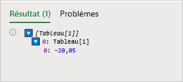
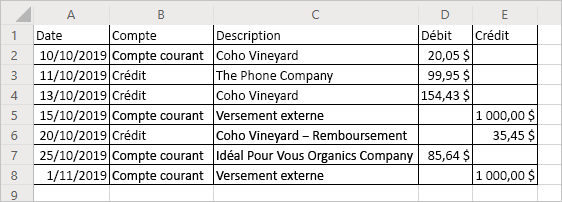

# <a name="read-workbook-data-with-office-scripts-in-excel-on-the-web"></a><span data-ttu-id="18a82-103">Lire les données d’un classeur avec les scripts Office d’Excel pour le web</span><span class="sxs-lookup"><span data-stu-id="18a82-103">Read workbook data with Office Scripts in Excel on the web</span></span>

<span data-ttu-id="18a82-104">Ce didacticiel vous apprend comment lire des données à partir d’un classeur à l’aide d’un script Office pour Excel pour le web.</span><span class="sxs-lookup"><span data-stu-id="18a82-104">This tutorial teaches you how to read data from a workbook with an Office Script for Excel on the web.</span></span> <span data-ttu-id="18a82-105">Vous pourrez ensuite modifier les données que vous avez lues et les replacer dans le classeur.</span><span class="sxs-lookup"><span data-stu-id="18a82-105">You'll then edit the data you read and put it back in the workbook.</span></span>

> [!TIP]
> <span data-ttu-id="18a82-106">Si vous débutez avec les scripts Office, nous vous recommandons de commencer par le didacticiel [Enregistrer, modifier, créer des scripts Office dans Excel pour le web](excel-tutorial.md).</span><span class="sxs-lookup"><span data-stu-id="18a82-106">If you are new to Office Scripts, we recommend starting with the [Record, edit, and create Office Scripts in Excel on the web](excel-tutorial.md) tutorial.</span></span>

## <a name="prerequisites"></a><span data-ttu-id="18a82-107">Conditions préalables</span><span class="sxs-lookup"><span data-stu-id="18a82-107">Prerequisites</span></span>

[!INCLUDE [Tutorial prerequisites](../includes/tutorial-prerequisites.md)]

> [!IMPORTANT]
> <span data-ttu-id="18a82-108">Ce didacticiel est destiné aux utilisateurs ayant des connaissances de niveau débutant à intermédiaire en JavaScript ou TypeScript.</span><span class="sxs-lookup"><span data-stu-id="18a82-108">This tutorial is intended for people with beginner to intermediate-level knowledge of JavaScript or TypeScript.</span></span> <span data-ttu-id="18a82-109">Si vous débutez avec JavaScript, nous vous conseillons de consulter le [didacticiel Mozilla JavaScript](https://developer.mozilla.org/docs/Web/JavaScript/Guide/Introduction).</span><span class="sxs-lookup"><span data-stu-id="18a82-109">If you're new to JavaScript, we recommend reviewing the [Mozilla JavaScript tutorial](https://developer.mozilla.org/docs/Web/JavaScript/Guide/Introduction).</span></span> <span data-ttu-id="18a82-110">Rendez-vous sur [Scripts Office dans Excel pour le web](../overview/excel.md) pour en savoir plus sur l’environnement de script.</span><span class="sxs-lookup"><span data-stu-id="18a82-110">Visit [Office Scripts in Excel on the web](../overview/excel.md) to learn more about the script environment.</span></span>

## <a name="read-a-cell"></a><span data-ttu-id="18a82-111">Lire une cellule</span><span class="sxs-lookup"><span data-stu-id="18a82-111">Read a cell</span></span>

<span data-ttu-id="18a82-112">Les scripts créés avec l’enregistreur d’actions peuvent uniquement écrire des informations dans le classeur.</span><span class="sxs-lookup"><span data-stu-id="18a82-112">Scripts made with the Action Recorder can only write information to the workbook.</span></span> <span data-ttu-id="18a82-113">L’éditeur de code vous permet de modifier et de créer des scripts qui peuvent également lire les données d’un classeur.</span><span class="sxs-lookup"><span data-stu-id="18a82-113">With the Code Editor, you can edit and make scripts that also read data from a workbook.</span></span>

<span data-ttu-id="18a82-114">Nous allons créer un script qui lit les données et agit en fonction de ce qui a été lu.</span><span class="sxs-lookup"><span data-stu-id="18a82-114">Let's make a script that reads data and acts based on what was read.</span></span> <span data-ttu-id="18a82-115">Nous allons utiliser un exemple de relevé bancaire.</span><span class="sxs-lookup"><span data-stu-id="18a82-115">We're going to work with a sample banking statement.</span></span> <span data-ttu-id="18a82-116">Il s’agit d’un relevé combiné de compte courant et de crédit.</span><span class="sxs-lookup"><span data-stu-id="18a82-116">This statement is a combined checking and credit statement.</span></span> <span data-ttu-id="18a82-117">Malheureusement, les changements de soldes sont rapportés différemment.</span><span class="sxs-lookup"><span data-stu-id="18a82-117">Unfortunately, they report balance changes differently.</span></span> <span data-ttu-id="18a82-118">Le relevé de compte courant donne les revenus comme crédit positif et les dépenses comme débit négatif.</span><span class="sxs-lookup"><span data-stu-id="18a82-118">The checking statement gives income as positive credit and costs as negative debit.</span></span> <span data-ttu-id="18a82-119">Le relevé de crédit fait l’inverse.</span><span class="sxs-lookup"><span data-stu-id="18a82-119">The credit statement does the opposite.</span></span>

<span data-ttu-id="18a82-120">Dans le reste du didacticiel, nous allons normaliser ces données à l’aide d’un script.</span><span class="sxs-lookup"><span data-stu-id="18a82-120">Over the rest of the tutorial, we will normalize this data using a script.</span></span> <span data-ttu-id="18a82-121">Pour commencer, voyons comment lire des données à partir du classeur.</span><span class="sxs-lookup"><span data-stu-id="18a82-121">First, let's learn how to read data from the workbook.</span></span>

1. <span data-ttu-id="18a82-122">Créez une nouvelle feuille de calcul dans le classeur courant, vous l’utiliserez pour le reste du didacticiel.</span><span class="sxs-lookup"><span data-stu-id="18a82-122">Create a new worksheet in the workbook you've used for the rest of the tutorial.</span></span>
2. <span data-ttu-id="18a82-123">Copiez les données suivantes et collez-les dans la feuille de calcul en commençant à la cellule **A1**.</span><span class="sxs-lookup"><span data-stu-id="18a82-123">Copy the following data and paste it into the new worksheet, starting at cell **A1**.</span></span>

    |<span data-ttu-id="18a82-124">Date</span><span class="sxs-lookup"><span data-stu-id="18a82-124">Date</span></span> |<span data-ttu-id="18a82-125">Compte</span><span class="sxs-lookup"><span data-stu-id="18a82-125">Account</span></span> |<span data-ttu-id="18a82-126">Description</span><span class="sxs-lookup"><span data-stu-id="18a82-126">Description</span></span> |<span data-ttu-id="18a82-127">Débit</span><span class="sxs-lookup"><span data-stu-id="18a82-127">Debit</span></span> |<span data-ttu-id="18a82-128">Crédit</span><span class="sxs-lookup"><span data-stu-id="18a82-128">Credit</span></span> |
    |:--|:--|:--|:--|:--|
    |<span data-ttu-id="18a82-129">10/10/2019</span><span class="sxs-lookup"><span data-stu-id="18a82-129">10/10/2019</span></span> |<span data-ttu-id="18a82-130">Compte courant</span><span class="sxs-lookup"><span data-stu-id="18a82-130">Checking</span></span> |<span data-ttu-id="18a82-131">Coho Vineyard</span><span class="sxs-lookup"><span data-stu-id="18a82-131">Coho Vineyard</span></span> |<span data-ttu-id="18a82-132">−20,05</span><span class="sxs-lookup"><span data-stu-id="18a82-132">-20.05</span></span> | |
    |<span data-ttu-id="18a82-133">11/10/2019</span><span class="sxs-lookup"><span data-stu-id="18a82-133">10/11/2019</span></span> |<span data-ttu-id="18a82-134">Crédit</span><span class="sxs-lookup"><span data-stu-id="18a82-134">Credit</span></span> |<span data-ttu-id="18a82-135">The Phone Company</span><span class="sxs-lookup"><span data-stu-id="18a82-135">The Phone Company</span></span> |<span data-ttu-id="18a82-136">99,95</span><span class="sxs-lookup"><span data-stu-id="18a82-136">99.95</span></span> | |
    |<span data-ttu-id="18a82-137">13/10/2019</span><span class="sxs-lookup"><span data-stu-id="18a82-137">10/13/2019</span></span> |<span data-ttu-id="18a82-138">Crédit</span><span class="sxs-lookup"><span data-stu-id="18a82-138">Credit</span></span> |<span data-ttu-id="18a82-139">Coho Vineyard</span><span class="sxs-lookup"><span data-stu-id="18a82-139">Coho Vineyard</span></span> |<span data-ttu-id="18a82-140">154,43</span><span class="sxs-lookup"><span data-stu-id="18a82-140">154.43</span></span> | |
    |<span data-ttu-id="18a82-141">15/10/2019</span><span class="sxs-lookup"><span data-stu-id="18a82-141">10/15/2019</span></span> |<span data-ttu-id="18a82-142">Compte courant</span><span class="sxs-lookup"><span data-stu-id="18a82-142">Checking</span></span> |<span data-ttu-id="18a82-143">Versement externe</span><span class="sxs-lookup"><span data-stu-id="18a82-143">External Deposit</span></span> | |<span data-ttu-id="18a82-144">1000</span><span class="sxs-lookup"><span data-stu-id="18a82-144">1000</span></span> |
    |<span data-ttu-id="18a82-145">20/10/2019</span><span class="sxs-lookup"><span data-stu-id="18a82-145">10/20/2019</span></span> |<span data-ttu-id="18a82-146">Crédit</span><span class="sxs-lookup"><span data-stu-id="18a82-146">Credit</span></span> |<span data-ttu-id="18a82-147">Coho Vineyard − Remboursement</span><span class="sxs-lookup"><span data-stu-id="18a82-147">Coho Vineyard - Refund</span></span> | |<span data-ttu-id="18a82-148">−35,45</span><span class="sxs-lookup"><span data-stu-id="18a82-148">-35.45</span></span> |
    |<span data-ttu-id="18a82-149">25/10/2019</span><span class="sxs-lookup"><span data-stu-id="18a82-149">10/25/2019</span></span> |<span data-ttu-id="18a82-150">Compte courant</span><span class="sxs-lookup"><span data-stu-id="18a82-150">Checking</span></span> |<span data-ttu-id="18a82-151">Best For You Organics Company</span><span class="sxs-lookup"><span data-stu-id="18a82-151">Best For You Organics Company</span></span> | <span data-ttu-id="18a82-152">−85,64</span><span class="sxs-lookup"><span data-stu-id="18a82-152">-85.64</span></span> | |
    |<span data-ttu-id="18a82-153">01/11/2019</span><span class="sxs-lookup"><span data-stu-id="18a82-153">11/01/2019</span></span> |<span data-ttu-id="18a82-154">Compte courant</span><span class="sxs-lookup"><span data-stu-id="18a82-154">Checking</span></span> |<span data-ttu-id="18a82-155">Versement externe</span><span class="sxs-lookup"><span data-stu-id="18a82-155">External Deposit</span></span> | |<span data-ttu-id="18a82-156">1000</span><span class="sxs-lookup"><span data-stu-id="18a82-156">1000</span></span> |

3. <span data-ttu-id="18a82-157">Ouvrez l’**éditeur de code** puis sélectionnez **Nouveau script**.</span><span class="sxs-lookup"><span data-stu-id="18a82-157">Open the **Code Editor** and select **New Script**.</span></span>
4. <span data-ttu-id="18a82-158">Nous allons réarranger la mise en forme.</span><span class="sxs-lookup"><span data-stu-id="18a82-158">Let's clean up the formatting.</span></span> <span data-ttu-id="18a82-159">Il s’agit d’un document financier, nous allons donc modifier la mise en forme des nombres dans les colonnes **Débit** et **Crédit** pour afficher les valeurs sous forme de montants en dollars.</span><span class="sxs-lookup"><span data-stu-id="18a82-159">This is a financial document, so let's change the number formatting in the **Debit** and **Credit** columns to show values as dollar amounts.</span></span> <span data-ttu-id="18a82-160">Ajustons également la largeur des colonnes aux données.</span><span class="sxs-lookup"><span data-stu-id="18a82-160">Let's also fit the column width to the data.</span></span>

    <span data-ttu-id="18a82-161">Remplacez le contenu du script par le code suivant :</span><span class="sxs-lookup"><span data-stu-id="18a82-161">Replace the script contents with the following code:</span></span>

    ```TypeScript
    function main(workbook: ExcelScript.Workbook) {
        // Get the current worksheet.
        let selectedSheet = workbook.getActiveWorksheet();

        // Format the range to display numerical dollar amounts.
        selectedSheet.getRange("D2:E8").setNumberFormat("$#,##0.00");

        // Fit the width of all the used columns to the data.
        selectedSheet.getUsedRange().getFormat().autofitColumns();
    }
    ```

5. <span data-ttu-id="18a82-162">Nous allons maintenant lire une valeur depuis l’une des colonnes de montants.</span><span class="sxs-lookup"><span data-stu-id="18a82-162">Now let's read a value from one of the number columns.</span></span> <span data-ttu-id="18a82-163">Ajoutez le code suivant à la fin du script (avant le `}` de clôture) :</span><span class="sxs-lookup"><span data-stu-id="18a82-163">Add the following code to the end of the script (before the closing `}`):</span></span>

    ```TypeScript
    // Get the value of cell D2.
    let range = selectedSheet.getRange("D2");
    console.log(range.getValues());
    ```

6. <span data-ttu-id="18a82-164">Exécutez le script.</span><span class="sxs-lookup"><span data-stu-id="18a82-164">Run the script.</span></span>
7. <span data-ttu-id="18a82-165">Ouvrez la console.</span><span class="sxs-lookup"><span data-stu-id="18a82-165">Open the console.</span></span> <span data-ttu-id="18a82-166">Accédez au menu **Ellipses**, puis appuyez sur **Journaux...**.</span><span class="sxs-lookup"><span data-stu-id="18a82-166">Go to the **Ellipses** menu and press **Logs...**.</span></span>
8. <span data-ttu-id="18a82-167">Dans la console, `[Array[1]]` doit s’afficher.</span><span class="sxs-lookup"><span data-stu-id="18a82-167">You should see `[Array[1]]` in the console.</span></span> <span data-ttu-id="18a82-168">Ce n’est pas un nombre, car les plages sont des tableaux de données à deux dimensions.</span><span class="sxs-lookup"><span data-stu-id="18a82-168">This is not a number because ranges are two-dimensional arrays of data.</span></span> <span data-ttu-id="18a82-169">Cette plage à deux dimensions est directement journalisée dans la console.</span><span class="sxs-lookup"><span data-stu-id="18a82-169">That two-dimensional range is being logged to the console directly.</span></span> <span data-ttu-id="18a82-170">Heureusement, l’éditeur de code vous permet de voir le contenu du tableau.</span><span class="sxs-lookup"><span data-stu-id="18a82-170">Luckily, the Code Editor does let you see the contents of the array.</span></span>
9. <span data-ttu-id="18a82-171">Lorsqu’un tableau à deux dimensions est journalisé sur la console, il regroupe les valeurs de colonne sous chaque ligne.</span><span class="sxs-lookup"><span data-stu-id="18a82-171">When a two-dimensional array is logged to the console, it groups column values under each row.</span></span> <span data-ttu-id="18a82-172">Développez le journal du tableau en appuyant sur le triangle bleu.</span><span class="sxs-lookup"><span data-stu-id="18a82-172">Expand the array log by pressing the blue triangle.</span></span>
10. <span data-ttu-id="18a82-173">Développez le deuxième niveau du tableau en appuyant sur le triangle bleu nouvellement affiché.</span><span class="sxs-lookup"><span data-stu-id="18a82-173">Expand the second level of the array by pressing the newly revealed blue triangle.</span></span> <span data-ttu-id="18a82-174">Voici ce que vous devez voir :</span><span class="sxs-lookup"><span data-stu-id="18a82-174">You should now see this:</span></span>

    

## <a name="modify-the-value-of-a-cell"></a><span data-ttu-id="18a82-176">Modifier la valeur d’une cellule.</span><span class="sxs-lookup"><span data-stu-id="18a82-176">Modify the value of a cell</span></span>

<span data-ttu-id="18a82-177">Maintenant que nous avons vu comment lire des données, nous allons les utiliser pour modifier le classeur.</span><span class="sxs-lookup"><span data-stu-id="18a82-177">Now that we can read data, let's use that data to modify the workbook.</span></span> <span data-ttu-id="18a82-178">Nous allons rendre la valeur de la cellule **D2** positive avec la fonction `Math.abs`.</span><span class="sxs-lookup"><span data-stu-id="18a82-178">We'll make the value of the cell **D2** positive with the `Math.abs` function.</span></span> <span data-ttu-id="18a82-179">L’objet [Math](https://developer.mozilla.org/docs/web/javascript/reference/global_objects/math) contient de nombreuses fonctions auxquelles vos scripts ont accès.</span><span class="sxs-lookup"><span data-stu-id="18a82-179">The [Math](https://developer.mozilla.org/docs/web/javascript/reference/global_objects/math) object contains many functions to which your scripts have access.</span></span> <span data-ttu-id="18a82-180">Pour plus d’informations sur `Math` et les autres objets intégrés, voir [Utilisation d’objets JavaScript intégrés dans les scripts Office](../develop/javascript-objects.md).</span><span class="sxs-lookup"><span data-stu-id="18a82-180">More information about `Math` and other built-in objects can be found at [Using built-in JavaScript objects in Office Scripts](../develop/javascript-objects.md).</span></span>

1. <span data-ttu-id="18a82-181">Ajoutez le code suivant à la fin du script :</span><span class="sxs-lookup"><span data-stu-id="18a82-181">Add the following code to the end of the script:</span></span>

    ```TypeScript
        // Run the `Math.abs` function with the value at D2 and apply that value back to D2.
    let positiveValue = Math.abs(range.getValue());
    range.setValue(positiveValue);
    ```

    <span data-ttu-id="18a82-182">Notez que nous utilisons `getValue` et `setValue`.</span><span class="sxs-lookup"><span data-stu-id="18a82-182">Note that we're using `getValue` and `setValue`.</span></span> <span data-ttu-id="18a82-183">Ces méthodes fonctionnent sur une seule cellule.</span><span class="sxs-lookup"><span data-stu-id="18a82-183">These methods work on a single cell.</span></span> <span data-ttu-id="18a82-184">Lorsque vous manipulez des plages de plusieurs cellules, vous pouvez utiliser `getValues` et `setValues`.</span><span class="sxs-lookup"><span data-stu-id="18a82-184">When handling multi-cell ranges, you'll want to use `getValues` and `setValues`.</span></span>

2. <span data-ttu-id="18a82-185">La valeur de la cellule **D2** doit maintenant être positive.</span><span class="sxs-lookup"><span data-stu-id="18a82-185">The value of cell **D2** should now be positive.</span></span>

## <a name="modify-the-values-of-a-column"></a><span data-ttu-id="18a82-186">Modifier les valeurs d’une colonne</span><span class="sxs-lookup"><span data-stu-id="18a82-186">Modify the values of a column</span></span>

<span data-ttu-id="18a82-187">Maintenant que nous avons vu comment lire et écrire dans une seule cellule, configurons le script de façon à ce qu’il travaille sur l’ensemble des cellules des colonnes **Débit** et **Crédit**.</span><span class="sxs-lookup"><span data-stu-id="18a82-187">Now that we know how to read and write to a single cell, let's generalize the script to work on the entire **Debit** and **Credit** columns.</span></span>

1. <span data-ttu-id="18a82-188">Supprimez le code qui affecte une seule cellule (le code de valeur absolue précédent), de sorte que votre script se présente désormais comme suit :</span><span class="sxs-lookup"><span data-stu-id="18a82-188">Remove the code that affects only a single cell (the previous absolute value code), such that your script now looks like this:</span></span>

    ```TypeScript
    function main(workbook: ExcelScript.Workbook) {
        // Get the current worksheet.
        let selectedSheet = workbook.getActiveWorksheet();

        // Format the range to display numerical dollar amounts.
        selectedSheet.getRange("D2:E8").setNumberFormat("$#,##0.00");

        // Fit the width of all the used columns to the data.
        selectedSheet.getUsedRange().getFormat().autofitColumns();
    }
    ```

2. <span data-ttu-id="18a82-189">Ajoutez une boucle à la fin du script qui itère au sein des lignes des deux dernières colonnes.</span><span class="sxs-lookup"><span data-stu-id="18a82-189">Add a loop to the end of the script that iterates through the rows in the last two columns.</span></span> <span data-ttu-id="18a82-190">Le script remplace la valeur de chaque cellule en la valeur absolue de cette valeur.</span><span class="sxs-lookup"><span data-stu-id="18a82-190">For each cell, the script sets the value to the current value's absolute value.</span></span>

    <span data-ttu-id="18a82-191">Notez que l’indexation du tableau qui définit les emplacements des cellules est basée sur zéro.</span><span class="sxs-lookup"><span data-stu-id="18a82-191">Note that the array defining cell locations is zero-based.</span></span> <span data-ttu-id="18a82-192">Par conséquent, la cellule **A1** est `range[0][0]`.</span><span class="sxs-lookup"><span data-stu-id="18a82-192">That means cell **A1** is `range[0][0]`.</span></span>

    ```TypeScript
    // Get the values of the used range.
    let range = selectedSheet.getUsedRange();
    let rangeValues = range.getValues();

    // Iterate over the fourth and fifth columns and set their values to their absolute value.
    for (let i = 1; i < range.getRowCount(); i++) {
        // The column at index 3 is column "4" in the worksheet.
        if (rangeValues[i][3] != 0) {
            let positiveValue = Math.abs(rangeValues[i][3]);
            selectedSheet.getCell(i, 3).setValue(positiveValue);
        }

        // The column at index 4 is column "5" in the worksheet.
        if (rangeValues[i][4] != 0) {
            let positiveValue = Math.abs(rangeValues[i][4]);
            selectedSheet.getCell(i, 4).setValue(positiveValue);
        }
    }
    ```

    <span data-ttu-id="18a82-193">Cette partie du script effectue plusieurs tâches importantes.</span><span class="sxs-lookup"><span data-stu-id="18a82-193">This portion of the script does several important tasks.</span></span> <span data-ttu-id="18a82-194">Premièrement, elle obtient les valeurs et le nombre de lignes de la plage utilisée.</span><span class="sxs-lookup"><span data-stu-id="18a82-194">First, it gets the values and row count of the used range.</span></span> <span data-ttu-id="18a82-195">Nous pouvons ainsi examiner les valeurs et déterminer quand arrêter.</span><span class="sxs-lookup"><span data-stu-id="18a82-195">This lets us look at values and know when to stop.</span></span> <span data-ttu-id="18a82-196">Deuxièmement, elle produit une itération dans la plage utilisée, en vérifiant chaque cellule des colonnes **Débit** et **Crédit**.</span><span class="sxs-lookup"><span data-stu-id="18a82-196">Second, it iterates through the used range, checking each cell in the **Debit** or **Credit** columns.</span></span> <span data-ttu-id="18a82-197">Enfin, si la valeur dans la cellule n’est pas 0, elle est remplacée par sa valeur absolue.</span><span class="sxs-lookup"><span data-stu-id="18a82-197">Finally, if the value in the cell is not 0, it is replaced by its absolute value.</span></span> <span data-ttu-id="18a82-198">Nous évitons les zéros pour pouvoir laisser les cellules vides telles qu’elles sont.</span><span class="sxs-lookup"><span data-stu-id="18a82-198">We're avoiding zeroes so we can leave the blank cells as they were.</span></span>

3. <span data-ttu-id="18a82-199">Exécutez le script.</span><span class="sxs-lookup"><span data-stu-id="18a82-199">Run the script.</span></span>

    <span data-ttu-id="18a82-200">Voici ce à quoi doit maintenant ressembler le relevé bancaire :</span><span class="sxs-lookup"><span data-stu-id="18a82-200">Your banking statement should now look like this:</span></span>

    

## <a name="next-steps"></a><span data-ttu-id="18a82-202">Étapes suivantes</span><span class="sxs-lookup"><span data-stu-id="18a82-202">Next steps</span></span>

<span data-ttu-id="18a82-203">Ouvrez l’éditeur de code et testez quelques-uns de nos [Exemples de scripts pour Scripts Office dans Excel pour le web](../resources/excel-samples.md).</span><span class="sxs-lookup"><span data-stu-id="18a82-203">Open the Code Editor and try out some of our [Sample scripts for Office Scripts in Excel on the web](../resources/excel-samples.md).</span></span> <span data-ttu-id="18a82-204">Vous pouvez également consulter [Principes de base des scripts Office dans Excel pour le web](../develop/scripting-fundamentals.md) pour en savoir plus sur la création de scripts Office.</span><span class="sxs-lookup"><span data-stu-id="18a82-204">You can also visit [Scripting Fundamentals for Office Scripts in Excel on the web](../develop/scripting-fundamentals.md) to learn more about creating Office Scripts.</span></span>
