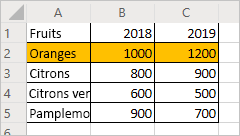
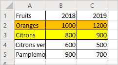
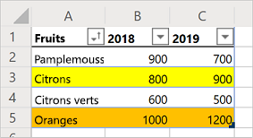

# <a name="record-edit-and-create-office-scripts-in-excel-on-the-web"></a><span data-ttu-id="02a2e-103">Enregistrer, modifier, créer des scripts Office dans Excel pour le web</span><span class="sxs-lookup"><span data-stu-id="02a2e-103">Record, edit, and create Office Scripts in Excel on the web</span></span>

<span data-ttu-id="02a2e-104">Ce didacticiel vous présente les notions de base de l’enregistrement, de la modification et de la rédaction d’un script Office pour Excel pour le web.</span><span class="sxs-lookup"><span data-stu-id="02a2e-104">This tutorial will teach you the basics of recording, editing, and writing an Office Script for Excel on the web.</span></span>

## <a name="prerequisites"></a><span data-ttu-id="02a2e-105">Conditions préalables</span><span class="sxs-lookup"><span data-stu-id="02a2e-105">Prerequisites</span></span>

[!INCLUDE [Preview note](../includes/preview-note.md)]

<span data-ttu-id="02a2e-106">Avant de commencer ce didacticiel, vous devez disposer d’un accès aux scripts Office, ce qui nécessite ce qui suit :</span><span class="sxs-lookup"><span data-stu-id="02a2e-106">Before starting this tutorial, you'll need access to Office Scripts, which requires the following:</span></span>

- <span data-ttu-id="02a2e-107">[Excel pour le web](https://www.office.com/launch/excel).</span><span class="sxs-lookup"><span data-stu-id="02a2e-107">[Excel on the web](https://www.office.com/launch/excel).</span></span>
- <span data-ttu-id="02a2e-108">Demandez à votre administrateur d’[activer les scripts Office pour votre organisation](https://support.office.com/article/office-scripts-settings-in-m365-19d3c51a-6ca2-40ab-978d-60fa49554dcf), ce qui ajoute l’onglet **Automatiser** au ruban.</span><span class="sxs-lookup"><span data-stu-id="02a2e-108">Ask your administrator to [enable Office Scripts for your organization](https://support.office.com/article/office-scripts-settings-in-m365-19d3c51a-6ca2-40ab-978d-60fa49554dcf), which adds the **Automate** tab to the ribbon.</span></span>

> [!IMPORTANT]
> <span data-ttu-id="02a2e-109">Ce didacticiel est destiné aux utilisateurs ayant des connaissances de niveau débutant à intermédiaire en JavaScript ou TypeScript.</span><span class="sxs-lookup"><span data-stu-id="02a2e-109">This tutorial is intended for people with beginner to intermediate-level knowledge of JavaScript or TypeScript.</span></span> <span data-ttu-id="02a2e-110">Si vous débutez avec JavaScript, nous vous conseillons de consulter le [didacticiel Mozilla JavaScript](https://developer.mozilla.org/docs/Web/JavaScript/Guide/Introduction).</span><span class="sxs-lookup"><span data-stu-id="02a2e-110">If you're new to JavaScript, we recommend reviewing the [Mozilla JavaScript tutorial](https://developer.mozilla.org/docs/Web/JavaScript/Guide/Introduction).</span></span> <span data-ttu-id="02a2e-111">Rendez-vous sur [Scripts Office dans Excel pour le web](../overview/excel.md) pour en savoir plus sur l’environnement de script.</span><span class="sxs-lookup"><span data-stu-id="02a2e-111">Visit [Office Scripts in Excel on the web](../overview/excel.md) to learn more about the script environment.</span></span>

## <a name="add-data-and-record-a-basic-script"></a><span data-ttu-id="02a2e-112">Ajouter des données et enregistrer un script simple</span><span class="sxs-lookup"><span data-stu-id="02a2e-112">Add data and record a basic script</span></span>

<span data-ttu-id="02a2e-113">Tout d’abord, il nous faut des données et un petit script de base.</span><span class="sxs-lookup"><span data-stu-id="02a2e-113">First, we'll need some data and a small starting script.</span></span>

1. <span data-ttu-id="02a2e-114">Créez un nouveau classeur dans Excel pour le Web.</span><span class="sxs-lookup"><span data-stu-id="02a2e-114">Create a new workbook in Excel for the Web.</span></span>
2. <span data-ttu-id="02a2e-115">Copiez les données de ventes de fruits suivantes et collez-les dans la feuille de calcul en commençant à la cellule **A1**.</span><span class="sxs-lookup"><span data-stu-id="02a2e-115">Copy the following fruit sales data and paste it into the worksheet, starting at cell **A1**.</span></span>

    |<span data-ttu-id="02a2e-116">Fruits</span><span class="sxs-lookup"><span data-stu-id="02a2e-116">Fruit</span></span> |<span data-ttu-id="02a2e-117">2018</span><span class="sxs-lookup"><span data-stu-id="02a2e-117">2018</span></span> |<span data-ttu-id="02a2e-118">2019</span><span class="sxs-lookup"><span data-stu-id="02a2e-118">2019</span></span> |
    |:---|:---|:---|
    |<span data-ttu-id="02a2e-119">Oranges</span><span class="sxs-lookup"><span data-stu-id="02a2e-119">Oranges</span></span> |<span data-ttu-id="02a2e-120">1000</span><span class="sxs-lookup"><span data-stu-id="02a2e-120">1000</span></span> |<span data-ttu-id="02a2e-121">1200</span><span class="sxs-lookup"><span data-stu-id="02a2e-121">1200</span></span> |
    |<span data-ttu-id="02a2e-122">Citrons</span><span class="sxs-lookup"><span data-stu-id="02a2e-122">Lemons</span></span> |<span data-ttu-id="02a2e-123">800</span><span class="sxs-lookup"><span data-stu-id="02a2e-123">800</span></span> |<span data-ttu-id="02a2e-124">900</span><span class="sxs-lookup"><span data-stu-id="02a2e-124">900</span></span> |
    |<span data-ttu-id="02a2e-125">Citrons verts</span><span class="sxs-lookup"><span data-stu-id="02a2e-125">Limes</span></span> |<span data-ttu-id="02a2e-126">600</span><span class="sxs-lookup"><span data-stu-id="02a2e-126">600</span></span> |<span data-ttu-id="02a2e-127">500</span><span class="sxs-lookup"><span data-stu-id="02a2e-127">500</span></span> |
    |<span data-ttu-id="02a2e-128">Pamplemousses</span><span class="sxs-lookup"><span data-stu-id="02a2e-128">Grapefruits</span></span> |<span data-ttu-id="02a2e-129">900</span><span class="sxs-lookup"><span data-stu-id="02a2e-129">900</span></span> |<span data-ttu-id="02a2e-130">700</span><span class="sxs-lookup"><span data-stu-id="02a2e-130">700</span></span> |

3. <span data-ttu-id="02a2e-131">Ouvrez l’onglet **Automatiser**. Si vous ne voyez pas l’onglet **Automatiser**, vérifiez dans la section dépassement du ruban en appuyant sur la flèche déroulante vers le bas.</span><span class="sxs-lookup"><span data-stu-id="02a2e-131">Open the **Automate** tab. If you do not see the **Automate** tab, check the ribbon overflow by pressing the drop-down arrow.</span></span>
4. <span data-ttu-id="02a2e-132">Appuyez sur le bouton **Actions d’enregistrement**.</span><span class="sxs-lookup"><span data-stu-id="02a2e-132">Press the **Record Actions** button.</span></span>
5. <span data-ttu-id="02a2e-133">Sélectionnez les cellules **A2:C2** (la ligne « Oranges ») et choisissez orange comme couleur de remplissage.</span><span class="sxs-lookup"><span data-stu-id="02a2e-133">Select cells **A2:C2** (the "Oranges" row) and set the fill color to orange.</span></span>
6. <span data-ttu-id="02a2e-134">Appuyez sur le bouton **Arrêter** pour arrêter l’enregistrement.</span><span class="sxs-lookup"><span data-stu-id="02a2e-134">Stop the recording by pressing the **Stop** button.</span></span>
7. <span data-ttu-id="02a2e-135">Renseignez le champ **Nom du script** avec un nom explicite.</span><span class="sxs-lookup"><span data-stu-id="02a2e-135">Fill in the **Script Name** field with a memorable name.</span></span>
8. <span data-ttu-id="02a2e-136">*Facultatif :* renseignez le champ **Description** avec une description significative.</span><span class="sxs-lookup"><span data-stu-id="02a2e-136">*Optional:* Fill in the **Description** field with a meaningful description.</span></span> <span data-ttu-id="02a2e-137">Celle-ci permet d’offrir un contexte sur l’usage du script.</span><span class="sxs-lookup"><span data-stu-id="02a2e-137">This is used to provide context as to what the script does.</span></span> <span data-ttu-id="02a2e-138">Pour ce didacticiel, vous pouvez utiliser « Assigner un code couleur aux lignes d’un tableau ».</span><span class="sxs-lookup"><span data-stu-id="02a2e-138">For the tutorial, you can use "Color-codes rows of a table".</span></span>

   > [!TIP]
   > <span data-ttu-id="02a2e-139">Vous pouvez modifier la description d’un script ultérieurement à partir du volet **Détails du script** qui se trouve sous le menu **...** de l’Éditeur de code.</span><span class="sxs-lookup"><span data-stu-id="02a2e-139">You can edit a script's description later from the **Script Details** pane, which is located under the Code Editor's **...** menu.</span></span>

9. <span data-ttu-id="02a2e-140">Sauvegardez le script en cliquant sur le bouton **Enregistrer**.</span><span class="sxs-lookup"><span data-stu-id="02a2e-140">Save the script by pressing the **Save** button.</span></span>

    <span data-ttu-id="02a2e-141">Voici ce à quoi votre feuille de calcul doit ressembler (les couleurs peuvent être différentes) :</span><span class="sxs-lookup"><span data-stu-id="02a2e-141">Your worksheet should look like this (don't worry if the color is different):</span></span>

    

## <a name="edit-an-existing-script"></a><span data-ttu-id="02a2e-143">Modifier un script existant</span><span class="sxs-lookup"><span data-stu-id="02a2e-143">Edit an existing script</span></span>

<span data-ttu-id="02a2e-144">Le script précédent a coloré la ligne « Oranges » en orange.</span><span class="sxs-lookup"><span data-stu-id="02a2e-144">The previous script colored the "Oranges" row to be orange.</span></span> <span data-ttu-id="02a2e-145">Nous allons ajouter une ligne jaune pour « Citrons ».</span><span class="sxs-lookup"><span data-stu-id="02a2e-145">Let's add a yellow row for the "Lemons".</span></span>

1. <span data-ttu-id="02a2e-146">Ouvrez l’onglet **Automatiser**.</span><span class="sxs-lookup"><span data-stu-id="02a2e-146">Open the **Automate** tab.</span></span>
2. <span data-ttu-id="02a2e-147">Appuyez sur le bouton **Éditeur de code**.</span><span class="sxs-lookup"><span data-stu-id="02a2e-147">Press the **Code Editor** button.</span></span>
3. <span data-ttu-id="02a2e-148">Ouvrez le script que vous avez enregistré dans la section précédente.</span><span class="sxs-lookup"><span data-stu-id="02a2e-148">Open the script you recorded in the previous section.</span></span> <span data-ttu-id="02a2e-149">Un code similaire à celui-ci doit apparaître :</span><span class="sxs-lookup"><span data-stu-id="02a2e-149">You should see something similar to this code:</span></span>

    ```TypeScript
    async function main(context: Excel.RequestContext) {
      // Set fill color to FFC000 for range Sheet1!A2:C2
      let workbook = context.workbook;
      let worksheets = workbook.worksheets;
      let selectedSheet = worksheets.getActiveWorksheet();
      selectedSheet.getRange("A2:C2").format.fill.color = "FFC000";
    }
    ```

    <span data-ttu-id="02a2e-150">Ce code récupère la feuille de calcul active en accédant au préalable à la collection de feuilles de calcul du classeur.</span><span class="sxs-lookup"><span data-stu-id="02a2e-150">This code gets the current worksheet by first accessing the workbook's worksheet collection.</span></span> <span data-ttu-id="02a2e-151">Il définit ensuite la couleur de remplissage de la plage **A2:C2**.</span><span class="sxs-lookup"><span data-stu-id="02a2e-151">Then, it sets the fill color of the range **A2:C2**.</span></span>

    <span data-ttu-id="02a2e-152">Les plages jouent un rôle fondamental dans les scripts Office d’Excel pour le web.</span><span class="sxs-lookup"><span data-stu-id="02a2e-152">Ranges are a fundamental part of Office Scripts in Excel on the web.</span></span> <span data-ttu-id="02a2e-153">Une plage est un bloc de cellules contiguës de forme rectangulaire qui contient des valeurs, des formules ou des formats.</span><span class="sxs-lookup"><span data-stu-id="02a2e-153">A range is a contiguous, rectangular block of cells that contains values, formula, and formatting.</span></span> <span data-ttu-id="02a2e-154">Les plages constituent la structure de base faite de cellules par laquelle vous effectuerez des tâches de script.</span><span class="sxs-lookup"><span data-stu-id="02a2e-154">They are the basic structure of cells through which you'll perform most of your scripting tasks.</span></span>

4. <span data-ttu-id="02a2e-155">Ajoutez la ligne suivante à la fin du script (entre l’emplacement où le `color` se trouve et le `}` de clôture) :</span><span class="sxs-lookup"><span data-stu-id="02a2e-155">Add the following line to the end of the script (between where the `color` is set and the closing `}`):</span></span>

    ```TypeScript
    selectedSheet.getRange("A3:C3").format.fill.color = "yellow";
    ```

5. <span data-ttu-id="02a2e-156">Testez le script en appuyant sur **Exécuter**.</span><span class="sxs-lookup"><span data-stu-id="02a2e-156">Test the script by pressing **Run**.</span></span> <span data-ttu-id="02a2e-157">Voici ce à quoi votre feuille de calcul doit maintenant ressembler :</span><span class="sxs-lookup"><span data-stu-id="02a2e-157">Your workbook should now look like this:</span></span>

    

## <a name="create-a-table"></a><span data-ttu-id="02a2e-159">Créer un tableau</span><span class="sxs-lookup"><span data-stu-id="02a2e-159">Create a table</span></span>

<span data-ttu-id="02a2e-160">Nous allons convertir les données de ventes de fruits en tableau.</span><span class="sxs-lookup"><span data-stu-id="02a2e-160">Let's convert this fruit sales data into a table.</span></span> <span data-ttu-id="02a2e-161">Nous allons utiliser notre script pour l’ensemble du processus.</span><span class="sxs-lookup"><span data-stu-id="02a2e-161">We'll use our script for the entire process.</span></span>

1. <span data-ttu-id="02a2e-162">Ajoutez la ligne suivante à la fin du script (avant le `}` de clôture) :</span><span class="sxs-lookup"><span data-stu-id="02a2e-162">Add the following line to the end of the script (before the closing `}`):</span></span>

    ```TypeScript
    let table = selectedSheet.tables.add("A1:C5", true);
    ```

2. <span data-ttu-id="02a2e-163">Cet appel renvoie un objet `Table`.</span><span class="sxs-lookup"><span data-stu-id="02a2e-163">That call returns a `Table` object.</span></span> <span data-ttu-id="02a2e-164">Nous allons utiliser ce tableau pour trier les données.</span><span class="sxs-lookup"><span data-stu-id="02a2e-164">Let's use that table to sort the data.</span></span> <span data-ttu-id="02a2e-165">Nous allons trier les données en ordre croissant en fonction des valeurs de la colonne « Fruits ».</span><span class="sxs-lookup"><span data-stu-id="02a2e-165">We'll sort the data in ascending order based on the values in the "Fruit" column.</span></span> <span data-ttu-id="02a2e-166">Ajoutez la ligne suivante après la création du tableau :</span><span class="sxs-lookup"><span data-stu-id="02a2e-166">Add the following line after the table creation:</span></span>

    ```TypeScript
    table.sort.apply([{ key: 0, ascending: true }]);
    ```

    <span data-ttu-id="02a2e-167">Voici ce à quoi doit ressembler votre script :</span><span class="sxs-lookup"><span data-stu-id="02a2e-167">Your script should look like this:</span></span>

    ```TypeScript
    async function main(context: Excel.RequestContext) {
      // Set fill color to FFC000 for range Sheet1!A2:C2
      let workbook = context.workbook;
      let worksheets = workbook.worksheets;
      let selectedSheet = worksheets.getActiveWorksheet();
      selectedSheet.getRange("A2:C2").format.fill.color = "FFC000";
      selectedSheet.getRange("A3:C3").format.fill.color = "yellow";
      let table = selectedSheet.tables.add("A1:C5", true);
      table.sort.apply([{ key: 0, ascending: true }]);
    }
    ```

    <span data-ttu-id="02a2e-168">Les tableaux comportent un objet `TableSort` auquel on accède par la propriété `Table.sort`.</span><span class="sxs-lookup"><span data-stu-id="02a2e-168">Tables have a `TableSort` object, accessed through the `Table.sort` property.</span></span> <span data-ttu-id="02a2e-169">Vous pouvez appliquer des critères de tri à cet objet.</span><span class="sxs-lookup"><span data-stu-id="02a2e-169">You can apply sorting criteria to that object.</span></span> <span data-ttu-id="02a2e-170">La méthode `apply` prend un tableau d’objets `SortField`.</span><span class="sxs-lookup"><span data-stu-id="02a2e-170">The `apply` method takes in an array of `SortField` objects.</span></span> <span data-ttu-id="02a2e-171">Dans notre cas, ne disposant que d’un seul critère de tri, nous utiliserons un seul `SortField`.</span><span class="sxs-lookup"><span data-stu-id="02a2e-171">In this case, we only have one sorting criteria, so we only use one `SortField`.</span></span> <span data-ttu-id="02a2e-172">`key: 0` définit la colonne ayant les valeurs de définition de tri sur « 0 » (la première colonne du tableau, **A** dans notre cas).</span><span class="sxs-lookup"><span data-stu-id="02a2e-172">`key: 0` sets the column with the sort-defining values to "0" (which is the first column on the table, **A** in this case).</span></span> <span data-ttu-id="02a2e-173">`ascending: true` trie les données dans un ordre croissant (et non dans un ordre décroissant).</span><span class="sxs-lookup"><span data-stu-id="02a2e-173">`ascending: true` sorts the data in ascending order (instead of descending order).</span></span>

3. <span data-ttu-id="02a2e-174">Exécutez le script.</span><span class="sxs-lookup"><span data-stu-id="02a2e-174">Run the script.</span></span> <span data-ttu-id="02a2e-175">Voici ce à quoi doit ressembler le tableau :</span><span class="sxs-lookup"><span data-stu-id="02a2e-175">You should see a table like this:</span></span>

    

    > [!NOTE]
    > <span data-ttu-id="02a2e-177">Si vous réexécutez le script, un message d’erreur s’affiche.</span><span class="sxs-lookup"><span data-stu-id="02a2e-177">If you re-run the script, you'll get an error.</span></span> <span data-ttu-id="02a2e-178">En effet, vous ne pouvez pas créer un tableau au-dessus d’un autre.</span><span class="sxs-lookup"><span data-stu-id="02a2e-178">This is because you cannot create a table on top of another table.</span></span> <span data-ttu-id="02a2e-179">Toutefois, vous pouvez exécuter le script sur une autre feuille de calcul ou un autre classeur.</span><span class="sxs-lookup"><span data-stu-id="02a2e-179">However, you can run the script on a different worksheet or workbook.</span></span>

### <a name="re-run-the-script"></a><span data-ttu-id="02a2e-180">Réexécutez le script.</span><span class="sxs-lookup"><span data-stu-id="02a2e-180">Re-run the script</span></span>

1. <span data-ttu-id="02a2e-181">Créer une nouvelle feuille de calcul dans le classeur actif.</span><span class="sxs-lookup"><span data-stu-id="02a2e-181">Create a new worksheet in the current workbook.</span></span>
2. <span data-ttu-id="02a2e-182">Copiez les données des fruits du début de ce didacticiel et collez-les dans la nouvelle feuille de calcul, en commençant à la cellule **A1**.</span><span class="sxs-lookup"><span data-stu-id="02a2e-182">Copy the fruit data from the beginning of the tutorial and paste it into the new worksheet, starting at cell **A1**.</span></span>
3. <span data-ttu-id="02a2e-183">Exécutez le script.</span><span class="sxs-lookup"><span data-stu-id="02a2e-183">Run the script.</span></span>

## <a name="next-steps"></a><span data-ttu-id="02a2e-184">Étapes suivantes</span><span class="sxs-lookup"><span data-stu-id="02a2e-184">Next steps</span></span>

<span data-ttu-id="02a2e-185">Complétez le didacticiel [Lire les données d’un classeur avec les scripts Office d’Excel pour le web](excel-read-tutorial.md).</span><span class="sxs-lookup"><span data-stu-id="02a2e-185">Complete the [Read workbook data with Office Scripts in Excel on the web](excel-read-tutorial.md) tutorial.</span></span> <span data-ttu-id="02a2e-186">Il vous apprend comment lire des données à partir d’un classeur à l’aide d’un script Office.</span><span class="sxs-lookup"><span data-stu-id="02a2e-186">It teaches you how to read data from a workbook with an Office Script.</span></span>
